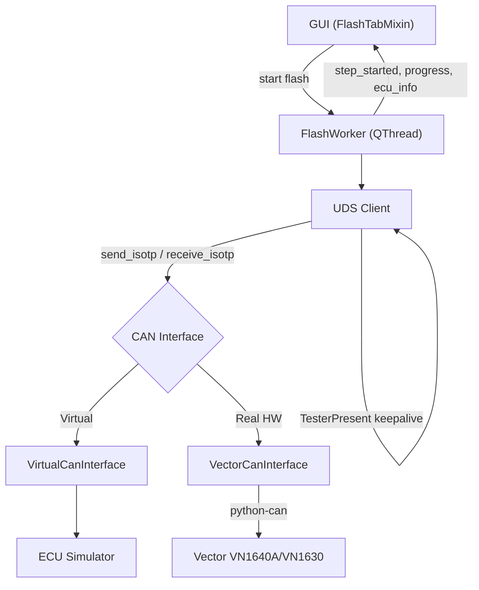

# FFlash (v1.1)

Ứng dụng desktop (PySide6) để **flash firmware ECU** qua giao thức **UDS (ISO 14229)** trên bus CAN — hỗ trợ chạy với **ECU giả lập** (không cần phần cứng) hoặc với thiết bị **Vector VN1640A / VN1630** thật.

---

## Tính Năng

- **Đọc file firmware**: Intel HEX (`.hex`), Motorola S-Record (`.s19`), Binary (`.bin`) — tự động tách thành các datablock/segment theo địa chỉ bộ nhớ.
- **UDS Client đầy đủ** (ISO 14229): session control, security access (seed & key), routine control, download/transfer, ghi/đọc Data Identifier, reset ECU, điều khiển DTC/communication.
- **ECU Simulator ảo**: mô phỏng toàn bộ state machine của một ECU thật (session, security, download) — cho phép test luồng flash hoàn chỉnh mà không cần phần cứng.
- **Vector CAN Adapter**: giao tiếp với phần cứng thật qua `python-can` (`interface='vector'`), hỗ trợ cả CAN và CAN FD.
- **TesterPresent keepalive**: tự động gửi `TesterPresent (0x3E)` nền để giữ session UDS không bị timeout trong lúc flash.
- **NRC retry logic**: tự động retry khi ECU trả về các NRC có thể phục hồi (Busy, ConditionsNotCorrect), xử lý riêng `ResponsePending (0x78)`.
- **Security DLL loader**: có thể trỏ tới DLL ngoài (`ctypes`) để tính key bảo mật theo thuật toán riêng của OEM khi flash ECU thật.
- **Đọc thông tin ECU (ReadDID)**: đọc SW/HW Version, Part Number, Serial Number trước và sau khi flash để xác nhận.
- **GUI theo dõi tiến trình real-time**: bảng các bước UDS, tiến trình từng segment, progress bar, log kỹ thuật (trace CAN frame) và log dễ đọc (information) tách riêng.
- **Menu bar (File/Edit/View/Tools/Help)**: Load Firmware..., **Recent Files** (tối đa 8 file gần nhất, click để nạp lại nhanh), Clear Information Log / Clear Trace Table, **Dark Mode** (toggle, mặc định tắt — Light Mode — ở lần chạy đầu tiên, nhớ lại lựa chọn giữa các lần mở app sau đó), **Test Connection...** (kiểm tra session + security access an toàn ngay trên GUI, không cần dùng CLI — không đụng Erase/Download), Export Report..., About, **Open Guideline** (hướng dẫn sử dụng nhanh dành cho end-user, `docs/user_guide.html`, có ảnh minh hoạ — ngắn gọn hơn README này).
- **Export Report (HTML)**: xuất báo cáo tổng hợp 1 phiên flash (ECU info, checksum, các bước, trace) ra file HTML — menu **Tools → Export Report...**.
- **Lưu cấu hình tự động**: Hardware/Radar Side/Security DLL/Flash Sequence/Dark Mode được nhớ lại giữa các lần mở app.
- **Giao diện theme nhất quán ("Engineering Blue"), có Dark Mode**: QSS áp dụng toàn app (`resources/style.qss` sáng, `resources/style_dark.qss` tối, toggle qua menu **View → Dark Mode**) — button/tab/table/progress bar/menu đồng bộ 1 tông màu xanh dương, có phản hồi hover/pressed rõ ràng, progress bar chuyển động mượt thay vì nhảy cứng theo từng bước, thay vì style mặc định rời rạc của OS. Icon app cũng được set làm window/taskbar icon lúc chạy (không chỉ icon file `.exe`).

---

## Cấu Trúc Project

```
06_PYSIDE6/
├── main.py                    ← Entry point (GUI)
├── cli.py                     ← Entry point (Command Line Interface)
├── build.bat                  ← Build file .exe cho Windows (PyInstaller)
│
├── resources/
│   ├── style.qss               ← Theme QSS sáng toàn app ("Engineering Blue")
│   ├── style_dark.qss          ← Theme QSS tối (Dark Mode), mirror style.qss
│   └── icons/
│       ├── flash_bolt_blue.ico   ← Icon app, dùng khi build .exe + window/taskbar icon lúc chạy
│       └── flash_bolt_blue.svg   ← File nguồn vector, chỉnh sửa/thiết kế lại tại đây
│
├── gui/                       ← GUI logic + file UI
│   ├── main_window.ui         ← Qt Designer file
│   ├── ui_main_window.py      ← UI auto-generated (từ main_window.ui)
│   ├── main_window.py         ← MainWindow (mixin pattern)
│   ├── flash_tab.py           ← Tab Flash: chạy/theo dõi flash sequence
│   ├── configure_tab.py       ← Tab Configure: chọn file, cấu hình Communication
│   ├── menu_bar.py            ← Menu bar File/Edit/View/Tools/Help
│   ├── test_connection_dialog.py  ← Dialog Tools > Test Connection...
│   ├── report_export.py       ← Export Report... (HTML), gọi từ menu Tools
│   ├── settings_profile.py    ← Lưu/nạp cấu hình (QSettings)
│   └── style.py               ← load_stylesheet(dark=), is_dark_mode_enabled(), ICON_PATH
│
├── core/                      ← Business logic
│   ├── flash_controller.py    ← FlashWorker (QThread) — chạy flash sequence qua UDS
│   ├── flash_sequence.py      ← Định nghĩa FlashStep + build_flash_sequence()
│   └── test_connection.py     ← TestConnectionWorker (QThread) — session+security probe
│
├── communication/              ← CAN + UDS protocol layer
│   ├── can_interface.py        ← Interface trừu tượng (send/receive/ISO-TP)
│   ├── virtual_can.py          ← Virtual CAN bus (không cần hardware)
│   ├── vector_can.py           ← Adapter cho Vector VN1640A/VN1630 (python-can)
│   ├── ecu_simulator.py        ← ECU giả lập đầy đủ (session/security/download)
│   ├── uds_client.py           ← UDS Client (10 service, retry, keepalive, DLL loader)
│   └── tester_present.py       ← Thread nền giữ session UDS sống
│
├── parsers/                    ← Parser file firmware
│   ├── hex_parser.py           ← Intel HEX
│   ├── srec_parser.py          ← Motorola S-Record
│   ├── binary_parser.py        ← Raw binary
│   └── auto_parser.py          ← Tự nhận diện định dạng theo đuôi file (dùng chung GUI + CLI)
│
├── config/settings.py          ← Hằng số app (hardware options, CAN config mẫu...)
├── tests/                      ← Bộ test tự động (unittest) + sample.hex
└── docs/
    ├── walkthrough.md          ← Nhật ký triển khai chi tiết từng phase
    ├── user_guide.html         ← Hướng dẫn dùng GUI cơ bản cho end-user (Help > Open Guideline)
    └── *_Report_Trace.csv      ← Log CAN trace thật, dùng để đối chiếu flash sequence
```

---

## Kiến Trúc



### UDS Services Hỗ Trợ (ISO 14229)

| SID | Service | Mô tả |
|-----|---------|--------|
| 0x10 | DiagnosticSessionControl | Default / Extended / Programming session |
| 0x11 | ECUReset | Hard / Soft / KeyOffOn reset |
| 0x22 | ReadDataByIdentifier | Đọc SW/HW Version, Serial Number, Part Number... |
| 0x27 | SecurityAccess | Seed & Key (thuật toán mặc định hoặc DLL ngoài) |
| 0x28 | CommunicationControl | Enable / Disable normal communication |
| 0x2E | WriteDataByIdentifier | Ghi Fingerprint (DID 0xF15A) |
| 0x31 | RoutineControl | Check Preconditions / Erase Memory / Verify |
| 0x34 | RequestDownload | Yêu cầu ECU nhận dữ liệu firmware |
| 0x36 | TransferData | Gửi dữ liệu firmware theo từng block |
| 0x37 | RequestTransferExit | Kết thúc transfer |
| 0x3E | TesterPresent | Giữ session sống (keepalive) |
| 0x85 | ControlDTCSetting | Enable / Disable ghi log DTC |

---

## Yêu Cầu

- Python **3.9+** (đã test trên 3.12)
- [PySide6](https://pypi.org/project/PySide6/) — bắt buộc, dùng cho GUI
- [python-can](https://pypi.org/project/python-can/) — **chỉ cần khi flash với phần cứng Vector thật**, không cần nếu chỉ dùng Virtual ECU Simulator

## Cài Đặt

```bash
# Tạo môi trường (khuyến nghị dùng conda/miniforge)
conda create -n pyside6 python=3.12
conda activate pyside6

# Cài dependencies
pip install -r requirements.txt

# Chỉ cần nếu dùng phần cứng Vector thật (mặc định đang comment trong requirements.txt)
pip install python-can
```

## Chạy Ứng Dụng

```bash
conda activate pyside6
python main.py
```

## Sử Dụng Nhanh (Virtual ECU — không cần hardware)

1. Chạy app.
2. Tab **Configure → Communication** → chọn **"Virtual ECU Simulator (No Hardware)"**.
3. Tab **Configure → Data** → click **"Please click here to add a Datablock"** → chọn file (vd. `tests/sample.hex`).
4. Quay lại tab **Flash** → nhấn **Flash**.
5. Theo dõi:
   - **Steps table**: từng bước UDS (đọc ECU ID → session → security → download → verify → reset).
   - **Segments table**: tiến trình từng segment (0% → 100%).
   - **Information tab**: log dễ đọc (SW/HW Version đọc được, kết quả từng bước).
   - **Trace tab**: log kỹ thuật — hex frame TX/RX qua ISO-TP, `TesterPresent` gửi định kỳ.

## Sử Dụng Với Phần Cứng Vector Thật

Phần cứng Vector (VN1640A/VN1630) **chỉ chạy được trên Windows** (XL Driver Library không có bản macOS/Linux). Cần cài đặt + cấu hình đúng thứ tự dưới đây — bỏ qua bước cấu hình **Vector Hardware Config** là nguyên nhân phổ biến nhất khiến kết nối thất bại dù hardware đã cắm vào máy.

### A. Cài đặt (làm 1 lần trên máy Windows)

1. Cài **Vector Driver Setup** (tải từ [vector.com](https://www.vector.com), hoặc có sẵn nếu máy đã cài CANoe/CANalyzer/CANape) — gói này cài:
   - **XL Driver Library** — thư viện driver mà `python-can` dùng để giao tiếp phần cứng Vector.
   - **Vector Hardware Config** (tên cũ: *Vector Hardware Manager*) — công cụ quản lý channel/ứng dụng, **bắt buộc phải dùng** ở bước B.
2. `pip install python-can` (đã ghi sẵn nhưng comment trong `requirements.txt` — chạy `pip install python-can` riêng, hoặc bỏ comment dòng đó rồi `pip install -r requirements.txt`).
3. Cắm thiết bị VN1640A/VN1630 vào máy qua USB.

### B. Cấu hình Vector Hardware Config (**bắt buộc**, làm 1 lần mỗi máy)

Vector XL Driver không cho ứng dụng truy cập channel tự do — mỗi phần mềm (CANoe, CANalyzer, hay app tự viết như tool này) phải được **đăng ký tên ứng dụng**, và channel vật lý phải được **gán (assign)** cho đúng tên đó. Tool này đăng ký với tên **`FlashTool`** (xem `communication/vector_can.py`, tham số `app_name`).

1. Mở **Vector Hardware Config** (tìm trong Start Menu sau khi cài Driver Setup).
2. Vào tab **Applications** → nếu chưa có mục **"FlashTool"**, bấm **Add/New Application** để thêm (đặt tên đúng chính xác `FlashTool`).
3. Ở mục cấu hình của "FlashTool", **gán (assign)** channel vật lý muốn dùng vào đó — vd. kéo **"VN1640A – Channel 1"** vào slot CAN1 của ứng dụng FlashTool.
4. **Save**.

Nếu bỏ qua bước này, kết nối từ tool sẽ báo lỗi kiểu *"no channels configured for application"* dù `list-hardware`/nút **Refresh** trong GUI vẫn "thấy" được hardware — vì bước quét đó chỉ hỏi driver "có hardware nào cắm vào máy" (không cần đăng ký app), còn bước **kết nối thật** thì driver bắt buộc phải tra theo tên app đã đăng ký.

### C. Nếu dùng chung hardware với CANoe

- CANoe và tool này có thể cùng đăng ký dùng chung 1 channel vật lý (driver Vector hỗ trợ nhiều app/channel).
- Nên **dừng measurement (hoặc đóng) CANoe** trong lúc dùng tool này, tránh 2 bên cùng gửi frame lên bus gây xung đột/nhiễu trace — đặc biệt nếu CANoe có node giả lập gửi UDS/TesterPresent trùng CAN ID.
- Nếu muốn dùng CANoe song song chỉ để **log CAN bus** (không có node/panel nào chủ động gửi UDS): về nguyên tắc có thể chạy cùng lúc, nhưng nhớ **tắt TesterPresent tự động của CANoe** (nếu có bật) trên đúng CAN ID của ECU đang flash — nếu cả CANoe lẫn tool này cùng gửi TesterPresent (0x3E), ECU có thể nhận 2 tester khác nhau và raise NRC bất thường hoặc rớt session giữa chừng.
- **Cảnh báo tự động**: từ Phase 4.23, trước khi flash vào hardware thật (không áp dụng cho Virtual ECU Simulator), tool tự kiểm tra 2 tín hiệu và cảnh báo nếu phát hiện rủi ro xung đột — vì người dùng đôi khi quên CANoe vẫn đang mở:
  - Có tiến trình `CANoe.exe`/`CANalyzer.exe`/`CANape.exe` đang chạy trên máy (chỉ hoạt động trên Windows, qua `tasklist`).
  - Channel Vector đang chọn được driver báo là **đã có kết nối active** (`is_on_bus`), bất kể ứng dụng nào đang giữ nó.

  Trong GUI, gặp cảnh báo này sẽ hiện hộp thoại Yes/No (mặc định **No**) trước khi bắt đầu flash. Trong `cli.py` (`flash`/`test-connection`), cảnh báo chỉ **in ra `stderr`** rồi tiếp tục chạy — không chặn, để giữ khả năng chạy script/tự động hóa.

### D. Sử dụng trong app

1. Tab **Configure → Communication** → bấm **"Refresh"** cạnh combo Hardware để quét lại thiết bị đang cắm, rồi chọn kênh tương ứng vừa xuất hiện. Combo mặc định chỉ có **"Virtual ECU Simulator"** — kênh thật chỉ hiện ra khi có hardware Vector thật sự được nhận diện *và* đã đăng ký ở bước B (không còn danh sách kênh giả cố định như trước).
2. Nếu ECU yêu cầu thuật toán bảo mật riêng của OEM: chọn file DLL ở mục **"Security Access DLL"** (Browse...).
3. Nạp file firmware và nhấn **Flash** như trên. Khuyến nghị chạy `test-connection` trước (xem mục [Command Line Interface](#command-line-interface-clipy)) để xác nhận đấu dây/channel/security đúng trước khi flash thật.

### Lưu ý về đánh số channel (`--channel N`)

`--channel`/channel trong combo Hardware hiện lấy theo `channel_index` toàn cục do driver trả về. Có khả năng `python-can` (khi có `app_name`) diễn giải số channel theo thứ tự **đã gán riêng cho app đó** trong Vector Hardware Config (không phải số toàn cục) — chưa kiểm chứng được với hardware thật. Nếu sau khi cấu hình xong ở bước B mà `--channel 0`/channel đầu tiên trong combo kết nối nhầm thiết bị, hoặc báo lỗi liên quan tới channel, hãy lưu lại thông báo lỗi/log (xem mục [Test Trên ECU Thật](#test-trên-ecu-thật-từ-máy-windows)) để điều chỉnh lại `detect_vector_channels()`/`VectorCanInterface.connect()` cho khớp đúng cách driver diễn giải trên máy thật.

---

## Command Line Interface (`cli.py`)

Chạy các chức năng chính của app từ command line — không cần mở GUI. Chạy được trên cả **Windows, macOS, Linux** (chỉ dùng thư viện chuẩn + PySide6, không phụ thuộc gì thêm ngoài `requirements.txt`).

```bash
# Xem thông tin file firmware (không flash)
python cli.py info tests/sample.hex

# Xem trước các bước sẽ chạy, không gửi gì tới ECU
python cli.py flash tests/sample.hex --dry-run

# Flash qua Virtual ECU Simulator (mặc định, không cần hardware)
python cli.py flash tests/sample.hex

# Flash bằng Suzuki flash sequence, Radar Side S1
python cli.py flash firmware.s3 --sequence suzuki --radar-side s1

# Flash hardware Vector thật, channel 2, kèm CAN trace chi tiết
python cli.py flash firmware.s3 --hardware vector --channel 1 --verbose

# Test kết nối + Security Access an toàn — KHÔNG Erase/Download —
# trước khi tin tưởng flash thật (xem mục "Test Trên ECU Thật" bên dưới)
python cli.py test-connection --hardware vector --channel 0 --sequence suzuki --verbose

# Xem danh sách hardware/CAN option (tự quét hardware Vector thật đang cắm)
python cli.py list-hardware

# Xem đầy đủ option
python cli.py flash --help
python cli.py test-connection --help
```

Các cờ chính của `flash`/`test-connection` (dùng chung): `--hardware {virtual,vector}`, `--channel`, `--sequence {generic,suzuki}` (mặc định **`suzuki`**), `--radar-side {s0,s1}`, `--tx-id`/`--rx-id` (ghi đè Radar Side), `--bitrate`, `--can-fd`, `--data-bitrate`, `--security-dll <path>`, `-q`/`--quiet`, `-v`/`--verbose`. Riêng `flash` có thêm `--base-address` (cho file `.bin`) và `--dry-run`. Mã thoát (exit code): `0` = thành công, `1` = abort/lỗi, `2` = lỗi tham số/parse file, `130` = bị ngắt (Ctrl+C) — thuận tiện để dùng trong script CI/automation.

**Lưu ý**: `--hardware vector` (Vector VN1640A/VN1630 thật) chỉ dùng được trên **Windows** vì driver Vector XL Driver Library chỉ có bản Windows. `--hardware virtual` (mặc định) chạy y hệt trên mọi hệ điều hành.

### `test-connection` — kiểm tra kết nối an toàn trước khi flash thật

Chỉ thực hiện **Session Control + Security Access** (và đọc ECU Identification, read-only) — **không bao giờ** đụng tới Erase Memory / TransferData / bất kỳ lệnh ghi nào. Dùng để xác nhận đấu dây/CAN ID/thuật toán security đúng trước khi tin tưởng chạy `flash` thật lên ECU.

- Với `--sequence suzuki`: thực hiện đúng các bước tiền-Security giống log thật (Extended Session, Disable DTC, Disable Communication — đều functional/broadcast tới `0x700`), sau đó Programming Session + Security Access ở địa chỉ vật lý.
- **Luôn cố khôi phục ECU về trạng thái an toàn khi kết thúc**, dù thành công hay lỗi giữa chừng: bật lại DTC/Communication (nếu đã tắt) rồi trả về Default Session — nhờ `try/finally`, không phụ thuộc bước nào ở trên có pass hay không.
- Kết quả in: `PASSED` (exit 0) hoặc `FAILED` kèm lý do cụ thể (exit 1) — ví dụ Security Access bị từ chối (NRC 0x35 Invalid Key) nghĩa là thuật toán/DLL security chưa đúng với ECU thật.

**Có cả trên GUI**: menu **Tools → Test Connection...** chạy đúng logic này (cùng file `core/test_connection.py`), hiện kết quả trong 1 dialog nhỏ — không cần rời khỏi GUI để dùng CLI.

---

## Test Trên ECU Thật (Từ Máy Windows)

Project build/dev trên Mac, nhưng test với ECU thật cần chạy trên **Windows** (driver Vector chỉ có bản Windows). Quy trình đề xuất:

### 1. Setup trên Windows

```powershell
git clone https://github.com/phuctm012/ECU-Flashing-Tool.git
cd ECU-Flashing-Tool
conda create -n pyside6 python=3.12
conda activate pyside6
pip install -r requirements.txt
pip install python-can
```

Cài thêm **Vector XL Driver Library** (từ trang Vector Informatik). Luôn chạy app qua **terminal/PowerShell** (không double-click) — nếu có exception/crash, traceback đầy đủ sẽ hiện ra terminal thay vì biến mất.

### 2. Quy trình test an toàn (theo thứ tự)

```powershell
# 1. Xác nhận hardware đã được nhận diện đúng
python cli.py list-hardware

# 2. Xem trước sequence, KHÔNG đụng ECU — kiểm tra logic trước
python cli.py flash firmware.s3 --sequence suzuki --dry-run

# 3. Test kết nối + Security Access — an toàn, không Erase/Download
python cli.py test-connection --hardware vector --channel 0 --sequence suzuki --verbose

# 4. Chỉ khi bước 3 PASSED mới flash thật — nên test trên ECU dự phòng/bench trước
python cli.py flash firmware.s3 --hardware vector --channel 0 --sequence suzuki --verbose > flash_log.txt 2>&1
```

Hoặc test qua GUI (`python main.py`): Configure → Communication → bấm **Refresh** để quét hardware thật đang cắm → chọn channel/Radar Side → nạp firmware → Flash.

### 3. Cách lấy log gửi lại để debug

- **Ưu tiên nhất — tab Trace (GUI) → chuột phải → "Save Log (CSV)..."**: đúng format 6 cột giống `docs/*_Report_Trace.csv` đã phân tích trước đó → đối chiếu trực tiếp từng bước UDS được ngay.
- **CLI**: dùng `--verbose > flash_log.txt 2>&1` (gộp cả stdout + stderr vào 1 file, có đầy đủ TX/RX hex frame).
- Nếu app crash: copy nguyên traceback từ terminal (nhờ chạy qua terminal ở bước 1, không double-click).
- Tab Information (GUI) → "Save Log..." (.txt) — log dễ đọc hơn, bổ trợ cho Trace.

---

## Trạng Thái Phát Triển

| Phase | Nội dung | Trạng thái |
|-------|----------|:---:|
| 1 | Tái cấu trúc code (mixin pattern, tách module) | ✅ |
| 2 | File parser (HEX, S-Record, Binary) | ✅ |
| 3 | CAN Communication + UDS Protocol + ECU Simulator | ✅ |
| 4 | UDS nâng cao: keepalive, ReadDID, NRC retry, Security DLL loader | ✅ |
| 5 | Save/Load project (.vfp), đọc DTC sau flash | 🔜 |

Xem chi tiết từng phase (kiến trúc, file mới, kết quả test) trong [`docs/walkthrough.md`](docs/walkthrough.md).

## Chạy Test

Bộ test tự động dùng `unittest` (built-in, không cần cài thêm gì). Chạy toàn bộ:

```bash
conda activate pyside6
python -m unittest discover -s tests -p "test_*.py" -v
```

Hoặc chạy riêng từng file (vd. chỉ test parser):

```bash
python -m unittest tests.test_parsers -v
```

| File | Nội dung |
|---|---|
| `test_parsers.py` | Intel HEX, S-Record (bao gồm `.s3`/32-bit address), Binary — parse đúng, lỗi checksum/record type/file không tồn tại |
| `test_flash_sequence.py` | `build_flash_sequence()` (generic) và `build_suzuki_slp1_flash_sequence()` — thứ tự bước, functional addressing, địa chỉ 5-byte, BCD date |
| `test_uds_client.py` | UDS Client qua Virtual ECU: session/security/read/write, functional addressing, NRC retry, ResponsePending (0x78), regression byte-order `RequestDownload` (ISO 14229) |
| `test_flash_controller.py` | `FlashWorker.run()` end-to-end (đồng bộ) qua Virtual ECU — cả sequence generic lẫn Suzuki |
| `test_flash_threading.py` | **Regression cho crash `QThread: Destroyed while thread is still running`** — chạy qua đúng `QThread` thật (`flash_button_clicked()` + `app.exec()`): 1 lần, lặp 5 lần, abort giữa chừng, đóng cửa sổ giữa chừng |
| `test_gui_smoke.py` | Khởi tạo `MainWindow`, tồn tại widget, `get_can_config()` (Radar Side, channel, CAN FD), lưu log `.txt`/`.csv`, cảnh báo xung đột CAN bus, lọc datablock theo checkbox, Export Report, lưu/nạp profile (`QSettings`), wiring menu bar, File > Recent Files, menu Edit (Clear Information Log/Trace) |
| `test_cli.py` | `cli.py` — `info`/`flash`/`list-hardware`/`test-connection`, `--dry-run`, Suzuki + Radar Side, `--quiet`/`--verbose`, cleanup khôi phục DTC/Comm, mã lỗi khi thiếu `python-can`/sai tham số |
| `test_vector_can.py` | `detect_running_vector_tools()` (nhận diện CANoe/CANalyzer/CANape qua `tasklist`, chỉ Windows) và field `is_on_bus` trong `detect_vector_channels()` |
| `test_test_connection.py` | `TestConnectionWorker.run()` đồng bộ qua Virtual ECU — generic/suzuki, đọc ECU ID, không bao giờ gửi SID `0x34`/`0x36`, khôi phục Default session |
| `test_test_connection_dialog.py` | **Regression cho deadlock trong `TestConnectionDialog.closeEvent()`** — chạy qua đúng `QThread` thật: 1 lần, lặp 5 lần, đóng dialog giữa chừng lúc đang probe |
| `test_style.py` | `load_stylesheet(dark=)` — đọc đúng file sáng/tối, trả `""` (không raise) nếu thiếu file; `is_dark_mode_enabled()` đọc/ghi qua `QSettings`; regression cho `resources/style.qss`/`style_dark.qss` thật (bảng màu, rule hover/pressed, `QTextEdit`, `sectionHeader` label) và icon app tồn tại |

**Lưu ý cho `test_flash_threading.py`**: đây là bộ test quan trọng nhất để tránh crash — nó cố tình chạy qua `QThread` thật thay vì gọi `FlashWorker.run()` trực tiếp (cách nhanh nhưng **không** phát hiện được race condition giữa Python và vòng đời `QThread`). Khi sửa bất kỳ logic nào liên quan tới `gui/flash_tab.py` (đặc biệt phần connect signal `flash_finished`/`flash_aborted`/`thread.finished`), luôn chạy lại file này.

---

## Build File `.exe` (Windows)

Đóng gói GUI (`main.py`) thành 1 file `FFlash.exe` standalone bằng [PyInstaller](https://pyinstaller.org/) — chỉ build được trên **Windows** (không build cho macOS/Linux).

```bat
REM Trên máy Windows, trong thư mục gốc project:
build.bat
```

`build.bat` tự động: cài `requirements.txt` + `requirements_build.txt` (chỉ có `pyinstaller`), dọn `build/`/`dist/`/`*.spec` cũ, rồi chạy PyInstaller (`--onefile --windowed`, kèm `--add-data` bundle sẵn `docs/user_guide.html`, `resources/style.qss`, `resources/style_dark.qss` và `resources/icons/` để menu Help > Open Guideline, theme sáng/tối và window icon lúc chạy đều hoạt động đúng trong bản `.exe`). Kết quả nằm ở `dist\FFlash.exe`.

- **Không cần cài Vector XL Driver/`python-can` để build** — `.exe` chạy tốt với Virtual ECU Simulator ngay cả khi build trên máy không có `python-can`. Muốn bản `.exe` hỗ trợ luôn hardware Vector thật: bỏ comment dòng `python-can` trong `requirements_build.txt` **trước khi** chạy `build.bat` (không thể thêm vào sau khi đã build, vì `.exe` là 1 file đóng gói sẵn — Vector XL Driver Library vẫn phải cài riêng trên máy chạy `.exe`, xem mục [Sử Dụng Với Phần Cứng Vector Thật](#sử-dụng-với-phần-cứng-vector-thật)).
- Icon app: `resources\icons\flash_bolt_blue.ico` (đã có sẵn trong repo, nhiều kích thước) — `build.bat` tự dùng nếu tồn tại (cả cho icon file `.exe` lẫn window/taskbar icon lúc app chạy), bỏ qua (build không icon file `.exe`) nếu không có. File nguồn dạng vector ở `resources\icons\flash_bolt_blue.svg` nếu muốn chỉnh sửa/thiết kế lại.
- `build.bat` chỉ đóng gói GUI (`main.py`); `cli.py` vẫn chạy trực tiếp qua `python cli.py ...` như bình thường (không cần `.exe` riêng).
