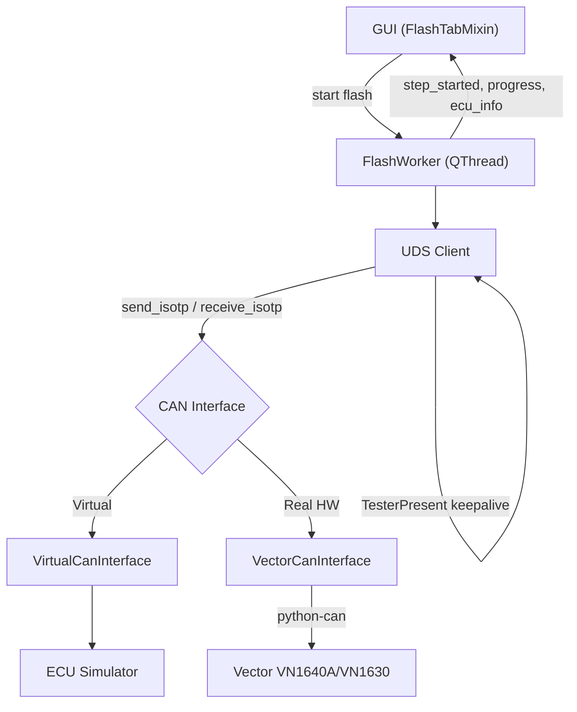

# VectorFlash Tool

Ứng dụng desktop (PySide6) để **flash firmware ECU** qua giao thức **UDS (ISO 14229)** trên bus CAN — hỗ trợ chạy với **ECU giả lập** (không cần phần cứng) hoặc với thiết bị **Vector VN1640A / VN1630** thật.

---

## Tính Năng

- **Đọc file firmware**: Intel HEX (`.hex`), Motorola S-Record (`.s19`), Binary (`.bin`) — tự động tách thành các datablock/segment theo địa chỉ bộ nhớ.
- **UDS Client đầy đủ** (ISO 14229): session control, security access (seed & key), routine control, download/transfer, ghi/đọc Data Identifier, reset ECU, điều khiển DTC/communication.
- **ECU Simulator ảo**: mô phỏng toàn bộ state machine của một ECU thật (session, security, download) — cho phép test luồng flash hoàn chỉnh mà không cần phần cứng.
- **Vector CAN Adapter**: giao tiếp với phần cứng thật qua `python-can` (`interface='vector'`), hỗ trợ cả CAN và CAN FD.
- **TesterPresent keepalive**: tự động gửi `TesterPresent (0x3E)` nền để giữ session UDS không bị timeout trong lúc flash.
- **NRC retry logic**: tự động retry khi ECU trả về các NRC có thể phục hồi (Busy, ConditionsNotCorrect), xử lý riêng `ResponsePending (0x78)`.
- **Security DLL loader**: có thể trỏ tới DLL ngoài (`ctypes`) để tính key bảo mật theo thuật toán riêng của OEM khi flash ECU thật.
- **Đọc thông tin ECU (ReadDID)**: đọc SW/HW Version, Part Number, Serial Number trước và sau khi flash để xác nhận.
- **GUI theo dõi tiến trình real-time**: bảng các bước UDS, tiến trình từng segment, progress bar, log kỹ thuật (trace CAN frame) và log dễ đọc (information) tách riêng.

---

## Cấu Trúc Project

```
06_PYSIDE6/
├── main.py                    ← Entry point
├── main_window.ui             ← Qt Designer file
├── ui_main_window.py          ← UI auto-generated (từ main_window.ui)
│
├── gui/                       ← GUI logic
│   ├── main_window.py         ← MainWindow (mixin pattern)
│   ├── flash_tab.py           ← Tab Flash: chạy/theo dõi flash sequence
│   └── configure_tab.py       ← Tab Configure: chọn file, cấu hình Communication
│
├── core/                      ← Business logic
│   ├── flash_controller.py    ← FlashWorker (QThread) — chạy flash sequence qua UDS
│   └── flash_sequence.py      ← Định nghĩa FlashStep + build_flash_sequence()
│
├── communication/              ← CAN + UDS protocol layer
│   ├── can_interface.py        ← Interface trừu tượng (send/receive/ISO-TP)
│   ├── virtual_can.py          ← Virtual CAN bus (không cần hardware)
│   ├── vector_can.py           ← Adapter cho Vector VN1640A/VN1630 (python-can)
│   ├── ecu_simulator.py        ← ECU giả lập đầy đủ (session/security/download)
│   ├── uds_client.py           ← UDS Client (10 service, retry, keepalive, DLL loader)
│   └── tester_present.py       ← Thread nền giữ session UDS sống
│
├── parsers/                    ← Parser file firmware
│   ├── hex_parser.py           ← Intel HEX
│   ├── srec_parser.py          ← Motorola S-Record
│   └── binary_parser.py        ← Raw binary
│
├── config/settings.py          ← Hằng số app (hardware options, CAN config mẫu...)
├── tests/sample.hex            ← File HEX mẫu để test
└── docs/
    ├── walkthrough.md          ← Nhật ký triển khai chi tiết từng phase
    └── *_Report_Trace.csv      ← Log CAN trace thật, dùng để đối chiếu flash sequence
```

---

## Kiến Trúc



### UDS Services Hỗ Trợ (ISO 14229)

| SID | Service | Mô tả |
|-----|---------|--------|
| 0x10 | DiagnosticSessionControl | Default / Extended / Programming session |
| 0x11 | ECUReset | Hard / Soft / KeyOffOn reset |
| 0x22 | ReadDataByIdentifier | Đọc SW/HW Version, Serial Number, Part Number... |
| 0x27 | SecurityAccess | Seed & Key (thuật toán mặc định hoặc DLL ngoài) |
| 0x28 | CommunicationControl | Enable / Disable normal communication |
| 0x2E | WriteDataByIdentifier | Ghi Fingerprint (DID 0xF15A) |
| 0x31 | RoutineControl | Check Preconditions / Erase Memory / Verify |
| 0x34 | RequestDownload | Yêu cầu ECU nhận dữ liệu firmware |
| 0x36 | TransferData | Gửi dữ liệu firmware theo từng block |
| 0x37 | RequestTransferExit | Kết thúc transfer |
| 0x3E | TesterPresent | Giữ session sống (keepalive) |
| 0x85 | ControlDTCSetting | Enable / Disable ghi log DTC |

---

## Yêu Cầu

- Python **3.9+** (đã test trên 3.12)
- [PySide6](https://pypi.org/project/PySide6/) — bắt buộc, dùng cho GUI
- [python-can](https://pypi.org/project/python-can/) — **chỉ cần khi flash với phần cứng Vector thật**, không cần nếu chỉ dùng Virtual ECU Simulator

## Cài Đặt

```bash
# Tạo môi trường (khuyến nghị dùng conda/miniforge)
conda create -n pyside6 python=3.12
conda activate pyside6

# Cài dependencies
pip install -r requirements.txt

# Chỉ cần nếu dùng phần cứng Vector thật (mặc định đang comment trong requirements.txt)
pip install python-can
```

## Chạy Ứng Dụng

```bash
conda activate pyside6
python main.py
```

## Sử Dụng Nhanh (Virtual ECU — không cần hardware)

1. Chạy app.
2. Tab **Configure → Communication** → chọn **"Virtual ECU Simulator (No Hardware)"**.
3. Tab **Configure → Data** → click **"Please click here to add a Datablock"** → chọn file (vd. `tests/sample.hex`).
4. Quay lại tab **Flash** → nhấn **Flash**.
5. Theo dõi:
   - **Steps table**: từng bước UDS (đọc ECU ID → session → security → download → verify → reset).
   - **Segments table**: tiến trình từng segment (0% → 100%).
   - **Information tab**: log dễ đọc (SW/HW Version đọc được, kết quả từng bước).
   - **Trace tab**: log kỹ thuật — hex frame TX/RX qua ISO-TP, `TesterPresent` gửi định kỳ.

## Sử Dụng Với Phần Cứng Vector Thật

1. Cài `pip install python-can` và driver Vector (XL Driver Library) từ nhà sản xuất.
2. Kết nối thiết bị VN1640A/VN1630 vào máy.
3. Tab **Configure → Communication** → chọn kênh tương ứng (vd. **"VN1640A - Channel 1"**).
4. Nếu ECU yêu cầu thuật toán bảo mật riêng của OEM: chọn file DLL ở mục **"Security Access DLL"** (Browse...).
5. Nạp file firmware và nhấn **Flash** như trên.

---

## Trạng Thái Phát Triển

| Phase | Nội dung | Trạng thái |
|-------|----------|:---:|
| 1 | Tái cấu trúc code (mixin pattern, tách module) | ✅ |
| 2 | File parser (HEX, S-Record, Binary) | ✅ |
| 3 | CAN Communication + UDS Protocol + ECU Simulator | ✅ |
| 4 | UDS nâng cao: keepalive, ReadDID, NRC retry, Security DLL loader | ✅ |
| 5 | Save/Load project (.vfp), đọc DTC sau flash | 🔜 |

Xem chi tiết từng phase (kiến trúc, file mới, kết quả test) trong [`docs/walkthrough.md`](docs/walkthrough.md).

## Chạy Test

Bộ test tự động dùng `unittest` (built-in, không cần cài thêm gì). Chạy toàn bộ:

```bash
conda activate pyside6
python -m unittest discover -s tests -p "test_*.py" -v
```

Hoặc chạy riêng từng file (vd. chỉ test parser):

```bash
python -m unittest tests.test_parsers -v
```

| File | Nội dung |
|---|---|
| `test_parsers.py` | Intel HEX, S-Record (bao gồm `.s3`/32-bit address), Binary — parse đúng, lỗi checksum/record type/file không tồn tại |
| `test_flash_sequence.py` | `build_flash_sequence()` (generic) và `build_suzuki_slp1_flash_sequence()` — thứ tự bước, functional addressing, địa chỉ 5-byte, BCD date |
| `test_uds_client.py` | UDS Client qua Virtual ECU: session/security/read/write, functional addressing, NRC retry, ResponsePending (0x78), regression byte-order `RequestDownload` (ISO 14229) |
| `test_flash_controller.py` | `FlashWorker.run()` end-to-end (đồng bộ) qua Virtual ECU — cả sequence generic lẫn Suzuki |
| `test_flash_threading.py` | **Regression cho crash `QThread: Destroyed while thread is still running`** — chạy qua đúng `QThread` thật (`flash_button_clicked()` + `app.exec()`): 1 lần, lặp 5 lần, abort giữa chừng, đóng cửa sổ giữa chừng |
| `test_gui_smoke.py` | Khởi tạo `MainWindow`, tồn tại widget, `get_can_config()` (Radar Side, channel, CAN FD), lưu log `.txt`/`.csv` |

**Lưu ý cho `test_flash_threading.py`**: đây là bộ test quan trọng nhất để tránh crash — nó cố tình chạy qua `QThread` thật thay vì gọi `FlashWorker.run()` trực tiếp (cách nhanh nhưng **không** phát hiện được race condition giữa Python và vòng đời `QThread`). Khi sửa bất kỳ logic nào liên quan tới `gui/flash_tab.py` (đặc biệt phần connect signal `flash_finished`/`flash_aborted`/`thread.finished`), luôn chạy lại file này.
