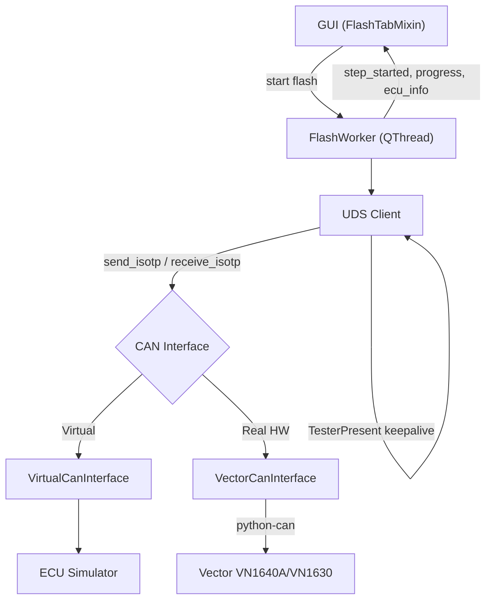

# SFlash (v3.0)

Ứng dụng desktop (PySide6) để **flash firmware ECU** qua giao thức **UDS (ISO 14229)** trên bus CAN — hỗ trợ chạy với **ECU giả lập** (không cần phần cứng) hoặc với thiết bị **Vector VN1640A / VN1630** thật.

---

## Tính Năng

- **Đọc file firmware**: Intel HEX (`.hex`), Motorola S-Record (`.s19`), Binary (`.bin`) — tự động tách thành các datablock/segment theo địa chỉ bộ nhớ.
- **UDS Client đầy đủ** (ISO 14229): session control, security access (seed & key), routine control, download/transfer, ghi/đọc Data Identifier, reset ECU, điều khiển DTC/communication.
- **ECU Simulator ảo**: mô phỏng toàn bộ state machine của một ECU thật (session, security, download) — cho phép test luồng flash hoàn chỉnh mà không cần phần cứng.
- **Vector CAN Adapter**: giao tiếp với phần cứng thật qua `python-can` (`interface='vector'`), hỗ trợ cả CAN và CAN FD.
- **TesterPresent keepalive**: tự động gửi `TesterPresent (0x3E)` nền để giữ session UDS không bị timeout trong lúc flash.
- **NRC retry logic**: tự động retry khi ECU trả về các NRC có thể phục hồi (Busy, ConditionsNotCorrect), xử lý riêng `ResponsePending (0x78)`.
- **Security DLL loader**: có thể trỏ tới DLL ngoài (`ctypes`) để tính key bảo mật theo thuật toán riêng của OEM khi flash ECU thật.
- **Đọc thông tin ECU (ReadDID)**: đọc SW/HW Version, Part Number, Serial Number trước và sau khi flash để xác nhận.
- **GUI theo dõi tiến trình real-time**: bảng các bước UDS, tiến trình từng segment, progress bar, log kỹ thuật (trace CAN frame) và log dễ đọc (information) tách riêng.
- **Menu bar (File/Edit/View/Tools/Help)**: Load Firmware..., **Recent Files** (tối đa 8 file gần nhất, click để nạp lại nhanh), **Save Project As... / Open Project...** (lưu/nạp lại 1 phiên làm việc trọn vẹn — firmware đã nạp + cấu hình CAN — thành file `.sfproj`, khác với Profile tự động chỉ nhớ cấu hình lần cuối), Close Window, Clear Information Log / Clear Trace Table, **Dark Mode** (toggle, mặc định tắt — Light Mode — ở lần chạy đầu tiên, nhớ lại lựa chọn giữa các lần mở app sau đó), **Resize Window** (Default/Medium/Large + Maximize/Full Screen), **Flash / Abort** (tương đương nút Flash/Abort trên tab Flash — chỉ 1 trong 2 bật tuỳ trạng thái đang chạy hay không), **Test Connection...** (kiểm tra session + security access an toàn ngay trên GUI, không cần dùng CLI — không đụng Erase/Download), Export Report..., About, **Open Guideline** (hướng dẫn sử dụng nhanh dành cho end-user, `docs/user_guide.html`, có ảnh minh hoạ — ngắn gọn hơn README này), **Export Issue...** (xuất 1 file `.txt` gom Environment/Configuration/CAN Details/Datablocks/Information Log/Trace — để đính kèm khi cần hỗ trợ debug, cố tình bỏ bảng Steps vì Information Log đã narrate lại đủ chi tiết; có tuỳ chọn tick checkbox để đính kèm luôn file firmware đang nạp, xuất ra `.zip` — hữu ích khi nghi ngờ lỗi do sai định dạng/parse sai firmware, mặc định không tick vì firmware có thể nhạy cảm).
- **Export Report (HTML)**: xuất báo cáo tổng hợp 1 phiên flash (ECU info, checksum, các bước, trace) ra file HTML — menu **Tools → Export Report...**.
- **Lưu cấu hình tự động**: Hardware/Radar Side/Security DLL/Flash Sequence/Dark Mode được nhớ lại giữa các lần mở app.
- **Giao diện theme nhất quán ("Engineering Blue"), có Dark Mode**: QSS áp dụng toàn app (`resources/style.qss` sáng, `resources/style_dark.qss` tối, toggle qua menu **View → Dark Mode**) — button/tab/table/progress bar/menu đồng bộ 1 tông màu xanh dương, có phản hồi hover/pressed rõ ràng, progress bar chuyển động mượt thay vì nhảy cứng theo từng bước, thay vì style mặc định rời rạc của OS. Icon app cũng được set làm window/taskbar icon lúc chạy (không chỉ icon file `.exe`).

---

## Cấu Trúc Project

```
06_PYSIDE6/
├── main.py                    ← Entry point (GUI)
├── cli.py                     ← Entry point (Command Line Interface)
├── cli_gitlab.py              ← Nhóm lệnh `cli.py gitlab ...` (artifact/package)
├── build.bat                  ← Build file .exe cho Windows (PyInstaller)
│
├── resources/
│   ├── style.qss               ← Theme QSS sáng toàn app ("Engineering Blue")
│   ├── style_dark.qss          ← Theme QSS tối (Dark Mode), mirror style.qss
│   └── icons/
│       ├── flash_bolt_blue.ico   ← Icon app, dùng khi build .exe + window/taskbar icon lúc chạy
│       └── flash_bolt_blue.svg   ← File nguồn vector, chỉnh sửa/thiết kế lại tại đây
│
├── gui/                       ← GUI logic + file UI
│   ├── main_window.ui         ← Qt Designer file
│   ├── ui_main_window.py      ← UI auto-generated (từ main_window.ui)
│   ├── main_window.py         ← MainWindow (mixin pattern)
│   ├── flash_tab.py           ← Tab Flash: chạy/theo dõi flash sequence
│   ├── configure_tab.py       ← Tab Configure: chọn file, cấu hình Communication
│   ├── menu_bar.py            ← Menu bar File/Edit/View/Tools/Help
│   ├── test_connection_dialog.py  ← Dialog Tools > Test Connection...
│   ├── report_export.py       ← Export Report... (HTML), gọi từ menu Tools
│   ├── settings_profile.py    ← Lưu/nạp cấu hình (QSettings)
│   ├── project_file.py        ← Save/Open Project (.sfproj, JSON) — File menu
│   ├── issue_export.py        ← Export Issue (.txt debug bundle) — Help menu
│   └── style.py               ← load_stylesheet(dark=), is_dark_mode_enabled(), ICON_PATH
│
├── core/                      ← Business logic
│   ├── flash_controller.py    ← FlashWorker (QThread) — chạy flash sequence qua UDS
│   ├── flash_sequence.py      ← Định nghĩa FlashStep + build_flash_sequence()
│   ├── test_connection.py     ← TestConnectionWorker (QThread) — session+security probe
│   ├── batch_runner.py        ← BatchRunner — `cli.py batch`, flash tuần tự nhiều ECU
│   ├── parallel_runner.py     ← ParallelRunner — `cli.py parallel`, nhiều ECU đồng thời
│   ├── flash_unit.py          ← FlashUnit + parse `--unit`/`--units-file`
│   ├── project_config.py      ← Đọc .sfproj headless (`--project`) + format version
│   └── report.py              ← RunRecord + xuất HTML/CSV/JSON (`--report`...)
│
├── communication/              ← CAN + UDS protocol layer
│   ├── can_interface.py        ← Interface trừu tượng (send/receive/ISO-TP)
│   ├── virtual_can.py          ← Virtual CAN bus (không cần hardware)
│   ├── vector_can.py           ← Adapter cho Vector VN1640A/VN1630 (python-can)
│   ├── ecu_simulator.py        ← ECU giả lập đầy đủ (session/security/download)
│   ├── uds_client.py           ← UDS Client (10 service, retry, keepalive, DLL loader)
│   └── tester_present.py       ← Thread nền giữ session UDS sống
│
├── parsers/                    ← Parser file firmware
│   ├── hex_parser.py           ← Intel HEX
│   ├── srec_parser.py          ← Motorola S-Record
│   ├── binary_parser.py        ← Raw binary
│   └── auto_parser.py          ← Tự nhận diện định dạng theo đuôi file (dùng chung GUI + CLI)
│
├── config/settings.py          ← Hằng số app (hardware options, CAN config mẫu...)
├── tests/                      ← Bộ test tự động (unittest) + sample.hex
└── docs/
    ├── walkthrough.md          ← Nhật ký triển khai chi tiết từng phase
    ├── user_guide.html         ← Hướng dẫn dùng GUI cơ bản cho end-user (Help > Open Guideline)
    └── *_Report_Trace.csv      ← Log CAN trace thật, dùng để đối chiếu flash sequence
```

---

## Kiến Trúc


```mermaid
graph TD
    A["GUI (FlashTabMixin)"] -->|"start flash"| B["FlashWorker (QThread)"]
    B -->|"step_started, progress, ecu_info"| A
    B --> C["UDS Client"]
    C -->|"TesterPresent keepalive"| C
    C -->|"send_isotp / receive_isotp"| D{"CAN Interface"}
    D -->|"Virtual"| E["VirtualCanInterface"]
    D -->|"Real HW"| F["VectorCanInterface"]
    E --> G["ECU Simulator"]
    F -->|"python-can"| H["Vector VN1640A/VN1630"]
```

### UDS Services Hỗ Trợ (ISO 14229)

| SID | Service | Mô tả |
|-----|---------|--------|
| 0x10 | DiagnosticSessionControl | Default / Extended / Programming session |
| 0x11 | ECUReset | Hard / Soft / KeyOffOn reset |
| 0x22 | ReadDataByIdentifier | Đọc SW/HW Version, Serial Number, Part Number... |
| 0x27 | SecurityAccess | Seed & Key (thuật toán mặc định hoặc DLL ngoài) |
| 0x28 | CommunicationControl | Enable / Disable normal communication |
| 0x2E | WriteDataByIdentifier | Ghi Fingerprint (DID 0xF15A) |
| 0x31 | RoutineControl | Check Preconditions / Erase Memory / Verify |
| 0x34 | RequestDownload | Yêu cầu ECU nhận dữ liệu firmware |
| 0x36 | TransferData | Gửi dữ liệu firmware theo từng block |
| 0x37 | RequestTransferExit | Kết thúc transfer |
| 0x3E | TesterPresent | Giữ session sống (keepalive) |
| 0x85 | ControlDTCSetting | Enable / Disable ghi log DTC |

---

## Yêu Cầu

- Python **3.9+** (đã test trên 3.12)
- [PySide6](https://pypi.org/project/PySide6/) — bắt buộc, dùng cho GUI
- [python-can](https://pypi.org/project/python-can/) — **chỉ cần khi flash với phần cứng Vector thật**, không cần nếu chỉ dùng Virtual ECU Simulator

## Cài Đặt

```bash
# Tạo môi trường (khuyến nghị dùng conda/miniforge)
conda create -n pyside6 python=3.12
conda activate pyside6

# Cài dependencies
pip install -r requirements.txt

# Chỉ cần nếu dùng phần cứng Vector thật (mặc định đang comment trong requirements.txt)
pip install python-can
```

## Chạy Ứng Dụng

```bash
conda activate pyside6
python main.py
```

## Sử Dụng Nhanh (Virtual ECU — không cần hardware)

1. Chạy app.
2. Tab **Configure → Communication** → chọn **"Virtual ECU Simulator (No Hardware)"**.
3. Tab **Configure → Data** → click **"Please click here to add a Datablock"** → chọn file (vd. `tests/sample.hex`).
4. Quay lại tab **Flash** → nhấn **Flash**.
5. Theo dõi:
   - **Steps table**: từng bước UDS (đọc ECU ID → session → security → download → verify → reset).
   - **Segments table**: tiến trình từng segment (0% → 100%).
   - **Information tab**: log dễ đọc (SW/HW Version đọc được, kết quả từng bước).
   - **Trace tab**: log kỹ thuật — hex frame TX/RX qua ISO-TP, `TesterPresent` gửi định kỳ.

## Sử Dụng Với Phần Cứng Vector Thật

Phần cứng Vector (VN1640A/VN1630) **chỉ chạy được trên Windows** (XL Driver Library không có bản macOS/Linux). Cần cài đặt đúng thứ tự dưới đây. Từ khi app hỗ trợ chọn channel theo **serial number** (mục "Lưu ý về đánh số channel" bên dưới), bước cấu hình **Vector Hardware Config** (mục B) chỉ còn **bắt buộc nếu `python-can` không hỗ trợ tham số `serial`** (bản cũ hơn 4.x) — nếu không chắc, cứ làm mục B cho chắc, không tốn thêm gì.

### A. Cài đặt (làm 1 lần trên máy Windows)

1. Cài **Vector Driver Setup** (tải từ [vector.com](https://www.vector.com), hoặc có sẵn nếu máy đã cài CANoe/CANalyzer/CANape) — gói này cài:
   - **XL Driver Library** — thư viện driver mà `python-can` dùng để giao tiếp phần cứng Vector.
   - **Vector Hardware Config** (tên cũ: *Vector Hardware Manager*) — công cụ quản lý channel/ứng dụng, **bắt buộc phải dùng** ở bước B.
2. `pip install python-can` (đã ghi sẵn nhưng comment trong `requirements.txt` — chạy `pip install python-can` riêng, hoặc bỏ comment dòng đó rồi `pip install -r requirements.txt`).
3. Cắm thiết bị VN1640A/VN1630 vào máy qua USB.

### B. Cấu hình Vector Hardware Config (bắt buộc nếu không dùng serial — xem mục "Lưu ý về đánh số channel")

Vector XL Driver không cho ứng dụng truy cập channel tự do — mỗi phần mềm (CANoe, CANalyzer, hay app tự viết như tool này) phải được **đăng ký tên ứng dụng**, và channel vật lý phải được **gán (assign)** cho đúng tên đó. Tool này đăng ký với tên **`FlashTool`** (xem `communication/vector_can.py`, tham số `app_name`).

1. Mở **Vector Hardware Config** (tìm trong Start Menu sau khi cài Driver Setup).
2. Vào tab **Applications** → nếu chưa có mục **"FlashTool"**, bấm **Add/New Application** để thêm (đặt tên đúng chính xác `FlashTool`).
3. Ở mục cấu hình của "FlashTool", **gán (assign)** channel vật lý muốn dùng vào đó — vd. kéo **"VN1640A – Channel 1"** vào slot CAN1 của ứng dụng FlashTool.
4. **Save**.

Nếu bỏ qua bước này, kết nối từ tool sẽ báo lỗi kiểu *"no channels configured for application"* dù `list-hardware`/nút **Refresh** trong GUI vẫn "thấy" được hardware — vì bước quét đó chỉ hỏi driver "có hardware nào cắm vào máy" (không cần đăng ký app), còn bước **kết nối thật** thì driver bắt buộc phải tra theo tên app đã đăng ký.

### C. Nếu dùng chung hardware với CANoe

- CANoe và tool này có thể cùng đăng ký dùng chung 1 channel vật lý (driver Vector hỗ trợ nhiều app/channel).
- Nên **dừng measurement (hoặc đóng) CANoe** trong lúc dùng tool này, tránh 2 bên cùng gửi frame lên bus gây xung đột/nhiễu trace — đặc biệt nếu CANoe có node giả lập gửi UDS/TesterPresent trùng CAN ID.
- Nếu muốn dùng CANoe song song chỉ để **log CAN bus** (không có node/panel nào chủ động gửi UDS): về nguyên tắc có thể chạy cùng lúc, nhưng nhớ **tắt TesterPresent tự động của CANoe** (nếu có bật) trên đúng CAN ID của ECU đang flash — nếu cả CANoe lẫn tool này cùng gửi TesterPresent (0x3E), ECU có thể nhận 2 tester khác nhau và raise NRC bất thường hoặc rớt session giữa chừng.
- **Cảnh báo tự động**: từ Phase 4.23, trước khi flash vào hardware thật (không áp dụng cho Virtual ECU Simulator), tool tự kiểm tra 2 tín hiệu và cảnh báo nếu phát hiện rủi ro xung đột — vì người dùng đôi khi quên CANoe vẫn đang mở:
  - Có tiến trình `CANoe.exe`/`CANalyzer.exe`/`CANape.exe` đang chạy trên máy (chỉ hoạt động trên Windows, qua `tasklist`).
  - Channel Vector đang chọn được driver báo là **đã có kết nối active** (`is_on_bus`), bất kể ứng dụng nào đang giữ nó.

  Trong GUI, gặp cảnh báo này sẽ hiện hộp thoại Yes/No (mặc định **No**) trước khi bắt đầu flash. Trong `cli.py` (`flash`/`test-connection`), cảnh báo chỉ **in ra `stderr`** rồi tiếp tục chạy — không chặn, để giữ khả năng chạy script/tự động hóa.

### D. Sử dụng trong app

1. Tab **Configure → Communication** → bấm **"Refresh"** cạnh combo Hardware để quét lại thiết bị đang cắm, rồi chọn kênh tương ứng vừa xuất hiện. Combo mặc định chỉ có **"Virtual ECU Simulator"** — kênh thật chỉ hiện ra khi có hardware Vector thật sự được nhận diện *và* đã đăng ký ở bước B (không còn danh sách kênh giả cố định như trước).
2. Nếu ECU yêu cầu thuật toán bảo mật riêng của OEM: tab **Configure → Flash Options** → mục **"Security Access"** → tick **"Active Security Access"** rồi chọn file DLL (Browse...). Không tick (mặc định) thì app dùng thuật toán seed/key dummy built-in, kể cả khi đã chọn DLL. Nếu tick mà chưa chọn DLL (hoặc file DLL không còn tồn tại), app **từ chối bắt đầu flash** trên hardware thật và báo lỗi — không âm thầm rơi về thuật toán dummy. Virtual ECU Simulator luôn dùng thuật toán dummy bất kể checkbox.

   **DLL phải cùng kiến trúc (32/64-bit) với bản SFlash đang chạy.** DLL Seed&Key rất thường được build **32-bit** (vì đi kèm bộ tool CANoe/CANape), còn SFlash chạy Python/`.exe` 64-bit → Windows **không thể** load vào. Đây là quy tắc của OS, không phải giới hạn của app: một process 64-bit không bao giờ load được DLL 32-bit. App kiểm tra PE header của DLL **trước khi** bắt đầu flash và báo thẳng ra, thay vì để chết ở bước SecurityAccess và bỏ ECU ở giữa session — chọn lại file không giải quyết được gì.

   Kiểm tra nhanh DLL là 32 hay 64-bit (không đụng tới ECU):

   ```powershell
   python cli.py check-security-dll C:\path\SeedKey.dll
   ```

   In ra kiến trúc DLL, kiến trúc của SFlash, thử load thật, và cho biết DLL có export `GenerateKeyExOpt`/`GenerateKeyEx` hay không. Exit `0` = dùng được, `1` = không.

   **Chữ ký hàm (calling contract) phải khớp.** Có 3 kiểu DLL ngoài đời, gọi sai kiểu **không** chỉ ra key sai mà làm **crash process** (đọc tham số từ stack rác rồi ghi key qua con trỏ rác):

   | `--security-dll-signature` | Hàm | Mô tả |
   |---|---|---|
   | `vector` | `GenerateKeyEx` | Chuẩn Vector/ASAM: **7 tham số**, truyền mảng byte, trả status code, key ghi vào buffer của caller |
   | `vector_opt` | `GenerateKeyExOpt` | Biến thể ODX: như trên + `const char* iOptions` (**8 tham số**) |
   | `uint32` | tên tuỳ ý | Hợp đồng cũ của project này: `uint32 seed → uint32 key` (**1 tham số**) |

   Mặc định `auto`: có export `GenerateKeyExOpt` → `vector_opt`, còn lại `GenerateKeyEx` → `vector`. Đúng cho mọi DLL chuẩn Vector. Chỉ DLL kiểu `uint32` mới phải khai rõ bằng `--security-dll-signature uint32`.

   Nếu DLL là 32-bit thì **chỉ có 2 hướng**: (a) xin bên cấp DLL bản **x64** — thường họ có cả hai; (b) dùng một process phụ 32-bit làm cầu nối (chưa implement — nói nếu bạn cần). Build SFlash thành 32-bit **không khả thi**: Qt 6/PySide6 không có bản Windows 32-bit nên không cài được trên Python 32-bit.

   Nếu DLL đúng kiến trúc mà vẫn không load được, nguyên nhân hay gặp thứ hai là **thiếu DLL phụ thuộc** (WinError 126): copy đủ các DLL mà nó link tới vào cùng thư mục, kèm Visual C++ Runtime mà nó được build với. App tự thêm thư mục chứa DLL vào đường dẫn tìm kiếm khi load (`os.add_dll_directory`) nên DLL nằm cạnh nhau sẽ được tìm thấy.

   **Lưu ý khi chạy bản `.exe`**: nếu thấy thông báo *"Failed to load dynlib/dll ... Most likely this dynlib/dll was not found when the application was frozen"* thì đó là câu của **PyInstaller**, không phải lỗi đóng gói — Security DLL là file ngoài, chọn lúc chạy, cố ý **không** bundle vào `.exe`. Từ bản này app đã bóc lỗi gốc ra và in nguyên nhân thật (sai 32/64-bit, thiếu DLL phụ thuộc, hay file không tồn tại) thay vì câu đó.
3. Nếu ECU yêu cầu khai báo compression/encryption method trong RequestDownload: tab **Configure → Data**, bảng **Details** — 2 dòng **Compression Method**/**Encryption Method** giờ gõ trực tiếp được từ bàn phím (1 ký tự hex 0-F, mặc định 0 = None, chữ thường tự động chuyển thành chữ hoa) thay vì chỉ hiển thị, chỉ set nibble tương ứng trong byte `dataFormatIdentifier` gửi cho ECU, **không** tự nén/mã hóa dữ liệu firmware — file nạp vào phải đã ở đúng định dạng đó từ trước nếu chọn giá trị khác 0. Đây là 1 lựa chọn chung cho cả phiên flash, không đổi theo từng datablock nạp vào.
4. Tester Serial Number ghi vào ECU khi flash (chỉ sequence **Suzuki**, bước "Write Tester Info", DID `0xF198`): tab **Configure → Flash Options** → mục **"Fingerprint"** → gõ hex trực tiếp vào **"Tester Serial Number"** (tối đa 20 ký tự hex = 10 byte, mặc định `00112233445566778899`, chữ thường tự động chuyển thành chữ hoa). Sequence **Generic** không dùng field này.
5. Nạp file firmware và nhấn **Flash** như trên. Khuyến nghị chạy `test-connection` trước (xem mục [Command Line Interface](#command-line-interface-clipy)) để xác nhận đấu dây/channel/security đúng trước khi flash thật.

### Nạp Firmware Từ GitLab (CI Artifact / Package Registry)

Ngoài chọn file firmware trên máy, app hỗ trợ nạp trực tiếp từ GitLab — lấy về job artifact mới nhất của 1 pipeline CI, hoặc 1 phiên bản trong Package Registry (Generic packages) của project.

- **Kích hoạt**: mặc định tính năng này **tắt** — cần `pip install python-gitlab` rồi bỏ comment dòng `python-gitlab` trong `requirements.txt` (hoặc `requirements_build.txt` nếu muốn có luôn trong bản build `.exe`). Không cài thì phần còn lại của app không đổi hành vi gì.
- **Vị trí**: menu **File → Load from GitLab...**, hoặc nút **"Load from GitLab..."** trên tab **Configure → Data** (ngay dưới bảng Details).
- **Cách dùng**: điền Instance URL/Project/Access Token (lưu riêng, không dùng chung Profile của app), chọn tab **CI Artifact** (nhập ref + tên job, hoặc bấm "Browse recent jobs..." để chọn từ danh sách) hoặc tab **Package Registry** (nhập tên package, hoặc "Browse versions..."), bấm Fetch. Nếu file tải về là `.zip`, app tự giải nén và cho chọn đúng file firmware bên trong (tự chọn sẵn file khớp đuôi `.hex`/`.s19`/`.bin` nếu tìm thấy); xác nhận xong file được nạp vào app **y hệt** như chọn file local — qua bảng Details, Recent Files bình thường.
- **Chỉ đọc (read-only)**: tính năng này **chỉ fetch** — không bao giờ publish, upload, hay trigger pipeline nào trên GitLab.

### Lưu ý về đánh số channel (`--channel N`)

**GUI**: combo Hardware tự phát hiện serial number của thiết bị Vector và dùng nó để chọn đúng channel vật lý — **không cần** cấu hình bước B (Vector Hardware Config) nếu python-can hỗ trợ tham số `serial` (phiên bản 4.x trở lên). Nếu python-can không hỗ trợ `serial`, app tự động fallback về dùng `app_name`/`xlGetApplConfig` — khi đó bước B là bắt buộc.

**CLI**: `--channel N` mặc định là application channel index (cần bước B). Để bypass hoàn toàn, dùng `--channel <hw_channel> --serial <serial_number>` — xem `list-hardware` để lấy giá trị đúng.

### Không detect được hardware Vector (combo Hardware trống)

Nếu combo Hardware chỉ có "Virtual ECU Simulator" dù đã cắm hardware Vector thật — bấm **"Refresh"** rồi xem tab **Information**: nếu có lỗi thật (khác "chưa cắm gì"), dòng log sẽ hiện lý do cụ thể ngay trong GUI (không cần mở terminal). 2 nguyên nhân hay gặp nhất, đặc biệt nếu cùng 1 bản `.exe` chạy được ở máy này nhưng không được ở máy khác:

1. **Vector XL Driver Library chưa cài trên máy đang gặp lỗi** (mục A ở trên) — driver này cài riêng theo từng máy, không đi kèm trong file `.exe`.
2. **Bản `.exe` build ra không có `python-can`** — mặc định `requirements_build.txt` comment sẵn dòng `python-can`; nếu build mà không bỏ comment trước, `.exe` chạy tốt với Virtual ECU Simulator nhưng sẽ **không bao giờ** detect được hardware thật dù máy nào — cần build lại (xem mục "Build file .exe" bên dưới). Trường hợp này thì lỗi xảy ra **giống nhau ở mọi máy**, khác với trường hợp 1 (chỉ lỗi ở máy thiếu driver).

---

## Command Line Interface (`cli.py`)

Chạy các chức năng chính của app từ command line — không cần mở GUI. Chạy được trên cả **Windows, macOS, Linux** (chỉ dùng thư viện chuẩn + PySide6; riêng nhóm lệnh `gitlab` cần thêm `python-gitlab`).

CLI hiện **phủ đủ mọi chức năng của GUI**: Single Flash, Batch Flash, Parallel Flash, Test Connection, Load from GitLab, Export Report, và mở lại Project `.sfproj`.

| Lệnh | Tương ứng trong GUI |
|---|---|
| `info` | Configure → Data (bảng Datablocks/Details) |
| `list-hardware` | Configure → Communication → Refresh |
| `flash` | Tab Single Flash |
| `batch` | Tools → Mode → Batch Flash |
| `parallel` | Tab Parallel Flash |
| `test-connection` | Tools → Test Connection... |
| `gitlab` | File → Load from GitLab... |
| `--report` / `--trace-csv` | Tools → Export Report... / Trace → Save Log (CSV) |
| `--project` | File → Open Project... |

```bash
# Xem thông tin file firmware (không flash) — nhiều file cũng được
python cli.py info tests/sample.hex
python cli.py info app.s19 calib.s19

# Xem trước các bước sẽ chạy, không gửi gì tới ECU
python cli.py flash tests/sample.hex --dry-run

# Flash qua Virtual ECU Simulator (mặc định, không cần hardware)
python cli.py flash tests/sample.hex

# Flash nhiều datablock trong 1 lần (giống tick nhiều dòng ở bảng Datablocks)
python cli.py flash app.s19 calib.s19 --sequence suzuki

# Flash bằng Suzuki flash sequence, Radar Side S1
python cli.py flash firmware.s3 --sequence suzuki --radar-side s1

# Flash hardware Vector thật, channel 2, kèm CAN trace chi tiết
python cli.py flash firmware.s3 --hardware vector --channel 1 --verbose

# Test kết nối an toàn (đọc ECU Identification, KHÔNG Erase/Download,
# KHÔNG Security Access) — trước khi tin tưởng flash thật
# (xem mục "Test Trên ECU Thật" bên dưới)
python cli.py test-connection --hardware vector --channel 0 --sequence suzuki --verbose

# Xem danh sách hardware/CAN option (tự quét hardware Vector thật đang cắm)
python cli.py list-hardware

# Xem đầy đủ option
python cli.py flash --help
python cli.py batch --help
python cli.py parallel --help
python cli.py gitlab artifact --help
```

Các cờ chính dùng chung cho `flash`/`batch`/`parallel`/`test-connection`: `--hardware {virtual,vector}`, `--channel`, `--serial`, `--sequence {generic,suzuki}` (mặc định **`suzuki`**), `--radar-side {s0,s1}`, `--tx-id`/`--rx-id` (ghi đè Radar Side), `--bitrate`, `--can-fd`, `--data-bitrate`, `--security-dll <path>`, `--compression`/`--encryption` (nibble `dataFormatIdentifier` của RequestDownload, 0-15, mặc định 0 — chỉ khai báo định dạng cho ECU, không tự nén/mã hóa file), `--tester-serial <hex>` (payload WriteDataByIdentifier DID `0xF198`, chuỗi hex chẵn số ký tự, mặc định `00112233445566778899` — chỉ dùng cho sequence `suzuki`), `--project`, `--report`/`--trace-csv`/`--json-summary`, `-q`/`--quiet`, `-v`/`--verbose`. `flash`/`batch`/`parallel` có thêm `--base-address` (cho file `.bin`) và `--dry-run`.

Mã thoát (exit code): `0` = thành công, `1` = abort/lỗi, `2` = lỗi tham số/parse file/project, `130` = bị ngắt (Ctrl+C) — thuận tiện để dùng trong script CI/automation. Với `batch`/`parallel`, exit `0` chỉ khi **mọi** unit đều PASS.

**Lưu ý**: `--hardware vector` (Vector VN1640A/VN1630 thật) chỉ dùng được trên **Windows** vì driver Vector XL Driver Library chỉ có bản Windows. `--hardware virtual` (mặc định) chạy y hệt trên mọi hệ điều hành.

### Xuất báo cáo: `--report` / `--trace-csv` / `--json-summary`

Có trên cả 4 lệnh flash/test. Luôn được ghi **dù run thành công hay thất bại** — lúc fail mới là lúc cần report nhất. Nếu ghi file lỗi thì chỉ cảnh báo, không đổi exit code (flash đã xảy ra rồi).

```bash
python cli.py flash firmware.s3 --hardware vector --channel 0 \
    --report report.html --trace-csv trace.csv --json-summary result.json
```

- `--report report.html` — báo cáo HTML đủ mục Summary / Firmware / Steps / Trace (và bảng Units cho `batch`/`parallel`), tương đương **Tools → Export Report...** của GUI.
- `--trace-csv trace.csv` — đúng 6 cột như `docs/*_Report_Trace.csv`, giống hệt **Trace → chuột phải → Save Log (CSV)**. Trace được thu đầy đủ **không cần** `--verbose` (cờ đó chỉ quyết định có in ra màn hình hay không).
- `--json-summary result.json` — bản tóm tắt máy đọc được (`result`, `duration_seconds`, `units`, `unit_counts`, `steps`, `firmware`…) để CI assert trực tiếp, không phải parse HTML hay scrape stdout.

### Mở lại Project: `--project file.sfproj`

Đọc đúng file `.sfproj` mà GUI ghi ra ở **File → Save Project As...**: danh sách firmware (chỉ các dòng đã tick), Radar Side, Flash Sequence, CAN/CAN FD, Security DLL (chỉ dùng nếu "Active Security Access" được tick), Compression/Encryption, Tester Serial Number.

```bash
# Dùng nguyên cấu hình đã lưu
python cli.py flash --project line1.sfproj

# Vẫn ghi đè được từng cờ — cờ truyền tay luôn thắng project
python cli.py flash --project line1.sfproj --radar-side s1
```

Thứ tự ưu tiên: **cờ command line > project > giá trị mặc định**. Project thiếu file firmware thì thoát `2` và liệt kê **tất cả** file bị thiếu (không chết ở file đầu tiên).

### `batch` — flash nhiều ECU lần lượt

Bản CLI của **Tools → Mode → Batch Flash**: mỗi unit được Identify trước (lấy Serial Number cho log/report) rồi mới flash, một unit fail không làm dừng cả loạt.

```bash
# 5 ECU cùng cấu hình, chờ nhấn Enter giữa các lần để đổi ECU
python cli.py batch firmware.s3 --hardware vector --channel 0 \
    --count 5 --pause --report batch.html

# Mỗi unit một cấu hình riêng
python cli.py batch firmware.s3 \
    --unit "name=Left,channel=0,side=s0" \
    --unit "name=Right,channel=1,side=s1"

# Hoặc khai báo trong file JSON
python cli.py batch firmware.s3 --units-file line1_units.json
```

Cờ riêng: `--count N` (số unit cùng cấu hình), `--pause` (chờ Enter giữa các unit — **mặc định tắt** để script không bị treo ở stdin), `--no-identify` (bỏ bước Identify), `--stop-on-fail` (dừng ngay ở unit đầu tiên fail; mặc định chạy hết rồi báo cáo tất cả).

### `parallel` — flash nhiều ECU cùng lúc

Bản CLI của tab **Parallel Flash**: mỗi unit một thread + một channel CAN riêng, chạy đồng thời, và các lần tính key của Security DLL được **xếp hàng qua 1 lock dùng chung** y như GUI (DLL ngoài không chắc thread-safe).

```bash
python cli.py parallel firmware.s3 --hardware vector \
    --unit "name=Left,channel=0,serial=123456,side=s0" \
    --unit "name=Right,channel=1,serial=123456,side=s1" \
    --report parallel.html
```

Hai unit trỏ vào **cùng một ECU thật** (cùng channel + cùng Tx ID) sẽ bị chặn với exit `2` — hai UDS session song song lên một ECU sẽ phá nhau và trông như lỗi hardware. GUI không gặp chuyện này vì mỗi panel gắn một channel riêng; CLI thì phải kiểm tra. Riêng unit `virtual` được phép trùng (mỗi unit có simulator riêng), tiện để thử nhanh tính đồng thời: `python cli.py parallel tests/sample.hex --count 4`.

Ctrl+C = Abort All: mọi channel đang chạy được yêu cầu abort rồi mới thoát, không bỏ thread nào lại.

### Cấu trúc file units (`--units-file`)

Dùng chung cho cả `batch` và `parallel`. Là một list, hoặc một object có khóa `units` (hoặc `channels`):

```json
{
  "comment": "Line 1 — 2 radar mỗi xe",
  "units": [
    { "name": "Left",  "hardware": "vector", "channel": 0, "serial": 123456, "side": "s0" },
    { "name": "Right", "hardware": "vector", "channel": 1, "serial": 123456, "side": "s1" }
  ]
}
```

Các field: `name`, `hardware` (`virtual`/`vector`), `channel`, `serial`, `side` (`s0`/`s1`), `tx_id`, `rx_id`, `functional_id`. **Field nào không khai thì lấy từ cờ global của lệnh.** Sai tên field sẽ báo lỗi rõ ràng chứ không bị bỏ qua âm thầm (gõ sai `serial_number=` mà bị ignore thì sẽ flash sai ECU). Trong một unit, `tx_id`/`rx_id` thắng `side`; nhưng `side` của unit luôn thắng `--tx-id`/`--rx-id` global — nếu không thì mọi unit sẽ dùng chung một cặp CAN ID và "flash Left + Right" thực ra chỉ flash một ECU hai lần.

### `gitlab` — tải firmware từ GitLab

Bản CLI của **File → Load from GitLab...**. Cần `pip install python-gitlab`. Token lấy từ `--token` hoặc — nên dùng hơn — biến môi trường `SFLASH_GITLAB_TOKEN` (không lọt vào shell history và `ps`).

```bash
export SFLASH_GITLAB_TOKEN=glpat-xxxxxxxx

# Liệt kê branch/tag của project (mặc định là repo artifact của team)
python cli.py gitlab refs

# Liệt kê job CI, chỉ job success (giống bảng Browse của GUI)
python cli.py gitlab jobs --ref Release_DD_05_01_02 --success-only

# Tải artifact của job success mới nhất trên 1 branch, giải nén luôn
python cli.py gitlab artifact --ref main --job create_ffi_3p5mb_no_HTSM \
    -o downloads --extract

# Hoặc tải chính xác 1 job theo ID lấy từ `gitlab jobs`
python cli.py gitlab artifact --job-id 9876543 -o downloads --extract

# Package Registry
python cli.py gitlab packages --package-name radar_fw
python cli.py gitlab package  --package-name radar_fw --version 1.2.3 -o downloads
```

Nối thẳng tải-rồi-flash bằng `--print-firmware` (chỉ in ra đường dẫn file firmware trong archive, mỗi dòng một file):

```bash
FW=$(python cli.py gitlab artifact --ref main --job build -o downloads --print-firmware)
python cli.py flash "$FW" --hardware vector --channel 0 --sequence suzuki
```

Cờ chung: `--gitlab-url`, `--gitlab-project` (mặc định lấy repo artifact/package của team trong `config/settings.py`), `--token`, `--no-ssl-verify` (instance self-hosted dùng certificate tự ký).

### `test-connection` — kiểm tra kết nối an toàn trước khi flash thật


Chỉ thực hiện **Session Control** rồi đọc một số DID nhận diện ECU (SW Version, HW Version, Serial Number, Supplier SW Version, ECU SW Number — read-only) — **không bao giờ** đụng tới Programming Session, Security Access, Erase Memory, TransferData, hay bất kỳ lệnh ghi nào. Dùng để xác nhận đấu dây/CAN ID/ECU có phản hồi đúng trước khi tin tưởng chạy `flash` thật lên ECU (Security Access thật sự chỉ được test khi chạy `flash`).

- Với `--sequence suzuki`: thực hiện đúng các bước tiền-Security giống log thật (Extended Session, Disable DTC, Disable Communication — đều functional/broadcast tới `0x700`), rồi đọc các DID ở địa chỉ vật lý.
- **Luôn cố khôi phục ECU về trạng thái an toàn khi kết thúc**, dù thành công hay lỗi giữa chừng: bật lại DTC/Communication (nếu đã tắt) rồi trả về Default Session — nhờ `try/finally`, không phụ thuộc bước nào ở trên có pass hay không.
- Kết quả in: `PASSED` (exit 0) hoặc `FAILED` kèm lý do cụ thể (exit 1) — mỗi DID đọc lỗi sẽ hiện `N/A (<lý do>)` thay vì làm cả bài test fail, miễn ECU vẫn phản hồi ở tầng session.

**Có cả trên GUI**: menu **Tools → Test Connection...** chạy đúng logic này (cùng file `core/test_connection.py`), hiện kết quả trong 1 dialog nhỏ — không cần rời khỏi GUI để dùng CLI.

---

## Test Trên ECU Thật (Từ Máy Windows)

Project build/dev trên Mac, nhưng test với ECU thật cần chạy trên **Windows** (driver Vector chỉ có bản Windows). Quy trình đề xuất:

### 1. Setup trên Windows

```powershell
git clone https://github.com/phuctm012/ECU-Flashing-Tool.git
cd ECU-Flashing-Tool
conda create -n pyside6 python=3.12
conda activate pyside6
pip install -r requirements.txt
pip install python-can
```

Cài thêm **Vector XL Driver Library** (từ trang Vector Informatik). Luôn chạy app qua **terminal/PowerShell** (không double-click) — nếu có exception/crash, traceback đầy đủ sẽ hiện ra terminal thay vì biến mất.

### 2. Quy trình test an toàn (theo thứ tự)

```powershell
# 1. Xác nhận hardware đã được nhận diện đúng
python cli.py list-hardware

# 2. Xem trước sequence, KHÔNG đụng ECU — kiểm tra logic trước
python cli.py flash firmware.s3 --sequence suzuki --dry-run

# 3. Test kết nối — an toàn, không Security Access, không Erase/Download
python cli.py test-connection --hardware vector --channel 0 --sequence suzuki --verbose

# 4. Chỉ khi bước 3 PASSED mới flash thật — nên test trên ECU dự phòng/bench trước
python cli.py flash firmware.s3 --hardware vector --channel 0 --sequence suzuki --verbose > flash_log.txt 2>&1
```

Hoặc test qua GUI (`python main.py`): Configure → Communication → bấm **Refresh** để quét hardware thật đang cắm → chọn channel/Radar Side → nạp firmware → Flash.

### 3. Cách lấy log gửi lại để debug

- **Ưu tiên nhất — tab Trace (GUI) → chuột phải → "Save Log (CSV)..."**: đúng format 6 cột giống `docs/*_Report_Trace.csv` đã phân tích trước đó → đối chiếu trực tiếp từng bước UDS được ngay.
- **CLI**: dùng `--verbose > flash_log.txt 2>&1` (gộp cả stdout + stderr vào 1 file, có đầy đủ TX/RX hex frame).
- Nếu app crash: copy nguyên traceback từ terminal (nhờ chạy qua terminal ở bước 1, không double-click).
- Tab Information (GUI) → "Save Log..." (.txt) — log dễ đọc hơn, bổ trợ cho Trace.

---

## Trạng Thái Phát Triển

| Phase | Nội dung | Trạng thái |
|-------|----------|:---:|
| 1 | Tái cấu trúc code (mixin pattern, tách module) | ✅ |
| 2 | File parser (HEX, S-Record, Binary) | ✅ |
| 3 | CAN Communication + UDS Protocol + ECU Simulator | ✅ |
| 4 | UDS nâng cao: keepalive, ReadDID, NRC retry, Security DLL loader | ✅ |
| 5 | GUI theme + Dark Mode, menu bar (Recent Files/Edit/Save-Load Project), đọc DTC sau flash | 🔜 (Save/Load Project `.sfproj` xong, còn đọc DTC) |

Xem chi tiết từng phase (kiến trúc, file mới, kết quả test) trong [`docs/walkthrough.md`](docs/walkthrough.md).

## Chạy Test

Bộ test tự động dùng `unittest` (built-in, không cần cài thêm gì). Chạy toàn bộ:

```bash
conda activate pyside6
python -m unittest discover -s tests -p "test_*.py" -v
```

Hoặc chạy riêng từng file (vd. chỉ test parser):

```bash
python -m unittest tests.test_parsers -v
```

| File | Nội dung |
|---|---|
| `test_parsers.py` | Intel HEX, S-Record (bao gồm `.s3`/32-bit address), Binary — parse đúng, lỗi checksum/record type/file không tồn tại |
| `test_flash_sequence.py` | `build_flash_sequence()` (generic) và `build_suzuki_slp1_flash_sequence()` — thứ tự bước, functional addressing, địa chỉ 5-byte, BCD date |
| `test_uds_client.py` | UDS Client qua Virtual ECU: session/security/read/write, functional addressing, NRC retry, ResponsePending (0x78), regression byte-order `RequestDownload` (ISO 14229) |
| `test_flash_controller.py` | `FlashWorker.run()` end-to-end (đồng bộ) qua Virtual ECU — cả sequence generic lẫn Suzuki |
| `test_flash_threading.py` | **Regression cho crash `QThread: Destroyed while thread is still running`** — chạy qua đúng `QThread` thật (`flash_button_clicked()` + `app.exec()`): 1 lần, lặp 5 lần, abort giữa chừng, đóng cửa sổ giữa chừng |
| `test_gui_smoke.py` | Khởi tạo `MainWindow`, tồn tại widget, `get_can_config()` (Radar Side, channel, CAN FD), lưu log `.txt`/`.csv`, cảnh báo xung đột CAN bus, lọc datablock theo checkbox, Export Report, lưu/nạp profile (`QSettings`), wiring menu bar, File > Recent Files, menu Edit (Clear Information Log/Trace), Save/Open Project (`.sfproj`), Resize Window, Export Issue (`.txt`/`.zip` kèm firmware) |
| `test_cli.py` | `cli.py` — `info`/`flash`/`list-hardware`/`test-connection`, `--dry-run`, Suzuki + Radar Side, `--quiet`/`--verbose`, cleanup khôi phục DTC/Comm, mã lỗi khi thiếu `python-can`/sai tham số |
| `test_cli_commands.py` | Phần CLI bổ sung cho ngang bằng GUI — flash nhiều file, `--project` (thứ tự ưu tiên cờ > project > default), `--report`/`--trace-csv`/`--json-summary` (ghi cả khi fail, không đổi exit code khi ghi lỗi), `batch`, `parallel` |
| `test_cli_batch_parallel.py` | `BatchRunner`/`ParallelRunner` end-to-end qua Virtual ECU — tuần tự đúng thứ tự, một unit fail không dừng loạt, `--stop-on-fail`, pause hook; **parallel thật sự đồng thời**, listener nhận được signal từ thread worker (regression cho "signal queued rồi mất vì không có event loop"), Security lock không bao giờ chồng lấn, Abort All |
| `test_cli_gitlab.py` | `cli.py gitlab` — thứ tự lấy token (`--token` > `SFLASH_GITLAB_TOKEN`), `refs`/`jobs` (lọc `--success-only`), tải artifact theo ref+job hoặc job-id, giải nén + `--print-firmware`, Package Registry, `--no-ssl-verify` |
| `test_cli_report.py` | `core/report.py` — 6 cột CSV trace khớp tab Trace của GUI, HTML đủ mục (Units chỉ hiện với batch/parallel), escape HTML, JSON summary |
| `test_project_config.py` | `core/project_config.py` — map index combo → nghĩa (**đối chiếu trực tiếp thứ tự item trong `gui/main_window.ui`**), file thiếu/format version mới hơn, gate "Active Security Access", fallback Tester Serial |
| `test_flash_unit.py` | `core/flash_unit.py` — parse `--unit`, đọc `--units-file`, và thứ tự ưu tiên CAN ID (`side` của unit thắng `--tx-id` global) |
| `test_security_dll.py` | `communication/security_dll.py` — đọc PE header xác định 32/64-bit (không cần `pefile`/`dumpbin`), chặn DLL sai kiến trúc trước khi gọi OS, bóc lỗi gốc khỏi wrapper của PyInstaller, WinError 126/193, thêm thư mục DLL vào search path rồi nhả ra |
| `test_vector_can.py` | `detect_running_vector_tools()` (nhận diện CANoe/CANalyzer/CANape qua `tasklist`, chỉ Windows) và field `is_on_bus` trong `detect_vector_channels()` |
| `test_test_connection.py` | `TestConnectionWorker.run()` đồng bộ qua Virtual ECU — generic/suzuki, đọc ECU ID, không bao giờ gửi SID `0x34`/`0x36`, khôi phục Default session |
| `test_test_connection_dialog.py` | **Regression cho deadlock trong `TestConnectionDialog.closeEvent()`** — chạy qua đúng `QThread` thật: 1 lần, lặp 5 lần, đóng dialog giữa chừng lúc đang probe |
| `test_style.py` | `load_stylesheet(dark=)` — đọc đúng file sáng/tối, trả `""` (không raise) nếu thiếu file; `is_dark_mode_enabled()` đọc/ghi qua `QSettings`; regression cho `resources/style.qss`/`style_dark.qss` thật (bảng màu, rule hover/pressed, `QTextEdit`, `sectionHeader` label) và icon app tồn tại |

**Lưu ý cho `test_flash_threading.py`**: đây là bộ test quan trọng nhất để tránh crash — nó cố tình chạy qua `QThread` thật thay vì gọi `FlashWorker.run()` trực tiếp (cách nhanh nhưng **không** phát hiện được race condition giữa Python và vòng đời `QThread`). Khi sửa bất kỳ logic nào liên quan tới `gui/flash_tab.py` (đặc biệt phần connect signal `flash_finished`/`flash_aborted`/`thread.finished`), luôn chạy lại file này.

---

## Build File `.exe` (Windows)

Đóng gói GUI (`main.py`) bằng [PyInstaller](https://pyinstaller.org/) — chỉ build được trên **Windows** (không build cho macOS/Linux).

```bat
REM Trên máy Windows, trong thư mục gốc project:
build.bat
```

`build.bat` hỏi tương tác lúc chạy — chọn **1. Onefile** hay **2. Onedir** (mặc định Onefile nếu bấm Enter bỏ trống):

| | Onefile (mặc định) | Onedir |
|---|---|---|
| Kết quả | 1 file `dist\SFlash.exe` duy nhất | 1 thư mục `dist\SFlash\` (chứa `SFlash.exe` + file phụ trợ) |
| Gửi/copy | Dễ — chỉ 1 file | Phải giữ nguyên cả thư mục, không tách riêng `.exe` |
| Tốc độ mở | Chậm hơn — mỗi lần chạy tự giải nén ra thư mục temp trước | Nhanh hơn rõ rệt — không có bước tự giải nén |

Sau khi chọn, `build.bat` tự động: cài `requirements.txt` + `requirements_build.txt` (chỉ có `pyinstaller`), dọn `build/`/`dist/`/`*.spec` cũ, rồi chạy PyInstaller (`--windowed`, kèm `--add-data` bundle sẵn `docs/user_guide.html`, `resources/style.qss`, `resources/style_dark.qss` và `resources/icons/` để menu Help > Open Guideline, theme sáng/tối và window icon lúc chạy đều hoạt động đúng trong bản build).

- **Không cần cài Vector XL Driver/`python-can` để build** — bản build chạy tốt với Virtual ECU Simulator ngay cả khi build trên máy không có `python-can`. Muốn hỗ trợ luôn hardware Vector thật: bỏ comment dòng `python-can` trong `requirements_build.txt` **trước khi** chạy `build.bat` (không thể thêm vào sau khi đã build dù Onefile hay Onedir, vì đều là bản đóng gói sẵn — Vector XL Driver Library vẫn phải cài riêng trên máy chạy app, xem mục [Sử Dụng Với Phần Cứng Vector Thật](#sử-dụng-với-phần-cứng-vector-thật)).
- Icon app: `resources\icons\flash_bolt_blue.ico` (đã có sẵn trong repo, nhiều kích thước) — `build.bat` tự dùng nếu tồn tại (cả cho icon file `.exe` lẫn window/taskbar icon lúc app chạy), bỏ qua (build không icon file `.exe`) nếu không có. File nguồn dạng vector ở `resources\icons\flash_bolt_blue.svg` nếu muốn chỉnh sửa/thiết kế lại.
- `build.bat` chỉ đóng gói GUI (`main.py`); `cli.py` vẫn chạy trực tiếp qua `python cli.py ...` như bình thường (không cần `.exe` riêng).
