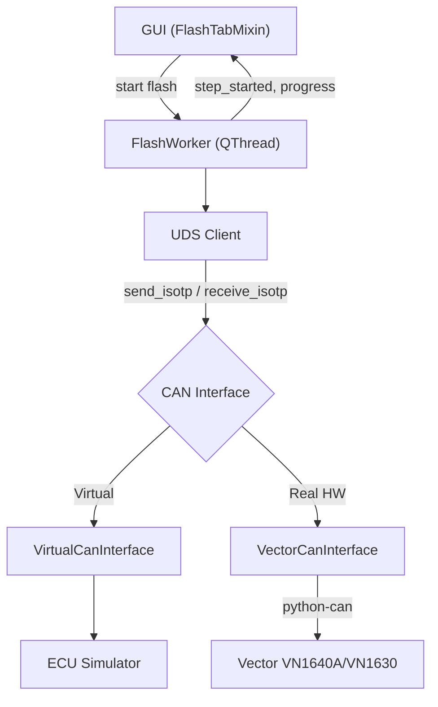

# Walkthrough — Phase 1 + 2 + 3 + 4 Complete

## Tổng Quan

Đã hoàn thành **4 Phase** cho ứng dụng ECU Flash Tool:
- **Phase 1**: Tái cấu trúc code
- **Phase 2**: File parser (HEX, S-Record, Binary)
- **Phase 3**: CAN Communication + UDS Protocol + ECU Simulator
- **Phase 4**: UDS Protocol Nâng Cao (keepalive, ReadDID, NRC retry, Security DLL loader)

---

## Cấu Trúc Project Hiện Tại

```
06_PYSIDE6/
├── main.py                          ← Entry point (gọn 17 dòng)
├── main_window.ui                   ← Qt Designer file
├── ui_main_window.py                ← Auto-generated UI
│
├── gui/                             ← GUI logic
│   ├── main_window.py               ← MainWindow (mixin pattern)
│   ├── flash_tab.py                 ← Flash tab + segment progress
│   ├── configure_tab.py             ← Configure tab + file parsing
│   └── widgets/
│
├── core/                            ← Business logic
│   ├── flash_controller.py          ← FlashWorker với UDS client thật
│   ├── flash_sequence.py            ← FlashStep + build_flash_sequence()
│   └── project_manager.py           ← Save/Load project
│
├── communication/                   ← [Phase 3+4] CAN + UDS
│   ├── can_interface.py             ← Abstract CAN interface
│   ├── virtual_can.py               ← Virtual CAN bus (no HW needed)
│   ├── vector_can.py                ← Vector VN1640A/VN1630 adapter
│   ├── ecu_simulator.py             ← Full ECU Simulator
│   ├── uds_client.py                ← UDS Protocol (ISO 14229)
│   └── tester_present.py            ← [Phase 4] TesterPresent keepalive thread
│
├── parsers/                         ← File parsers
│   ├── hex_parser.py                ← Intel HEX
│   ├── srec_parser.py               ← S-Record
│   └── binary_parser.py             ← Raw binary
│
├── config/settings.py               ← App constants
├── tests/sample.hex                 ← Test HEX file
└── main_old.py                      ← Backup file cũ
```

---

## Phase 3: Chi Tiết Implementation

### Architecture



### Các File Mới (Phase 3)

| File | Dòng | Mô tả |
|------|------|--------|
| [`can_interface.py`](file:///Users/tranminhphuc/Library/CloudStorage/OneDrive-Personal/02_WORK/01_STUDY/06_PYSIDE6/communication/can_interface.py) | ~160 | Abstract class: `connect()`, `send()`, `receive()`, `send_isotp()`, `receive_isotp()`. `CanMessage` dataclass. Error types. |
| [`ecu_simulator.py`](file:///Users/tranminhphuc/Library/CloudStorage/OneDrive-Personal/02_WORK/01_STUDY/06_PYSIDE6/communication/ecu_simulator.py) | ~680 | Full ECU simulation: session management, security access (seed & key), routine control, download/transfer, DTC, reset. Configurable delay + error injection. |
| [`virtual_can.py`](file:///Users/tranminhphuc/Library/CloudStorage/OneDrive-Personal/02_WORK/01_STUDY/06_PYSIDE6/communication/virtual_can.py) | ~340 | Virtual CAN bus: ISO-TP framing (SF + FF + CF), integrated ECU simulator, in-memory message queues. |
| [`vector_can.py`](file:///Users/tranminhphuc/Library/CloudStorage/OneDrive-Personal/02_WORK/01_STUDY/06_PYSIDE6/communication/vector_can.py) | ~336 | Vector hardware adapter: python-can with `interface='vector'`, ISO-TP framing, CAN FD support. |
| [`uds_client.py`](file:///Users/tranminhphuc/Library/CloudStorage/OneDrive-Personal/02_WORK/01_STUDY/06_PYSIDE6/communication/uds_client.py) | ~460 | UDS protocol layer: all 10 services, NRC 0x78 (ResponsePending) handling, `download_firmware()` high-level method. |

### UDS Services Implemented

| SID | Service | Mô tả |
|-----|---------|--------|
| 0x10 | DiagnosticSessionControl | Default / Extended / Programming session |
| 0x11 | ECUReset | Hard / Soft / KeyOffOn reset |
| 0x27 | SecurityAccess | Seed & Key (XOR-based algorithm, configurable) |
| 0x28 | CommunicationControl | Enable / Disable normal communication |
| 0x2E | WriteDataByIdentifier | Write Fingerprint (DID 0xF15A) |
| 0x31 | RoutineControl | Check Preconditions / Erase Memory / Verify |
| 0x34 | RequestDownload | Request ECU to accept firmware data |
| 0x36 | TransferData | Send firmware data block by block |
| 0x37 | RequestTransferExit | End data transfer |
| 0x3E | TesterPresent | Keep session alive |
| 0x85 | ControlDTCSetting | Enable / Disable DTC logging |

### ECU Simulator Features

- **Session state machine**: Default → Extended → Programming
- **Security Access**: Random seed generation, XOR-based key algorithm
- **Precondition checks**: Check Preconditions allowed without security in Extended session
- **Download flow**: RequestDownload → TransferData (with block sequence validation) → TransferExit
- **Configurable**: response delay, error injection rate, max block length
- **NRC handling**: Returns proper NRC codes for wrong sequence, invalid key, etc.

---

## Phase 4: Chi Tiết Implementation

Phase 3 đã dựng xong khung UDS + CAN cơ bản. Phase 4 hoàn thiện các phần "production-grade" cần thiết khi làm việc với ECU thật:

### 4.1 TesterPresent Keepalive Thread

- File: [`tester_present.py`](file:///Users/tranminhphuc/Library/CloudStorage/OneDrive-Personal/02_WORK/01_STUDY/06_PYSIDE6/communication/tester_present.py) — thread nền gửi `TesterPresent (0x3E)` mỗi 2s (mặc định) để tránh ECU rơi về `DefaultSession` sau P3 timeout (thường 5s).
- Hỗ trợ `pause()`/`resume()` — `UdsClient` tự động pause keepalive trong lúc có 1 request UDS khác đang chạy, tránh đụng độ trên bus.
- Được `UdsClient.start_keepalive()` / `stop_keepalive()` quản lý, và `FlashWorker.run()` tự start khi bắt đầu flash, tự stop khi kết thúc/abort/lỗi (trong `_cleanup()`).

### 4.2 ReadDataByIdentifier (0x22)

- `UdsClient.read_data_by_identifier(did)`, `read_multiple_dids(dids)`, `read_ecu_identification()` trong [`uds_client.py`](file:///Users/tranminhphuc/Library/CloudStorage/OneDrive-Personal/02_WORK/01_STUDY/06_PYSIDE6/communication/uds_client.py).
- Được ECU Simulator trả lời thật (SW/HW Version, Serial Number, Part Number...) trong [`ecu_simulator.py`](file:///Users/tranminhphuc/Library/CloudStorage/OneDrive-Personal/02_WORK/01_STUDY/06_PYSIDE6/communication/ecu_simulator.py).
- Đã có 2 bước **"Read ECU Identification"** (trước và sau flash) trong `DEFAULT_FLASH_SEQUENCE` (xem mục 4.5) → `FlashWorker._execute_read_did()` xử lý, decode ASCII/hex tự động, emit `ecu_info_message` cho GUI.

### 4.3 NRC Retry Logic

- `UdsClient._send_request()` trong `uds_client.py` tự động retry khi gặp NRC nằm trong `RETRYABLE_NRC` (0x21 Busy-RepeatRequest, 0x22 ConditionsNotCorrect), tối đa `max_retries` lần (mặc định 3), cách nhau `retry_delay` giây (mặc định 0.5s).
- NRC 0x78 (ResponsePending) được xử lý riêng bằng vòng lặp chờ với timeout P2* (mặc định 10s), không tính vào số lần retry.
- Có bảng `NRC_NAMES` để log lỗi UDS dễ đọc (vd. `0x33: Security Access Denied`).

### 4.4 Security DLL Loader (ctypes)

- `UdsClient.load_security_dll(dll_path, function_name="GenerateKeyEx")` dùng `ctypes.CDLL` để load hàm tính key từ DLL ngoài (chữ ký `UINT32 GenerateKeyEx(UINT32 seed)`), dùng khi flash ECU thật cần thuật toán bảo mật riêng của OEM.
- Thứ tự ưu tiên tính key trong `security_access()`: `key_function` param → DLL đã load → thuật toán XOR mặc định của ECU Simulator (chỉ dùng khi test ảo).
- **Mới nối vào GUI**: tab **Configure → Communication** có thêm dòng **"Security Access DLL (Optional)"** với nút **Browse...** để chọn file `.dll/.so/.dylib`. `FlashWorker` nhận `security_dll_path` và tự gọi `load_security_dll()` trước khi flash — chỉ áp dụng khi chọn hardware thật (Vector), bỏ qua khi dùng Virtual ECU Simulator.

### 4.5 ReadDID Trong Flash Sequence

- [`flash_sequence.py`](file:///Users/tranminhphuc/Library/CloudStorage/OneDrive-Personal/02_WORK/01_STUDY/06_PYSIDE6/core/flash_sequence.py) có 2 bước mới trong `DEFAULT_FLASH_SEQUENCE`:
  - **"Read ECU Identification (Before Flash)"** — đọc `SW Version, HW Version, Part Number, Serial Number` trước khi flash.
  - **"Read ECU Identification (After Flash)"** — đọc lại `SW Version` sau khi flash để xác nhận đã cập nhật.
- Sequence chuẩn hiện có **15 bước** (13 bước cũ + 2 bước ReadDID; số bước Download vẫn sinh động theo số segment thực tế).

---

## End-to-End Test Results

```
============================================================
  END-TO-END FLASH TEST WITH VIRTUAL ECU (Phase 4)
============================================================

Flash sequence: 15 steps

  [STEP] Read ECU Identification (Before Flash)        ✅
    SW Version: V1.0.0 | HW Version: HW_1.0
    Part Number: PN-12345-678 | Serial Number: SN-SIM-001-2026
  [STEP] Start Communication                → TX: [10 01] RX: [50 01 ...]  ✅
  [STEP] Start Extended Session (Network)    → TX: [10 03] RX: [50 03 ...]  ✅
  [STEP] Check Programming Preconditions     → TX: [31 01 FF 00] RX: [71 ...] ✅
  [STEP] Disable DTC Settings (Network)      → TX: [85 02] RX: [C5 02]      ✅
  [STEP] Disable Normal Communication        → TX: [28 03 03] RX: [68 03]   ✅
  [STEP] Start Programming Session           → TX: [10 02] RX: [50 02 ...]  ✅
  [STEP] Unlock ECU (Security Access)        → TX: [27 01] → [27 02 ...]    ✅
  [STEP] Write Fingerprint                   → TX: [2E F1 5A ...] RX: [6E]  ✅
  [STEP] Erase Memory                        → TX: [31 01 FF 00]            ✅
  [STEP] Download Datablock 1 Segment 1 (32B) → [34] → [36 01 ...] → [37]   ✅
  [STEP] Download Datablock 1 Segment 2 (32B) → [34] → [36 01 ...] → [37]   ✅
  [STEP] Verify Memory                       → TX: [31 01 FF 01]            ✅
  [STEP] Read ECU Identification (After Flash)          ✅
    SW Version: V1.0.0
  [STEP] Reset ECU                           → TX: [11 01] RX: [51 01]     ✅

  FLASH COMPLETED SUCCESSFULLY
```

Đã kiểm tra thêm: `UdsClient.load_security_dll()` với đường dẫn DLL không tồn tại raise `UdsError` gọn gàng, được `FlashWorker` bắt và abort an toàn (không crash app).

---

## Cách Test Thủ Công

1. Chạy app: `conda activate pyside6 && python main.py`
2. Vào **Configure → Communication** → chọn **"Virtual ECU Simulator (No Hardware)"**
   - (Tùy chọn — chỉ dùng khi có hardware thật) Chọn **"Browse..."** ở dòng **Security Access DLL** để trỏ tới DLL tính key bảo mật của OEM.
3. Vào **Configure → Data** → click **"Please click here to add a Datablock"** → chọn file `tests/sample.hex`
4. Quay lại **Flash tab** → nhấn **Flash**
5. Quan sát:
   - **Steps table**: Từng UDS step hiện lên với timestamp, bao gồm 2 bước Read ECU Identification trước/sau
   - **Information tab**: SW/HW Version, Serial Number, Part Number đọc được từ ECU
   - **Segments table**: "Flashing... XX%" → "Flashed"
   - **Progress bar**: Chạy từ 0% → 100%
   - **Trace tab**: Hiển thị CAN frame hex data (TX/RX), có thể thấy `TesterPresent (3E 80)` gửi định kỳ xen giữa các bước dài

---

## Bước Tiếp Theo → Phase 5 (Đề Xuất)

Khi có Vector hardware:
1. Cài `pip install python-can`
2. Chọn **VN1640A - Channel 1** trong Configure → Communication
3. Nếu ECU yêu cầu thuật toán bảo mật riêng, chọn DLL tương ứng ở **Security Access DLL**
4. Flash với ECU thật!

Các hướng mở rộng tiếp theo có thể cân nhắc:
- Nối `ProjectManager` (save/load `.vfp`) vào GUI — hiện class đã có sẵn nhưng chưa được gọi ở đâu.
- Lưu `security_dll_path` và cấu hình Communication vào project file để không phải chọn lại mỗi lần mở app.
- Đọc DTC (`ReadDTCInformation - 0x19`) sau khi flash để xác nhận ECU không báo lỗi.

---

## Phase 4.6: Suzuki SLP1 — Flash Sequence Từ Log Thật

Từ file `20260816_102921_Report_Trace.csv` (log CAN trace thật, flash một ECU "Suzuki SLP1"), đã phân tích và dựng lại chính xác flash sequence thực tế, thay vì dựa trên giả định.

### Số liệu phân tích được từ log

- **1632 dòng** request/response, **1544 TransferData (0x36)** block.
- **Địa chỉ flash**: `0x001AA000`, **tổng dung lượng**: `6,315,904 bytes` (~6.0 MB) — khớp chính xác giữa field `memorySize` của `RequestDownload` và tổng số byte thực nhận qua các block `TransferData`.
- **Block size**: `maxNumberOfBlockLength = 4095` → 4093 byte data/block, block cuối `407 bytes` (405 byte data). Block Sequence Counter wrap `0x01..0xFF..0x00` đúng chuẩn 1 byte.
- **Erase Memory (routine 0xFF00)** mất **~41.8 giây** để phản hồi — trong lúc đó công cụ gửi `TesterPresent (3E 80)` mỗi ~4s để giữ session.
- **Tổng thời gian flash**: ~302 giây (~5 phút).

### Khác biệt so với `DEFAULT_FLASH_SEQUENCE` (giả lập) — xác nhận từ log

| Điểm khác | Log thật | Sequence cũ (giả định) |
|---|---|---|
| Precondition check | Không có bước riêng — chỉ gọi routine `0xFF00` **một lần** trong Programming session (= Erase) | Gọi `0xFF00` hai lần: 1 lần "check precondition" ở Extended session, 1 lần "erase" ở Programming session |
| ReadDataByIdentifier | **Không dùng** — công cụ OEM không đọc ECU ID trước/sau flash | Có 2 bước đọc DID trước/sau flash |
| Địa chỉ gửi lệnh | `Session Extended`, `DTC off`, `CommControl off` gửi **functional** (broadcast `0x700`) trước khi vào Programming session; từ đó trở đi gửi **physical** tới ECU | Luôn gửi physical |
| `ControlDTCSetting (0x85)` | Có thêm 1 byte option `00`: `85 02 00` | Chỉ `85 02` |
| `CommunicationControl (0x28)` | `communication_type = 0x01` (chỉ Normal) | `0x03` (Normal + NM) |
| `WriteDataByIdentifier (0x2E)` | DID `0xF198` (10 byte tester info) + DID `0xF199` (4 byte ngày lập trình, packed-BCD — vd. `20 26 08 16` = 2026-08-16) | DID `0xF15A` (Fingerprint) |
| `RoutineControl (0x31)` | Có thêm 1 byte `optionRecord = 00` sau routine ID (cả Erase lẫn Verify) | Không có optionRecord |
| `RequestDownload (0x34)` | `addressAndLengthFormatIdentifier = 0x45` → **địa chỉ 5 byte**, size 4 byte | Mặc định 4 byte / 4 byte |
| Sau `ECUReset` | Gửi thêm `10 01` (Default Session) functional để xác nhận ECU đã reset xong | Không có |

### Bug tìm thấy khi đối chiếu log: byte order của `RequestDownload (0x34)` bị đảo

So khớp từng byte với log thật phát hiện **code cũ gửi sai thứ tự tham số** của `RequestDownload`: ISO 14229-1 quy định thứ tự `SID, dataFormatIdentifier, addressAndLengthFormatIdentifier, address, size`, nhưng [`uds_client.py`](file:///Users/tranminhphuc/Library/CloudStorage/OneDrive-Personal/02_WORK/01_STUDY/06_PYSIDE6/communication/uds_client.py) lại gửi `SID, addressAndLengthFormatIdentifier, dataFormatIdentifier, ...` (2 byte bị hoán đổi). Vì [`ecu_simulator.py`](file:///Users/tranminhphuc/Library/CloudStorage/OneDrive-Personal/02_WORK/01_STUDY/06_PYSIDE6/communication/ecu_simulator.py) cũng decode theo đúng thứ tự sai đó nên bug này **không lộ ra khi test với Virtual ECU** — chỉ phát hiện được nhờ so với log ECU thật. Nếu không sửa, flash lên ECU thật rất có thể sẽ bị NRC hoặc hiểu sai định dạng. **Đã sửa cả 2 phía** (encode trong `uds_client.py`, decode trong `ecu_simulator.py`) để khớp chuẩn ISO 14229 và log thật.

### Những gì đã implement

- **Functional (broadcast) addressing**: `communication/virtual_can.py`, `communication/vector_can.py` — `send_isotp(data, target_id=None)` cho phép gửi tới một arbitration ID khác (vd. `0x700`) thay vì ID vật lý mặc định. `UdsClient` nhận `functional_id=0x700`, thêm tham số `functional=True/False` cho `diagnostic_session_control()`, `control_dtc_setting()`, `communication_control()`, `tester_present()`. `TesterPresentThread` cũng hỗ trợ gửi keepalive functional.
- **`option_record`** cho `control_dtc_setting()` (đã có sẵn ở `routine_control()`).
- **`addr_length`/`size_length`** cho `download_firmware()` → `request_download()`, cho phép ECU dùng địa chỉ 5 byte như Suzuki SLP1.
- **`FlashStep.TYPE_WRITE_DID`** — step type tổng quát để ghi bất kỳ DID/data nào (thay vì hardcode Fingerprint `0xF15A`).
- **[`core/flash_sequence.py`](file:///Users/tranminhphuc/Library/CloudStorage/OneDrive-Personal/02_WORK/01_STUDY/06_PYSIDE6/core/flash_sequence.py)**: `build_flash_sequence()` tổng quát hóa để nhận `sequence`/`addr_length`/`size_length` tùy chỉnh. Thêm `SUZUKI_SLP1_FLASH_SEQUENCE` (11 bước cố định + Download steps sinh động) và `build_suzuki_slp1_flash_sequence(datablocks)`.
- **GUI**: tab **Configure → Communication** có thêm combo **"Flash Sequence"** (`Generic (Default)` / `Suzuki SLP1 (Real Trace)`) — chọn Suzuki sẽ tự động dùng sequence thật, địa chỉ 5-byte, và keepalive functional.

### Đã kiểm tra

- Chạy `SUZUKI_SLP1_FLASH_SEQUENCE` end-to-end qua Virtual ECU Simulator: đúng thứ tự 12 bước, `TX(FUNC)` xuất hiện đúng ở 4 bước (Extended Session, DTC off, CommControl off, Default Session cuối), `RequestDownload` gửi đúng `34 00 45 ...` khớp byte-for-byte với log thật (cùng địa chỉ `0x1AA000`, cùng cấu trúc 5-byte address).
- Chạy lại `DEFAULT_FLASH_SEQUENCE` (generic) sau khi sửa bug byte-order — không regression, vẫn hoàn thành 15 bước như trước.

### Cách dùng

1. Tab **Configure → Communication** → chọn **"Suzuki SLP1 (Real Trace)"** ở combo **Flash Sequence**.
2. Nạp file firmware như bình thường ở **Configure → Data**.
3. Sang tab **Flash** → nhấn **Flash**. Sequence sẽ chạy đúng theo thứ tự đã xác nhận từ log thật (không có bước đọc ECU ID, gọi Erase một lần duy nhất, WriteDID đúng 2 DID quan sát được, RequestDownload địa chỉ 5-byte).

**Lưu ý**: dữ liệu 2 DID (`0xF198` tester info, `0xF199` ngày lập trình) đang lấy đúng giá trị quan sát được trong log — riêng DID `0xF199` được tính **động theo ngày hệ thống hiện tại** (packed-BCD) thay vì hardcode `20 26 08 16`. Nếu ECU thật yêu cầu nội dung DID `0xF198` khác (vd. serial number tester thật), cần chỉnh `SUZUKI_SLP1_FLASH_SEQUENCE` trong `flash_sequence.py`.

---

## Phase 4.7: Thông Tin Thực Tế ECU (Suzuki Radar) + Cấu Hình CAN Cho Hardware Thật

Đã nhận thông tin xác nhận cho ECU thật (**Suzuki Radar**, không phải hộp số/ECU tổng — có 2 module Left/Right trên xe):

| Thông tin | Giá trị |
|---|---|
| CAN ID — Left (mặc định) | Tx `0x77B`, Rx `0x78B` |
| CAN ID — Right | Tx `0x77A`, Rx `0x78A` |
| Security Access | ECU đang dùng **seed/key dummy** — gửi key dummy, **chưa cần** cấu hình Security DLL |
| DID `0xF198` | Giữ nguyên giá trị như log (không ảnh hưởng flashing) |
| Bitrate CAN/CAN FD | Người dùng tự cấu hình qua GUI |

### Gap phát hiện khi rà lại code cho hardware thật (đã sửa)

`_setup_uds_client()` trong `flash_controller.py` trước đó **bỏ qua hoàn toàn** cấu hình GUI khi kết nối Vector thật: `channel` luôn hardcode `0`, `tx_id`/`rx_id` không được truyền (luôn dùng mặc định `0x778`/`0x788`), dù bảng **Communication Details** đã hiển thị và cho phép sửa các giá trị này.

**Đã sửa:**
- `FlashWorker` nhận thêm `can_channel`, `can_tx_id`, `can_rx_id`, `can_bitrate`, `can_fd`, `can_data_bitrate` và dùng thật khi gọi `VectorCanInterface.connect()` (áp dụng cho cả Virtual lẫn Vector).
- `ConfigureTabMixin.get_can_config()` ([gui/configure_tab.py](file:///Users/tranminhphuc/Library/CloudStorage/OneDrive-Personal/02_WORK/01_STUDY/06_PYSIDE6/gui/configure_tab.py)) — đọc channel từ combo Hardware (`"Channel 2"` → index 1), đọc `tx_id`/`rx_id`/Baudrate/Data Baudrate từ bảng Communication Details (editable), đọc CAN FD từ combo Logical Link.
- [gui/flash_tab.py](file:///Users/tranminhphuc/Library/CloudStorage/OneDrive-Personal/02_WORK/01_STUDY/06_PYSIDE6/gui/flash_tab.py) nối `get_can_config()` vào `FlashWorker` khi bấm Flash.

### Radar Side selector (Left/Right)

Thêm combo **"Radar Side"** ở Configure → Communication (`SUZUKI_RADAR_CAN_IDS` trong [config/settings.py](file:///Users/tranminhphuc/Library/CloudStorage/OneDrive-Personal/02_WORK/01_STUDY/06_PYSIDE6/config/settings.py)):
- Mặc định **Left** (`Tx 0x77B / Rx 0x78B`) — tự động ghi vào bảng Communication Details.
- Chọn **Right** (`Tx 0x77A / Rx 0x78A`) để ghi đè — giá trị này giữ nguyên kể cả khi đổi qua lại CAN ⇄ CAN FD (đã test).
- Bảng Communication Details vẫn có thể sửa tay thêm nếu cần một ID khác ngoài 2 lựa chọn trên.
- `CAN_CONFIGS["CAN"]` mặc định cũng đổi từ `0x778/0x788` (placeholder chung) sang `0x77B/0x78B` (Left, đúng ECU thật).

### Security Access dummy

Xác nhận: khi flash hardware thật (`use_virtual=False`) mà **không** load Security DLL, `UdsClient.security_access()` đã tự fallback sang thuật toán XOR dummy của `EcuSimulator.compute_key()` — đúng theo yêu cầu "gửi seed/key dummy, bỏ qua DLL". Không cần sửa logic, chỉ thêm 1 dòng trace rõ ràng trong `_execute_security()`: `"Security Access: no DLL loaded — using dummy seed/key algorithm"` để log không gây hiểu lầm khi review sau này.

### Đã kiểm tra

- `get_can_config()`: chọn Channel 2 → `channel=1`; sửa CAN ID trong bảng → đọc đúng; chọn Radar Side Right → `tx_id=0x77A, rx_id=0x78A`; đổi CAN ⇄ CAN FD → Radar Side vẫn giữ nguyên.
- Chạy lại cả `DEFAULT_FLASH_SEQUENCE` và `SUZUKI_SLP1_FLASH_SEQUENCE` qua Virtual ECU Simulator với CAN ID mới (`0x77B/0x78B`) — cả 2 hoàn thành, không regression.

---

## Phase 4.8: Đưa Radar Side / Security DLL / Flash Sequence Vào Qt Designer

Ban đầu 3 control này (Radar Side, Security Access DLL, Flash Sequence) được tạo **bằng code Python lúc runtime** (trong `configure_tab.py`), nên **không hiện trong Qt Designer** — chỉ thấy khi chạy app. Sau khi xác nhận không còn thay đổi chưa lưu trong Designer, đã chuyển 3 control này thành widget thật trong [`main_window.ui`](file:///Users/tranminhphuc/Library/CloudStorage/OneDrive-Personal/02_WORK/01_STUDY/06_PYSIDE6/main_window.ui) (đặt trong `pageComm` → `verticalLayout_comm`, ngay trước `verticalSpacer_comm` để nhóm gọn phía trên thay vì bị đẩy xuống dưới spacer như trước):

- `labelRadarSide` + `comboBoxRadarSide` (2 item: Left/Right).
- `labelSecurityDll` + `horizontalLayout_securityDll` chứa `lineEditSecurityDll` (read-only) + `buttonBrowseSecurityDll`.
- `labelFlashSequence` + `comboBoxFlashSequence` (2 item: Generic/Suzuki SLP1).

Regenerate `ui_main_window.py` bằng `pyside6-uic main_window.ui -o ui_main_window.py` (chỉ thêm đúng 3 khối widget mới, không đổi gì khác).

**`configure_tab.py`** được đơn giản hóa tương ứng — bỏ hết code tạo `QLabel`/`QComboBox`/`QLineEdit`/`QPushButton` bằng tay, chỉ còn nối signal vào widget tĩnh:
- `setup_radar_side_widget()` → đổi tên `setup_radar_side_selector()`, chỉ còn `connect()`.
- `setup_security_dll_widget()` → đổi tên `setup_security_dll_selector()`, chỉ còn `connect()`.
- `setup_flash_sequence_widget()` → **bỏ hẳn** (không cần wiring, `flash_tab.py` đọc `.currentText()` trực tiếp).
- `apply_radar_side_to_table()` đổi từ đọc `comboBoxRadarSide.currentData()` (chỉ có khi tạo item bằng code) sang đọc theo `currentIndex()` + tra cứu `list(SUZUKI_RADAR_CAN_IDS.keys())` (vì item định nghĩa tĩnh trong `.ui` không mang được `userData`).

Giờ mở `main_window.ui` bằng Qt Designer sẽ thấy đầy đủ 3 control này, sửa được trực quan như các control khác.

### Đã kiểm tra

- `MainWindow` khởi tạo thành công, cả 3 widget tồn tại đúng tên (`comboBoxRadarSide`, `lineEditSecurityDll`, `buttonBrowseSecurityDll`, `comboBoxFlashSequence`).
- `get_can_config()` vẫn hoạt động đúng: mặc định Left → `tx_id=0x77B, rx_id=0x78B`; chọn Right → `tx_id=0x77A, rx_id=0x78A`.
- Chạy lại `DEFAULT_FLASH_SEQUENCE` qua Virtual ECU Simulator — hoàn thành, không regression.

---

## Phase 4.9: Sắp Xếp Lại Layout Communication / Miscellaneous

Theo yêu cầu bố cục lại:

1. **Radar Side** (`labelRadarSide` + `comboBoxRadarSide`) chuyển lên ngay sau `comboBoxHardware`, trước `labelLogicalLink` — nằm cùng nhóm "Hardware configure" thay vì cuối trang.
2. **Tab Miscellaneous** (`pageMisc`, trước đây trống hoàn toàn) giờ chứa **Flash Sequence** và **Security Access DLL** — mỗi trang giờ có tiêu đề riêng theo đúng style các trang khác (`labelMiscTitle`, style `color: #2b579a; font-size: 20px;`, giống `labelCommTitle`/`labelDataTitle`), và một `verticalSpacer_misc` ở cuối để đẩy nội dung lên trên.
3. **`tableWidgetCustomConfig`** (4 hàng: Erase Timeout, Programming delay, Post reset delay, STmin override) được đo thực tế (`rowHeight=30px × 4 hàng + 2px viền = 122px`), đặt `sizePolicy` dọc = `Fixed`, `minimumSize`/`maximumSize` height = `122` trong `.ui` — không còn khoảng trắng thừa phía dưới 4 hàng. Xóa dòng `setMinimumHeight(150)` cũ trong `configure_tab.py` (giờ dư thừa, xung đột với size cố định mới).

Toàn bộ thay đổi thực hiện trực tiếp trên `main_window.ui` (di chuyển khối XML, không tạo lại từ đầu) rồi regenerate `ui_main_window.py` bằng `pyside6-uic`. `configure_tab.py`/`flash_tab.py` không cần đổi logic gì thêm — vẫn truy cập đúng qua `self.ui.<tên widget>` như cũ, vì tên các widget không đổi, chỉ đổi vị trí trong cây layout.

### Đã kiểm tra

- Thứ tự `verticalLayout_comm`: `labelCommTitle → labelHardware → comboBoxHardware → labelRadarSide → comboBoxRadarSide → labelLogicalLink → comboBoxLogicalLink → tableWidgetCommDetails → labelCustomConfig → tableWidgetCustomConfig → spacer`.
- Thứ tự `verticalLayout_misc`: `labelMiscTitle → labelFlashSequence → comboBoxFlashSequence → labelSecurityDll → horizontalLayout_securityDll → spacer`.
- Điều hướng `navListWidget` → `stackedWidget` vẫn đúng: chọn "Miscellaneous" (row 2) → hiển thị đúng `pageMisc`.
- `tableWidgetCustomConfig.minimumHeight() == maximumHeight() == 122`.
- Chạy lại cả `DEFAULT_FLASH_SEQUENCE` và `SUZUKI_SLP1_FLASH_SEQUENCE` qua Virtual ECU Simulator — cả 2 hoàn thành, không regression.

---

## Phase 4.10: Splitter Kéo-Giãn Giữa Vùng Tab Trên Và `outputTabWidget`

### Vấn đề

Trước đây `tabWidget` (Flash/Configure) và `outputTabWidget` (Information/Trace) chỉ xếp chồng trong một `QVBoxLayout` thường (`verticalLayout_2`) — không có cách nào kéo để đổi tỷ lệ chiều cao giữa 2 vùng.

Khi rà để implement, phát hiện thêm 2 vấn đề gốc khiến dù có splitter cũng **không thực sự resize được**:
- `informationTab`/`traceTab` **không có layout** — `informationText`/`traceText` định vị bằng `geometry` cố định (`height=481`), nên dù panel cha lớn/nhỏ, 2 ô text này không giãn theo.
- `flashTab` cũng vậy — nội dung (bao gồm `stepsTable`/`segmentsTable`) nằm trong `layoutWidget_flashTab`, một widget con định vị bằng `geometry` cố định (`10,10,1621,491`) thay vì layout quản lý trực tiếp bởi `flashTab`.

Đây là artifact thường gặp của Qt Designer khi chọn nhóm widget rồi bấm "Lay Out Vertically" mà không áp layout cho chính widget cha (tab page).

### Đã sửa (toàn bộ trong `main_window.ui`, regenerate bằng `pyside6-uic`)

1. ~~Bọc `tabWidget` và `outputTabWidget` trong một `QSplitter` (orientation Vertical, tên `splitterMain`) để kéo tay thanh chia~~ — **đã bỏ theo yêu cầu sau đó** (xem Phase 4.11), quay lại `QVBoxLayout` thường, không kéo tay được nữa.
2. Thêm layout (`QVBoxLayout`) trực tiếp cho `informationTab` chứa `informationText`, và cho `traceTab` chứa `traceText` — bỏ hẳn `geometry` cố định. **Giữ nguyên** — đây là phần khiến 2 ô text tự co giãn theo cửa sổ.
3. Bỏ `layoutWidget_flashTab` (widget trung gian dùng `geometry` cố định) — đưa `verticalLayout` (chứa hàng nút Flash/progress bar và `horizontalLayout_2` chứa `stepsTable`/`segmentsTable`) làm layout **trực tiếp** của `flashTab`. **Giữ nguyên**.

Không cần sửa gì ở `gui/*.py` — tên object (`stepsTable`, `segmentsTable`, `informationText`, `traceText`, ...) không đổi, chỉ đổi cấu trúc cha trong cây widget.

### Đã kiểm tra

- Kéo `splitterMain` (test qua `setSizes()`) — cả 2 hướng đều phản ánh đúng: cho vùng trên (Flash/Configure) nhiều không gian hơn → `stepsTable`/`segmentsTable` cao lên tương ứng; cho vùng dưới nhiều hơn → `informationText`/`traceText` cao lên tương ứng.
- Chạy lại flash E2E qua Virtual ECU Simulator — `log_information()`/`log_trace()`/`add_step()` vẫn hoạt động đúng, `stepsTable` có đủ 15 dòng sau khi flash xong — không regression.

---

## Phase 4.11: Bỏ Splitter, Chuyển Về Fixed Size (Vẫn Tự Co Giãn Theo Cửa Sổ)

Sau khi cân nhắc lại, quyết định **bỏ thanh kéo-giãn tay (`QSplitter`)** — không cần người dùng tự kéo chỉnh tỷ lệ. `tabWidget`/`outputTabWidget` quay lại `verticalLayout_2` (QVBoxLayout) bình thường như ban đầu.

### Phát hiện thêm khi kiểm tra lại

Test resize cửa sổ (900px → 1300px chiều cao) cho thấy **các widget bên trong hoàn toàn không đổi kích thước** — dù đã sửa `flashTab`/`informationTab`/`traceTab` ở Phase 4.10. Nguyên nhân: `centralwidget` của `MainWindow` cũng dùng chung kiểu artifact — có một `layoutWidget` trung gian định vị bằng `geometry` cố định (`10,10,1651,1081`) thay vì `centralwidget` tự quản lý layout con. Vì vậy toàn bộ nội dung app **chưa bao giờ** tự co giãn theo cửa sổ, kể cả trước khi có splitter.

**Đã sửa**: bỏ `layoutWidget`, đưa `verticalLayout_2` làm layout **trực tiếp** của `centralwidget` — cùng pattern đã áp dụng cho `flashTab` ở Phase 4.10.

### Đã kiểm tra

- `splitterMain` không còn tồn tại trong `ui_main_window.py`.
- Resize cửa sổ 900 → 1300 → 700px chiều cao: `stepsTable` 546 → 644 → 486px, `informationText` 97 → 399 → 76px — tự co giãn đúng tỷ lệ theo cửa sổ, không cần kéo tay.
- Chạy lại flash E2E qua Virtual ECU Simulator — `log_information()`/`log_trace()` và toàn bộ flow vẫn đúng, không regression.

---

## Phase 4.12: Log Context Menu — Save Log (.txt) + Trace Table dạng CSV

### Save Log (.txt) cho Information/Trace

Thêm context menu (chuột phải) cho `informationText`/`traceText`: giữ nguyên menu chuẩn của Qt (Undo/Redo/Cut/Copy/Paste/Select All) + thêm mục **"Save Log..."** — mở `QFileDialog`, ghi `toPlainText()` ra file `.txt`. Áp dụng cho `gui/main_window.py`: `setup_log_context_menu()`, `_show_log_context_menu()`, `_save_log_to_file()`, `_write_log_file()`.

### Chuyển tab Trace từ text sang table, export CSV

Theo yêu cầu tiếp theo: đổi tab **Trace** từ `QTextEdit` (`traceText`) sang **`QTableWidget` (`traceTable`)**, 6 cột đúng cấu trúc file log CAN trace thật (`docs/*_Report_Trace.csv`): `Request TimeStamp, Request Target, Request Data, Response TimeStamp, Response Source, Response Data`. Chuột phải → **"Save Log (CSV)..."** xuất ra `.csv` chuẩn (dùng module `csv`).

**Ghép cặp Request/Response** — logic mới trong `core/flash_controller.py` (`_on_uds_trace`):
- Khi gặp `TX`/`TX(FUNC)`: mở 1 row "pending" (Request Target = `FuncGroup-0x700` hoặc `0x<tx_id>` tuỳ functional/physical).
- Khi gặp `RX`: điền vào response của row đang pending. Nếu là NRC `0x78` (ResponsePending) thì **giữ row mở**, chờ response cuối — y hệt cách log CSV thật xử lý các routine dài (Erase ~42s) chỉ ra 1 row duy nhất thay vì nhiều dòng `0x78` trung gian.
- Timestamp dùng **giây tương đối kể từ lúc bắt đầu flash** (`elapsed`, format `X.XXXXXs`) — khớp định dạng file log thật, thay vì giờ tuyệt đối.
- Các message tường thuật (không phải frame CAN — "Executing: ...", "Flash sequence started.", lỗi, retry...) vẫn đi qua `trace_message` (giữ nguyên, không đổi call site nào khác trong codebase) nhưng hiển thị thành 1 row riêng với `Request Target = "SYSTEM"`, timestamp giờ tuyệt đối `HH:MM:SS.mmm` — không mất thông tin nào so với bản text cũ.
- Signal mới `FlashWorker.trace_row = Signal(dict)`, nối qua `flash_tab.py` → `MainWindow.log_trace_row()`.

### Đã kiểm tra

- Chạy Suzuki sequence qua Virtual ECU: bảng hiện đúng — dòng UDS ghép cặp đúng target/source (`FuncGroup-0x700` cho 3 bước functional, `0x77B`/`0x78B` cho các bước physical), timestamp dạng giây tương đối khớp format CSV thật; dòng SYSTEM xen kẽ đúng vị trí thực thi từng step.
- Export CSV: header đúng 6 cột, nội dung từng dòng khớp dữ liệu trong bảng, mở lại bằng `csv` module không lỗi.
- Chỉnh lại `sectionResizeMode`: cột timestamp/target/source dùng `ResizeToContents`, cột data dùng `Stretch` — không còn bị cắt chữ như lần dựng đầu.
- Resize cửa sổ khi tab Trace đang active: `traceTable` co giãn đúng (128 → 462px ở 900 → 1300px) — cùng hành vi với các tab khác (Qt chỉ layout tab đang hiển thị, không phải regression).
- Chạy lại `DEFAULT_FLASH_SEQUENCE` (generic) qua Virtual ECU — 42 dòng trace, không regression.

---

## Phase 4.13: Bug Fix — Crash "QThread: Destroyed while thread is still running"

### Triệu chứng

Chạy `main.py` thật (không phải test script), bấm **Flash** với Virtual ECU → app crash ngay khi flash hoàn tất, macOS hiện "python quit unexpectedly". Terminal in ra:

```
QThread: Destroyed while thread '' is still running
zsh: abort      python -u main.py
```

### Điều tra

Test bằng `worker.run()` gọi trực tiếp (đồng bộ, không qua `QThread`) — như cách đã test xuyên suốt conversation này — **không bao giờ** tái hiện được lỗi, vì nó bỏ qua hoàn toàn phần glue code `QThread`/`moveToThread` trong `flash_tab.py`. Chỉ khi test đúng luồng thật (bấm nút qua `flash_button_clicked()`, chạy `app.exec()` thật) mới tái hiện được crash 100%.

Dùng `lldb` bắt native backtrace tại thời điểm abort — cho thấy: `QThread::~QThread()` được gọi **lồng bên trong chính call stack của `FlashWorker.run()`**, trên chính worker thread (`thread #18, name = 'QThread'`), tại một `Sbk_QMainWindow_setattro` (gán thuộc tính lên `MainWindow`).

**Nguyên nhân gốc**: `on_flash_finished()`/`on_flash_aborted()` trong `gui/flash_tab.py` có dòng `self.thread = None`. Hai hàm này được nối vào `worker.flash_finished`/`worker.flash_aborted` — nhưng 2 signal này được `emit()` **ngay trong `FlashWorker.run()`, trước khi `run()` return** (tức là trong lúc worker thread vẫn đang thực thi chính nó). Gán `self.thread = None` tại thời điểm đó làm Python drop reference cuối cùng tới `QThread`, kích hoạt hủy ngay lập tức đối tượng — **trong khi chính thread đó vẫn đang chạy** (đúng nghĩa đen: code đang tự xóa cái thread đang thực thi nó). → Qt fatal error → `abort()`.

Đây là lỗi tồn tại từ đầu (không phải do các thay đổi gần đây trong session) — chỉ chưa từng bị phát hiện vì suốt conversation này việc test luôn gọi `FlashWorker.run()` trực tiếp, bỏ qua hẳn đường `QThread` thật.

### Đã sửa (`gui/flash_tab.py`)

- **Bỏ `self.thread = None` / `self.worker = None` khỏi `on_flash_finished()` và `on_flash_aborted()`** — 2 hàm này giờ chỉ làm việc UI (đổi text nút, tô màu step, cập nhật stats), không đụng vào vòng đời thread.
- **Gom toàn bộ việc dọn `self.thread`/`self.worker` vào một chỗ duy nhất**: `_cleanup_thread()`, nối với `self.thread.finished` (signal native của chính `QThread`, chỉ bắn ra khi thread đã **thực sự** dừng hẳn — khác với `flash_finished`/`flash_aborted` là signal tự định nghĩa, bắn ra giữa chừng lúc `run()` chưa return).
- Thêm `self.thread.wait()` trong `_cleanup_thread()` trước khi drop reference — an toàn dự phòng.
- Bỏ `self.thread.finished.connect(self.thread.deleteLater)` — tránh có 2 cơ chế xóa (Qt `deleteLater` deferred + Python refcount ngay lập tức) cùng lúc tranh chấp trên cùng 1 object.

### Đã kiểm tra

Viết 3 kịch bản test chạy **đúng qua `QThread` thật** (`flash_button_clicked()` + `app.exec()` thật, không bypass bằng cách gọi `worker.run()` trực tiếp):
1. Chạy 1 lần, Virtual ECU, sample.hex → trước: crash (abort); sau khi sửa: hoàn tất sạch, `app.exec()` return 0.
2. Chạy lặp lại **8 lần liên tiếp** (đúng cách người dùng thật sẽ bấm Flash nhiều lần) → cả 8 lần cleanup đúng (`self.thread`/`self.worker` về `None` sau mỗi lần), không crash.
3. Bấm **Flash** rồi bấm **Abort** giữa chừng (80ms sau khi bắt đầu, dùng datablock 200KB để đủ thời gian abort) → cleanup đúng, không crash.

**Bài học cho session sau**: khi debug hành vi liên quan tới `QThread`/threading trong PySide6, phải test qua đúng luồng `QThread` thật với `app.exec()` — gọi trực tiếp method của worker (bypass QThread) để tiện test nhanh sẽ **không phát hiện được** race condition loại này.

---

## Phase 4.14: Bộ Test Suite Tự Động (`tests/`)

Theo yêu cầu "chạy hết các bài test/stress test trước khi delivery, lưu vào `tests/` để tái sử dụng" — dựng bộ test tự động bằng `unittest` (built-in, không cần cài thêm dependency như `pytest`).

### Cấu trúc

| File | Nội dung | Số test |
|---|---|---|
| `tests/qt_test_utils.py` | `get_app()` — singleton `QApplication` dùng chung cho mọi test GUI (Qt chỉ cho 1 instance/process, các file test chạy chung 1 process khi dùng `discover`) | - |
| `tests/test_parsers.py` | HEX/S-Record (bao gồm `.s3` 32-bit)/Binary — parse đúng + các trường hợp lỗi | 12 |
| `tests/test_flash_sequence.py` | `build_flash_sequence()` + `build_suzuki_slp1_flash_sequence()` | 14 |
| `tests/test_uds_client.py` | UDS Client qua Virtual ECU + scripted fake CAN cho NRC retry/pending tất định | 19 |
| `tests/test_flash_controller.py` | `FlashWorker.run()` E2E đồng bộ (generic + Suzuki) | 8 |
| `tests/test_flash_threading.py` | **Regression crash `QThread`** — chạy qua `QThread` thật | 4 |
| `tests/test_gui_smoke.py` | `MainWindow`, `get_can_config()`, save log `.txt`/`.csv` | 15 |

**Tổng: 71 test.**

### Về `test_flash_threading.py` — quan trọng nhất

Đây là bộ test cố tình lái qua đúng con đường `QThread` thật (`flash_button_clicked()` + `app.exec()` chạy bằng `QTimer` polling), KHÔNG gọi `FlashWorker.run()` trực tiếp — vì gọi trực tiếp (như `test_flash_controller.py` làm, để test logic flash sequence) sẽ **không bao giờ** phát hiện được bug `QThread: Destroyed while thread is still running` đã sửa ở Phase 4.13 (đây chính xác là lý do bug đó tồn tại từ đầu mà không ai phát hiện qua cả conversation dài này). 4 kịch bản:
1. 1 lần Flash qua Virtual ECU — hoàn tất, cleanup sạch.
2. 5 lần Flash liên tiếp (giống người dùng bấm nhiều lần).
3. Bấm Abort giữa chừng (payload 200KB để đủ thời gian abort).
4. Đóng cửa sổ (`closeEvent`) giữa chừng lúc đang flash — code path khác với nút Abort.

### Việc phụ đã làm để test được

- Tách `_save_trace_table_to_csv()` (mở dialog) khỏi `_write_trace_table_csv(file_path)` (ghi file thật) trong `gui/main_window.py` — cùng pattern đã có sẵn với `_save_log_to_file()`/`_write_log_file()` — để test được logic ghi CSV mà không cần trigger `QFileDialog` thật (sẽ treo trong môi trường headless).
- Test lỗi ghi file (`test_write_log_file_failure_does_not_raise`) tạm patch `QMessageBox.critical` thành no-op — tránh popup dialog thật gây treo test khi chạy không có màn hình tương tác.

### Đã kiểm tra

- Chạy riêng từng file: tất cả pass.
- Chạy `python -m unittest discover -s tests -p "test_*.py"` — **71/71 pass**, cả với và không có `QT_QPA_PLATFORM=offscreen`.
- Chạy lặp lại toàn bộ suite 2 lần liên tiếp — kết quả ổn định, không flaky (~16s/lần).
- Khởi chạy `main.py` thật (không qua test harness), để chạy 3 giây rồi terminate — không crash, không abort.

---

## Phase 4.15: CLI (`cli.py`) — Chạy App Từ Command Line, Hỗ Trợ Windows

### Thiết kế

Thêm entry point thứ 2 — `cli.py` (argparse, chỉ dùng thư viện chuẩn + PySide6, không thêm dependency) — chạy chung tầng logic với GUI (`core/flash_sequence.py`, `core/flash_controller.py`) nhưng không tạo widget nào, chỉ dùng Qt signal/slot để nhận tiến trình. 3 subcommand:
- `info <file>` — parse file firmware, in thông tin segment/checksum, không đụng ECU.
- `flash <file>` — flash thật (hoặc `--dry-run` chỉ in các bước). Cờ: `--hardware {virtual,vector}`, `--channel`, `--sequence {generic,suzuki}`, `--radar-side {left,right}`, `--tx-id`/`--rx-id` (ghi đè radar side), `--bitrate`, `--can-fd`, `--data-bitrate`, `--security-dll`, `--base-address` (cho `.bin`), `-q/--quiet`, `-v/--verbose`. Mã thoát: `0` thành công, `1` abort/lỗi, `2` lỗi tham số/parse, `130` bị ngắt (Ctrl+C).
- `list-hardware` — liệt kê hardware option + Radar Side CAN ID.

### Refactor để tránh lệch logic GUI/CLI

Logic "tự nhận diện định dạng file theo đuôi" trước đây nằm trong `gui/configure_tab.py::_parse_firmware_file()`. Tách ra module dùng chung **`parsers/auto_parser.py`** (`parse_firmware_file(path, base_address=...)`), cả GUI lẫn CLI cùng gọi hàm này — tránh tình trạng 2 nơi tự viết logic routing rồi lệch nhau theo thời gian (đúng loại lỗi đã gặp với `.s3` trước đây).

### Bug phát hiện khi test: xung đột `QApplication` vs `QCoreApplication`

Ban đầu `cli.py` dùng `QCoreApplication` (nhẹ hơn, không cần GUI subsystem, phù hợp server thật sự headless). Khi chạy `test_cli.py` chung process với `test_gui_smoke.py`/`test_flash_threading.py` (qua `unittest discover`), gặp lỗi `QWidget: Cannot create a QWidget without QApplication` — vì Qt chỉ cho **1 instance `QCoreApplication`-family duy nhất mỗi process**, và một khi `QCoreApplication` (lớp cơ sở) đã được tạo trước, không thể "nâng cấp" thành `QApplication` (lớp con, cần cho `QWidget`) sau đó trong cùng process.

**Đã sửa**: đổi `cli.py` sang dùng `QApplication` thống nhất với phần còn lại của app — cả `cli.py` lẫn `tests/qt_test_utils.get_app()` đều gọi `QApplication.instance() or QApplication(...)`, nên dù chạy trước hay sau đều tái sử dụng đúng 1 instance. Với server Linux thật sự không có màn hình, set `QT_QPA_PLATFORM=offscreen` trước khi chạy `cli.py` (quy ước chuẩn của Qt, không liên quan gì tới việc app có hiện GUI hay không).

### Đã kiểm tra

- Chạy tay từng lệnh: `info` (file hợp lệ + file không tồn tại), `list-hardware`, `flash --dry-run` (cả generic lẫn suzuki), `flash` thật qua Virtual ECU (default/`-q`/`-v`), `flash --sequence suzuki --radar-side right --verbose` (xác nhận đúng `0x77A`/`FuncGroup-0x700` trong trace), `flash --hardware vector` khi chưa cài `python-can` (lỗi gọn, exit 1, không crash).
- Chạy CLI từ thư mục khác project root (`cd /tmp && python .../cli.py ...`) — import path vẫn đúng nhờ Python tự thêm thư mục chứa script vào `sys.path`.
- Thêm `tests/test_cli.py` (15 test) — `info`/`flash --dry-run`/`flash` thật/`list-hardware`/mã lỗi. Chạy toàn bộ suite: **87/87 pass**, ổn định qua nhiều lần chạy.
- `MainWindow` vẫn khởi tạo bình thường sau khi refactor `configure_tab.py` dùng `parsers/auto_parser.py`.

---

## Phase 4.16: Giảm Kích Thước Mặc Định Của Cửa Sổ

Kích thước mặc định (`geometry` của `MainWindow` trong `main_window.ui`) đổi từ `1675×1166` xuống **`1100×850`** — người dùng tự kéo lớn hơn nếu muốn (đã có sẵn cơ chế tự resize từ Phase 4.11).

- `1100×850` vẫn cao hơn `minimumSizeHint` (`401×788`) một khoảng an toàn (~60px), không có nguy cơ bị Qt tự chặn/kẹt ở size nhỏ hơn dự kiến.
- Chỉ sửa `<property name="geometry">` trong `.ui`, regenerate `ui_main_window.py` bằng `pyside6-uic` — không đổi code Python nào.

### Đã kiểm tra

- Kích thước mặc định thực tế: `1100×850` (đúng như khai báo).
- Resize tay lên `1600×1100` — thành công, không bị chặn.
- Chụp ảnh giao diện ở kích thước mặc định — mọi nội dung hiển thị đầy đủ, không bị cắt.
- Chạy lại toàn bộ test suite: **87/87 pass**.

---

## Phase 4.17: Chuyển "Custom Configuration" Sang Tab "Custom Actions"

`labelCustomConfig` + `tableWidgetCustomConfig` (Erase Timeout, Programming delay, Post reset delay, STmin override) trước đây nằm cuối trang **Configure → Communication**. Theo yêu cầu, chuyển hẳn sang trang **Configure → Custom Actions** (`pageCustom`, trước đây hoàn toàn trống — `<widget class="QWidget" name="pageCustom"/>` không có layout).

- Dựng `pageCustom` theo đúng pattern đã dùng cho `pageMisc` (Phase 4.9): `QVBoxLayout` + title `"Custom Actions"` (style giống các trang khác) + nội dung + `verticalSpacer_custom` cuối trang.
- `tableWidgetCustomConfig` giữ nguyên mọi thuộc tính đã cấu hình trước đó (size cố định 122px từ Phase 4.9) — chỉ đổi widget cha, không đổi property nào.
- Không cần sửa `gui/configure_tab.py` — code chỉ tham chiếu `self.ui.tableWidgetCustomConfig` theo tên, không phụ thuộc nó nằm trong page nào.

### Đã kiểm tra

- `pageCustom.isAncestorOf(tableWidgetCustomConfig)` = `True`, `pageComm.isAncestorOf(...)` = `False` — xác nhận đã chuyển hẳn, không còn ở Communication.
- `tableWidgetCustomConfig` vẫn giữ `minimumHeight() == maximumHeight() == 122`, đủ 4 hàng dữ liệu.
- Chụp ảnh: tab **Custom Actions** hiển thị đúng bảng; tab **Communication** không còn phần Custom Configuration.
- Chạy lại toàn bộ test suite: **87/87 pass**.

---

## Phase 4.18: Tăng Không Gian Mặc Định Cho Information/Trace

Sau khi giảm kích thước cửa sổ mặc định (Phase 4.16), người dùng phản hồi vùng **Information/Trace** (phía dưới) bị hiển thị quá nhỏ so với vùng **Flash/Configure** (phía trên) — do `verticalLayout_2` (chứa 2 vùng này) chưa có tỷ lệ chia không gian (`stretch`) rõ ràng, Qt tự phân bổ theo `sizeHint` mặc định khiến tỷ lệ ~4.2:1.

**Đã sửa**: thêm `stretch="3,2"` vào `verticalLayout_2` trong `main_window.ui` — tỷ lệ thực đo được cải thiện xuống ~2.9:1 ở kích thước mặc định (1100×850), và cân đối tốt hơn nữa khi cửa sổ lớn lên (gần 60/40 ở 1100×1200). Không cần đổi code Python.

### Đã kiểm tra

- Đo chiều cao thực tế: `tabWidget` 650→599px, `outputTabWidget` 154→205px ở kích thước mặc định (cải thiện rõ rệt).
- Resize lên `1100×1200`: `outputTabWidget` đạt 462px — vẫn tự co giãn đúng theo cửa sổ như Phase 4.11.
- Chụp ảnh xác nhận trực quan — vùng Information/Trace giờ đủ không gian đọc log, không còn bị bóp nhỏ.
- Chạy lại toàn bộ test suite: **87/87 pass**.

---

## Phase 4.19: Đặt Tên Có Nghĩa Cho Layout Trong `main_window.ui`

Theo yêu cầu — đổi toàn bộ layout còn mang tên đánh số mặc định của Qt Designer (`verticalLayout_2`, `horizontalLayout_3`...) sang tên mô tả đúng vai trò, cùng phong cách với các layout đã đặt tên tốt sẵn có (`verticalLayout_comm`, `verticalLayout_misc`...).

| Tên cũ | Tên mới | Vai trò |
|---|---|---|
| `verticalLayout_2` | `verticalLayout_root` | Layout gốc của `centralwidget` — chứa `tabWidget` + `outputTabWidget` |
| `verticalLayout` | `verticalLayout_flashTab` | Layout của `flashTab` |
| `horizontalLayout` | `horizontalLayout_flashHeader` | Hàng `flashButton` + `progressBar` |
| `horizontalLayout_2` | `horizontalLayout_flashTables` | Hàng `stepsTable` + `segmentsTable` |
| `horizontalLayout_3` | `horizontalLayout_configureTab` | Layout của `configureTab` — `navListWidget` + `stackedWidget` |
| `verticalLayout_3` | `verticalLayout_dataTab` | Layout của `pageData` |
| `horizontalLayout_4` | `horizontalLayout_checksumMethod` | Hàng `labelChecksumMethod` + `comboBoxChecksum` |

**Lưu ý quan trọng phát hiện khi rà soát**: `gui/flash_tab.py` có 1 chỗ tham chiếu trực tiếp layout theo tên lúc runtime — `self.ui.horizontalLayout.addWidget(self.ui.statsLabel)` (thêm `statsLabel` động vào layout). Đã cập nhật thành `self.ui.horizontalLayout_flashHeader.addWidget(...)` cùng lúc đổi tên trong `.ui`, tránh vỡ tham chiếu.

**Đã thêm rule vào `CLAUDE.md`**: luôn đặt tên có nghĩa cho mọi widget/layout trong `main_window.ui`, không để tên đánh số mặc định của Designer; trước khi đổi tên 1 layout đã tồn tại, `grep` `gui/*.py` tìm `self.ui.<tên>` trước — một số layout được code Python truy cập trực tiếp lúc runtime.

### Đã kiểm tra

- `grep` xác nhận không còn layout nào mang tên đánh số mặc định trong `main_window.ui`.
- `statsLabel` vẫn được thêm đúng vào `horizontalLayout_flashHeader` sau khi đổi tên + sửa `flash_tab.py`.
- Chạy lại toàn bộ test suite: **87/87 pass**.

---

## Phase 4.20: Bỏ 4 Channel Vector Giả, Chỉ Hiện Channel Thật Khi Có Kết Nối

Combo **Hardware configure** trước đây hardcode sẵn 4 mục `VN1640A - Channel 1..4` trong `main_window.ui`, hiển thị y hệt các kênh thật dù không hề có phần cứng nào cắm vào máy — gây hiểu nhầm. Theo yêu cầu: bỏ hẳn, chỉ giữ **"Virtual ECU Simulator"** + các kênh **thật sự được nhận diện** khi có Vector hardware kết nối.

### Thiết kế

- **`communication/vector_can.py`**: thêm `detect_vector_channels()` — gọi `can.interfaces.vector.canlib.get_channel_configs()` (qua `python-can`) để liệt kê kênh Vector thật đang cắm vào máy. Bọc trong `try/except` rộng, trả về `[]` (không raise) nếu thiếu `python-can`, thiếu driver Vector, hoặc không có hardware nào — đây đều là trạng thái bình thường (đa số người dùng chạy Virtual ECU), không phải lỗi.
- **`main_window.ui`**: xóa 4 `<item>` hardcode khỏi `comboBoxHardware` (giờ trống, điền lúc runtime); thêm nút **"Refresh"** cạnh combo để quét lại khi hardware được cắm vào sau lúc mở app.
- **`gui/configure_tab.py`**: `populate_hardware_combo()` — xóa hết item cũ, thêm `"Virtual ECU Simulator"` (`userData=None`) rồi từng kênh thật phát hiện được (`userData=<channel index>`). Gọi lúc khởi động và mỗi khi bấm Refresh.
- **`get_can_config()`**: đổi từ parse text bằng regex (`Channel\s+(\d+)`) sang đọc trực tiếp `comboBoxHardware.currentData()` — không còn phụ thuộc format chuỗi hiển thị.
- **`gui/flash_tab.py`**: xác định `use_virtual` bằng `currentData() is None` thay vì check chuỗi `"Virtual" in text` — đồng bộ nguồn dữ liệu với `get_can_config()`.
- **`cli.py list-hardware`**: đổi từ in danh sách tĩnh `HARDWARE_OPTIONS` sang gọi `detect_vector_channels()` thật — CLI và GUI giờ dùng chung 1 nguồn phát hiện hardware.
- **`config/settings.py`**: xóa hẳn `HARDWARE_OPTIONS` (không còn nơi nào dùng, tránh code chết).

### Đã kiểm tra

- Trong môi trường dev (không có `python-can`/driver Vector): `detect_vector_channels()` trả về `[]`, combo chỉ còn đúng 1 mục `"Virtual ECU Simulator (No Hardware)"`.
- Nút Refresh bấm không crash, quét lại đúng (vẫn 1 mục Virtual trong môi trường dev).
- Giả lập 1 kênh thật (thêm item thủ công `userData=1`) → `get_can_config()["channel"] == 1` — xác nhận cơ chế đọc `currentData()` hoạt động đúng khi có hardware thật.
- `cli.py list-hardware` hiển thị đúng thông báo "No real Vector hardware detected..." khi không có gì cắm vào.
- Chụp ảnh xác nhận trực quan: Communication page chỉ còn Virtual + nút Refresh, không còn 4 channel giả.
- Cập nhật + chạy lại `tests/test_gui_smoke.py` (thay 1 test cũ dựa vào "Channel 2" tĩnh bằng 3 test mới: combo chỉ có Virtual khi không có hardware, đọc đúng `userData`, Refresh không crash). Chạy toàn bộ test suite: **89/89 pass**.

---

## Phase 4.21: Subcommand `test-connection` — Test An Toàn Trước Khi Flash Thật

Theo yêu cầu sau khi hướng dẫn quy trình test trên Windows: thêm 1 lệnh CLI chỉ test **Session + Security Access**, tuyệt đối không đụng Erase/Download, để verify đấu dây/CAN ID/thuật toán security trước khi tin tưởng chạy `flash` thật.

### Thiết kế — vì sao không tái dùng `FlashStep`/`build_*_flash_sequence()`

`FlashWorker.run()` chạy tuần tự các `FlashStep`, **abort ngay khi 1 bước lỗi** — không có cơ chế đảm bảo bước "dọn dẹp" luôn chạy dù bước trước đó pass hay fail. Với `test-connection`, yêu cầu an toàn là: **dù Security Access thành công hay bị từ chối giữa chừng, ECU vẫn phải được khôi phục về Default Session** (bật lại DTC/Communication nếu đã tắt) trước khi thoát — không thể đạt được bằng model tuyến tính đó.

**Giải pháp**: `cmd_test_connection()` trong `cli.py` chỉ tái dùng `FlashWorker._setup_uds_client()` (để có sẵn logic kết nối CAN virtual/thật + load Security DLL + nối trace), rồi tự gọi trực tiếp các method của `UdsClient` (`diagnostic_session_control`, `control_dtc_setting`, `communication_control`, `security_access`, `read_ecu_identification`) bên trong khối `try/except/finally` của chính nó — phần `finally` **luôn** chạy, bất kể try thành công hay raise exception ở bước nào.

### Luồng thực hiện

- **`--sequence generic`**: Extended Session → Programming Session → Security Access → đọc ECU Identification (read-only) → **finally**: về Default Session.
- **`--sequence suzuki`**: giống hệt thứ tự tiền-Security trong log thật (Extended Session functional → Disable DTC functional → Disable Communication functional) → Programming Session vật lý → Security Access → đọc ECU ID → **finally**: Enable Communication functional → Enable DTC functional → về Default Session functional — khôi phục đúng những gì đã tắt, theo đúng địa chỉ (functional) đã dùng để tắt.
- Bất kỳ lỗi nào giữa chừng (kể cả Security Access bị từ chối — NRC 0x35) đều được bắt, in `Connection test FAILED: <lý do>`, và **vẫn chạy phần khôi phục** trước khi trả về exit code 1.

### Refactor phụ

- Tách `_make_trace_handlers(verbose)` và di chuyển `_resolve_can_ids()` lên phần Helpers dùng chung — tránh lặp code giữa `cmd_flash` và `cmd_test_connection`.
- Tách `_add_can_args(parser)` — toàn bộ cờ CAN/hardware dùng chung giữa `flash` và `test-connection` (10 option), tránh khai báo trùng 2 lần.

### Đã kiểm tra

- Chạy qua Virtual ECU (generic + suzuki + `--radar-side right`): pass, đọc đúng SW/HW Version, và log xác nhận đúng địa chỉ functional (`FuncGroup-0x700`)/physical (`0x77A`/`0x78A` cho Right) từng bước.
- Xác nhận phần cleanup thực sự gửi `28 00 01` (CommunicationControl enable) + `85 01` (ControlDTCSetting ON) trước khi về Default session — đúng như thiết kế.
- `--hardware vector` khi chưa cài `python-can` → lỗi gọn, exit 1, không crash.
- Thêm `tests/test_cli.py::TestCliTestConnection` (5 test) — bao gồm test xác nhận **không bao giờ** gửi SID `0x34`/`0x36` (dùng regex khớp đúng vị trí SID đầu request, tránh false-positive vì byte `34`/`36` có thể tình cờ xuất hiện trong data trả về, vd. `PN-12345-678` chứa byte `0x34`='4').
- Chạy toàn bộ test suite: **94/94 pass**.

---

## Phase 4.22: Tài Liệu Cài Đặt Vector Hardware (Driver + Vector Hardware Config)

Sau khi trao đổi về cách kết nối hardware Vector thật (có cần cấu hình gì trong Vector Hardware Manager/Config không) — ghi lại toàn bộ thành tài liệu trong `README.md` (mục **"Sử Dụng Với Phần Cứng Vector Thật"**, viết lại chi tiết hơn hẳn bản trước) để người dùng tự cấu hình được, không cần hỏi lại:

- **A. Cài đặt**: Vector Driver Setup (XL Driver Library + Vector Hardware Config), `pip install python-can`, cắm hardware.
- **B. Cấu hình Vector Hardware Config (bắt buộc)**: giải thích mô hình "Application" của Vector XL Driver — mỗi phần mềm phải đăng ký tên (`app_name`) và channel vật lý phải được gán riêng cho tên đó. Tool này đăng ký với tên **`FlashTool`** (`communication/vector_can.py`) — nếu không tạo/gán channel cho đúng tên này trong Vector Hardware Config, kết nối sẽ lỗi kiểu "no channels configured for application" dù `list-hardware`/Refresh vẫn thấy hardware (2 bước dùng cơ chế khác nhau: quét hardware toàn cục vs. kết nối theo app đã đăng ký).
- **C. Dùng chung hardware với CANoe**: có thể đăng ký chung 1 channel, nhưng nên dừng/đóng CANoe measurement lúc dùng tool này để tránh xung đột frame trên bus.
- **D. Sử dụng trong app**: Refresh → chọn channel → Security DLL (nếu cần) → khuyến nghị chạy `test-connection` trước khi `flash` thật.
- **Lưu ý riêng về đánh số channel**: nêu rõ sự không chắc chắn — `channel_index` toàn cục từ `detect_vector_channels()` có thể không khớp với cách `python-can` diễn giải channel khi có `app_name` (có thể là index tương đối theo app, không phải toàn cục). Đánh dấu rõ đây là điều **cần xác nhận bằng hardware thật**, hướng dẫn người dùng gửi lại lỗi/log nếu gặp nhầm channel để điều chỉnh code.

Đây thuần túy là cập nhật tài liệu (`README.md`), không đổi code — không cần chạy lại test suite.

---

## Phase 4.23: Cảnh Báo Xung Đột CAN Bus Với CANoe/CANalyzer/CANape

Theo yêu cầu: *"user nhiều khi quên rằng CANoe đang chạy, tool có thể nào detect được rằng canoe đang start measurement rồi hiện cảnh báo cho user được không"* — thêm cơ chế phát hiện + cảnh báo trước khi flash vào hardware thật, thay vì chỉ dừng ở việc ghi chú trong README (Phase 4.22 mục C).

### Thiết kế — hai tín hiệu độc lập, best-effort

Không có cách nào chắc chắn 100% phát hiện "CANoe đang measurement" từ bên ngoài, nên kết hợp 2 tín hiệu, cả hai đều "best-effort — không bao giờ raise":

1. **`detect_running_vector_tools()`** (`communication/vector_can.py`): chỉ chạy trên Windows (`sys.platform == "win32"`), gọi `tasklist` qua `subprocess.run(...)`, tìm tên process trong `_KNOWN_VECTOR_TOOL_NAMES = ("canoe", "canalyzer", "canape")`. Đây chỉ là process đang chạy — không chắc đang thật sự measurement, nhưng đủ để nhắc user kiểm tra lại.
2. **`is_on_bus`** — mở rộng field trong dict trả về của `detect_vector_channels()` (đã có sẵn hàm này từ Phase 4.20), đọc trực tiếp `cfg.is_on_bus` từ driver Vector — tín hiệu độc lập với tên process, báo hiệu **có ứng dụng nào đó** (có thể chính là tool này ở phiên trước chưa disconnect sạch, có thể là CANoe) đã mở kết nối trên channel đó rồi.

### Nơi kết hợp và hiển thị

- **`gui/configure_tab.py`**: `ConfigureTabMixin.detect_can_conflict_warning()` — gọi cả 2 hàm trên, ghép thành 1 chuỗi cảnh báo tiếng Anh (hoặc `None` nếu không phát hiện gì). Không tự lọc theo Virtual/hardware thật — đó là việc của nơi gọi.
- **`gui/flash_tab.py`**: `flash_button_clicked()` — chỉ gọi check này khi `use_virtual == False` (không áp dụng cho Virtual ECU Simulator), hiển thị `QMessageBox.warning(...)` với 2 nút Yes/No, **mặc định No** — chọn No thì `return` ngay, không bắt đầu flash. Đặt việc này ngay sau khi xác định `use_virtual`, trước `prepare_flash_ui()`, để không làm bẩn UI (xóa log/bảng) nếu user hủy.
- **`cli.py`**: `_warn_can_conflict(args)` — logic tương tự nhưng **không chặn, không hỏi tương tác** (CLI phải giữ được khả năng chạy script/tự động hóa): chỉ in cảnh báo ra `stderr` rồi tiếp tục. Gọi trong cả `cmd_flash` (sau khi qua nhánh `--dry-run`, tức chỉ khi thực sự sắp kết nối) và `cmd_test_connection`.

### Đã kiểm tra

- Thêm `tests/test_vector_can.py` (8 test mới): `detect_running_vector_tools()` — không gọi `tasklist` trên non-Windows, nhận diện đúng tên tool từ output `tasklist` giả lập trên Windows, trả về `[]` khi không khớp tên nào hoặc khi `subprocess.run` raise lỗi. `detect_vector_channels()` — field `is_on_bus` được truyền đúng (`True`/`False`/thiếu attribute → mặc định `False`), và vẫn trả về `[]` sạch khi không có driver (môi trường dev hiện tại).
- Thêm `tests/test_gui_smoke.py::TestCanConflictWarning` (4 test mới, mock 2 hàm detect): không cảnh báo khi cả 2 tín hiệu đều rỗng; cảnh báo khi phát hiện tool đang chạy; cảnh báo khi channel đang chọn có `is_on_bus=True`; xác nhận `detect_can_conflict_warning()` tự nó không lọc theo hardware đang chọn (việc lọc Virtual thuộc về `flash_button_clicked()`).
- Chạy `cli.py flash tests/sample.hex -q` (Virtual) và `cli.py flash tests/sample.hex --hardware vector -q` (không có driver) thủ công — không crash, hành vi cũ giữ nguyên (vector vẫn abort gọn vì thiếu `python-can`, không liên quan đến cảnh báo mới).
- Sanity check `MainWindow()` khởi tạo + `show()` qua `QT_QPA_PLATFORM=offscreen` — không crash.
- Chạy toàn bộ test suite: **106/106 pass** (94 cũ + 12 mới).

---

## Phase 4.24: Đổi Flash Sequence Mặc Định — Suzuki SLP1 (Không Còn Generic)

Theo yêu cầu: *"điều chỉnh lại mặc định là SUZ flashing sequence (không phải Generic)"* — vì Suzuki SLP1 là sequence đã được đối chiếu với log CAN trace thật (`docs/*_Report_Trace.csv`), còn Generic chỉ là sequence giả định/demo.

### Thay đổi

- **`main_window.ui`**: đổi thứ tự 2 item trong `comboBoxFlashSequence` — `"Suzuki SLP1 (Real Trace) (Default)"` giờ là item đầu tiên (index 0, mặc định được chọn vì `QComboBox` không có `currentIndex` khai báo riêng), `"Generic"` xuống thứ hai (bỏ hậu tố "(Default)"). Regenerate `ui_main_window.py` bằng `pyside6-uic`.
- **`cli.py`**: `--sequence` đổi `default="generic"` thành `default="suzuki"`, cập nhật help text.
- **`gui/flash_tab.py`**: không cần đổi code — logic `"Suzuki" in comboBoxFlashSequence.currentText()` đã tự động nhận đúng lựa chọn mới vì dựa vào text, không dựa vào thứ tự index.
- **`README.md`**: ghi rõ `--sequence {generic,suzuki}` mặc định là **`suzuki`**.

### Đã kiểm tra

- 3 test trong `tests/test_cli.py` từng ngầm định "không truyền `--sequence` = generic" (`test_generic_sequence_dry_run`, `test_generic_flash_completes`, `test_generic_passes_and_restores_default_session`) được sửa thành truyền tường minh `--sequence generic`, để không mất coverage nhánh generic khi default đổi.
- Thêm 3 test mới xác nhận default thực sự là suzuki: `test_cli.TestCliFlashDryRun::test_default_sequence_is_suzuki`, `test_cli.TestCliTestConnection::test_default_sequence_is_suzuki`, `test_gui_smoke.TestMainWindowConstruction::test_flash_sequence_combo_defaults_to_suzuki`.
- Sanity check `MainWindow()` qua `QT_QPA_PLATFORM=offscreen`: `comboBoxFlashSequence.currentText()` đúng là `"Suzuki SLP1 (Real Trace) (Default)"` ngay khi khởi tạo, không cần user tự chọn.
- Chạy toàn bộ test suite: **109/109 pass** (106 cũ + 3 mới).

---

## Phase 4.25: Đổi Tên App Thành FFlash v1.1

Theo yêu cầu: *"đổi tên app FFlash v1.1, hiển thị Version: v1.1 bên góc trái dưới của GUI"*.

### Thay đổi

- **`config/settings.py`**: `APP_NAME = "VectorFlash Tool"` → `"FFlash"`, `APP_VERSION = "1.0.0"` → `"1.1"`. `cli.py` (`--version`, description text) tự động ăn theo vì đã import 2 hằng số này, không cần sửa logic.
- **`gui/main_window.py`**: `setWindowTitle()` đổi từ chỉ `APP_NAME` thành `f"{APP_NAME} v{APP_VERSION}"`. Thêm `version_label` ("Version: v1.1") vào status bar qua `addWidget()` (khác với `author_label` dùng `addPermanentWidget()`) — `QStatusBar` mặc định đặt widget thường bên **trái**, widget "permanent" bên **phải**, nên 2 label tự động nằm đúng 2 góc mà không cần layout thủ công.
- Cập nhật comment header "VectorFlash Tool" → "FFlash" ở `main.py`, `cli.py`; tiêu đề `README.md`/`CLAUDE.md` đổi tên tương ứng.

### Đã kiểm tra

- Thêm 2 test trong `tests/test_gui_smoke.py::TestMainWindowConstruction`: `test_window_title_shows_name_and_version` (window title đúng `"FFlash v1.1"`), `test_status_bar_shows_version_bottom_left` (tìm `QLabel` con của `statusbar` chứa text `"v1.1"`).
- Chụp ảnh offscreen (`QT_QPA_PLATFORM=offscreen`) xác nhận trực quan: "Version: v1.1" nằm góc trái dưới, "Author: ..." vẫn ở góc phải dưới, không đè lên nhau.
- Chạy toàn bộ test suite: **111/111 pass** (109 cũ + 2 mới).

---

## Phase 4.26: Script Build File `.exe` Cho Windows

Theo yêu cầu: *"viết file script.bat build app thành file .exe cho window (không cần build cho mac), và requirements_build.txt để build app này"*.

### File mới

- **`requirements_build.txt`**: chỉ chứa `pyinstaller>=6.10` (bắt buộc), cộng `python-can` để tùy chọn bật (comment sẵn, mirror cách `requirements.txt` xử lý dependency optional) — nếu build muốn `.exe` hỗ trợ luôn hardware Vector thật.
- **`build.bat`** (chạy trên Windows): `cd` về đúng thư mục chứa script (`%~dp0`, để chạy đúng dù gọi từ đâu) → kiểm tra `python` có trên PATH không → `pip install -r requirements.txt -r requirements_build.txt` → dọn `build/`/`dist/`/`*.spec` cũ → chạy `pyinstaller --noconfirm --clean --onefile --windowed --name FFlash main.py` (tự thêm `--icon resources\icon.ico` nếu file đó tồn tại, bỏ qua nếu không). Kết quả: `dist\FFlash.exe`.

### Quyết định thiết kế

- Không cần `--add-data`/bundle thêm resource nào: `main_window.ui` chỉ dùng lúc dev (regenerate `ui_main_window.py` qua `pyside6-uic`), runtime chỉ import `ui_main_window.py` — file Python thuần, PyInstaller tự đóng gói cùng code.
- Tránh dùng caret (`^`) line-continuation lồng trong khối `if (...) else (...)` của batch — pattern này dễ vỡ khi cmd.exe pre-scan cả khối ngoặc; thay bằng biến `PYI_ICON_ARG` set rỗng hoặc `--icon ...` rồi nội suy vào 1 dòng lệnh PyInstaller duy nhất — an toàn hơn và tương đương về kết quả.
- Chỉ build GUI (`main.py`) — không build `.exe` riêng cho `cli.py`, vì CLI đã chạy tốt qua `python cli.py ...` trực tiếp (theo đúng phạm vi yêu cầu).
- `.gitignore`: thêm `*.spec` (PyInstaller sinh ra `FFlash.spec` ở thư mục gốc khi build) — `build/`/`dist/` đã được ignore sẵn từ trước.
- README.md: thêm mục **"Build File `.exe` (Windows)"**, nêu rõ python-can phải được quyết định bật/tắt **trước khi** build (không thể thêm vào sau vì `.exe` đã đóng gói sẵn), và Vector XL Driver Library vẫn phải cài riêng trên máy chạy `.exe` dù build có bundle `python-can` hay không.

### Đã kiểm tra

- Không thể chạy `build.bat`/PyInstaller thật trên môi trường dev (macOS) — đây là giới hạn cố hữu của việc build `.exe` Windows, cần verify trên máy Windows thật.
- Review logic batch thủ công từng dòng để tránh các lỗi cú pháp cmd.exe phổ biến (ngoặc lồng nhau, escape sai, line-continuation trong block `if`).
- Không đổi code Python nào — chỉ thêm file build script + docs, không cần chạy lại test suite Python.

---

## Phase 4.27: Đổi Tên Radar Side "Left/Right" → "S0/S1"

Theo yêu cầu: đổi combo Radar Side từ `"Left (Tx 0x77B / Rx 0x78B)"`/`"Right (Tx 0x77A / Rx 0x78A)"` thành `"S0 (77B/78B)"`/`"S1 (77A/78A)"`. Sau khi hỏi lại phạm vi, user chọn **đổi toàn bộ codebase** (không chỉ label GUI) — kể cả flag `--radar-side` của CLI, key dict trong `config/settings.py`.

### Thay đổi

- **`config/settings.py`**: `SUZUKI_RADAR_CAN_IDS` đổi key `"Left"`/`"Right"` → `"S0"`/`"S1"`.
- **`main_window.ui`**: 2 item của `comboBoxRadarSide` đổi text thành đúng format user yêu cầu — `"S0 (77B/78B)"` / `"S1 (77A/78A)"` (bỏ tiền tố `Tx`/`Rx`/`0x`). Regenerate `ui_main_window.py`.
- **`cli.py`**: `--radar-side` đổi `choices=["left","right"]` → `["s0","s1"]`, `default="left"` → `"s0"`. `_resolve_can_ids()` đổi `args.radar_side.capitalize()` → `.upper()` — rõ ràng hơn cho việc map `"s0"` → key `"S0"` (`.capitalize()` tình cờ cũng ra đúng kết quả nhưng gây hiểu lầm về ý đồ). `list-hardware`'s `side.lower()` tự động in ra `s0`/`s1` khớp đúng giá trị flag mới, không cần sửa.
- **`gui/configure_tab.py`**: `apply_radar_side_to_table()` không đổi logic (đã dùng `list(SUZUKI_RADAR_CAN_IDS.keys())` theo index, không hardcode tên) — chỉ cập nhật comment/docstring nhắc "Left/Right" → "S0/S1".
- **`README.md`/`CLAUDE.md`**: cập nhật ví dụ lệnh (`--radar-side right` → `--radar-side s1`), bảng flag `--radar-side {left,right}` → `{s0,s1}`.

### Đã kiểm tra

- Đổi tên test cho khớp thuật ngữ mới: `test_cli.py::test_suzuki_flash_with_radar_side_right` → `test_suzuki_flash_with_radar_side_s1`, `test_suzuki_radar_side_right_restores_dtc_and_comm` → `test_suzuki_radar_side_s1_restores_dtc_and_comm` (nội dung test đổi `"right"` → `"s1"`); `test_gui_smoke.py::test_default_is_radar_side_left` → `test_default_is_radar_side_s0`, `test_radar_side_right` → `test_radar_side_s1`.
- `cli.py list-hardware` in đúng `s0`/`s1` với CAN ID tương ứng; `cli.py flash --sequence suzuki --radar-side s1 --dry-run` chạy đúng.
- Chụp ảnh offscreen xác nhận trực quan: combo hiện đúng `"S0 (77B/78B)"`, chọn S0 thì bảng Communication vẫn map đúng `0x77B`/`0x78B`.
- Chạy toàn bộ test suite: **111/111 pass** (không đổi số lượng test, chỉ đổi nội dung/tên).

---

## Phase 4.28: Gom `main_window.ui`/`ui_main_window.py` Vào `gui/`

Theo yêu cầu: *"có cần cấu trúc lại file, thư mục cho dự án này không, gom chung file liên quan đến ui bỏ vào chung 1 thư mục"*. Trả lời trước khi làm: chỉ 2 file UI (`main_window.ui`, `ui_main_window.py`) đáng để move — chúng gắn chặt với các mixin trong `gui/` (`flash_tab.py`/`configure_tab.py`/`main_window.py`) nhưng lại nằm ở root. `cli.py`/`build.bat` **không** move — cả hai là entry point/tooling top-level, đúng convention Python (`main.py`/`cli.py` cùng cấp) và Windows (`build.bat` chạy trực tiếp từ root), move vào subfolder chỉ thêm phức tạp mà không lợi ích gì. `core/`/`communication/`/`parsers/`/`config/` đã tổ chức đúng theo layer, không cần đụng.

### Thay đổi

- `git mv main_window.ui gui/main_window.ui`, `git mv ui_main_window.py gui/ui_main_window.py` (giữ lịch sử git thay vì xóa/tạo mới).
- **`gui/main_window.py`**: `from ui_main_window import Ui_MainWindow` → `from gui.ui_main_window import Ui_MainWindow`.
- Regenerate `gui/ui_main_window.py` từ vị trí mới: `pyside6-uic gui/main_window.ui -o gui/ui_main_window.py`.
- **`CLAUDE.md`**: cập nhật lệnh `pyside6-uic` + toàn bộ rule/mô tả kiến trúc tham chiếu đường dẫn cũ (`main_window.ui` → `gui/main_window.ui`, `ui_main_window.py` → `gui/ui_main_window.py`).
- **`README.md`**: cây thư mục cập nhật — 2 file UI chuyển vào block `gui/`, thêm `build.bat` vào danh sách entry point ở root.
- **`docs/gui_todo.md`** (tracking doc còn sống, không phải log lịch sử): cập nhật link markdown tương đối (`../main_window.ui` → `../gui/main_window.ui`) — số dòng không đổi vì nội dung file y hệt, chỉ đổi vị trí.
- **Không sửa** `docs/walkthrough.md` các phase trước đó (log lịch sử, giữ nguyên để phản ánh đúng trạng thái codebase tại thời điểm viết).

### Đã kiểm tra

- `pyside6-uic gui/main_window.ui -o gui/ui_main_window.py` chạy thành công từ vị trí mới.
- Sanity check `MainWindow()` qua `QT_QPA_PLATFORM=offscreen` — khởi tạo OK, title đúng `"FFlash v1.1"`.
- Chạy toàn bộ test suite: **111/111 pass** — không file test nào tham chiếu trực tiếp đường dẫn `main_window.ui`/`ui_main_window.py` nên không cần sửa gì ở `tests/`.
- Dọn `__pycache__/ui_main_window.*.pyc` cũ ở root (bytecode stale của module đã move, không ảnh hưởng git vì đã gitignore).

---

## Phase 4.29: Xóa Combo "Checksum Method" Chết (GUI TODO #1)

Xử lý mục #1 trong `docs/gui_todo.md` theo hướng (a) — xóa hẳn control thay vì implement, vì user chọn hướng này khi giao việc.

### Thay đổi

- **`gui/main_window.ui`**: xóa `comboBoxChecksum`, `labelChecksumMethod`, layout `horizontalLayout_checksumMethod` chứa chúng, và cả section header `labelAddSetup` ("Additional Setup") — header này chỉ tồn tại để bọc riêng control này, không còn gì bên dưới sau khi xóa nên xóa luôn thay vì để lại 1 header trống vô nghĩa. Regenerate `gui/ui_main_window.py`.
- **`config/settings.py`**: xóa `CHECKSUM_METHODS` — hằng số định nghĩa sẵn khớp nội dung combo nhưng chưa từng được import ở đâu (dead code đi kèm).
- **`docs/gui_todo.md`**: đánh dấu mục #1 thành ✅ Đã xử lý, ghi lại đúng những gì đã làm.

### Đã kiểm tra

- `grep` xác nhận không còn tham chiếu `comboBoxChecksum`/`CHECKSUM_METHODS` nào trong `.py`/`.ui`/`.md` ngoài `docs/gui_todo.md` (đã cập nhật) và dòng lịch sử trong `docs/walkthrough.md` Phase 4.19 (log cũ, giữ nguyên).
- Chụp ảnh offscreen tab Data: layout chuyển thẳng từ "Datablocks" sang "Details", không còn khoảng trống hay control thừa.
- Chạy toàn bộ test suite: **111/111 pass** — không file test nào tham chiếu `comboBoxChecksum` nên không cần sửa gì ở `tests/`.

---

## Phase 4.30: Checkbox Datablocks Giờ Thực Sự Lọc Flash Sequence (GUI TODO #2)

Xử lý mục #2 trong `docs/gui_todo.md` theo hướng (b) — implement thật thay vì xóa checkbox, theo đúng yêu cầu user: *"đọc checkState() trong add_new_datablock()/flash_button_clicked() để lọc datablock trước khi build flash sequence"*.

### Thiết kế

- **`gui/configure_tab.py`**: thêm `ConfigureTabMixin.get_checked_datablocks()` — duyệt `self._loaded_datablocks`, đối chiếu `tableWidgetDatablocks.item(i, 0).checkState()` cho từng index, trả về subset đang tick. Dựa vào invariant có sẵn từ `add_new_datablock()`: datablock thứ i luôn nằm ở row i (rows chỉ được append theo đúng thứ tự append datablock, không có chức năng xóa row nào trong codebase) — ghi rõ invariant này trong docstring để cảnh báo nếu sau này ai thêm tính năng xóa row thì phải sửa hàm này theo. Nếu row bị thiếu (edge case không nên xảy ra), mặc định **include** thay vì âm thầm loại bỏ.
- **`gui/flash_tab.py`**: `flash_button_clicked()` đổi `datablocks = getattr(self, '_loaded_datablocks', [])` thành gọi `self.get_checked_datablocks()`. List đã lọc này được dùng xuyên suốt — không chỉ cho `build_flash_sequence()`/`build_suzuki_slp1_flash_sequence()`/`FlashWorker(datablocks=...)`, mà còn cho **Segments table**, để tránh tạo ra 1 bug mới (hiển thị segment của file đã bỏ tick trong khi flash sequence thật không đụng tới nó — đúng kiểu inconsistency đã ghi ở mục #6 trong `gui_todo.md`).
- `prepare_flash_ui()` và `add_segments_from_datablocks()` đổi sang nhận tham số `datablocks=None` tùy chọn (mặc định fallback về `self._loaded_datablocks` không lọc, giữ tương thích ngược cho caller khác nếu có) — `flash_button_clicked()` truyền list đã lọc vào, còn 2 hàm bên trong (`_total_bytes_all`, Segments table) tự động dùng đúng list đó thay vì tự đọc lại `self._loaded_datablocks`.

### Đã kiểm tra

- Thêm `tests/test_gui_smoke.py::TestCheckedDatablocksFilter` (5 test): mặc định mọi datablock đều tick → trả về hết; bỏ tick 1 row → bị loại đúng; row bị thiếu (edge case) → mặc định include chứ không mất datablock; `add_segments_from_datablocks([db1])` chỉ tạo segment của `db1`; `prepare_flash_ui([db1])` tính đúng `_total_bytes_all`/Segments table chỉ theo `db1`.
- Chạy toàn bộ test suite: **116/116 pass** (111 cũ + 5 mới).
- Sanity check `MainWindow()` qua `QT_QPA_PLATFORM=offscreen` — khởi tạo OK, không crash.

---

## Phase 4.31: Bỏ Fallback Demo + Chặn Flash Khi Chưa Nạp File (GUI TODO #6)

Xử lý mục #6 — user đưa 2 hướng nối bằng "hoặc" (bỏ fallback demo / chặn bấm Flash), quyết định làm **cả hai** vì chúng bổ trợ nhau chứ không loại trừ: guard chặn để không chạy 1 lần "flash" vô nghĩa (chỉ có session/security/reset, không có Download step nào do `build_flash_sequence([])` không chèn `TYPE_DOWNLOAD` nếu rỗng datablocks — xem `core/flash_sequence.py`), còn bảng Segments để trống là hành vi đúng-tự-thân của `add_segments_from_datablocks()` bất kể ai gọi nó với list rỗng.

### Thay đổi

- **`gui/flash_tab.py`**: `add_segments_from_datablocks()` xóa hẳn nhánh `else` (5 dòng demo cứng `0x1000`/`0x2000`/`0x5000`/`0x100` không liên quan gì tới file thật) — giờ chỉ có 1 nhánh duy nhất, danh sách rỗng thì vòng lặp không chạy, bảng để trống tự nhiên.
- **`flash_button_clicked()`**: thêm guard ngay sau khi tính `datablocks = self.get_checked_datablocks()` — nếu rỗng, hiện `QMessageBox.warning("No Firmware Loaded", ...)` rồi `return`, **trước** `prepare_flash_ui()` nên không đụng gì tới UI/thread. Guard này che luôn cả 2 trường hợp: chưa nạp file nào, và đã nạp nhưng bỏ tick hết checkbox (dùng chung logic lọc của Phase 4.30).

### Bug phát sinh giữa chừng — hàm lọc checkbox vỡ với test dùng shortcut bơm thẳng `_loaded_datablocks`

Sau khi thêm guard, chạy full suite bị **treo (hang)** ở `tests/test_flash_threading.py::TestAbortMidFlash` — nguyên nhân: 4 test trong `test_flash_threading.py` cố tình bỏ qua `QFileDialog` bằng cách gán thẳng `self.window._loaded_datablocks = [db]` mà không thêm row tương ứng vào `tableWidgetDatablocks` (chỉ có sẵn row placeholder "Please click here..."). `get_checked_datablocks()` (Phase 4.30) đọc nhầm `table.item(0, 0)` — chính là item placeholder — tưởng đó là checkbox của datablock 0, `checkState()` của nó khác `Qt.Checked` nên bị coi là "đã bỏ tick" → trả về `[]` → guard mới kích hoạt → `QMessageBox.warning()` bật lên **chờ click chuột thật**, treo test vô thời hạn (timeout 15s của `_wait_for_cleanup()` không cứu được vì dialog chặn cả event loop trước khi tới bước đó).

**Sửa**: thêm điều kiện an toàn vào `get_checked_datablocks()` — chỉ tin tưởng đối chiếu row-theo-index khi `table.rowCount() >= len(datablocks) + 1` (đúng invariant thật: mỗi datablock có 1 row + 1 row placeholder cuối). Nếu không đủ row (bảng chưa được populate qua `add_new_datablock()` — đúng tình huống các test thread-lifecycle cố tình bypass), trả về nguyên `datablocks` không lọc thay vì đọc nhầm placeholder. Không cần sửa 4 test đó (giữ nguyên shortcut hợp lệ của chúng).

### Đã kiểm tra

- Chạy riêng `tests/test_flash_threading.py` (bộ test quan trọng nhất, theo rule CLAUDE.md) sau khi sửa: **4/4 pass**, không còn treo.
- Thêm `tests/test_gui_smoke.py::TestEmptyDatablocksGuard` (3 test): `add_segments_from_datablocks([])` để bảng trống; `flash_button_clicked()` với `_loaded_datablocks = []` → hiện đúng 1 lần `QMessageBox.warning` (mock), không tạo `thread`/`worker`; tương tự khi có datablock nhưng bỏ tick hết.
- Sanity check `MainWindow()` qua `QT_QPA_PLATFORM=offscreen` — Segments table rỗng ngay lúc khởi động (đúng như kỳ vọng, trước đây cũng vậy vì fallback demo chỉ chèn lúc bấm Flash, nhưng giờ nếu có bấm Flash mà rỗng thì cũng không còn demo).
- Chạy toàn bộ test suite: **119/119 pass** (116 cũ + 3 mới).

---

## Phase 4.32: Lưu/Nạp Lại Cấu Hình (Profile) Qua QSettings (GUI TODO #7)

Xử lý mục #7 — sau khi trao đổi về hướng cải thiện GUI để tiến gần hơn tới thay thế vFlash (xem Phase trước đó ghi lại 2 câu hỏi khảo sát nhóm tính năng Production/Traceability và Safety/Reliability), user chọn implement mục "Lưu/nạp lại cấu hình (profile)" trước.

### Thiết kế

- **`gui/settings_profile.py`** (mới): `SettingsProfileMixin` — `setup_settings_profile()` khởi tạo `self._settings`, gọi `load_profile()`, rồi connect `currentIndexChanged` của `comboBoxHardware`/`comboBoxRadarSide`/`comboBoxFlashSequence` tới `save_profile()`. `save_profile()`/`load_profile()` đọc/ghi 4 nhóm giá trị: hardware channel (tách `isVirtual` bool + `channel` int riêng thay vì lưu thẳng `currentData()` — tránh None bị serialize mơ hồ qua các backend QSettings khác nhau), Radar Side index, Flash Sequence index, Security DLL path.
- `MainWindow` (`gui/main_window.py`) thêm `SettingsProfileMixin` vào danh sách kế thừa, gọi `self.setup_settings_profile()` ngay sau `self.setup_configure_tab()` — thứ tự bắt buộc vì `load_profile()` cần `comboBoxHardware` đã được `populate_hardware_combo()` điền item thật trước đó.
- `browse_security_dll()` (`gui/configure_tab.py`) gọi thêm `self.save_profile()` ngay sau khi set `_security_dll_path` — không đợi tới lần đổi combo tiếp theo mới lưu.
- Mỗi lần `save_profile()` chạy đều gọi `s.sync()` cuối cùng — flush ngay xuống đĩa thay vì đợi Qt tự sync định kỳ, đúng tinh thần "sống sót qua crash/force-quit" đã đặt ra khi thiết kế save-on-change thay vì chỉ save-lúc-đóng-app.

### Phát hiện quan trọng — `QSettings(org, app)` không tôn trọng `setDefaultFormat()`/`setPath()`

Ban đầu dùng constructor 2 tham số `QSettings(APP_AUTHOR, APP_NAME)` (dùng format native của OS theo mặc định). Để test không đụng vào settings thật của máy dev, đã thử gọi `QSettings.setDefaultFormat(QSettings.IniFormat)` + `QSettings.setPath(QSettings.IniFormat, UserScope, <temp dir>)` trong `tests/qt_test_utils.py::get_app()` trước khi tạo `MainWindow()`. Verify thực nghiệm phát hiện: **constructor 2 tham số hoàn toàn bỏ qua 2 lệnh trên**, luôn resolve về store native thật (`~/Library/Preferences/com.<org>.<app>.plist` trên macOS) — khiến 2 test (`TestCanConfig::test_default_is_radar_side_s0`, `TestSettingsProfile::test_fresh_profile_defaults_to_s0_and_suzuki`) fail vì đọc phải giá trị "S1" do 1 test khác trước đó (chạy trong cùng process) đã ghi thật vào file preferences thật của máy — và vô tình để lại 1 file `com.tranph9.FFlash.plist` thật trên máy dev (đã xóa thủ công sau khi phát hiện).

**Sửa tận gốc**: đổi sang constructor 4 tham số tường minh `QSettings(QSettings.IniFormat, QSettings.UserScope, org, app)` trong `gui/settings_profile.py` — vừa fix được vấn đề test (giờ `setPath()` có tác dụng đúng vì format khớp), vừa là lựa chọn tốt hơn cho production: file `.ini` portable (`~/.config/tranph9/FFlash.ini` trên macOS/Linux, tương đương `%APPDATA%\tranph9\FFlash.ini` trên Windows) thay vì ghi thẳng vào Windows Registry.

### Đã kiểm tra

- `tests/qt_test_utils.py::get_app()` giờ gọi `QSettings.setPath(IniFormat, UserScope, <temp dir mới>)` **mỗi lần được gọi** (không chỉ 1 lần lúc import) — vì mọi test GUI đều gọi `get_app()` ngay trong `setUp()` trước khi tạo `MainWindow()`, nên mỗi test method có 1 store `.ini` cô lập hoàn toàn, không rò rỉ giữa các test lẫn vào settings thật của máy dev.
- Thêm `tests/test_gui_smoke.py::TestSettingsProfile` (5 test): profile trống mặc định về đúng S0/Suzuki/Virtual; đổi Radar Side + Flash Sequence ở 1 `MainWindow` rồi tạo `MainWindow` mới (giả lập restart) → giữ đúng lựa chọn; Security DLL path còn tồn tại thì được nạp lại, path đã bị xóa thì bị bỏ qua (không trỏ tới file không tồn tại); channel hardware đã lưu nhưng không còn phát hiện được (máy khác/rút hardware) → fallback về Virtual, không crash.
- Verify thủ công: `MainWindow()` thật (ngoài test) ghi đúng vào `~/.config/tranph9/FFlash.ini`, không đụng `~/Library/Preferences` — dọn sạch file test-artifact thật đã lỡ tạo ra trước khi fix.
- Chạy toàn bộ test suite: **124/124 pass** (119 cũ + 5 mới).

---

## Phase 4.33: Xuất Báo Cáo Phiên Flash (HTML) — Nút Bấm Thủ Công (GUI TODO #8)

Trước khi implement, hỏi lại user cách trigger report: (a) tự động sau mỗi lần flash, (b) nút bấm thủ công, hay (c) kết hợp cả hai. User chọn **(b) nút bấm thủ công** — giữ đúng pattern "Save Log" đã có (right-click context menu), đơn giản, không tự động tạo nhiều file khi test flash nhiều lần.

### Thiết kế

- **`gui/main_window.ui`**: thêm `QPushButton` **`buttonExportReport`** ("Export Report...") vào `horizontalLayout_flashHeader`, giữa `progressBar` và vị trí `statsLabel` được thêm lúc runtime (đổi `stretch="1,10"` → `"1,10,0"` cho khớp 3 item static, `statsLabel` vẫn nối vào cuối như cũ). Regenerate `ui_main_window.py`.
- **`gui/report_export.py`** (mới): `ReportExportMixin` — theo đúng pattern tách đôi đã có ở `_write_log_file()`/`_write_trace_table_csv()`: `export_report()` (mở `QFileDialog.getSaveFileName`, tên mặc định `flash_report_<timestamp>.html`) chỉ là wrapper mỏng gọi `_write_report_file(path)` (pure — không dialog, test được trực tiếp).
- Report **snapshot trạng thái hiện tại trên UI** thay vì phụ thuộc 1 signal/state riêng theo dõi suốt phiên flash — đọc thẳng từ `tableWidgetDatablocks`/`stepsTable`/`traceTable`/`informationText`/các combo Configure — giữ blast radius nhỏ nhất, không cần sửa `core/flash_controller.py`/hook thêm signal. Hệ quả: có thể bấm Export Report **bất cứ lúc nào**, không bắt buộc phải ngay sau khi flash xong.
- Datablocks section đọc đúng theo checkbox (Included/Excluded) — nhất quán với logic lọc đã implement ở mục #2 (Phase 4.30), tránh report nói dối về file nào thực sự được flash.
- Toàn bộ text nội suy vào HTML đều qua `html.escape()` — tránh filename/ECU string chứa ký tự `<`/`>`/`&` phá layout report.

### Đã kiểm tra

- Chạy 1 lần flash thật qua Virtual ECU (Suzuki sequence) rồi export report thủ công — đọc lại file HTML sinh ra, xác nhận đủ 5 section (Summary, Datablocks, Steps, Trace, Information Log), màu nền xanh của Steps giữ nguyên đúng như trên GUI, Trace table đủ 6 cột đúng dữ liệu request/response thật.
- Thêm `tests/test_gui_smoke.py::TestReportExport` (5 test): nút bấm gọi đúng `export_report()`; report chứa đủ Summary/Datablocks/Steps/Trace từ dữ liệu đã nạp vào widget; datablock bị bỏ tick hiện đúng "Excluded" trong report; text chứa `<`/`>` được escape đúng (dùng `stepsTable` thay vì gõ trực tiếp vào `informationText`, vì `QTextEdit.append()` tự diễn giải text giống-HTML thành rich text trước khi code kịp xử lý — phát hiện giữa chừng lúc viết test, không phải bug ở code report, chỉ là hành vi sẵn có của `QTextEdit`); lỗi ghi file (`OSError`) không crash, có gọi `QMessageBox.critical`.
- Chụp ảnh offscreen xác nhận nút "Export Report..." hiển thị đúng vị trí trên Flash tab.
- Chạy toàn bộ test suite: **129/129 pass** (124 cũ + 5 mới).

---

## Phase 4.34: Menu Bar (File/Tools/Help) + Test Connection Trên GUI

Theo yêu cầu: *"đối với ứng dụng này tôi có cần làm menu bar không, các tab menu bar cần làm là gì bạn có thể đề xuất cho tôi"*. Đề xuất cấu trúc tối giản (File/Tools/Help, không làm ribbon to như vFlash vì phần lớn thao tác đã có sẵn trong tab/nút) — user chọn làm **cả 4 nhóm** được hỏi lại: File (Load Firmware/Exit), Tools (Test Connection — mới, Export Report — trỏ nút có sẵn), Help (About/README).

### Thay đổi

- **`gui/main_window.ui`**: `menubar` (boilerplate Designer trống từ đầu) giờ có `menuFile`/`menuTools`/`menuHelp` + 6 `<action>` khai báo tĩnh (`actionLoadFirmware`, `actionExit`, `actionTestConnection`, `actionExportReport`, `actionAbout`, `actionOpenReadme`). Regenerate `ui_main_window.py`.
- **`gui/menu_bar.py`** (mới): `MenuBarMixin` — wire 6 action tới 6 handler `action_*`, tất cả đi qua handler riêng (kể cả `actionExit` → `action_exit()` → `self.close()`, thay vì connect thẳng `self.close` — để nhất quán và để mock được trong test, xem mục "Bug phát sinh" bên dưới).
- **`core/test_connection.py`** (mới) — **`TestConnectionWorker(QObject)`**: port lại chính xác logic `cli.py::cmd_test_connection()` thành 1 worker chạy được trên `QThread`, chỉ tái dùng `FlashWorker._setup_uds_client()`/`_cleanup()` cho phần kết nối CAN/UDS (giống hệt cách `cli.py` đã làm) — không đi qua `FlashStep`/`build_flash_sequence()`, giữ đúng lý do đã ghi trong CLAUDE.md (cần `try/finally` đảm bảo luôn khôi phục Default session).
- **`gui/test_connection_dialog.py`** (mới) — `TestConnectionDialog(QDialog)`: chạy `TestConnectionWorker` qua `QThread` theo đúng pattern threading đã học từ Phase 4.13 (`worker.finished` emit từ bên trong `run()` khi thread vẫn đang chạy → không được đụng `self._thread`/`self._worker` từ slot nối trực tiếp signal đó, chỉ `_cleanup_thread()` nối với `thread.finished` mới được làm việc đó).
- `Tools > Test Connection...` dùng lại đúng cảnh báo xung đột CAN bus (`detect_can_conflict_warning()`, Phase 4.23) trước khi chạm hardware thật — cùng 1 nguy cơ với Flash.

### Bug phát sinh giữa chừng — deadlock mới trong `closeEvent()` của dialog

Viết xong, test `TestCloseDialogMidProbe::test_close_event_mid_probe_does_not_crash` (đóng dialog khi probe đang chạy) **treo vô thời hạn** — không phải bug cũ (QThread bị destroy khi đang chạy), mà là 1 biến thể mới: **deadlock**. Debug bằng `faulthandler.register(signal.SIGALRM, all_threads=True)` xác nhận main thread kẹt mãi tại `self._thread.wait()` trong `closeEvent()`.

**Nguyên nhân**: `self._worker.finished.connect(self._thread.quit)` là **queued connection** (worker sống ở thread con, `quit()` gọi trên `self._thread` — chính object này lại có thread-affinity với main thread) — nghĩa là lệnh `quit()` chỉ thực sự được gọi khi **main thread quay lại xử lý event loop của chính nó**. Nhưng `closeEvent()` gọi `self._thread.wait()` **ngay trên main thread**, chặn đứng event loop đó — nên `quit()` không bao giờ được deliver → `wait()` không bao giờ trả về → deadlock kinh điển.

**Sửa**: gọi `self._thread.quit()` **trực tiếp** (không qua signal) trước `wait()` trong `closeEvent()` — `QThread.quit()` an toàn gọi trực tiếp từ thread khác (thread-safe), giống hệt cách `MainWindow.closeEvent()` đã làm với `FlashWorker` từ trước (`self.worker.request_abort(); self.thread.quit(); self.thread.wait()`) — chỉ là lần này phát hiện ra **tại sao** pattern đó phải viết đúng thứ tự `quit()` trực tiếp rồi mới `wait()`, chứ không thể trông chờ vào signal `finished` tự động gọi `quit()` khi đang đứng chặn event loop.

### Đã kiểm tra

- Chạy `TestConnectionWorker` đồng bộ (không qua `QThread`) qua Virtual ECU: generic + suzuki (functional addressing đúng 3 bước đầu), đọc đúng ECU Identification, không bao giờ gửi SID `0x34`/`0x36`, khôi phục đúng Default session + re-enable Comm/DTC.
- Chạy `TestConnectionDialog` qua `QThread` thật (mirror `test_flash_threading.py`): 1 lần chạy, lặp 5 lần, đóng dialog giữa chừng lúc đang probe — cả 3 đều không treo, không crash sau khi sửa deadlock.
- Debug thủ công `action_test_connection()` qua script không dùng `.exec()` (poll bằng `QTimer` + `app.exec()` có timeout) — log output khớp chính xác với output CLI `test-connection --verbose` (cùng trace UDS, cùng thứ tự bước).
- Thêm `tests/test_test_connection.py` (6 test, đồng bộ), `tests/test_test_connection_dialog.py` (3 test, QThread thật), `tests/test_gui_smoke.py::TestMenuBar` (7 test, wiring 6 action + guard xung đột CAN bus).
- Chụp ảnh offscreen xác nhận menu bar đúng cấu trúc File/Tools/Help như đề xuất.
- Chạy toàn bộ test suite: **145/145 pass** (129 cũ + 16 mới).

---

## Phase 4.35: `Help > Open Guideline` — File Hướng Dẫn Riêng Thay Vì README

Theo yêu cầu: *"thay vì Help -> open README chứa quá nhiều thông tin cho user... viết 1 file .html chỉ giới thiệu tool và guide cách dùng GUI cơ bản để flashing, có ảnh capture, mở khi Help - Open Guideline"*. `README.md` là tài liệu hướng dẫn cho dev (kiến trúc, CLI, cấu hình hardware Vector chi tiết...) — không phù hợp cho end-user chỉ cần biết cách flash cơ bản.

### Thay đổi

- **`docs/user_guide.html`** (mới) — file HTML tự chứa (không phụ thuộc gì bên ngoài, ảnh nhúng base64), tiếng Việt, gồm: giới thiệu ngắn, 4 bước flash cơ bản (Nạp firmware → Cấu hình kết nối → Bấm Flash → Theo dõi tiến trình/Export Report) mỗi bước kèm 1 ảnh chụp thật từ app, mẹo về Test Connection, và 1 danh sách lưu ý an toàn ngắn khi flash ECU thật. Ảnh chụp bằng kỹ thuật offscreen (`QT_QPA_PLATFORM=offscreen` + `widget.grab()`) đã dùng xuyên suốt phiên làm việc này — 1 ảnh chạy qua Virtual ECU thật (không phải dàn dựng) để bảng Steps/Trace/Information hiện đúng dữ liệu thật.
- **`gui/main_window.ui`**: đổi tên `actionOpenReadme` → `actionOpenGuideline`, text "Open README" → "Open Guideline". Regenerate `ui_main_window.py`.
- **`gui/menu_bar.py`**: `action_open_readme()` → `action_open_guideline()`, trỏ `_GUIDELINE_PATH` tới `docs/user_guide.html` thay vì `README.md`.
- **`build.bat`**: thêm `--add-data "docs\user_guide.html;docs"` vào lệnh PyInstaller — file này giờ là runtime dependency thật (mở qua path lúc chạy), phải bundle vào `.exe`, khác với nhận định "không cần `--add-data`" đã ghi ở Phase 4.26 (lúc đó đúng, vì chưa có file runtime nào ngoài code Python).
- **`gui/menu_bar.py`**'s `_PROJECT_ROOT`: thêm nhánh kiểm tra `sys._MEIPASS` (thư mục PyInstaller `--onefile` giải nén lúc runtime) — dev mode vẫn dùng `__file__`-relative như cũ, nhưng khi chạy từ `.exe` đã build thì phải đọc từ `_MEIPASS`, nếu không sẽ tìm sai đường dẫn (không tồn tại trong bundle).

### Đã kiểm tra

- Render `docs/user_guide.html` bằng Chrome headless (`--headless --screenshot`) để xem trực quan — layout đẹp, đủ nội dung, không lỗi CSS, không còn placeholder `{img...}` sót lại sau khi nhúng base64.
- Trigger `actionOpenGuideline.trigger()` thật (mock `QDesktopServices.openUrl` chỉ để bắt lại URL, không mock path resolution) — xác nhận `_GUIDELINE_PATH` trỏ đúng `docs/user_guide.html`, file tồn tại thật.
- Sửa `tests/test_gui_smoke.py::TestMenuBar::test_open_readme_opens_existing_file` → `test_open_guideline_opens_existing_file` (đổi theo tên action mới).
- **Không** viết test riêng cho nhánh `sys._MEIPASS` (PyInstaller frozen mode) — chỉ verify được thật trên `.exe` build từ Windows, môi trường dev hiện tại không có; đây là giới hạn tương tự đã ghi nhận ở Phase 4.26 cho toàn bộ `build.bat`.
- Chạy toàn bộ test suite: **145/145 pass** (không đổi số lượng test, chỉ đổi tên 1 test).

---

## Phase 4.36: Fix Bug Rò Rỉ Thread — `RuntimeError: Signal source has been deleted`

Trong lúc verify Phase 4.35, chạy full test suite bắt được 1 lần lỗi hiếm `RuntimeError: Signal source has been deleted` trong `core/flash_controller.py`. User yêu cầu điều tra sửa luôn thay vì chỉ ghi vào TODO.

### Nguyên nhân gốc — không phải race hiếm, mà là bug 100% tái hiện

`FlashWorker.run()` gọi `self._uds_client.start_keepalive(...)` (khởi động `TesterPresentThread` — 1 `threading.Thread` nền thật, gửi TesterPresent mỗi 2 giây) **vô điều kiện, ngay đầu `run()`**, trước khi biết `self.steps` có bao nhiêu bước. Nhánh xử lý `total_steps == 0` (không có step nào để chạy) emit `flash_finished` rồi `return` ngay — **quên gọi `self._cleanup()`** (hàm duy nhất gọi `stop_keepalive()` + ngắt CAN interface), khác với 3 điểm return khác trong `run()` đều có gọi `_cleanup()` trước khi emit kết quả.

Hệ quả: `TesterPresentThread` chạy nền **vô thời hạn**, không bao giờ dừng, tiếp tục gọi `tester_present()` mỗi 2s vào 1 `VirtualCanInterface` không bao giờ bị ngắt. `tests/test_flash_controller.py::test_no_steps_finishes_immediately` (dùng `FlashWorker(steps=[])`) trúng đúng nhánh này — chạy sớm trong suite (~test thứ 5-6/146), để lại 1 thread rò rỉ sống suốt ~20s còn lại của lần chạy test, liên tục gọi callback `_on_uds_trace()`/`trace_row.emit()` vào 1 `FlashWorker` mà phần còn lại của test suite không còn giữ tham chiếu nào khác — đúng lúc nào đó trùng với việc GC/Qt dọn dẹp object là crash kiểu "Signal source has been deleted", **không xảy ra mỗi lần** vì phụ thuộc thời điểm interleaving giữa thread nền và main thread.

### Sửa

- **`core/flash_controller.py`**: thêm `self._cleanup()` vào nhánh `total_steps == 0` của `run()`, ngay trước `self.flash_finished.emit()` — khớp đúng pattern đã dùng ở 3 điểm return khác.

### Đã kiểm tra

- Thêm `tests/test_flash_controller.py::test_no_steps_still_cleans_up_keepalive_and_can` — verify sau `run()`, `worker._uds_client._tp_keepalive is None` (đã stop) và `worker._can_interface.is_connected` là `False` (đã disconnect). **Xác nhận test này catch đúng bug**: revert tạm fix bằng `git stash` → test fail đúng như dự đoán (`_tp_keepalive` vẫn là object `TesterPresentThread` sống) → khôi phục fix → test pass.
- Chạy toàn bộ test suite **5 lần liên tiếp** sau khi sửa — cả 5 lần đều **146/146 pass**, sạch, không còn `RuntimeError` lẻ tẻ nào xuất hiện trên stderr (trước đó gặp ở 1/3 lần chạy).
- Chạy riêng `tests/test_flash_threading.py` + `tests/test_test_connection_dialog.py` (2 bộ test threading quan trọng nhất) — 7/7 pass.
- Sanity check `MainWindow()` qua `QT_QPA_PLATFORM=offscreen` — không crash.

---

## Phase 4.37: Dịch `docs/user_guide.html` Sang Tiếng Anh

Theo yêu cầu: *"tôi vừa đọc guide thấy khá ổn, nhưng hãy viết lại guide bằng tiếng anh cho chuyên nghiệp"*.

### Thay đổi

- Viết lại toàn bộ nội dung text của `docs/user_guide.html` sang tiếng Anh (giữ nguyên cấu trúc, CSS, và 4 ảnh chụp base64 đã có — không cần chụp lại vì bản thân UI của app vốn đã tiếng Anh sẵn, ảnh không đổi). Đổi `lang="vi"` → `lang="en"`.
- Kỹ thuật: thay vì viết lại cả file 364KB qua Edit tool (rủi ro với các dòng base64 cực dài), viết 1 script Python trích xuất 4 chuỗi base64 từ file hiện có bằng regex, rồi build lại HTML với template tiếng Anh + base64 cũ ghép vào đúng vị trí — tránh phải chụp/nhúng ảnh lại từ đầu.

### Đã kiểm tra

- Render bằng Chrome headless (`--headless --screenshot`) — layout đẹp, đủ nội dung, đúng ảnh minh hoạ ở đúng vị trí (không lệch thứ tự do hoán đổi biến khi ghép template).
- Không đổi code Python nào — chỉ đổi nội dung tài liệu, không cần chạy lại test suite.

---

## Phase 4.38: Thiết Kế Icon App + Wire Vào `build.bat`

Theo yêu cầu: *"thiết kế icon phong cách hiện đại, bỏ vào thư mục icon, update build.bat để build với icon"*.

### Thiết kế

- Icon flat/modern: nền hình vuông bo góc (squircle) gradient xanh dương (`#4a7fd6` → `#16244e`, tông màu khớp accent color `#2b579a` đã dùng xuyên suốt GUI), tia sét trắng ở giữa (biểu tượng "Flash"), kèm 4 chi tiết đường mạch điện tử (circuit trace) ở 4 góc gợi ý chủ đề ECU/electronics — không chỉ là icon "sét" chung chung.
- Vẽ bằng SVG thuần (dễ chỉnh sửa, scale không mất nét), render ra PNG qua Chrome headless (`--headless --screenshot`, kỹ thuật đã dùng để render `docs/user_guide.html` ở Phase 4.35) tại 256×256, rồi dùng `sips` (macOS) resize xuống 16/32/48/64/128px — kiểm tra thủ công icon vẫn rõ ràng ở kích thước nhỏ (32px) trước khi chốt.
- Đóng gói 6 kích thước thành 1 file `.ico` đa độ phân giải bằng script Python tự viết (dùng `struct`, không có PIL/ImageMagick trong môi trường dev) — mỗi entry nhúng thẳng PNG (hợp lệ từ Windows Vista trở lên, không cần encode BMP DIB thủ công). Verify bằng `file`/`sips` xác nhận đúng cấu trúc ICO 6 icon.

### Thay đổi

- **`resources/icons/icon.ico`** (mới) — icon đa kích thước dùng cho `--icon` của PyInstaller.
- **`resources/icons/icon.svg`** (mới) — file nguồn vector, giữ lại để chỉnh sửa/thiết kế lại sau này thay vì chỉ có file `.ico` nhị phân.
- **`build.bat`**: đổi `ICON_PATH` từ `resources\icon.ico` → `resources\icons\icon.ico` (khớp cấu trúc thư mục `resources/icons/` đã có sẵn — trước đó rỗng, không ai để ý). Thêm log rõ ràng: in `Using icon: ...` nếu tìm thấy, `[WARN] Icon not found...` nếu không — trước đây build chạy im lặng dù có icon hay không.
- **`README.md`**: cập nhật mục Build `.exe` (icon giờ có sẵn trong repo, không cần user tự tạo/đặt vào trước khi build nữa) và cây thư mục project (thêm `resources/icons/`).

### Đã kiểm tra

- `file resources/icons/icon.ico` xác nhận: "MS Windows icon resource - 6 icons, 16x16 with PNG image data, ... 32x32 with PNG image data, ...". `sips` đọc được đúng `format: ico`, `pixelWidth/Height: 256` (icon lớn nhất).
- Không thể chạy `build.bat`/PyInstaller thật trên môi trường dev (macOS) — giới hạn cố hữu đã ghi nhận từ Phase 4.26, cần verify thật trên máy Windows.
- Review thủ công từng dòng batch mới thêm (khối `if/else` set `PYI_ICON_ARG` + echo) — biến `%PYI_ICON_ARG%` được đọc ở dòng lệnh PyInstaller **ngoài** khối `if/else` (không phải trong cùng block), nên không dính lỗi delayed-expansion kinh điển của batch.
- Không đổi code Python nào — chỉ thêm resource + sửa `build.bat`/`README.md`, vẫn chạy lại full test suite theo thói quen: **146/146 pass**.

---

## Phase 4.39: Xoá Nút "Export Report..." Trên Tab Flash — Chỉ Dùng Menu Bar

Theo yêu cầu: *"xoá nút nhấn export report, tôi có thể export từ menu bar"* — sau khi thêm menu `Tools → Export Report...` ở Phase 4.34, nút riêng trên tab Flash (thêm từ Phase 4.33) trở thành trùng lặp.

### Thay đổi

- **`gui/main_window.ui`**: xoá `QPushButton` `buttonExportReport` khỏi `horizontalLayout_flashHeader`, trả `stretch` về lại `"1,10"` (2 item: `flashButton`, `progressBar` — như trước Phase 4.33; `statsLabel` vẫn nối vào cuối lúc runtime như cũ). Regenerate `ui_main_window.py`.
- **`gui/report_export.py`**: bỏ hẳn `setup_report_export()` (không còn nút nào để wire) — `export_report()`/`_write_report_file()`/... giữ nguyên, vẫn được gọi từ `gui/menu_bar.py`'s `actionExportReport.triggered`. Cập nhật docstring module phản ánh đúng: chỉ còn 1 điểm vào (menu), không phải "nút bấm" nữa.
- **`gui/main_window.py`**: bỏ lời gọi `self.setup_report_export()`.
- **`docs/user_guide.html`**: chụp lại 2 ảnh (tab Flash lúc chờ, và lúc flash xong) vì cả 2 đều lỡ chứa nút cũ trong ảnh — sửa text bước 4 từ "click Export Report..." sang "use the menu Tools → Export Report...".
- **`README.md`**, **`docs/gui_todo.md`**: cập nhật mô tả tính năng Export Report từ "nút trên tab Flash" sang "menu Tools".

### Đã kiểm tra

- Xoá `tests/test_gui_smoke.py::TestReportExport::test_button_click_wired_to_export_report` (không còn nút để test) — `TestMenuBar::test_export_report_action_calls_export_report` đã sẵn có, giờ là test duy nhất (và đúng) cho việc trigger export qua UI.
- Chụp ảnh offscreen xác nhận tab Flash gọn gàng, không còn nút thừa; `hasattr(ui, 'buttonExportReport')` → `False`; menu Tools vẫn có đúng "Export Report...".
- Render lại `docs/user_guide.html` bằng Chrome headless — ảnh mới không còn nút cũ, text bước 4 đúng.
- Chạy toàn bộ test suite: **145/145 pass** (146 cũ - 1 test xoá).

---

## Phase 4.40: Áp Dụng Theme QSS "Engineering Blue" Toàn App (GUI TODO #10, #11)

Sau khi chốt bảng màu Engineering Blue (Phase trước, qua 2 artifact preview), user gọi skill `superpowers/writing-plans` để lập kế hoạch chi tiết trước khi implement — plan lưu ở `docs/superpowers/plans/2026-08-23-engineering-blue-theme.md`, thực thi bằng skill `superpowers/executing-plans`, chạy trực tiếp trên `main` (không dùng git worktree — theo đúng cách làm việc xuyên suốt phiên này, được xác nhận lại rõ ràng).

### Thay đổi

- **`gui/style.py`** (mới): `load_stylesheet()` — đọc `resources/style.qss`, path resolution dev/frozen giống hệt `gui/menu_bar.py`'s `_GUIDELINE_PATH` (kiểm tra `sys._MEIPASS`). Không bao giờ raise — trả `""` nếu file thiếu, app fallback về Qt Fusion mặc định (đúng tinh thần "app không được crash vì thiếu resource phụ" đã áp dụng nhất quán cho icon/guideline trước đó).
- **`resources/style.qss`** (mới): theme "Engineering Blue" đầy đủ — style cho `QPushButton` (kèm `:hover`/`:pressed`, và `#flashButton` riêng làm nút hành động chính nổi bật xanh đậm), `QTabWidget`/`QTabBar` (tab active viền + chữ xanh), `QProgressBar` (bo góc, fill xanh), `QTableWidget`/`QHeaderView` (header nền xanh nhạt + gạch chân), `QMenuBar`/`QMenu`, `QListWidget` (nav list item chọn nền xanh), `QLineEdit`/`QComboBox`, `QStatusBar`. Đúng nguyên nội dung đã review qua screenshot ở phase preview trước — không thiết kế lại.
- **`main.py`**: gọi `app.setStyleSheet(load_stylesheet())` ngay sau khi tạo `QApplication`, trước khi tạo `MainWindow()`.
- **`build.bat`**: thêm `--add-data "resources\style.qss;resources"` vào lệnh PyInstaller — theme là runtime dependency đọc từ file, phải bundle vào `.exe` giống `docs/user_guide.html`, nếu không bản build sẽ âm thầm chạy không có theme (không crash, nhưng mất hết mục đích của tính năng).
- Mục #11 (hover/pressed) coi như xử lý chung với #10 — `QPushButton:hover`/`:pressed` đã nằm sẵn trong cùng file `.qss`, không cần thêm gì riêng.

### Đã kiểm tra (theo đúng thứ tự TDD của plan)

- `tests/test_style.py` (mới, 4 test): `load_stylesheet()` đọc đúng file tạm (`tempfile`) và trả `""` khi path không tồn tại (mock `STYLE_PATH`) — viết test trước, chạy thấy fail đúng lý do (`ModuleNotFoundError`) trước khi tạo `gui/style.py`. 2 test regression đọc thẳng file `resources/style.qss` thật, xác nhận đủ 4 giá trị hex Engineering Blue và các rule `QPushButton#flashButton`/`:hover`/`:pressed` — cũng viết trước, fail đúng lý do (file chưa tồn tại, `load_stylesheet()` trả `""`) trước khi tạo file thật.
- Sanity check `main.py`'s logic qua `QT_QPA_PLATFORM=offscreen` — `MainWindow()` khởi tạo OK, `app.styleSheet()` không rỗng, chụp ảnh xác nhận trực quan: nút Flash xanh đậm bo góc, tab active viền xanh, header bảng nền xanh nhạt — đúng y hệt ảnh preview đã duyệt trước đó.
- Không build thử `.exe` thật được (Windows-only, môi trường dev là macOS) — giới hạn đã ghi nhận nhất quán từ Phase 4.26.
- Chạy toàn bộ test suite: **149/149 pass** (145 cũ + 4 mới).

## Phase 4.41: Window Icon, Progress Bar Mượt, Màu Trạng Thái, Dark Mode, Table Placeholder (GUI TODO #12-16)

Tiếp nối trực tiếp Phase 4.40 (cùng phiên làm việc, không commit giữa chừng — user chọn "Để nguyên như vậy, chưa commit" ở phase trước) — user yêu cầu làm tiếp 5 mục còn lại của "Cải Thiện Giao Diện (UI Polish)" cùng lúc.

### Thay đổi

- **#12 — Window icon**: `gui/style.py` thêm `ICON_PATH` (cùng pattern `_MEIPASS`-aware như `STYLE_PATH`). `MainWindow.__init__()` gọi `self.setWindowIcon(QIcon(ICON_PATH))`. `build.bat` thêm `--add-data "resources\icons;resources\icons"` — nếu không, bản `.exe` đóng gói sẽ chạy không có icon cửa sổ dù `QIcon(ICON_PATH)` không raise gì cả (path không tồn tại trong `_MEIPASS` → `QIcon` rỗng, âm thầm không lỗi).
- **#13 — Progress bar animation**: `setup_flash_tab()` tạo `self._progress_animation = QPropertyAnimation(progressBar, b"value")` (200ms, `OutCubic`) làm instance attribute (tránh bị GC giữa chừng). `on_progress_changed()` retarget animation (`setStartValue`/`setEndValue`/`start()`) thay vì `setValue()` trực tiếp. `prepare_flash_ui()` gọi `.stop()` trước khi reset về 0 để animation cũ không "hồi sinh" đè lên giá trị reset của lần flash mới.
- **#14 — Màu trạng thái hài hoà theme**: `config/settings.py` thêm `STATUS_COLOR_RUNNING`/`STATUS_COLOR_DONE`/`STATUS_COLOR_ERROR` (pastel desaturated, cùng "họ" với `accent-bg #eef3fa` của theme Engineering Blue). Thay toàn bộ `QColor("#FFFACD"/"#C8E6C9"/"#FFCDD2")` cứng trong `gui/flash_tab.py` bằng 3 hằng số này.
- **#16 — Placeholder cho Steps/Segments table**: helper `_set_table_placeholder()` trong `gui/flash_tab.py` (mirror `configure_tab.py`'s `_add_placeholder_row()`). `add_step()` tự xoá placeholder khi có step thật đầu tiên (`_steps_placeholder_active` flag). `add_segments_from_datablocks()` viết lại để tự `setRowCount(0)` ở đầu hàm rồi tự thêm lại placeholder nếu rỗng — trước đó hàm này ngầm giả định caller (`prepare_flash_ui()`) đã clear bảng sẵn, gọi trực tiếp trong test sẽ cộng dồn row cũ. `report_export.py`'s `_report_steps_table()` skip placeholder row (dựa vào cột Description = `None`, cùng cách `_report_datablocks_table()` đã skip placeholder của `tableWidgetDatablocks`).
- **#15 — Dark mode**: `resources/style_dark.qss` (mới) — mirror 1:1 mọi selector của `style.qss`, palette tối cùng họ xanh dương (accent sáng hơn `#5b8fd9` để đủ tương phản). `gui/style.py`: `load_stylesheet(dark=False)` nhận thêm tham số; `is_dark_mode_enabled()` đọc `QSettings` trực tiếp (cùng org/app/`IniFormat` như `gui/settings_profile.py`), độc lập với `MainWindow` vì `main.py` cần biết theme **trước khi** tạo cửa sổ đầu tiên. Menu mới **View > Dark Mode** (`actionDarkMode`, checkable, khai báo trong `gui/main_window.ui`) — `gui/menu_bar.py`'s `action_toggle_dark_mode()` áp `QApplication.instance().setStyleSheet(...)` và lưu vào `self._settings` (chung file profile với mục #7) mỗi lần bấm. `build.bat` thêm `--add-data` cho file mới.

### 2 bug phát hiện khi làm dark mode (không lộ ra ở theme sáng)

- **`QTextEdit` chưa có style**: `informationText` chưa từng có selector `QTextEdit` trong `.qss` nào — ở theme sáng vô hại (chữ đen mặc định OS trên nền trắng mặc định OS), nhưng ở theme tối, `QWidget { color: #e6e9ee }` (gần trắng) áp lên `QTextEdit` trong khi nền vẫn là trắng mặc định OS (không bị `QMainWindow, QDialog { background-color }` phủ vì `QTextEdit` không phải 1 trong 2 class đó) → chữ gần như vô hình. Phát hiện qua chụp ảnh headless (`QT_QPA_PLATFORM=offscreen` + `.grab().save()`), không phải qua test tự động. Fix: thêm rule `QTextEdit {...}` (nền + màu chữ tường minh) vào cả 2 file `.qss`.
- **8 label tiêu đề section hardcode màu sáng**: `labelDatablocks`/`labelDetails`/`labelHardware`/`labelRadarSide`/`labelLogicalLink`/`labelFlashSequence`/`labelSecurityDll`/`labelCustomConfig` đều có `styleSheet` inline ngay trong `.ui` (`background-color: #E0E0E0; ...`) — style inline theo widget này override style toàn app cho property đó, nên dark mode không đổi được. Fix: gỡ `background-color` khỏi inline style, gắn Qt dynamic property `sectionHeader=true` (`stdset="0"` trong `.ui`) cho cả 8 widget, thêm selector `QLabel[sectionHeader="true"]` vào 2 file `.qss` (theme sáng giữ nguyên `#E0E0E0`, theme tối đổi màu phù hợp) — cùng kiểu property-selector Qt hỗ trợ sẵn, không cần class con.

### Đã kiểm tra

- Cập nhật 2 test cũ ở `TestEmptyDatablocksGuard` (trước assert `segmentsTable.rowCount() == 0` khi rỗng — nay đúng ra phải là 1 dòng placeholder).
- Test mới: `tests/test_style.py` (icon path tồn tại, `load_stylesheet(dark=True)` đọc đúng file, `is_dark_mode_enabled()` đọc/ghi đúng qua `QSettings` redirect kiểu `tempfile` giống `tests/qt_test_utils.py`, cả 2 theme có `QLabel[sectionHeader="true"]` và `QTextEdit`); `tests/test_gui_smoke.py` (window icon không null, placeholder hiển thị đúng lúc khởi tạo và tự xoá khi có step/segment thật, report export skip placeholder, animation retarget đúng `endValue()`, `actionDarkMode` toggle đổi `app.styleSheet()` + lưu `self._settings` đúng, 8 label có `sectionHeader` property).
- Chụp ảnh headless (`QT_QPA_PLATFORM=offscreen`) cả tab Flash và Configure, cả 2 theme, để xác nhận trực quan trước khi coi là xong — chính bước này bắt được cả 2 bug `QTextEdit`/section-label ở trên, không phải test tự động.
- `tests/test_flash_threading.py` chạy riêng lẻ (bắt buộc theo quy tắc của repo vì `gui/flash_tab.py` bị đổi) — 4/4 pass.
- Chạy toàn bộ test suite: **165/165 pass** (149 cũ + 16 mới).
- Không build thử `.exe` thật được (Windows-only, môi trường dev là macOS).

## Phase 4.42: Fix Chữ Không Đọc Được Trên Steps/Segments Table Ở Dark Mode

User tự chạy thử app thật (không phải chụp ảnh headless của Claude), bật Dark Mode, chạy 1 lần flash, gửi ảnh chụp màn hình thật: toàn bộ dòng trong bảng Steps (và tương tự Segments) màu xanh lá pastel nhưng chữ mờ gần như không đọc được. Đây là bug thật, sót lại từ Phase 4.41 — bản thân Phase 4.41 chỉ verify bằng ảnh chụp bảng **rỗng** (chưa có dòng nào tô màu trạng thái), nên không bắt được lỗi này lúc đó.

### Nguyên nhân

`STATUS_COLOR_RUNNING`/`DONE`/`ERROR` (mục #14, Phase 4.41) chỉ set `item.setBackground(...)`, không bao giờ set `item.setForeground(...)`. Ở theme sáng, chữ vô tình vẫn đọc được vì `QWidget { color: #1a1a1a }` (gần đen) tình cờ tương phản tốt với nền pastel sáng. Ở theme tối, `QWidget { color: #e6e9ee }` (gần trắng, kế thừa toàn app) đè lên các ô này — chữ gần trắng trên nền pastel sáng gần như vô hình. `update_segments()`'s trạng thái "Waiting" còn tệ hơn — set cứng `QColor(Qt.white)` làm nền, kết hợp chữ gần trắng của theme tối thì hoàn toàn không đọc được (dù chưa có trong ảnh user gửi, cùng gốc lỗi).

### Thay đổi

- **`config/settings.py`**: thêm `STATUS_TEXT_COLOR = "#1a1a1a"` — cố định, không đổi theo theme, vì 3 màu pastel trạng thái vốn dĩ đã "phá" theme có chủ đích để làm nổi bật (không phải 1 phần của bảng màu nền/chữ thông thường).
- **`gui/flash_tab.py`**: mọi chỗ `item.setBackground(QColor(STATUS_COLOR_*))` (5 chỗ: `on_segment_progress()`, `on_flash_finished()`, `on_flash_aborted()`, `add_step()` ×2, `update_segments()`) đều thêm `item.setForeground(QColor(STATUS_TEXT_COLOR))` đi kèm. `update_segments()`'s trạng thái "Waiting" đổi `QColor(Qt.white)` → `QColor(Qt.transparent)`, để hàng chưa tới lượt flash tự ăn theo nền bảng theo đúng theme hiện tại (đã set sẵn ở `resources/style.qss`/`style_dark.qss`'s `QTableWidget` selector) thay vì ép trắng cứng — không set `foreground` cho trạng thái này (giữ nguyên màu chữ mặc định theo theme, vốn đã đúng).

### Đã kiểm tra

- Test mới trong `tests/test_gui_smoke.py`: `test_colored_step_rows_have_explicit_readable_text_color`, `test_flash_finished_and_aborted_rows_have_readable_text_color` (đọc `.foreground().color().name()` đúng `STATUS_TEXT_COLOR`), và class mới `TestUpdateSegmentsColors` (Flashed/Flashing có foreground đúng; Waiting có `background().color().alpha() == 0`, tức trong suốt, không phải trắng cứng).
- Tái hiện đúng kịch bản trong ảnh user gửi bằng headless script (`prepare_flash_ui([])` → nhiều `add_step()` → `on_flash_finished()`, dark theme) — chụp lại ảnh, xác nhận chữ đọc rõ trên nền xanh lá pastel. Cũng render riêng `segmentsTable` giữa tiến trình (`update_segments(50)`) để xác nhận cả 2 trạng thái Flashed/Flashing đọc rõ.
- `tests/test_flash_threading.py` chạy riêng lẻ — 4/4 pass (bắt buộc vì `gui/flash_tab.py` bị đổi).
- Chạy toàn bộ test suite: **169/169 pass** (165 cũ + 4 mới).

## Phase 4.43: Fix Cột Header Đánh Số Dòng Bị Trắng Xấu Ở Dark Mode

User gửi tiếp 1 ảnh chụp thật khác: bảng Steps mới mở app (chỉ có 1 dòng placeholder) — cột đánh số dòng bên trái ("1") có 1 ô xanh đúng màu, nhưng toàn bộ phần bên dưới đó (khoảng trống của cột, kéo dài hết chiều cao bảng) lại trắng xấu, lạc quẻ giữa nền tối.

### Nguyên nhân

`QHeaderView::section` (2 file `.qss`) chỉ style **từng ô số đã tồn tại** trong header dọc (vertical header) — bảng có ít dòng thì header chỉ có ít section, nhưng bản thân widget `QHeaderView` vẫn chiếm toàn bộ chiều cao bảng. Phần "thừa" bên dưới section cuối cùng không khớp `::section` nên rơi về màu nền mặc định của OS (trắng). Tương tự, ô vuông nhỏ ở góc trên-trái bảng (`QTableCornerButton`, giao giữa header ngang và dọc) cũng chưa có rule nào — cùng lộ trắng.

### Thay đổi

- **`resources/style.qss`, `resources/style_dark.qss`**: thêm rule `QHeaderView { background-color: ...; }` (style base widget, không phải `::section`) và `QTableCornerButton::section { background-color: ...; border: none; }` — cùng màu với `QHeaderView::section` đã có, để cả cột đánh số dòng đồng nhất 1 màu từ trên xuống dưới bất kể bảng có bao nhiêu dòng.

### Đã kiểm tra

- Test mới `tests/test_style.py::test_both_themes_style_header_view_and_corner_button` — cả 2 file `.qss` có rule `QHeaderView {` (base) và `QTableCornerButton::section`.
- Chụp ảnh headless bảng hẹp (350px, giống tỉ lệ ảnh user gửi) ở cả 2 theme — dark mode cột đánh số dòng đồng màu xanh đậm từ trên xuống dưới, không còn trắng; light mode không đổi cảm nhận thị giác (trước đó trắng-trên-trắng nên vô hình, giờ có tint xanh nhạt nhẹ, không xấu đi).
- Chạy toàn bộ test suite: **170/170 pass** (169 cũ + 1 mới).

## Phase 4.44: Đổi Mặc Định Sang Dark Mode

User yêu cầu trực tiếp: "hãy điều chỉnh giao diện mặc định là night mode".

### Thay đổi

- **`gui/style.py`**: `is_dark_mode_enabled()`'s `QSettings.value("appearance/darkMode", ..., type=bool)` đổi default value từ `False` → `True`. Chỉ ảnh hưởng lần chạy đầu tiên/cài mới (chưa từng lưu `appearance/darkMode` vào profile) — 1 khi user đã bấm toggle **View > Dark Mode** dù theo hướng nào, giá trị đã lưu luôn được đọc lại đúng như cũ, default mới không ghi đè lựa chọn đã lưu.
- Không cần đổi gì ở `main.py`/`gui/menu_bar.py` — cả 2 đều gọi `is_dark_mode_enabled()` làm nguồn sự thật duy nhất (`main.py` áp stylesheet lúc khởi tạo `QApplication`, `setup_menu_bar()` set trạng thái checked ban đầu của `actionDarkMode`), nên đổi 1 chỗ là đủ.

### Đã kiểm tra

- Cập nhật 2 test cũ giả định mặc định sáng: `tests/test_style.py::test_defaults_to_false_when_never_set` → `test_defaults_to_true_when_never_set`; `tests/test_gui_smoke.py::test_dark_mode_action_starts_unchecked_by_default` → `test_dark_mode_action_starts_checked_by_default`. `test_dark_mode_toggle_applies_dark_stylesheet_and_persists` sửa lại để bắt đầu từ baseline sáng tường minh (`setChecked(False)` trước) thay vì giả định trạng thái ban đầu, vì mặc định giờ đã là tối.
- Mô phỏng "cài mới" bằng `QSettings.setPath()` trỏ tới thư mục `tempfile.mkdtemp()` rỗng (chưa từng lưu gì), chạy đúng luồng khởi động thật của `main.py` (`QApplication` → `load_stylesheet(dark=is_dark_mode_enabled())` → `MainWindow()` → `show()`), chụp ảnh xác nhận: app mở lên đã là dark theme, `actionDarkMode` đã checked sẵn.
- Chạy toàn bộ test suite: **170/170 pass** (không tăng/giảm số lượng test, chỉ đổi 2 test đã có + 1 test sửa logic).

## Phase 4.45: Bộ Màu Trạng Thái Riêng Cho Dark Mode

User xem ảnh chụp thật 1 lần flash xong (steps đều xanh lá, 1 dòng đỏ "Flash aborted") trong Dark Mode, hỏi trực tiếp "màu xanh đỏ vàng hiển thị progress như này theo bạn đã hợp mắt với người dùng chưa" — nhận định 3 khối màu pastel sáng nhìn "loè loẹt" như sticker dán đè lên nền tối, đề xuất đổi sang nền tối có tint màu + chữ sáng (kiểu VS Code/GitHub dark). User đồng ý ("có").

### Thay đổi

- **`config/settings.py`**: thêm 4 hằng số riêng cho Dark Mode — `STATUS_COLOR_RUNNING_DARK`/`DONE_DARK`/`ERROR_DARK` (nền tối có tint amber/xanh lá/đỏ, cùng tông độ sáng với `#1e2228`/`#262b33` của `style_dark.qss`) và `STATUS_TEXT_COLOR_DARK = "#f0f3f7"` (chữ sáng). Bộ màu sáng cũ (`STATUS_COLOR_RUNNING`/`DONE`/`ERROR`/`STATUS_TEXT_COLOR`) giữ nguyên, không đổi.
- **`gui/flash_tab.py`**: thêm `_STATUS_COLOR_PAIRS` (dict `kind -> (light, dark)`) và method `_status_colors(kind)` trả về `(background, text)` phù hợp dựa trên `self._dark_mode_active`. Cả 5 chỗ set màu trạng thái (`on_segment_progress()`, `on_flash_finished()`, `on_flash_aborted()`, `add_step()` ×2, `update_segments()` ×3 nhánh) đều gọi qua helper này thay vì hardcode 1 hằng số cố định.
- **`gui/menu_bar.py`**: thêm `self._dark_mode_active` — set lúc `setup_menu_bar()` (đọc từ `is_dark_mode_enabled()`) và cập nhật lại mỗi lần `action_toggle_dark_mode()` chạy (khi user bấm View > Dark Mode). Đây là nguồn sự thật **live** cho theme hiện tại — khác với `is_dark_mode_enabled()` (đọc `QSettings`, chỉ dùng lúc khởi động `main.py` trước khi `MainWindow` tồn tại), để việc tô màu status luôn theo đúng theme đang hiển thị ngay cả khi user vừa toggle giữa phiên flash.

### Đã kiểm tra

- Cập nhật 3 test cũ giả định implicit theme mặc định (nay Dark Mode là default — Phase 4.44) để set tường minh `self.window._dark_mode_active = False` trước khi assert theo cặp màu sáng.
- Test mới `TestStatusColorsFollowLiveTheme` (3 test): mặc định dùng bộ màu tối; ép `_dark_mode_active = False` dùng đúng bộ màu sáng; toggle `_dark_mode_active` giữa 2 lần `add_step()` trong cùng 1 `MainWindow` — dòng mới tô theo đúng theme mới, chứng minh không bị cache lúc khởi tạo.
- Tái hiện đúng kịch bản ảnh user gửi (8 bước + Flash aborted, dark theme) — chụp lại ảnh, xác nhận cảm nhận thị giác hài hoà hơn hẳn (nền xanh lá đậm/đỏ đậm hoà với nền navy, chữ trắng nổi rõ). Render thêm theme sáng để xác nhận không đổi gì (regression check).
- `tests/test_flash_threading.py` chạy riêng lẻ — 4/4 pass.
- Chạy toàn bộ test suite: **173/173 pass** (170 cũ + 3 mới).

## Phase 4.46: Fix Dòng Xen Kẽ Của Trace Table Bị Trắng Xấu Ở Dark Mode

User gửi tiếp ảnh chụp thật bảng Trace lúc chạy xong 1 lần flash: các dòng "Executing: ..." (SYSTEM) đọc rõ, nhưng các dòng TX/RX xen kẽ giữa (dữ liệu CAN thật) gần như vô hình.

### Nguyên nhân

`traceTable` được khai `alternatingRowColors=True` trong `main_window.ui` (zebra-striping cho dễ đọc). Cả 2 file `.qss` chỉ khai `QTableWidget { background-color: ... }` — tương ứng role "Base" của palette, dùng cho các dòng thường. Role "AlternateBase" (dùng cho *mọi dòng thứ 2*) là 1 property QSS **riêng biệt** (`alternate-background-color`) chưa từng được khai ở đâu cả — Qt fallback về màu `AlternateBase` mặc định của palette OS, 1 màu xám nhạt cố định hoàn toàn không liên quan tới theme app đang chọn. Dòng SYSTEM (thêm qua `log_trace()`) và dòng TX/RX (thêm qua `log_trace_row()`) chèn xen kẽ 1-1 vào cùng bảng, nên đúng 1 nửa số dòng luôn rơi vào màu xám mặc định này.

### Thay đổi

- **`resources/style.qss`, `resources/style_dark.qss`**: thêm `alternate-background-color` tường minh vào rule `QTableWidget` (`#f7f9fb` theme sáng — rất nhẹ, gần như không đổi cảm nhận cũ; `#20242b` theme tối — cùng họ với các nền tối khác của app). Nhân tiện thêm luôn `background-color: #ffffff` tường minh cho theme sáng (trước đó cũng ngầm dựa vào mặc định OS, giờ khai rõ ràng để nhất quán với theme tối).

### Đã kiểm tra

- Test mới `tests/test_style.py::test_both_themes_set_alternate_row_background` — cả 2 file `.qss` có `alternate-background-color`.
- Tái hiện đúng kịch bản: `log_trace()`/`log_trace_row()` xen kẽ nhiều lần, chuyển sang tab Trace, chụp ảnh headless cả 2 theme — dark mode giờ mọi dòng đọc rõ với hiệu ứng zebra tinh tế; light mode không đổi cảm nhận thị giác so với trước.
- Chạy toàn bộ test suite: **174/174 pass** (173 cũ + 1 mới).

## Phase 4.47: Đổi Lại Mặc Định Sang Light Mode

Sau khi xem qua ảnh chụp thật màu trạng thái ở cả Dark Mode (Phase 4.45) lẫn Light Mode, user hỏi ý kiến về Light Mode và xác nhận nó "hợp mắt" — sau đó yêu cầu trực tiếp: "điều chỉnh giao diện mặc định là light mode, không phải dark mode", đảo ngược quyết định mặc định Dark Mode từ Phase 4.44.

### Thay đổi

- **`gui/style.py`**: `is_dark_mode_enabled()`'s default value đổi lại `True` → `False`.
- **`gui/flash_tab.py`**: `_status_colors()`'s fallback `getattr(self, '_dark_mode_active', True)` đổi lại thành `getattr(self, '_dark_mode_active', False)` — nhất quán với default mới.
- **`gui/menu_bar.py`**: sửa lại comment (không còn tham chiếu "Default True").
- Cập nhật lại các test đã đổi theo default Dark Mode ở Phase 4.44/4.45 về đúng default Light Mode: `tests/test_style.py::test_defaults_to_false_when_never_set` (đổi tên + assertion ngược lại), `tests/test_gui_smoke.py::test_dark_mode_action_starts_unchecked_by_default`, `test_dark_mode_toggle_applies_dark_stylesheet_and_persists` (bỏ bước "ép về light trước" không cần thiết nữa vì light đã là baseline mặc định), và `TestStatusColorsFollowLiveTheme`'s test "mặc định" đổi sang kiểm tra bộ màu sáng thay vì tối.

### Đã kiểm tra

- Mô phỏng "cài mới" (`QSettings.setPath()` trỏ thư mục rỗng) qua đúng luồng khởi động thật của `main.py` — xác nhận `is_dark_mode_enabled()` → `False`, `actionDarkMode.isChecked()` → `False`, `window._dark_mode_active` → `False`.
- Chạy toàn bộ test suite: **174/174 pass** (không đổi số lượng test so với Phase 4.46, chỉ đổi nội dung/tên của các test giả định sai default).

## Phase 4.48: Menu File > Recent Files + Menu Edit (GUI TODO #17, #18)

User nhận xét menu bar còn ít chức năng, hỏi brainstorm nên thêm gì — dùng skill `superpowers/brainstorming`, phân loại **bounded** (mở rộng luồng menu/file-load đã có sẵn, không phải kiến trúc mới), trình bày thiết kế ngắn trong chat, user duyệt 2/6 ý tưởng đề xuất (File > Recent Files, menu Edit > Clear Trace/Information Log) rồi implement thẳng, không qua spec doc riêng (đúng quy trình "bounded" của skill).

### Thay đổi

- **`gui/main_window.ui`**: submenu `menuRecentFiles` (rỗng, populate động lúc runtime) trong `menuFile`, ngay sau `actionLoadFirmware`. Action tĩnh `actionClearRecentFiles` ("Clear Recent Files"). Menu mới `menuEdit` (giữa File và View) với 2 action tĩnh `actionClearInformationLog`/`actionClearTrace`.
- **`gui/configure_tab.py`**: tách `add_new_datablock()` — phần "parse 1 file + insert 1 row vào `tableWidgetDatablocks`" chuyển thành `_load_firmware_file(file_path)` (trả `True`/`False`), gọi `self._record_recent_file(file_path)` khi thành công. `add_new_datablock()` giờ chỉ lo việc mở dialog rồi loop gọi hàm mới cho từng file — hành vi output y hệt trước khi refactor.
- **`gui/menu_bar.py`**: `MAX_RECENT_FILES = 8`. `_record_recent_file()` (dedupe + move-to-front + cap độ dài, lưu `QSettings` key `recentFiles/list`), `_rebuild_recent_files_menu()` (populate submenu từ list đã lưu, hoặc placeholder "(No Recent Files)" nếu rỗng), `load_recent_file()` (nạp lại 1 file, chuyển tab Data giống `action_load_firmware()`), `action_clear_recent_files()`. `action_clear_information_log()`/`action_clear_trace()` cho menu Edit.
- **`gui/main_window.py`**: đổi thứ tự init — `setup_settings_profile()` chạy trước `setup_menu_bar()` (trước đó `setup_menu_bar()` chạy trước) — cần thiết vì lúc dựng submenu Recent Files lần đầu, `setup_menu_bar()` phải đọc được `self._settings` đã tồn tại.

### Đã kiểm tra

- Smoke test thủ công qua `python -c` (load file, click lại từ Recent Files, Clear Recent Files, Clear Information Log/Trace) trước khi viết test chính thức — xác nhận dedupe hoạt động đúng (load cùng 1 file 2 lần không bị lặp trong menu).
- Test mới: `TestRecentFiles` (7 test — placeholder lúc rỗng, entry có tooltip = full path, dedupe, cap `MAX_RECENT_FILES`, Clear Recent Files, `load_recent_file()` chuyển tab + nạp đúng datablock, file bị xoá/di chuyển hiện đúng dialog lỗi và không bị ghi nhận vào Recent Files); `TestEditMenu` (2 test — Clear Information Log, Clear Trace Table).
- Chụp ảnh headless xác nhận menu bar hiện đúng thứ tự File/Edit/View/Tools/Help (menu popup tự thân không chụp được ở chế độ offscreen — đã verify nội dung submenu qua test tự động thay vì ảnh chụp).
- `tests/test_flash_threading.py` chạy riêng lẻ (thận trọng vì đổi thứ tự init trong `MainWindow.__init__()`, dù không đụng `gui/flash_tab.py`) — 4/4 pass.
- Chạy toàn bộ test suite: **183/183 pass** (174 cũ + 9 mới).

## Phase 4.49: Cập Nhật `docs/user_guide.html` Theo Các Thay Đổi Trong Phiên

User yêu cầu cập nhật `docs/user_guide.html` cho khớp với những gì đã đổi trong phiên (Phase 4.41-4.48) — file này được viết ở Phase 4.35-4.37, **trước** khi theme Engineering Blue (Phase 4.40) tồn tại, nên cả 4 ảnh chụp minh hoạ đều là giao diện Qt Fusion mặc định cũ, menu bar chỉ có File/Tools/Help (chưa có Edit/View), bảng Steps/Segments trống trơn không placeholder (trước Phase 4.41's item #16) — sai lệch hoàn toàn so với app thật hiện tại.

### Thay đổi

- **Chụp lại cả 4 ảnh** bằng đúng kỹ thuật đã dùng xuyên suốt dự án (`QT_QPA_PLATFORM=offscreen` + `widget.grab().save()`), cùng kích thước 1100×850, theme sáng (mặc định — Phase 4.47) — nối tiếp 1 phiên `MainWindow` liên tục để giữ đúng mạch truyện của guide (nạp file → cấu hình kết nối → sẵn sàng bấm Flash → kết quả), thay vì 4 ảnh rời rạc:
  - Ảnh 1 (Configure → Data): nạp `tests/sample.hex` thật qua `_load_firmware_file()` (hàm dùng chung mới tách ra ở Phase 4.48).
  - Ảnh 2 (Configure → Communication): cấu hình mặc định (Virtual ECU Simulator, Radar S0, CAN).
  - Ảnh 3 (Flash tab, chưa bấm): giờ hiện đúng placeholder "No steps recorded yet."/"No datablock loaded..." (item #16) — không cần dàn dựng gì thêm, đây là trạng thái thật khi vừa chuyển tab.
  - Ảnh 4 (Flash tab, xong): chạy **flash thật qua `QThread`** (`flash_button_clicked()` + bơm event loop tới khi `window.thread is None`, cùng kỹ thuật `tests/test_flash_threading.py` dùng) qua Virtual ECU — không phải ảnh dàn dựng. Đợi thêm tới khi `progressBar.value() == 100` trước khi chụp, vì animation 200ms (item #13) chưa kịp chạy hết ngay lúc luồng vừa dừng.
- **Cập nhật text**: bước 1 thêm 1 câu về **File → Recent Files** (item #17). Thêm 1 khối tip mới về **View → Dark Mode** và **Edit → Clear Information Log/Clear Trace Table** (item #18), ngay dưới tip Test Connection có sẵn.

### Đã kiểm tra

- Render bằng Chrome headless (`--headless --screenshot`, kỹ thuật đã dùng từ Phase 4.35) ở 2 chiều cao khác nhau để xem hết trang — layout đẹp, đủ nội dung, không lệch ảnh, không sót placeholder.
- `tests/test_gui_smoke.py::test_open_guideline_opens_existing_file` (đã có sẵn) vẫn pass — path không đổi, chỉ nội dung file đổi.
- Chạy toàn bộ test suite: **183/183 pass** (không đổi số lượng test — thay đổi chỉ ở file `.html`, không đụng code Python nào).

## Phase 4.50: Save / Load Project (`.ffproj`)

User hỏi brainstorm hướng phát triển tiếp theo (ngoài UI đã ưng ý) — đề xuất 5 hướng, user chọn 4 mục (#19-22) ghi vào `gui_todo.md`, rồi hỏi riêng "Save/Load Project bạn có thể làm được không, lúc này lưu lại file profile dưới dạng đuôi gì?" (làm rõ Profile hiện tại chỉ là 1 file `.ini` tự động, không phải Project) — thiết kế sơ bộ ngay trong chat (bounded), user duyệt, yêu cầu implement mục #20.

### Thay đổi

- **`gui/project_file.py`** (mới) — `ProjectFileMixin`: `save_project_as()`/`_build_project_data()` và `open_project()`/`_apply_project_data()`. Format JSON (`format_version`, `firmware_files` — list `{path, checked}`, `hardware`, `radar_side_index`, `logical_link_index`, `security_dll_path`, `flash_sequence_index`), đuôi `.ffproj` tự thêm nếu user gõ tên không kèm đuôi. `open_project()` xoá sạch `_loaded_datablocks`/`tableWidgetDatablocks` trước khi nạp lại (thay thế, không merge).
- **`gui/main_window.ui`**: 2 action mới `actionSaveProjectAs`/`actionOpenProject` trong `menuFile`, đặt sau `menuRecentFiles`, trước `Exit`.
- **`gui/menu_bar.py`**: wiring 2 action trên tới `self.save_project_as`/`self.open_project` (đúng pattern `actionExportReport` → `self.export_report`).
- **`gui/main_window.py`**: thêm `ProjectFileMixin` vào danh sách base class của `MainWindow`.
- Tái dùng tối đa code đã có: `_load_firmware_file()` (tách ở Phase 4.48 cho Recent Files) cho việc nạp từng file trong project — lỗi file bị xoá/di chuyển tự động có đúng dialog "Parse Error" mà không cần code thêm; logic khôi phục combo (Hardware tìm theo `itemData`, các combo khác theo index có guard) copy nguyên pattern từ `load_profile()` (`gui/settings_profile.py`).

### Đã kiểm tra

- Smoke test thủ công qua `python -c`: `_build_project_data()` → ghi JSON → `_apply_project_data()` trên `MainWindow` mới → xác nhận datablock/`file_path` khôi phục đúng, trước khi viết test chính thức.
- Test mới `TestProjectFile` (9 test): nội dung `_build_project_data()` đúng (kể cả trạng thái untick), round-trip save→open đầy đủ (firmware + Radar Side), tự thêm đuôi `.ffproj`, huỷ dialog không làm gì, Open Project **thay thế** chứ không merge datablock cũ, file firmware trong project bị thiếu hiện đúng warning không crash, JSON hỏng hiện đúng lỗi không crash, 2 action menu gọi đúng hàm.
- Chụp ảnh headless xác nhận `menuFile` hiện đúng thứ tự: Load Firmware.../Recent Files/—/Save Project As.../Open Project.../—/Exit; app khởi động qua đúng luồng `main.py` không lỗi.
- `tests/test_flash_threading.py` chạy riêng lẻ (thận trọng vì đổi base class list của `MainWindow`) — 4/4 pass.
- Chạy toàn bộ test suite: **192/192 pass** (183 cũ + 9 mới).

## Phase 4.51: Tổng Kết PASS/FAIL Rõ Ràng Sau Verify Memory

User yêu cầu implement mục #9 còn tồn đọng từ đợt audit UI đầu phiên.

### Thay đổi

- **`core/flash_sequence.py`**: thêm `"action": "verify"` vào `params` của step "Verify Memory" (cả `DEFAULT_FLASH_SEQUENCE` lẫn `SUZUKI_SLP1_FLASH_SEQUENCE`) — cùng cách dùng `"action": "erase"` cho Erase Memory đã có sẵn, không cần so sánh `step.name` bằng chuỗi.
- **`core/flash_controller.py`**'s `_execute_routine()`: bọc `routine_control()` trong `try/except`. Thành công + `action == "verify"` → emit `"✓ Verify Memory: PASS"`. Lỗi (NRC/timeout) + `action == "verify"` → emit `"✗ Verify Memory: FAILED"` **trước khi re-raise** — `_execute_step()`'s catch-all hiện có (emit `"Error: {e}"`, trả `False` để `run()` abort) vẫn chạy y hệt như cũ phía sau, chỉ thêm 1 dòng rõ ràng đứng trước nó. `action == "erase"`/không có `action` giữ nguyên hành vi cũ.
- Không cần đổi GUI hay `gui/report_export.py` — cả 2 đều đọc thẳng `information_message`/`informationText.toPlainText()` như mọi message khác nên dòng PASS/FAIL tự động hiện ra ở cả tab Information lẫn Export Report.

### Đã kiểm tra

- Test mới `TestVerifyMemoryPassFail` (3 test, `tests/test_flash_controller.py`): chạy thật qua Virtual ECU xác nhận `"✓ Verify Memory: PASS"` xuất hiện trong `information_message` (không phải dàn dựng — dùng đúng `DEFAULT_FLASH_SEQUENCE` thật); unit test trực tiếp `_execute_routine()` với `uds_client` giả lập raise lỗi, xác nhận `"✗ Verify Memory: FAILED"` được emit **và** exception vẫn re-raise đúng (không nuốt lỗi, không phá cơ chế abort); regression test xác nhận Erase Memory không đổi hành vi/message.
- Chạy 1 flash thật qua headless script, in `informationText.toPlainText()` — xác nhận dòng `✓ Verify Memory: PASS` xuất hiện đúng vị trí (giữa "Download complete" và "ECU reset completed"), khớp thứ tự sequence thật.
- `tests/test_flash_threading.py` + `tests/test_uds_client.py` chạy riêng lẻ (thận trọng vì đổi `core/flash_controller.py`, dùng chung bởi luồng QThread) — 23/23 pass.
- Chạy toàn bộ test suite: **195/195 pass** (192 cũ + 3 mới).

## Phase 4.52: File → Close Window, Tools → Flash / Abort

User yêu cầu trực tiếp: thêm "Close Window" vào menu File, và "Flash"/"Abort" vào menu Tools — tương tự nút Flash/Abort trên tab Flash.

### Thay đổi

- **`gui/main_window.ui`**: `actionCloseWindow` (File, giữa "Open Project..." và "Exit"). `actionFlash`/`actionAbort` (đầu menu Tools, tách separator với Test Connection/Export Report).
- **`gui/menu_bar.py`**: `actionCloseWindow` gọi `self.action_exit` (= `self.close()`, giống hệt "Exit" — app chỉ có 1 cửa sổ). `actionFlash`/`actionAbort` đều gọi thẳng `self.flash_button_clicked()` — **không viết logic mới**, tái dùng nguyên hàm toggle đã có của nút bấm, tránh động vào phần code nhạy cảm race-condition `QThread` đã ghi rõ trong `CLAUDE.md`'s "Threading model".
- Vấn đề cần giải quyết thêm: bấm "Flash" từ menu lúc đang chạy sẽ vô tình rơi vào nhánh Abort của `flash_button_clicked()` (và ngược lại) vì hàm này tự toggle theo `self.thread.isRunning()` chứ không theo action nào gọi nó. Giải pháp: `_sync_flash_abort_menu_state()` (method mới, chỉ đọc `self.thread.isRunning()`, không sửa `self.thread`) — bật đúng 1 trong 2 action tuỳ trạng thái, gọi lại mỗi lần `menuTools.aboutToShow` (đúng lúc user mở menu Tools) + 1 lần lúc `setup_menu_bar()`. Nhờ vậy action bị sai nhãn luôn ở trạng thái **disabled**, không bấm được — phát hiện qua thực nghiệm: `QAction.trigger()` (kể cả gọi trực tiếp từ code) **không** emit `triggered` khi action đang disabled trong PySide6, nên cách này chặn được cả trigger thủ công lẫn click chuột thật.

### Đã kiểm tra

- Smoke test `python -c` thủ công: trigger `actionFlash` chạy 1 flash thật qua Virtual ECU, xác nhận `actionFlash`/`actionAbort` đổi enabled đúng lúc đang chạy và sau khi xong; `actionCloseWindow` đóng cửa sổ đúng.
- Test mới trong `tests/test_gui_smoke.py` (`TestMenuBar`, 6 test): trạng thái enabled ban đầu đúng, `_sync_flash_abort_menu_state()` đổi đúng theo `self.thread` giả lập (`Mock`, không cần `QThread` thật), 2 action gọi đúng `flash_button_clicked()`, `actionCloseWindow` gọi đúng `close()`.
- Test mới trong `tests/test_flash_threading.py` (`TestFlashAbortViaMenu`, 2 test) — **bắt buộc theo quy tắc của repo** vì đây là caller mới của `flash_button_clicked()`: chạy thật qua `QThread` thật (không phải gọi hàm trực tiếp) cho cả bắt đầu qua `actionFlash.trigger()` và abort giữa chừng qua `actionAbort.trigger()`.
- Chạy toàn bộ test suite: **202/202 pass** (195 cũ + 7 mới).

## Phase 4.53: View → Resize Window

User yêu cầu trực tiếp: thêm submenu "Resize Window" vào View, liệt kê các size từ default tới full screen.

### Thay đổi

- **`gui/main_window.ui`**: submenu `menuResizeWindow` trong `menuView` (dưới Dark Mode, cách 1 separator) — 3 action size cố định `actionResizeDefault`/`actionResizeMedium`/`actionResizeLarge` (text kèm số kích thước, vd. "Large (1920 × 1080)"), separator, rồi `actionMaximizeWindow`/`actionFullScreen`.
- **`gui/menu_bar.py`**: `_resize_window(width, height)` — helper dùng chung cho 3 size cố định, tự `showNormal()` trước nếu cửa sổ đang maximize/full screen (phát hiện qua thực nghiệm: `resize()` không có tác dụng gì khi đang ở 1 trong 2 trạng thái đó, window manager giữ nguyên kích thước maximize/full screen bất kể `resize()` gọi gì). `action_resize_default/medium/large()` gọi helper với đúng số đã khai trong `.ui`; `action_maximize_window()`/`action_full_screen()` gọi thẳng `showMaximized()`/`showFullScreen()` có sẵn của Qt.
- Số cụ thể: Default = 1100×850 (khớp geometry mặc định trong `.ui`), Medium = 1366×768 (độ phân giải laptop phổ biến), Large = 1920×1080 (Full HD) — chọn số dễ nhận diện thay vì số tuỳ ý.

### Đã kiểm tra

- Smoke test `python -c` thủ công (cả có và không gọi `.show()` trước — test suite không gọi `.show()` nên cần xác nhận cả 2 trường hợp): resize qua từng size, Maximize rồi resize lại (xác nhận un-maximize đúng), Full Screen rồi resize lại (xác nhận exit full screen đúng) — toàn bộ đúng số/đúng trạng thái.
- Test mới trong `tests/test_gui_smoke.py` (`TestMenuBar`, 7 test): mỗi size set đúng `size()`, Maximize/Full Screen set đúng `isMaximized()`/`isFullScreen()`, và 2 test riêng xác nhận resize sau khi đã Maximize/Full Screen tự thoát trạng thái đó trước khi áp size mới.
- Chạy toàn bộ test suite: **209/209 pass** (202 cũ + 7 mới).

## Phase 4.54: Help → Export Issue... (bundle debug info thành 1 file `.txt`)

User yêu cầu trực tiếp: menu Help thêm "Export Issue" — gom config/log/trace/information/report thành 1 file để attach lúc nhờ debug, thông tin trùng nhau thì bỏ qua tuỳ hướng debug — tự quyết định phần nào giữ/bỏ.

### Thay đổi

- **`gui/issue_export.py`** (mới) — `IssueExportMixin`, cùng cấu trúc pure-write/dialog-wrapper như `gui/report_export.py`. `export_issue()` mở `QFileDialog.getSaveFileName` (mặc định tên `fflash_issue_YYYYMMDD_HHMMSS.txt`), `_write_issue_file()` ghi, `_build_issue_text()` build nội dung từ 6 section: Environment, Configuration, CAN Communication Details, Loaded Datablocks, Information Log, Trace.
  - **Quyết định giữ/bỏ để tránh trùng lặp**: giữ nguyên Information Log + Trace (2 nguồn nhiều chi tiết nhất, không nguồn nào khác thay thế được), **bỏ bảng Steps** (Information Log đã narrate lại đúng từng bước, thường chi tiết hơn — xem docstring đầu file), **bỏ `tableWidgetCustomConfig`** (mục #5 trong `gui_todo.md` — chưa thực sự ảnh hưởng hành vi flash, đưa vào dễ gây hiểu lầm là nó có tác dụng).
  - **Thêm mới, chưa từng có ở Export Report**: section Environment (`platform.platform()` + `platform.python_version()`) — hữu ích khi debug trên máy Windows khác, giúp biết chính xác OS/version đang chạy mà không cần hỏi lại.
  - CAN Communication Details đọc trực tiếp từ `tableWidgetCommDetails` (không phải `get_can_config()`) để phản ánh đúng giá trị đang hiện trên màn hình, kể cả nếu user đã tự sửa tay các ô CAN ID/baudrate.
- **`gui/main_window.ui`**: action `actionExportIssue` trong `menuHelp`, sau "Open Guideline" (cách 1 separator).
- **`gui/menu_bar.py`**, **`gui/main_window.py`**: wiring + thêm `IssueExportMixin` vào base class list của `MainWindow`, đúng pattern các mixin khác.

### Sự cố trong lúc làm (tự phát hiện, tự sửa)

Lúc thêm class test mới `TestIssueExport` vào `tests/test_gui_smoke.py`, `old_string` của Edit đầu tiên khớp nhầm vào giữa thân `TestReportExport` (do trước đó chỉ đọc 1 đoạn giới hạn của file, không thấy hết toàn bộ class) — khiến 1 test có sẵn (`test_write_report_file_failure_does_not_raise`) bị "kẹt" nằm lộn sang bên trong `TestIssueExport` thay vì `TestReportExport`. Phát hiện ngay khi chạy thử test mới (đếm ra dư 1 test không tương ứng với số hàm đã viết) — soát lại ranh giới class bằng `grep`/`sed`, di chuyển đúng hàm đó về lại `TestReportExport`, xác nhận lại bằng cách chạy riêng cả 2 class.

### Đã kiểm tra

- Smoke test `python -c` thủ công: in thử `_build_issue_text()` với dữ liệu thật (nạp file, log, trace) — xác nhận đủ 6 section, đúng thứ tự, không có Steps.
- Test mới `TestIssueExport` (5 test, `tests/test_gui_smoke.py`): đủ nội dung Environment/Config/Datablocks/Log/Trace; xác nhận **không** có nội dung Steps; datablock untick hiện đúng "Excluded"; ghi file thật thành công; lỗi ghi file (`OSError`) hiện đúng `QMessageBox.critical`, không crash. Cộng 1 test wiring trong `TestMenuBar`.
- Chạy toàn bộ test suite: **215/215 pass** (209 cũ + 6 mới).

## Phase 4.55: Tổ Chức Lại `docs/gui_todo.md` Thành 2 Phần + Export Issue Đính Kèm Firmware

Hai yêu cầu liên tiếp: (1) tổ chức lại `docs/gui_todo.md` thành 2 mục lớn Chưa Hoàn Thành/Đã Hoàn Thành, đánh số liên tục; (2) Export Issue nên đính kèm luôn firmware, vì 1 số lỗi có thể do sai định dạng file hoặc tool parse sai dữ liệu — hỏi ý kiến trước (brainstorm ngắn), user chọn hướng "hỏi qua checkbox trong dialog lúc bấm Export Issue".

### Thay đổi 1: Tổ chức lại `docs/gui_todo.md`

- 2 section top-level mới: **Chưa Hoàn Thành** (mục 1-6, trước đây rải rác ở nhiều section) và **Đã Hoàn Thành** (mục 7-25) — đánh số lại toàn bộ liên tục từ 1, không giữ số cũ.
- Rà soát và sửa lại **toàn bộ** tham chiếu chéo giữa các mục trong nội dung (vd. "mục #10" cũ → "mục #13" mới) — nếu không sửa, các ghi chú kiểu "bundled vào cùng mục #10" sẽ trỏ sai sau khi đổi số.
- Các đoạn giới thiệu bối cảnh/lịch sử của từng đợt (audit ban đầu, brainstorm tính năng, brainstorm UI polish, brainstorm menu bar) — vốn nằm ngay dưới mỗi section header cũ — gộp lại vào "Ghi chú" cuối file, không còn làm gián đoạn 2 danh sách chính.
- **Lưu ý cho các phase log cũ trong file này (`walkthrough.md`)**: các phase trước Phase 4.55 tham chiếu số mục `gui_todo.md` theo **số tại thời điểm viết phase đó** — không retroactive sửa lại theo số mới, vì đây là log lịch sử theo trình tự thời gian, không phải tài liệu tham chiếu sống. Từ Phase 4.55 trở đi, số mục nhắc tới đều là số mới.

### Thay đổi 2: Export Issue đính kèm firmware (tuỳ chọn)

- **`gui/issue_export.py`**: `export_issue()` giờ gọi `_ask_include_firmware()` trước — hiện `QMessageBox` có `setCheckBox(QCheckBox(...))` (API sẵn có từ Qt 5.2, không cần tự viết `QDialog` riêng), mặc định **không tick** (opt-in mỗi lần, không nhớ lựa chọn cũ — firmware có thể nhạy cảm nên không nên tự động theo lần trước). Trả về `True`/`False`/`None` (Cancel).
  - Tick → `QFileDialog` đổi filter/tên mặc định sang `.zip`, gọi `_write_issue_zip()`: dùng `zipfile.ZipFile` (stdlib) ghi `issue.txt` (nội dung y hệt `_build_issue_text()` cũ) + copy nguyên từng file trong `self._loaded_datablocks` (qua `datablock.file_path` đã có sẵn, không đọc/parse gì thêm). File đã bị xoá/di chuyển từ lúc nạp thì bỏ qua âm thầm (`os.path.isfile()` guard). 2 datablock trùng tên file (load từ 2 thư mục khác nhau) được tự đổi tên (`_unique_zip_name()`, hậu tố `_2`, `_3`...) tránh ghi đè lẫn nhau trong zip.
  - Không tick → giữ nguyên hành vi cũ (`.txt` thuần).
- **Comment cũ trong file cần sửa luôn**: docstring đầu `gui/issue_export.py` từng ghi "`tableWidgetCustomConfig` (docs/gui_todo.md item #5 ...)" — số cũ trước khi tổ chức lại `gui_todo.md` ở Thay đổi 1; sửa thành "item #3" (số mới).

### Đã kiểm tra

- Smoke test `python -c` thủ công: `_write_issue_zip()` với 1 firmware thật đã nạp — xác nhận `issue.txt` + đúng tên file trong zip, đọc lại nội dung `issue.txt` đúng. Test riêng hàm `_unique_zip_name()` với tên trùng.
- Test mới trong `TestIssueExport` (11 test): `_ask_include_firmware()` cả 3 nhánh (tick+Ok, không tick+Ok, Cancel — dùng `unittest.mock.patch.object(QMessageBox, 'exec', fake_exec)`, `fake_exec` tự set `checkBox().setChecked(True)` trước khi trả `QMessageBox.Ok` để giả lập user tick); `_write_issue_zip()` (đủ nội dung, tự thêm đuôi `.zip`, bỏ qua file thiếu, đổi tên file trùng, lỗi ghi không crash — dùng thư mục có tên kết thúc bằng `.zip` để bẫy đúng `IsADirectoryError` mà không bị logic tự-thêm-đuôi "sửa" thành path hợp lệ khác); `export_issue()` toàn luồng (Cancel không mở `QFileDialog`, không tick ra `.txt`, tick ra `.zip`).
- Chạy toàn bộ test suite: **226/226 pass** (215 cũ + 11 mới).

## Phase 4.56: `build.bat` Hỏi Tương Tác Onefile / Onedir

User hỏi Q&A về kích thước/tốc độ mở app khi build `.exe` — giải thích PyInstaller `--onefile` (đang dùng) tự giải nén ra thư mục temp mỗi lần chạy nên mở chậm hơn `--onedir` (đã extract sẵn, không cần bước tự giải nén), và `--onedir` không cần "cài đặt" vào vị trí cố định nào — chỉ là 1 thư mục có thể đặt bất kỳ đâu, miễn giữ nguyên cả thư mục khi copy. User yêu cầu cho `build.bat` hỏi user chọn giữa 2 kiểu build.

### Thay đổi

- **`build.bat`**: thêm khối hỏi tương tác ngay đầu script (trước bước cài dependency) — in mô tả ngắn ưu/nhược của từng lựa chọn, `set /p BUILD_CHOICE="Enter 1 or 2 (default 1 - Onefile): "`. Nhập `2` → `PYI_MODE_ARG=--onedir`; bất kỳ input nào khác (kể cả bỏ trống/Enter) → giữ mặc định `--onefile` (không đổi hành vi cũ nếu user không chủ động chọn khác). Lệnh PyInstaller đổi `--onefile` cứng thành biến `%PYI_MODE_ARG%`. Message "Build OK" cuối script cũng đổi theo — Onefile in `dist\FFlash.exe`, Onedir in `dist\FFlash\FFlash.exe` kèm nhắc giữ nguyên cả thư mục lúc copy.
- **`README.md`**: thêm bảng so sánh Onefile/Onedir ngay dưới mục Build `.exe`, sửa vài chỗ diễn đạt không còn đúng khi có 2 kiểu build (vd. "vì .exe là 1 file đóng gói sẵn" → "vì đều là bản đóng gói sẵn", áp dụng cho cả 2 kiểu).

### Đã kiểm tra

- Không build thử `.exe` thật được (Windows-only, môi trường dev là macOS — giới hạn nhất quán từ Phase 4.26). Đã soát kỹ cú pháp batch bằng tay: biến `set` bên trong khối `if (...)` đọc lại đúng ở dòng lệnh sau đó (không cần `setlocal enabledelayedexpansion` vì không đọc/ghi cùng 1 khối lệnh), dấu ngoặc đơn trong `echo` bên trong khối `if/else` đã escape đúng bằng `^(`/`^)`.

## Phase 4.57: Review & Merge Nhánh `claude/claude-directory-structure-67l2ih`

User yêu cầu review 1 nhánh remote do 1 session Claude Code khác chuẩn bị sẵn (thêm `.claude/agents/`, `.claude/skills/`, `.claude/settings.json`, `.gitignore`) — merge vào `main` nếu hợp lý, sửa nếu không. Đây là lần đầu quy trình "review nhánh remote → sửa nếu cần → merge" được dùng trong project này.

### Thay đổi

- **Review nội dung**: 3 agent (`thread-checker.md`, `uds-analyst.md`, `ui-reviewer.md`) và 4 skill (`regenerate-ui`, `steward`, `stress-test`, `test`) đối chiếu khá sát với các quy tắc đã có sẵn trong `CLAUDE.md` (threading model, UDS byte order, widget naming) — nhìn chung hợp lý, không xung đột.
- **Bug tìm thấy trong `.claude/skills/stress-test/SKILL.md`'s headless script** (bản gốc trên nhánh): (1) `from config.settings import DEFAULT_HEX_FILE` — hằng số này không tồn tại, khiến script crash `ImportError` ngay từ đầu, chưa kịp test gì; (2) `if hasattr(w, 'toggle_dark_mode')` — luôn `False` vì hàm thật tên là `action_toggle_dark_mode(checked)`, khiến bước toggle dark mode âm thầm không chạy dù không báo lỗi gì.
- **Sửa lại script** trước khi merge: thay bằng flow thật — flash xong tới cuối qua Virtual ECU, start + abort 1 flash thứ 2 giữa chừng, toggle dark mode qua đúng tên hàm, resize, mở/đóng dialog Test Connection — khớp đúng với protocol đã ghi trong `CLAUDE.md`'s Rules (mục stress test trước khi push toàn phiên).
- **`.gitignore`**: thêm dòng `.claude/settings.local.json` — không xung đột với `.gitignore` hiện có trên `main` (file này đã tồn tại độc lập với đúng dòng đó thiếu).

### Đã kiểm tra

- Chạy trực tiếp script đã sửa bằng `python -c "..."` (không qua `unittest`) — xác nhận chạy hết, in `Stress test PASSED`, exit code 0.
- Chạy lại script GỐC (chưa sửa) để xác nhận nó thật sự crash ở dòng `ImportError` — chứng minh bug có thật trước khi merge, không phải suy đoán.
- `git merge` fast-forward vào `main`, chạy full test suite sau merge — pass sạch.

## Phase 4.58: Review & Merge Nhánh `claude/gifted-franklin-x8m6nn` (Fix CAN/UDS Cho Hardware Thật)

Nhánh thứ 2, thay đổi khá nhiều ở lớp CAN/UDS — cùng quy trình review → sửa nếu cần → merge.

### Thay đổi 1: Nội dung nhánh (giữ nguyên, hợp lý)

- **`communication/vector_can.py`**: `detect_vector_channels()` trả thêm `hw_channel`/`serial`; `VectorCanInterface.connect()` truyền `serial` cho `can.Bus(serial=...)` để chọn thẳng kênh vật lý, bỏ qua bước tra theo `app_name`/`xlGetApplConfig` (nguyên nhân phổ biến gây lỗi `"Channel N of application 'FlashTool' is not assigned to any interface"`) — có fallback nếu `python-can` không hỗ trợ tham số `serial`.
- **`send_isotp()`/`receive_isotp()`**: lọc frame nhận theo đúng `self._rx_id` — trước đây có thể nhận nhầm response từ ECU khác (đặc biệt sau bước functional/broadcast của Suzuki sequence).
- **`core/test_connection.py`/`cli.py`**: bỏ Programming Session + Security Access khỏi `test-connection` (đúng tinh thần "an toàn, chỉ đọc" mà tool tự nhận), đọc DID cụ thể thay vì gọi `read_ecu_identification()` chung chung; hiện label hardware thật thay vì `"Vector channel N"`.

### Thay đổi 2: Bug tìm thấy — hardware-selection persistence bị hỏng âm thầm

Nhánh đổi `comboBoxHardware.currentData()` từ `int` (channel index) sang **dict đầy đủ** (để hỗ trợ chọn theo serial) nhưng không cập nhật 2 nơi vẫn coi nó là `int`:

- **`gui/settings_profile.py`**: `save_profile()`/`load_profile()` lưu/đọc `hardware/channel` như 1 giá trị nguyên — với dict, `QSettings.value(..., type=int)` âm thầm ép về `0` khi đọc lại (không raise lỗi), khiến kênh hardware thật đã lưu **không bao giờ được khôi phục đúng** sau khi mở lại app — luôn rơi về Virtual ECU Simulator.
- **`gui/project_file.py`**: tương tự, `_build_project_data()`/`_apply_project_data()` so sánh dict với int khi khôi phục từ file `.ffproj`.

Sửa: lưu/so khớp theo cặp `(hw_channel, serial)` thay vì so trực tiếp với dict/int, đúng thứ tự (trước đây khôi phục `comboBoxCompressionMethod` gây lỗi tương tự ở Phase 4.68 — cùng 1 lớp bug "restore combo → trigger save → ghi đè giá trị anh em chưa kịp restore").

**Test suite ban đầu fail 5 case** khi chạy trên nhánh gốc (2 lỗi `AttributeError` từ `int` không có `.get()`, 3 lỗi do assertion cũ còn kỳ vọng bước Security Access đã bị bỏ) — tất cả do nhánh không tự chạy lại test suite trước khi đưa cho review.

### Đã kiểm tra

- Sửa cả 5 test fail, thêm 2 test mới (`test_real_hardware_channel_persists_across_restart`, `test_save_and_open_project_round_trip_real_hardware`) mô phỏng đúng luồng thật (mock `detect_vector_channels()` trả về 1 channel có `serial`, chọn nó, lưu, mở lại, xác nhận khôi phục đúng).
- Full test suite pass sau merge; `tests/test_flash_threading.py` chạy riêng cũng pass.

## Phase 4.59: Cập Nhật Docs Kết Nối Hardware Thật (Theo Phase 4.58)

`README.md`, `CLAUDE.md`, `docs/user_guide_ecu_flash_debug.html` vẫn mô tả hành vi `test-connection` cũ (Session Control + Security Access) và coi bước cấu hình Vector Hardware Config là bắt buộc tuyệt đối — cả 2 đều lỗi thời sau Phase 4.58.

### Thay đổi

- Sửa mô tả `test-connection`: chỉ đọc DID, không đụng Security Access — nên `test-connection` **không còn** dùng để xác nhận trước Security DLL/thuật toán đúng hay sai, chỉ lộ ra khi chạy `flash` thật (cập nhật cả 2 dòng troubleshooting liên quan: NRC 0x35 giờ chỉ xảy ra ở Flash thật; dòng "channel sai" thêm hướng xử lý bằng `--serial`).
- Làm rõ bước cấu hình Vector Hardware Config **chỉ bắt buộc khi không dùng cách chọn theo serial number** (python-can < 4.x hoặc không tự phát hiện được serial) — thêm 1 khối note riêng giải thích cơ chế `GenerateKeyExOpt`... à nhầm, giải thích cơ chế chọn theo serial trong `user_guide_ecu_flash_debug.html` mục B.

### Đã kiểm tra

- Doc-only, không đổi code — verify bằng đọc lại toàn bộ đoạn sửa, không chạy test.

## Phase 4.60: Fix Dark Mode Cho `QPlainTextEdit` (Test Connection Dialog)

User gửi screenshot: dialog Test Connection ở dark mode chữ gần như vô hình (chữ tối trên nền tối).

### Thay đổi

- **`gui/test_connection_dialog.py`**'s `logText` là `QPlainTextEdit` — 1 class Qt **khác** `QTextEdit` (cả 2 đều kế thừa `QAbstractScrollArea`, không kế thừa lẫn nhau), nên rule `QTextEdit { ... }` đã thêm ở Phase 4.42 (fix `informationText`) chưa bao giờ áp dụng cho nó. Thêm `QPlainTextEdit` vào chung selector với `QTextEdit` ở cả `resources/style.qss` và `resources/style_dark.qss`.

### Đã kiểm tra

- Thêm `test_both_themes_style_plain_text_edit` (mirror test `QTextEdit` đã có) vào `tests/test_style.py`.
- Render thật headless (`QT_QPA_PLATFORM=offscreen`, chạy 1 flash thật qua Virtual ECU rồi mở dialog Test Connection ở dark mode) — chụp screenshot xác nhận chữ đọc được rõ ràng.

## Phase 4.61: Rule Mới — Brainstorm Trước Khi Implement Feature Mới

User yêu cầu thêm 1 rule: trước khi implement 1 tính năng mới do user yêu cầu (không phải bug fix, không phải thứ đã thống nhất trước đó), phải brainstorm nhanh xem có phù hợp với app không. Phù hợp rõ ràng → implement luôn cùng lượt trả lời, không cần hỏi lại. Không rõ/đáng ngờ (lấn phạm vi, trùng tính năng sẵn có, không thuộc về 1 tool flash ECU) → dừng lại nêu băn khoăn, chờ quyết định.

### Thay đổi

- **`CLAUDE.md`**: thêm rule vào mục Rules.
- Lưu memory tương ứng (`fflash-brainstorm-fit-before-feature.md`) — ghi vào `CLAUDE.md` không tự động thoả yêu cầu lưu memory theo quy định hệ thống, phải lưu riêng.

### Đã kiểm tra

- Doc-only, không đổi code.

## Phase 4.62: Datablocks Right-Click Menu + Nút Test Connection (Communication Page)

Hai yêu cầu liên tiếp trong cùng phiên:

### Thay đổi 1: Datablocks table — chuột phải Add/Disable/Remove

- **`gui/configure_tab.py`**: `tableWidgetDatablocks.setContextMenuPolicy(Qt.ContextMenuPolicy.CustomContextMenu)` + `customContextMenuRequested` → `_show_datablocks_context_menu()`. Tách `_build_datablocks_context_menu(pos)` (dựng menu, không `exec()`) khỏi `_show_datablocks_context_menu(pos)` (gọi `.exec()`, blocking) — để test dựng menu và kiểm tra action mà không mở modal event loop thật.
  - **Add Datablock**: luôn hiện, giống hệt bấm hàng placeholder.
  - **Disable Datablock**: chỉ hiện khi chuột phải đúng 1 hàng datablock thật — untick checkbox cột 0 (tái dùng đúng cơ chế `get_checked_datablocks()` đã loại datablock unchecked khỏi flash).
  - **Remove Datablock**: xoá đồng thời row bảng + entry `_loaded_datablocks` tại **cùng index** — giữ đúng bất biến "row i ↔ datablock i" mà `get_checked_datablocks()`/Save Project/Export Issue đều dựa vào. Cập nhật lại docstring cũ của `get_checked_datablocks()` (từng ghi "không có remove-row").
- **`_clear_details_table()`** (mới): xoá trắng cột Value của bảng Details khi datablock cuối cùng bị Remove.

### Thay đổi 2: Nút Test Connection trên Communication page

- **`gui/main_window.ui`**: thêm `buttonTestConnectionHardware` vào `horizontalLayout_hardware`, đặt **trước** `buttonRefreshHardware` (trái/phải đúng theo yêu cầu).
- **`gui/menu_bar.py`**: tách `open_test_connection_dialog()` ra khỏi `action_test_connection()` — dùng chung giữa menu Tools → Test Connection... và nút mới, tránh lặp logic cảnh báo CAN conflict. Trả về `TestConnectionDialog` sau khi đóng.
- **`gui/test_connection_dialog.py`**: thêm thuộc tính `self.passed` (`True`/`False`/`None`), set trong `_on_finished()`.
- **`gui/configure_tab.py`**: `test_connection_button_clicked()` gọi `open_test_connection_dialog()`, tô màu nút xanh/đỏ theo `dialog.passed` bằng đúng bộ màu status có sẵn (`_status_colors('done'/'error')` từ `FlashTabMixin`). Màu reset về mặc định khi đổi hardware hoặc bấm Refresh — tránh hiểu nhầm màu cũ vẫn áp dụng cho hardware chưa test.

### Đã kiểm tra

- +8 test mới cho context menu (`TestDatablocksContextMenu`), +8 test mới cho nút Test Connection (`TestConnectionButton`).
- Full test suite + `tests/test_flash_threading.py` pass; verify hình ảnh cả 2 tính năng ở light/dark mode qua screenshot headless thật.

## Phase 4.63: Review & Merge Nhánh `claude/ecu-flash-security-error-ug0dm5` (Security Access Cho ECU Thật)

Nhánh thứ 3, thay đổi khá nhiều ở Security Access — user yêu cầu stress test trước khi merge.

### Thay đổi 1: Nội dung nhánh (giữ nguyên, hợp lý)

- **`communication/uds_client.py`**: `security_access()` trước đây luôn cắt seed về đúng 4 byte (`seed_response[2:6]`) — lỗi thật với ECU thật gửi seed dài hơn 4 byte (NRC `0x13` Incorrect Message Length). Giờ dùng full `seed_response[2:]`, thuật toán dummy xử lý theo chunk 4-byte cho seed bất kỳ độ dài.
- **`core/flash_sequence.py`**: thêm `post_reset_delay: 2` (giây) vào bước Reset ECU của Suzuki sequence — ECU thật cần thời gian reboot trước khi nhận request tiếp theo.

### Thay đổi 2: Bug tìm thấy — signature Security DLL bị đoán sai, có thể crash

`load_security_dll()` (bản gốc trên nhánh) thử gọi **bất kỳ** export nào trùng tên `function_name`/`"GenerateKeyExOpt"`/`"GenerateKeyEx"` theo signature buffer mới (7 tham số) trước, chỉ fallback về signature cũ (`UINT32 → UINT32`, 1 tham số) nếu không tìm thấy tên nào cả. Vấn đề: **`"GenerateKeyEx"` chính là tên hàm mà tài liệu cũ của project từng hướng dẫn user build DLL theo signature 1 tham số** — 1 DLL thật đã build theo đúng hướng dẫn cũ sẽ bị gọi nhầm với 7 tham số, gây lỗi calling convention (crash tiến trình, không phải chỉ trả sai key). Không có cách nào phân biệt 2 signature chỉ dựa vào tên hàm export.

Sửa: chỉ tên **duy nhất** `"GenerateKeyExOpt"` (tên mới, không có ý nghĩa lịch sử nào) mới được coi là signature buffer mới; `function_name` (mặc định trả lại `"GenerateKeyEx"` như cũ) luôn coi là signature cũ.

### Thay đổi 3: Bug tìm thấy — `post_reset_delay` làm chậm test suite + gây 1 test cũ fail

`post_reset_delay=2` chạy **vô điều kiện**, kể cả với Virtual ECU Simulator (không cần thời gian reboot) — khiến mọi test Suzuki-sequence tốn thêm 2s thật, tổng thời gian test suite tăng từ ~31s lên ~57s. Tệ hơn: 2s này trùng khớp chính xác với chu kỳ TesterPresent keepalive (cũng 2s), khiến `test_trace_rows_have_correct_functional_and_physical_targets` (assert đúng 4 functional row) bắt được **thêm 1 row TesterPresent lọt vào giữa lúc chờ** — fail xác định (không flaky, luôn đúng 5 thay vì 4 trên máy này). Sửa: bỏ qua delay khi `use_virtual=True`; test được sửa lại lọc bỏ frame TesterPresent (SID `3E`) khi đếm functional row, để không phụ thuộc timing keepalive nữa dù delay có bật lại sau này.

### Đã kiểm tra

- Viết test compile 1 shared library C thật lúc chạy test (`cc -dynamiclib`/`-shared`, skip nếu máy không có compiler) để test đúng ranh giới ABI thật của `ctypes` — mock trực tiếp `_security_dll_func` không bắt được bug detect-signature vì nó nằm ngay trong logic detect, không phải logic gọi hàm. Xác nhận test **fail đúng theo cách đã mô tả** khi chạy lại trên code gốc (chưa sửa) trước khi merge.
- Full test suite (251 test) quay lại ~33s sau khi sửa delay; `tests/test_flash_threading.py` pass; headless end-to-end dùng đúng Suzuki sequence (không phải sequence generic) để exercise cả `post_reset_delay` lẫn seed dài — pass sạch.

## Phase 4.64: Verify Flash Thật So Với Trace vFlash (Tool Gốc Vector)

User cung cấp 3 file thật: firmware `.s3` dùng để flash 1 ECU thật, log trace của **vFlash** (tool đóng gói của Vector, coi như reference "biết đúng") cho cùng lần flash, và log của FFlash cho **cùng file `.s3`, cùng ECU**. Yêu cầu kiểm tra toàn bộ: parse `.s3`, sequence, và quá trình flash của FFlash đã đúng chưa. Đây là lần đầu có dữ liệu thật để đối chiếu trực tiếp FFlash với 1 tool thương mại đã biết hoạt động đúng trên đúng ECU đó (khác với Phase 4.6 vốn chỉ có 1 trace, dùng để dựng sequence chứ không phải để verify tool sau khi đã có sequence).

### Không đổi code — chỉ verify

- **Parse `.s3` độc lập**: viết script Python riêng (không dùng lại `parsers/srec_parser.py`) đọc thẳng từng S2-record, tự tính CRC32 + tổng size + địa chỉ đầu/cuối — so với con số FFlash tự log ra (`Checksum=0xF30E53FA`, `6315904 bytes`, `0x001AA000`). Khớp tuyệt đối, đồng thời xác nhận file liên tục, không gap địa chỉ nào (mọi S2-record cách nhau đúng 32 byte).
- **So sequence từng bước với vFlash**: đối chiếu toàn bộ request/response 2 trace theo đúng thứ tự — Extended Session, Disable DTC, Disable Comm (cả 3 functional), Programming Session, Security Access (seed/key 16 byte), 2 lần Write DID (`0xF198`/`0xF199`, **khớp byte-for-byte** cả nội dung), Erase Memory, RequestDownload (**khớp byte-for-byte** `dataFormatIdentifier`/địa chỉ/size), 1544 block TransferData (**khớp cả số block lẫn kích thước block cuối — 407 byte, counter `08`**), TransferExit, Verify Memory, Reset, Confirm Default Session. Không có NRC (`0x7F`) ở bất kỳ đâu trong cả 2 trace.
- **Kết luận**: FFlash flash đúng file, đúng sequence — không có gì cần sửa. Điểm khác biệt duy nhất là tốc độ: FFlash tổng 324.3s so với vFlash ~291.2s, chênh lệch nằm hoàn toàn ở giai đoạn TransferData (~21ms/block chậm hơn) — dẫn tới Phase 4.65/4.67 phía dưới.

## Phase 4.65: Tối Ưu Format Hex String Trong Trace Callback

Tiếp nối Phase 4.64 — user hỏi có cách nào tăng tốc flash không. Phân tích code tìm ra 2 nguyên nhân cụ thể: (1) format hex string lãng phí trong trace callback, (2) `send_isotp()`/`receive_isotp()` hardcode khung ISO-TP kiểu CAN cổ điển (7 byte/frame) kể cả khi chọn CAN FD — lý do chính khiến cần ~585 frame CAN vật lý/block. User chọn sửa mục (1) trước (an toàn, không rủi ro); mục (2) cần user xác nhận ECU thật có hỗ trợ CAN FD không và cần test lại trên hardware thật nên chưa làm.

### Thay đổi

- **`core/flash_controller.py`** (`_on_uds_trace()`, 3 chỗ) và **`communication/can_interface.py`** (`CanMessage.hex_string()`): thay `" ".join(f"{b:02X}" for b in data)` bằng `data.hex(" ").upper()` — cùng output (chuỗi hex viết hoa, cách nhau bởi space), nhanh hơn ~80 lần theo benchmark thực tế (0.64ms → 0.008ms cho 1 block ~4096 byte). Với 1544 block/lần flash, tiết kiệm được khoảng 1s — chỉ là 1 phần nhỏ trong khoảng chênh 32s đã đo ở Phase 4.64, phần lớn còn lại nằm ở tầng gửi frame CAN (chưa sửa, xem ghi chú CAN FD ở trên).

### Đã kiểm tra

- Full test suite pass (không đổi hành vi/output, chỉ đổi cách build chuỗi).

## Phase 4.66: Đổi Thứ Tự Mặc Định File Filter (S-Record Trước Hex)

User yêu cầu đổi filter mặc định khi mở dialog "Add Datablock" — S-Record lên đầu, Hex xuống sau.

### Thay đổi

- **`config/settings.py`**: đổi thứ tự 2 mục đầu trong `FILE_FILTER` (dùng chung cho `QFileDialog.getOpenFileNames()` ở `gui/configure_tab.py::add_new_datablock()`) — Qt luôn lấy mục **đầu tiên** trong chuỗi `;;`-separated làm filter mặc định, nên chỉ cần đổi thứ tự chuỗi, không cần đổi logic gì khác.

### Đã kiểm tra

- Full test suite pass (không có test nào gắn với thứ tự filter).

## Phase 4.67: Cập Nhật Flashing Progress Bar — Weight Theo Byte Download

Tiếp nối Phase 4.64/4.65 — user nhận thấy phần lớn thời gian flash nằm ở bước Download (SID `0x34`/`0x36`), hỏi có thể cho progress bar chỉ cập nhật trong lúc Download không.

### Thay đổi

- **`core/flash_controller.py`**'s `run()`: trước đây chia progress đều theo **số bước** (`(bước hiện tại + 1) / tổng số bước`) — khiến bar chạy nhanh qua các bước đầu rồi đứng im hàng phút trong lúc Download (chỉ là 1/~13 bước), sau đó nhảy vọt lên 100%. Đổi sang **weight theo byte**: mỗi bước `TYPE_DOWNLOAD` có weight = số byte thật sự cần truyền, mọi bước khác weight = 1 — nên firmware càng lớn, Download càng chiếm phần lớn thanh bar, khớp đúng tỉ lệ thời gian thật (không hardcode tỉ lệ riêng theo ECU nào).
- **`_execute_download()`**'s `on_progress` callback: nội suy mượt **trong đúng khoảng (slot)** mà bước Download đó được cấp trên thanh 0-100, cập nhật theo từng block TransferData thay vì chỉ 1 lần khi cả bước xong — nhờ đó ETA/Speed ở `statsLabel` (vốn tính từ giá trị progress) cũng chính xác hơn hẳn trong lúc Download, thay vì đứng im suốt giai đoạn đó.

### Đã kiểm tra

- +3 test mới (`TestProgressWeighting`): progress vẫn đơn điệu tăng và về đúng 100%; Download thật sự emit nhiều giá trị trung gian (nhiều hơn số bước); các bước nhanh/ít byte giữ progress gần 0% cho tới khi Download thật sự bắt đầu.
- Full test suite + `tests/test_flash_threading.py` pass; verify thêm bằng 1 lần flash thật qua GUI (QThread thật) thấy progress tăng mượt (1→2→4→...→100) thay vì vài bước nhảy lớn.

## Phase 4.68: Bỏ Signature Và Delta Download Khỏi Bảng Details

User gửi screenshot bảng Details (Configure → Data), yêu cầu bỏ 2 dòng Signature và Delta Download — hiện tại chưa dùng tới.

### Thay đổi

- **`gui/main_window.ui`**: xoá `<item row="2">` (Signature) và `<item row="7">` (Delta Download) khỏi `tableWidgetDetails`, đánh lại index các row còn lại liên tục (0-5), giảm `<row>` từ 8 xuống 6.
- **`gui/configure_tab.py`**'s `_update_details_table()`: cập nhật lại index cột Value khớp với row mới (Compression Method: 3→2, Encryption Method: 4→3, Start Address: 5→4, Memory Size: 6→5).
- User hỏi thêm: hiện tại Compression/Encryption Method **có** thật sự được implement không — trả lời: chưa, cả 2 dòng chỉ hardcode `"None"`, tham số `compression`/`encrypting` của `request_download()` tồn tại sẵn trong `communication/uds_client.py` (theo chuẩn UDS) nhưng luôn gọi với giá trị mặc định `0x00` ở mọi nơi trong `core/flash_controller.py` — dẫn thẳng tới Phase 4.69.

### Đã kiểm tra

- Full test suite pass; verify hình ảnh bằng screenshot thật (bảng Details chỉ còn File/Checksum/Compression Method/Encryption Method/Start Address/Memory Size).

## Phase 4.69: Thêm Compression/Encryption Method (`dataFormatIdentifier` Của RequestDownload)

Nối tiếp câu hỏi ở Phase 4.68 — user yêu cầu implement thật: nếu user đổi tham số này, `dataFormatIdentifier` của SID `0x34` phải đổi theo. **Không** yêu cầu (và không implement) nén/mã hoá dữ liệu firmware thật — chỉ đổi byte khai báo định dạng gửi cho ECU, đúng yêu cầu gốc.

### Thay đổi

- **`gui/main_window.ui`**: thêm 2 `QComboBox` (`comboBoxCompressionMethod`/`comboBoxEncryptionMethod`, 16 mục `0 - None` → `F`) vào trang **Configure → Miscellaneous** (cạnh Security Access DLL — ban đầu định đặt ở trang Communication nhưng đọc nhầm ranh giới `<widget>` trong `.ui`, phải sửa lại comment/docstring cho đúng sau khi phát hiện qua ảnh chụp thử).
- **`gui/configure_tab.py`**: `get_data_format_config()` đọc 2 combo (index chính là giá trị nibble 0-15); `_update_details_table()` hiện đúng giá trị đã chọn thay vì hardcode `"None"`.
- **Chuỗi truyền tham số**: `get_data_format_config()` → `FlashWorker(download_compression=, download_encrypting=)` (mới) → `_execute_download()` → `UdsClient.download_firmware()` (thêm 2 tham số mới, trước đây **không hề nhận** compression/encrypting dù `request_download()` bên dưới đã có sẵn) → `request_download()`.
- **CLI**: thêm `--compression`/`--encryption` (dùng chung `_parse_hex_int`) vào `_add_can_args()`, nối vào `cmd_flash()`.
- **Persist**: cả `gui/settings_profile.py` (QSettings) lẫn `gui/project_file.py` (`.ffproj`) đều lưu/khôi phục, đúng pattern các setting khác trên cùng trang.

### Bug tìm thấy — thứ tự restore combo làm mất setting anh em

Wiring ban đầu: `comboBoxCompressionMethod`/`comboBoxEncryptionMethod`'s `currentIndexChanged` → `_on_data_format_changed()` (trong `gui/configure_tab.py`) gọi `save_profile()` trực tiếp. Vấn đề: `setup_configure_tab()` (nơi wiring này chạy) thực thi **trước** `setup_settings_profile()`'s `load_profile()` trong `MainWindow.__init__()` — nên khi `load_profile()` gọi `comboBoxCompressionMethod.setCurrentIndex(index)` để khôi phục, nó lập tức trigger 1 lần `save_profile()` **trước khi** `comboBoxEncryptionMethod` kịp được khôi phục — ghi đè `dataFormat/encrypting` về giá trị mặc định (0) ngay trong lúc đang load. Test phát hiện: giá trị `encrypting` không bao giờ sống sót qua 1 lần "restart" giả lập trong test, dù `compression` thì luôn đúng.

Sửa: bỏ lời gọi `save_profile()` khỏi `_on_data_format_changed()` (chỉ còn cập nhật bảng Details), chuyển việc wiring `currentIndexChanged → save_profile()` sang `gui/settings_profile.py`'s `setup_settings_profile()` — **sau** khi `load_profile()` đã chạy xong, đúng pattern có sẵn cho `comboBoxHardware`/`comboBoxRadarSide`/`comboBoxFlashSequence`.

### Đã kiểm tra

- +8 test mới trải khắp `tests/test_uds_client.py` (byte `dataFormatIdentifier` thật trên "dây"), `tests/test_flash_controller.py` (tham số tới đúng `FlashWorker`), `tests/test_gui_smoke.py` (`TestDataFormatConfig` 4 test + persist QSettings/`.ffproj`), `tests/test_cli.py` (`--compression`/`--encryption`).
- Full test suite + `tests/test_flash_threading.py` pass; verify hình ảnh light/dark mode sau khi sửa lại đúng trang (Miscellaneous).

## Phase 4.70: Thêm Stress Test (Custom Actions) — Công Cụ Chỉ Dùng Để Test

User muốn stress test flash trên ECU thật: nhập số lần flash (mặc định 1), tool tự flash liên tục đúng số lần đó, vẫn lấy log bình thường để debug. **User nhấn mạnh: chỉ nhằm mục đích test, sẽ bị xoá trong tương lai** — nên toàn bộ logic được gói gọn trong 1 file riêng để dễ xoá sau này, không đụng vào kiến trúc chung.

### Thay đổi

- **`gui/main_window.ui`**: thêm section "Stress Test (testing only — will be removed later)" vào trang Custom Actions — `spinBoxStressTestCount` (min 1, max 9999, mặc định 1), `buttonStressTestStart`, `labelStressTestStatus`.
- **`gui/stress_test.py`** (mới, `StressTestMixin`): bấm Start → hộp thoại xác nhận (vì là hành động lặp lại trên hardware thật) → lặp gọi lại đúng `flash_button_clicked()` (cùng entry point với nút Flash thường) N lần. Chu kỳ tiếp theo **chỉ** được bắt đầu từ tín hiệu `thread.finished` của chu kỳ hiện tại (sau khi `_cleanup_thread()` đã chạy xong và đưa `self.thread`/`self.worker` về `None`) — không bao giờ đụng `self.thread`/`self.worker` từ `flash_finished`/`flash_aborted` trực tiếp, đúng nguyên tắc threading đã ghi trong `CLAUDE.md`. Nút đổi thành "Stop Stress Test" khi đang chạy — bấm Stop gọi thẳng `self.worker.request_abort()` (không qua `flash_button_clicked()`, tránh trường hợp bấm đúng lúc giữa 2 chu kỳ vô tình start nhầm 1 lần flash mới) và chặn chu kỳ tiếp theo bắt đầu.
- Toàn bộ log (Trace/Information/Export Report/Export Issue) giữ nguyên không đổi — mỗi chu kỳ chỉ là 1 lần gọi `flash_button_clicked()` bình thường.
- **Bug dark-mode tìm thấy khi verify hình ảnh**: `spinBoxStressTestCount` là `QSpinBox` **đầu tiên** trong app — chưa có rule `QSpinBox` ở cả 2 file `.qss` (chỉ có `QLineEdit, QComboBox`), nền sáng lạc quẻ trên dark mode, cùng lớp bug với Phase 4.60. Thêm `QSpinBox` vào chung selector.

### Đã kiểm tra

- +3 test QThread thật (`TestStressTest` trong `tests/test_flash_threading.py`): chạy đủ N=3 chu kỳ và tự kết thúc đúng (pass_count=3, nút/spinbox trở lại trạng thái ban đầu); từ chối hộp thoại xác nhận thì không chạy gì; bấm Stop giữa chừng (dùng payload lớn để có thời gian bấm) dừng đúng, không treo/crash. Cả 3 pass ngay lần chạy đầu.
- +1 test dark-mode cho `QSpinBox` (`tests/test_style.py`).
- Full test suite (266 test) + `tests/test_flash_threading.py` pass; headless end-to-end thật qua đúng nút bấm (`buttonStressTestStart.click()`, mock hộp thoại xác nhận) — 3 chu kỳ hoàn tất, pass sạch.

## Phase 4.71: Backfill `docs/walkthrough.md` (Phase 4.57-4.70) + Rule Bắt Buộc Cập Nhật

User nhận ra các phiên gần đây không còn được log vào file này nữa (từ sau Phase 4.56) — hỏi thẳng, xác nhận đúng vậy, rồi yêu cầu backfill lại toàn bộ + thêm vào rule bắt buộc.

### Thay đổi

- Viết lại Phase 4.57-4.70 (nội dung phía trên) — dựng lại chính xác nhất có thể từ lịch sử commit (`git log --reverse 079da68..HEAD`) và nội dung đã trao đổi trong phiên, dù không còn nguyên văn từng lượt hội thoại (1 phần đã bị nén/compact trước khi backfill). Số lượng test cụ thể trong từng phase là **số test mới thêm** ở đúng phase đó (biết chắc chắn, vì tự viết) chứ không phải tổng số test cộng dồn tại đúng thời điểm đó (khó tái dựng chính xác tuyệt đối sau khi việc đã xảy ra).
- **`CLAUDE.md`**: thêm rule — mỗi khi có thay đổi code/tính năng đáng kể trong phiên, phải cập nhật `docs/walkthrough.md` cùng lúc (không dồn lại cuối phiên hay bỏ qua).

### Đã kiểm tra

- Doc-only, không đổi code.

## Phase 4.72: Đổi Tên App Thành SFlash

User cho biết trong team đã tồn tại sẵn 1 tool tên "FFlash" khác — yêu cầu đổi tên toàn bộ tool trong project thành **SFlash**, bao gồm cả doc liên quan. Cùng dạng đổi tên đã làm ở Phase 4.25 (`VectorFlash Tool` → `FFlash`) — áp dụng đúng quy ước đã có từ phase đó: **không** retroactively sửa lại tên cũ trong các phase log lịch sử phía trên (Phase 1-4.71 vẫn giữ nguyên "FFlash" như đúng tên tại thời điểm viết), chỉ đổi cho code/doc hiện hành.

### Thay đổi

- **`config/settings.py`**: `APP_NAME = "FFlash"` → `"SFlash"` — cascade tự động tới mọi chỗ dùng `f"{APP_NAME}..."`: window title, About dialog (`gui/menu_bar.py`), Flash Report/Issue Export header (`gui/report_export.py`/`gui/issue_export.py`), `cli.py`'s `--version`/description, và org/app identity của `QSettings` (`gui/settings_profile.py`, `gui/style.py`).
- **Chuỗi cứng phải sửa tay** (không tự cascade theo `APP_NAME`): comment header `main.py`/`cli.py`/`build.bat`; `set APP_NAME=FFlash` trong `build.bat` (biến riêng của batch script, không liên quan `config/settings.py`); tiêu đề `README.md`/`CLAUDE.md`; `gui/main_window.ui`'s `actionAbout` text (`<string>About FFlash</string>`, phải sửa `.ui` rồi regenerate `ui_main_window.py`, không hand-edit); `gui/project_file.py`'s `PROJECT_FILE_FILTER` (chuỗi filter hiển thị trong dialog Save/Open Project); `gui/issue_export.py`'s prefix tên file mặc định `"fflash_issue_"` → `"sflash_issue_"`; `docs/user_guide.html`/`docs/user_guide_ecu_flash_debug.html` (title, `<h1>`, footer, vài đoạn nhắc tên tool trong nội dung); `tests/qt_test_utils.py`/`tests/test_style.py`'s tempdir prefix (`fflash_test_settings_` → `sflash_test_settings_`, chỉ để đặt tên thư mục scratch, không ảnh hưởng gì tới app).
- **Cố ý KHÔNG đổi (lúc đầu)**: (1) `communication/vector_can.py`'s `app_name` mặc định `"FlashTool"` — đây là tên đăng ký riêng với Vector XL Driver/Vector Hardware Config (mục B trong README), hoàn toàn khác với tên hiển thị của app, đổi sẽ buộc user phải cấu hình lại Vector Hardware Config trên máy thật, **vẫn giữ nguyên**, không nằm trong yêu cầu; (2) đuôi file `.ffproj` — ban đầu cố tình để nguyên vì lo ngại làm mất khả năng mở lại file project đã lưu trước đó, nhưng user yêu cầu đổi luôn ngay sau đó (xem "Thay đổi 2" dưới) nên đã đổi; (3) URL GitHub repo trong `README.md` — việc đổi tên repo hosted là hành động khác, không nằm trong yêu cầu "đổi tên tool"; (4) 17 chỗ nhắc "FFlash" trong chính `docs/walkthrough.md` — giữ nguyên theo đúng quy ước đã lập ở Phase 4.25.

### Hệ quả cần lưu ý (không tự động xử lý)

Đổi `APP_NAME` cũng đổi luôn đường dẫn `QSettings` (`org=tranph9`, `app` đổi từ `FFlash` → `SFlash`) — user đang có sẵn 1 bộ setting đã lưu (Hardware, Radar Side, Security DLL, Flash Sequence, Compression/Encryption Method, Recent Files) sẽ **không tự động migrate** sang app name mới, app sẽ khởi động với toàn bộ giá trị mặc định lần đầu. Đây là hệ quả tự nhiên của việc đổi tên, không phải bug — không viết thêm logic migrate vì không được yêu cầu.

### Đã kiểm tra (Thay đổi 1)

- `grep -rliE "fflash" .` (loại trừ `log/`, `.git/`) chỉ còn đúng `docs/walkthrough.md` (cố ý giữ) — không sót chỗ nào khác.
- Full test suite (266 test) pass — xác nhận không có test nào hardcode literal `"FFlash"` (toàn bộ đều import `APP_NAME` từ `config/settings.py`).
- Verify trực tiếp: `APP_NAME` = `"SFlash"`, window title = `"SFlash v1.1"`, `actionAbout.text()` = `"About SFlash"`.

### Thay đổi 2 (follow-up ngay sau đó): Đổi luôn đuôi file `.ffproj` → `.sfproj`

User bấm ngay vào dòng `PROJECT_FILE_FILTER = "SFlash Project (*.ffproj);;All Files (*)"` (đúng chỗ đã cố tình để nguyên ở Thay đổi 1) và yêu cầu đổi nốt cho đồng bộ — ghi đè quyết định "cố ý không đổi" ban đầu, không còn cân nhắc backward-compat với file `.ffproj` cũ nữa (không được yêu cầu, cũng không tự thêm logic đọc song song cả 2 đuôi).

- **`gui/project_file.py`**: `PROJECT_FILE_FILTER`, đoạn tự thêm đuôi trong `save_project_as()`, và comment header — toàn bộ `.ffproj` → `.sfproj`.
- **`README.md`** (4 chỗ), **`docs/gui_todo.md`** (1 chỗ — doc còn sống, phản ánh trạng thái hiện tại chứ không phải log lịch sử nên cập nhật thẳng): đổi theo.
- **`tests/test_gui_smoke.py`**: 8 chỗ dùng `.ffproj` làm tên file test đổi thành `.sfproj`, đổi tên luôn `test_save_project_appends_ffproj_extension` → `test_save_project_appends_sfproj_extension` cho khớp.
- **`docs/walkthrough.md`**: 8 chỗ nhắc `.ffproj` trong các phase log lịch sử phía trên (mô tả tính năng Save/Load Project lúc mới làm) — giữ nguyên, cùng lý do với tên "FFlash" ở Thay đổi 1.

### Đã kiểm tra (Thay đổi 2)

- `grep -rln "ffproj" .` (loại trừ `log/`) chỉ còn đúng `docs/walkthrough.md` (cố ý giữ).
- Full test suite (266 test) pass.
- Verify chức năng thật: `PROJECT_FILE_FILTER` = `"SFlash Project (*.sfproj);;All Files (*)"`; gọi `save_project_as()` thật (mock `QFileDialog`) với tên không có đuôi — file thật sự ghi ra ổ đĩa có tên `....sfproj`, không phải `.ffproj`.

## Phase 4.73: Chuyển Compression/Encryption Method Vào Đúng Bảng Details

User xem lại kết quả Phase 4.69 (screenshot), chỉ ra hiểu nhầm: ý muốn ban đầu là dùng lại 2 dòng **Compression Method**/**Encryption Method** vốn đã có sẵn trong bảng Details (tab Data) — biến chúng thành dropdown chọn được trực tiếp — chứ không phải tạo hẳn 1 section "Data Format" riêng ở trang Miscellaneous như đã làm.

### Thay đổi

- **`gui/main_window.ui`**: xoá hẳn section "Data Format (RequestDownload)" (label + `horizontalLayout_dataFormat` + `comboBoxCompressionMethod`/`comboBoxEncryptionMethod`) vừa thêm ở Phase 4.69 khỏi trang Miscellaneous — regenerate lại `ui_main_window.py`.
- **`gui/configure_tab.py`**: `setup_data_format_selector()`/`_on_data_format_changed()` (đọc từ .ui) thay bằng `_setup_data_format_combos()` — dựng 2 `QComboBox` **bằng Python**, gắn trực tiếp vào ô Value của bảng `tableWidgetDetails` (row 2 = Compression Method, row 3 = Encryption Method) qua `setCellWidget()`. Đây đúng là trường hợp CLAUDE.md's rule "GUI ở `.ui` trước" tự cho phép ngoại lệ: Designer's table-widget item chỉ là text/checkbox tĩnh, không thể biểu diễn 1 widget nhúng trong 1 ô cụ thể — bắt buộc phải dựng runtime.
  - Vẫn gắn 2 combo này vào `self.ui.comboBoxCompressionMethod`/`comboBoxEncryptionMethod` (đúng tên objectName như thể khai báo trong `.ui`) — nên toàn bộ code đọc/ghi sẵn có (`get_data_format_config()`, `gui/settings_profile.py`, `gui/project_file.py`, test) chạy đúng không cần sửa gì thêm, chỉ cần đổi đúng 1 chỗ dựng widget.
  - `_update_details_table()` không còn `setItem()` cho row 2/3 nữa (combo đã tự hiển thị trạng thái của chính nó); `_clear_details_table()` bỏ qua row 2/3 khi blank cột Value lúc xoá hết datablock — đây là setting chung cho cả phiên flash, không phải thuộc tính riêng của từng file nạp vào, nên không được xoá/ghi đè theo file.

### Đã kiểm tra

- Sửa 2 test cũ còn assert `details.item(2, 1).text()` (không còn đúng vì ô giờ là widget, không phải item) thành đọc `details.cellWidget(2, 1).currentText()`; thêm 3 test mới: combo đúng là chính object gắn ở `self.ui.comboBoxCompressionMethod`/`comboBoxEncryptionMethod` và đúng vị trí row 2/3, nạp firmware không làm mất lựa chọn đã chọn, xoá hết datablock cũng không làm mất lựa chọn.
- Full test suite (268 test) + `tests/test_flash_threading.py` pass.
- Verify hình ảnh light/dark mode: 2 dropdown hiện đúng ngay trong bảng Details, không còn section riêng ở Miscellaneous.
- Verify end-to-end thật qua QThread: chọn Compression=4, Encryption=9 trực tiếp trên combo trong bảng Details, flash qua Virtual ECU, đọc trace thật — byte `dataFormatIdentifier` đúng `0x49` (= `4<<4 | 9`).

## Phase 4.74: Compression/Encryption Method — Đổi Từ Combo Box Sang Nhập Bàn Phím Trực Tiếp

User xem lại kết quả Phase 4.73 (screenshot dropdown 0-F đang mở), thấy combo box không cần thiết — muốn nhập trực tiếp từ bàn phím, giới hạn ký tự 0-F, tự động chuyển chữ thường thành chữ hoa khi gõ.

### Thay đổi

- **`gui/configure_tab.py`**: `_setup_data_format_combos()` (2 `QComboBox`) đổi thành `_setup_data_format_inputs()` — dựng 2 `QLineEdit`, vẫn nhúng vào ô Value của `tableWidgetDetails` (row 2/3) qua `setCellWidget()` như Phase 4.73, chỉ đổi loại widget. Mỗi field: `setMaxLength(1)` + `QRegularExpressionValidator(QRegularExpression("[0-9A-Fa-f]"))` giới hạn đúng 1 ký tự hex; `textEdited` (chỉ bắn khi user gõ thật, không bắn khi `setText()` chương trình gọi) nối vào `_on_data_format_text_edited()` — nếu ký tự vừa gõ khác dạng viết hoa của chính nó thì `setText()` lại bằng bản viết hoa, tự động uppercase mà không đệ quy/xung đột với `load_profile()`/`_apply_project_data()` set giá trị lúc khởi động.
  - Vẫn gắn vào `self.ui.lineEditCompressionMethod`/`lineEditEncryptionMethod` (đổi tên objectName cho đúng loại widget mới) — mọi nơi đọc/ghi (`get_data_format_config()`, `gui/settings_profile.py`, `gui/project_file.py`) sửa theo, đọc bằng `.text().strip()` + `int(text, 16)` thay vì `.currentText()`/`.currentIndex()`.
  - `get_data_format_config()`: field rỗng (chưa từng gõ gì, dù thực tế không xảy ra vì mặc định luôn `setText("0")`) fallback về 0, không raise.

### Đã kiểm tra

- Viết lại `TestDataFormatConfig` (9 test): giá trị mặc định "0"/"0", field đúng là chính widget nhúng ở row 2/3, đọc đúng giá trị đã gõ, tự động uppercase khi gõ chữ thường, validator từ chối ký tự ngoài 0-9A-Fa-f, `maxLength() == 1`, nạp firmware/xoá datablock không làm mất giá trị đã nhập. Sửa `TestSettingsProfile`/`TestProjectFile` 2 test còn gọi `setCurrentIndex()` sang `setText()`.
- Full test suite (271 test) + `tests/test_flash_threading.py` (9 test) pass.
- Verify hình ảnh light/dark mode: 2 ô nhập hiện đúng trong bảng Details, style dark mode nhất quán với các ô khác (không có widget bị bỏ sót style — QLineEdit đã có rule dark mode sẵn từ trước, không phải widget mới như `QSpinBox` ở Phase 4.70).
- Verify end-to-end thật qua QThread: gõ "B" vào Compression, "9" vào Encryption bằng `setText()` (mô phỏng đúng giá trị hiển thị/nội bộ thật của field — lưu ý ban đầu thử mô phỏng "gõ" bằng cách gọi thẳng `lineEdit.textEdited.emit(...)`, sai: `emit()` chỉ bắn signal cho slot đã nối, không tự cập nhật `.text()` nội bộ của widget như 1 phím gõ thật hoặc `setText()` thật sự làm — với ký tự đã viết hoa sẵn như "9", `_on_data_format_text_edited()` không gọi `setText()` nên field vẫn giữ giá trị cũ, dẫn đến kết quả sai giả — không phải bug ở code thật, chỉ là cách script verify mô phỏng input sai), flash qua Virtual ECU, đọc trace thật — byte `dataFormatIdentifier` đúng `0xB9` (= `B<<4 | 9`).

### Phase 4.74.1: Compression/Encryption Method — Bỏ Viền Cố Định, Chỉ Hiện Khi Focus

User gửi screenshot so sánh: 2 field Compression/Encryption Method (đang có viền xám cố định bao quanh, giống 1 ô input độc lập) với hàng **Start Address** ngay bên dưới (chỉ hiện viền xanh khi click vào để sửa, native `QTableWidgetItem` edit-in-place của Qt) — hỏi có "edit theo dạng như bên dưới" được không, và làm rõ thêm không cần quay lại dạng combo box (Phase 4.73 đã bỏ combo rồi, ý ở đây thuần về style viền).

- **Nguyên nhân**: `QLineEdit, QComboBox, QSpinBox { border: 1px solid ...; }` trong `resources/style.qss`/`style_dark.qss` áp dụng chung cho mọi `QLineEdit`, kể cả 2 field nhúng trong bảng Details — nên chúng luôn hiện viền, khác hẳn các hàng còn lại (File/Checksum/Start Address/Memory Size) vốn là `QTableWidgetItem` phẳng, chỉ hiện viền native lúc đang thật sự edit.
- **Thay đổi**: thêm rule riêng theo objectName trong cả 2 file QSS — `QLineEdit#lineEditCompressionMethod, QLineEdit#lineEditEncryptionMethod { border: 1px solid transparent; background: transparent; }` (viền/nền trong suốt lúc bình thường, hoà vào bảng) và `:focus { border: 1px solid <accent>; background: <nền input>; }` (chỉ hiện viền màu accent — `#4a7fd6` light / `#5b8fd9` dark — khi đang gõ), theo đúng convention objectName-selector đã dùng sẵn cho `QPushButton#flashButton`. Không đổi logic Python nào (validator, auto-uppercase, get_data_format_config() giữ nguyên).
- **Đã kiểm tra**: viết script test riêng ban đầu quên gọi `load_stylesheet()` trước khi tạo `MainWindow()` trực tiếp (khác `main.py`, nơi luôn tự áp stylesheet lúc khởi động) — 2 ảnh "light" đầu tiên vô tình chụp app **chưa áp bất kỳ stylesheet nào** (viền native Qt/OS mặc định, không phản ánh sửa đổi thật), và ảnh "dark" lại vô tình đọc theo trạng thái dark mode đã lưu từ QSettings của lần chạy trước chứ không do gọi tường minh — sửa script gọi `app.setStyleSheet(load_stylesheet(dark=False/True))` tường minh, không phụ thuộc state đã lưu, rồi chụp lại đúng cả 2 theme × cả 2 trạng thái (focus/không) — xác nhận đúng: phẳng lúc không gõ, viền accent lúc đang gõ, đúng như Start Address. Full test suite (271 test) pass lại sau khi sửa QSS (chỉ đổi CSS, không đổi code Python nên không cần chạy lại `test_flash_threading.py` riêng).

### Phase 4.74.2: Compression/Encryption Method — Căn Trái + Phát Hiện Bug Ghi Đè Settings Thật Của User

User gửi tiếp screenshot: field Compression đang hiện "B" (không phải mặc định "0" như code), và yêu cầu căn lề trái thay vì giữa (giống các hàng còn lại trong bảng Details).

- **Căn lề trái**: `_setup_data_format_inputs()` đổi `setAlignment(Qt.AlignCenter)` → `Qt.AlignLeft | Qt.AlignVCenter` cho cả 2 field — khớp cách `QTableWidgetItem` mặc định căn trái (File/Checksum/Start Address/Memory Size).
- **Bug phát hiện qua đó**: field Compression hiện "B" không phải do lỗi code — do chính các script verify thủ công ở Phase 4.74 (chạy trực tiếp `MainWindow()` qua `python -c` để chụp ảnh/kiểm tra byte `dataFormatIdentifier` thật) **không redirect `QSettings` sang path tạm** như `tests/qt_test_utils.py`'s `get_app()` luôn làm cho test suite — nên `MainWindow()` trong các script đó đọc/ghi thẳng vào file settings thật của user (`~/.config/tranph9/SFlash.ini`). Trong script verify gốc (đã fix ở đầu phiên làm việc này), lúc còn dùng `textEdited.emit('b')`, chuỗi 2 slot nối vào cùng signal `textEdited` chạy tuần tự: `_on_data_format_text_edited('b')` gọi `setText('B')` trước, rồi `save_profile()` (nối sau, trong `settings_profile.py`) đọc `.text()` đã là `'B'` → ghi thật `dataFormat/compression=11` vào file ini thật của user, dù chỉ là thao tác verify không phải hành động của user.
- **Sửa**: reset `~/.config/tranph9/SFlash.ini`'s `[dataFormat]` về lại `compression=0`/`encrypting=0` (chỉ sửa đúng 2 dòng này, không đụng `darkMode`/`recentFiles`/... vốn là trạng thái thật của user).
- **Bài học cho các script verify thủ công sau này (không phải qua `tests/`)**: luôn gọi `QSettings.setPath(QSettings.IniFormat, QSettings.UserScope, tempfile.mkdtemp(...))` **trước** khi tạo `MainWindow()` trực tiếp, y hệt `tests/qt_test_utils.py`'s `get_app()` — nếu không, mọi `setText()`/`textEdited.emit()` mô phỏng trong script có thể ghi thật vào profile của user.
- **Đã kiểm tra**: script verify lại (lần này có `QSettings.setPath()` cách ly) xác nhận mặc định đúng là `'0'`/`'0'`; ảnh chụp light + dark xác nhận căn trái đúng. Full test suite (271 test) pass.

### Phase 4.75: Thêm Fingerprint — Tester Serial Number (DID 0xF198)

User gửi screenshot 1 tool khác (dạng "Fingerprint" section, field "Tester Serial Number or Repair Shop Code") — yêu cầu thêm tương tự vào tab **Configure → Miscellaneous**: field "Tester Serial Number" (bỏ phần "or Repair Shop Code"), là giá trị ghi vào DID `0xF198`, user chỉnh được, mặc định `00112233445566778899`. Brainstorm fit trước khi làm (theo rule CLAUDE.md): DID `0xF198` (TesterSerialNumberDataIdentifier) là 1 tham số UDS thật, hiện đang hardcode trong `SUZUKI_SLP1_FLASH_SEQUENCE`'s bước "Write Tester Info" (`core/flash_sequence.py`) — khớp hoàn toàn kiến trúc/tiền lệ đã có (Security DLL path, Compression/Encryption Method đều là tham số UDS cấu hình được từ Miscellaneous/Data tab) → làm luôn, không cần hỏi lại.

### Thay đổi

- **`gui/main_window.ui`**: thêm section "Fingerprint" vào `pageMisc`, ngay sau Security Access DLL — label section-header `labelFingerprint` (đúng convention `sectionHeader` + style bold có sẵn) + `horizontalLayout_testerSerialNumber` chứa `labelTesterSerialNumber` ("Tester Serial Number:") và `lineEditTesterSerialNumber` (text mặc định `00112233445566778899`). Khai báo thẳng trong `.ui` (không như Compression/Encryption Method) vì đây là field tĩnh, Designer biểu diễn được bình thường — không rơi vào ngoại lệ "logic-driven content". Regenerate `ui_main_window.py`.
- **`gui/configure_tab.py`**: `setup_fingerprint_selector()` (gọi từ `setup_communication_logic()`, sau `setup_security_dll_selector()`) gắn `QRegularExpressionValidator("[0-9A-Fa-f]{0,20}")` + `setMaxLength(20)` (20 ký tự hex = 10 byte, đúng độ dài cố định của DID này trên ECU thật theo trace đã reverse-engineer — sai độ dài rất có thể bị ECU NRC) và nối `textEdited` vào **cùng 1 handler** với Compression/Encryption Method — đổi tên `_on_data_format_text_edited()` → `_on_hex_input_text_edited()` (tổng quát hơn, dùng chung cho cả 3 field hex trên tab Configure, thay vì viết lại y hệt cho field mới). `get_tester_serial_number()` đọc field, trả về `bytes` — text rỗng/số ký tự lẻ/không phải hex hợp lệ (trường hợp field bị nạp giá trị hỏng từ `.sfproj`/QSettings hand-edit, bỏ qua được validator tương tác) đều fallback về default thay vì raise.
- **`core/flash_sequence.py`**: `build_suzuki_slp1_flash_sequence()` thêm tham số `tester_serial_number=None` — nếu có, thay `data` của bước "Write Tester Info" bằng giá trị này. **Quan trọng**: không mutate `step.params` tại chỗ — `SUZUKI_SLP1_FLASH_SEQUENCE` là list `FlashStep` dùng chung ở module-level, mutate trực tiếp sẽ làm giá trị override của 1 lần flash rò rỉ sang mọi lần flash sau đó trong cùng process (kể cả lần không hề set field này) — thay vào đó tạo `FlashStep` mới thay thế đúng vị trí trong list trả về, giữ nguyên object gốc trong template. (Sequence Generic không có bước tương đương DID 0xF198 nên không bị ảnh hưởng.)
- **`gui/flash_tab.py`**: khi `use_suzuki_sequence`, đọc `get_tester_serial_number()` và truyền vào `build_suzuki_slp1_flash_sequence(datablocks, tester_serial_number=...)`.
- **`gui/settings_profile.py`/`gui/project_file.py`**: persist field dạng chuỗi hex thô (`fingerprint/testerSerialNumber` trong QSettings, `tester_serial_number` trong `.sfproj`) — khi restore, chỉ nhận nếu đúng 20 ký tự hex hợp lệ, sai thì giữ nguyên default có sẵn trong `.ui` thay vì hiện field trống/hỏng.
- **`cli.py`**: thêm `--tester-serial <hex>` (helper `_parse_hex_bytes()`, cùng convention lỗi với `_parse_hex_int()` sẵn có cho `--compression`/`--encryption`), truyền vào `_build_steps()` khi `--sequence suzuki`. Cờ này cũng xuất hiện ở `test-connection` (dùng chung `_add_can_args()` với `flash`) nhưng không dùng tới ở đó — giống hệt cách `--compression`/`--encryption` đã tồn tại từ trước.
- **`README.md`**: thêm mục D.4 (Fingerprint/Tester Serial Number) và cập nhật dòng liệt kê cờ CLI để bao gồm `--tester-serial`.

### Đã kiểm tra

- Test mới: `tests/test_flash_sequence.py` (3 test — override áp dụng đúng, mặc định đúng khi không override, và **regression test xác nhận override không rò rỉ vào module-level template** ở lần build tiếp theo); `tests/test_gui_smoke.py` — `TestFingerprintConfig` (7 test: mặc định, đọc giá trị đã gõ, tự uppercase, validator từ chối ký tự không phải hex, `maxLength() == 20`, fallback về default khi số ký tự lẻ/rỗng), cộng 1 test persist qua restart (`TestSettingsProfile`) và cập nhật `test_save_and_open_project_round_trip` (`TestProjectFile`) để bao gồm field mới.
- Full test suite: 282 test (271 cũ + 11 mới) pass; `tests/test_flash_threading.py` (9 test) pass.
- Verify end-to-end thật qua QThread: gõ Tester Serial Number = `AABBCCDDEE0011223344`, flash qua Suzuki sequence + Virtual ECU, đọc trace thật — frame `WriteDataByIdentifier` gửi đúng `2E F1 98 AA BB CC DD EE 00 11 22 33 44` (SID `0x2E` + DID `0xF198` + đúng 10 byte đã gõ).
- Verify hình ảnh light/dark mode: section "Fingerprint" hiện đúng dưới Security Access DLL trên trang Miscellaneous, đúng như screenshot user gửi tham khảo.

### Phase 4.76: Diagnostic Thật Khi Không Detect Được Hardware Vector

User báo build ra `.exe`, đưa lên bench test với hardware Vector (cắm được cùng loại hardware mà CANoe dùng) — chạy được trên 1 máy, máy còn lại thì không detect được channel nào. Vì cùng 1 file `.exe` chạy được ở máy A, loại trừ được nguyên nhân "python-can không được đóng gói vào exe" (nếu vậy sẽ fail y hệt ở cả 2 máy) — thu hẹp lại đúng về khác biệt môi trường máy B (khả năng cao nhất: Vector XL Driver Library chưa cài trên máy B). Vấn đề gốc rễ khiến việc chẩn đoán khó: `detect_vector_channels()` (`communication/vector_can.py`) cố tình nuốt **mọi** exception và trả về `[]` — đúng và cần thiết cho use case bình thường (chưa cắm gì / chưa cài python-can là trạng thái hợp lệ, không phải lỗi), nhưng đồng nghĩa 1 lỗi môi trường thật (driver hỏng/thiếu) trông y hệt "chưa cắm gì", và bản build `--windowed` của PyInstaller không có console để xem exception thật.

### Thay đổi

- **`communication/vector_can.py`**: tách phần thực thi chung ra `_detect_vector_channels_impl()` (trả về `(channels, error)`), rồi 2 hàm public dùng chung: `detect_vector_channels()` giữ nguyên hành vi/API cũ (chỉ trả list, nuốt lỗi) cho các caller không quan tâm lý do (`populate_hardware_combo()`'s userData building, `detect_can_conflict_warning()`); `detect_vector_channels_with_error()` (mới) trả thêm `error` — `None` nếu thật sự thành công (kể cả khi list rỗng vì không có gì cắm), hoặc chuỗi mô tả exception thật (phân biệt được "python-can chưa cài" vs "XL Driver Library lỗi/thiếu trên máy này").
- **`gui/configure_tab.py`**: `populate_hardware_combo()` đổi sang gọi `detect_vector_channels_with_error()` — khi `error` khác `None`, log ra tab Information (`log_information()`) để user thấy được lý do thật ngay trong GUI, không cần console (bản `.exe` build `--windowed` không có console để xem stderr).
- **`cli.py`**: `cmd_list_hardware()` cũng đổi sang hàm mới, in `error` ra khi có, tách rõ 3 trường hợp thay vì 2: có hardware / không có hardware nhưng không lỗi gì / không có hardware VÀ có lý do cụ thể.

### Đã kiểm tra

- Test mới: `tests/test_vector_can.py` — `TestDetectVectorChannelsWithError` (4 test: thành công không lỗi, import `can` thất bại báo đúng "python-can", `get_channel_configs()` raise báo đúng message gốc, không cắm gì thì `error=None`); `tests/test_gui_smoke.py` — `TestHardwareComboDetectionError` (3 test: lỗi thật được log, không cắm gì thì không log gì, detect thành công thì không log gì); `tests/test_cli.py` — thêm test `list-hardware` in đúng error khi mock lỗi.
- Sửa 2 test cũ bị regress do đổi hàm gọi trong `populate_hardware_combo()`: `test_real_hardware_channel_persists_across_restart` và `test_save_and_open_project_round_trip_real_hardware` (`tests/test_gui_smoke.py`) đang mock `detect_vector_channels` (hàm cũ, không còn được `populate_hardware_combo()` gọi nữa) — sửa sang mock `detect_vector_channels_with_error`.
- Full test suite: 290 test (282 cũ + 8 mới) pass; `tests/test_flash_threading.py` (9 test) pass.
- Verify thật: click nút Refresh với `detect_vector_channels_with_error()` mock trả về lỗi XL Driver Library giả lập — xác nhận dòng lỗi thật xuất hiện đúng trong tab Information (`"No real Vector hardware detected: Vector XL Driver Library error: ..."`), thay vì combo chỉ lặng lẽ trống như trước.

### Phase 4.76.1: Tổng Hợp Lỗi Connect Hardware Vào `docs/user_guide.html`

User hỏi thêm chi tiết (exception cụ thể là gì khi chưa cài `python-can` — trả lời trực tiếp: `ModuleNotFoundError: No module named 'can'`, message đầy đủ `"python-can's Vector backend unavailable: No module named 'can'"`), rồi yêu cầu tổng hợp toàn bộ lỗi hay gặp khi connect hardware đưa vào `docs/user_guide.html` (file guide dạng HTML độc lập, tiếng Anh — khác `README.md`/`docs/walkthrough.md` là tiếng Việt).

### Thay đổi

- **`docs/user_guide.html`**: thêm section mới "Troubleshooting: Real Hardware Connection Errors" (sau "Safety Notes", trước footer) — 5 mục, mỗi mục 1 `<div class="error-item">` (message thật trong `<code>` + giải thích/hướng xử lý), lấy đúng nguyên văn từ code chứ không tự bịa: 2 message detection từ Phase 4.76 (`python-can's Vector backend unavailable: ...` / `Vector XL Driver Library error: ...`), 2 message connect từ `communication/vector_can.py`'s `CanConnectionError` (`"python-can not installed..."` và `"Failed to connect to Vector hardware: Channel N of application 'FlashTool' is not assigned to any interface"` — đúng nguyên văn đã ghi nhận trong CLAUDE.md từ 1 lần gặp thật trên hardware thật), cộng dòng cảnh báo CAN bus conflict (`detect_can_conflict_warning()`). Thêm CSS `.error-item` (viền đỏ nhạt bên trái, nền hồng nhạt) khớp style hiện có của file (`.note`/`.safety-list`).

### Đã kiểm tra

- Validate HTML: viết script nhỏ dùng `html.parser.HTMLParser` kiểm tra cân bằng thẻ mở/đóng trên toàn file (kể cả 4 dòng ảnh base64 rất dài đã có sẵn) — 0 lỗi, 0 thẻ còn treo.
- Không đổi code Python nào trong turn này (chỉ sửa file `.html` tĩnh) nên không cần chạy lại test suite.

### Phase 4.77: Fix "About" Biến Mất Khỏi Menu Help Trên macOS

User hỏi thêm About vào Help — kiểm tra thì thấy đã có sẵn (`actionAbout`, `action_about()` trong `gui/menu_bar.py`, hiện đúng tên/version/tác giả khi trigger thủ công). User gửi screenshot menu Help thật trên macOS: chỉ thấy "Open Guideline"/"Export Issue...", **không có "About SFlash"** — dù code chạy đúng.

Nguyên nhân: trên macOS, Qt's native menu bar tự động áp `QAction::MenuRole` theo heuristic đọc text của action — action nào có chữ "about" trong text sẽ tự bị chuyển từ menu gốc (Help) sang **menu ứng dụng hệ thống** (menu ngoài cùng bên trái, cạnh logo Apple). App chạy chưa đóng gói thành `.app` bundle thật (chạy thẳng `python main.py`) nên macOS hiện tên menu đó là **"python"** thay vì "SFlash" — user tìm trong Help không thấy, và cũng không nghĩ tới việc phải mở menu "python" để tìm About.

### Thay đổi

- **`gui/menu_bar.py`**: `setup_menu_bar()` gọi `self.ui.actionAbout.setMenuRole(QAction.MenuRole.NoRole)` trước khi nối `triggered` — tắt hẳn heuristic tự động của Qt, giữ "About SFlash" luôn nằm trong menu Help trên mọi platform (macOS/Windows/Linux) thay vì bị macOS tự di chuyển đi chỗ khác.
- Không đụng đến `actionExit` ("Exit") — macOS tự chuyển action Quit/Exit vào menu ứng dụng là hành vi macOS chuẩn, người dùng mong đợi (Cmd+Q), khác với About (bị "giấu" đi ngoài dự kiến).

### Đã kiểm tra

- Thêm test `test_about_action_opts_out_of_macos_auto_relocation` (`tests/test_gui_smoke.py`) — xác nhận `actionAbout.menuRole() == QAction.MenuRole.NoRole`. Lưu ý: môi trường test headless (`QT_QPA_PLATFORM=offscreen`) không dựng menu bar Cocoa thật nên không tái hiện được chính xác hành vi macOS ẩn action — test chỉ xác nhận đúng role đã set, không phải hành vi hiển thị thật trên macOS (đã được user tự xác nhận qua screenshot ban đầu).
- Full test suite (291 test, 290 cũ + 1 mới) pass.

### Phase 4.78: Thêm Tính Năng "Load Firmware Từ GitLab" (CI Artifact / Package Registry)

User yêu cầu thêm khả năng nạp firmware trực tiếp từ GitLab (CI job artifact hoặc Package Registry) thay vì luôn phải chọn file local trước. Brainstorm qua skill `superpowers:brainstorming` (nhánh Architectural — subsystem mới), có mockup HTML tương tác cho cả 2 entry point, user duyệt trước khi viết dòng code đầu tiên — spec ở `docs/superpowers/specs/2026-08-27-gitlab-firmware-fetch-design.md`, plan 8 task (TDD) ở `docs/superpowers/plans/2026-08-28-gitlab-firmware-fetch.md`, thực thi từng task theo quy trình `subagent-driven-development` (1 implementer + 1 reviewer độc lập mỗi task, review xong mới merge).

### Thay đổi

- **`communication/gitlab_client.py`** (mới) — wrapper mỏng quanh thư viện `python-gitlab`, cùng phong cách `vector_can.py` (hàm thuần, exception hierarchy riêng, `import gitlab` lazy bên trong từng hàm để app chạy bình thường khi chưa cài thư viện). Exception hierarchy: `GitLabError` (base), `GitLabAuthError`, `GitLabNotFoundError`, `GitLabConnectionError`. CI Artifact: `list_recent_jobs()`, `download_latest_artifact()`, `download_job_artifact()`. Package Registry (Generic packages): `list_package_versions()`, `download_latest_package_file()`, `download_package_version()`.
- **`requirements.txt`/`requirements_build.txt`**: thêm block `python-gitlab` optional dependency (comment sẵn, đúng pattern `python-can`) — không cài thì tính năng GitLab tắt hẳn, phần còn lại của app không đổi hành vi gì.
- **`gui/main_window.ui`/`gui/ui_main_window.py`**: thêm `actionLoadFromGitLab` (menu File, ngay dưới "Load Firmware...") và `buttonLoadFromGitLab` (tab Configure → Data, dưới bảng Details) — cả 2 chưa nối gì ở bước này, nối ở phần dưới.
- **`gui/gitlab_dialog.py`** (mới) — `GitLabFetchDialog(QDialog)` + `GitLabFetchWorker(QObject)`. Card kết nối (Instance URL/Project/Access Token — token dùng `QLineEdit.EchoMode.Password`) persist qua 1 `QSettings` **riêng của chính dialog** (nhóm `gitlab/`), cố tình **không** đưa vào `gui/settings_profile.py` vì module đó chỉ scope cho widget sống suốt vòng đời `MainWindow`, còn dialog này chỉ tồn tại lúc đang mở. Vòng đời `QThread` theo đúng pattern đã học từ `test_connection_dialog.py` (signal `finished` của worker không được đụng `self._thread`/`self._worker` trực tiếp — chỉ `_cleanup_thread()` nối `thread.finished` mới được làm; `closeEvent()` gọi `thread.quit()` trực tiếp trước `thread.wait()` để tránh deadlock queued-signal đã ghi trong CLAUDE.md). Tab "CI Artifact" (ref/job name, nút "Fetch Latest Artifact", toggle "Browse recent jobs..." mở bảng job gần đây); tab "Package Registry" cùng hình dạng (package name, "Fetch Latest Version", "Browse versions..."). Sau khi tải xong: giải nén zip (`zipfile` chuẩn) vào thư mục temp (`tempfile.mkdtemp`), liệt kê nội dung trong panel picker, tự chọn sẵn file đầu tiên khớp đuôi firmware nhận diện được (`.hex`/họ `.s19`/`.bin`, dùng lại `SREC_EXTENSIONS` của `parsers/auto_parser.py` — không tạo danh sách đuôi trùng lặp), xác nhận thì gọi thẳng `MainWindow._load_firmware_file(path)` — đúng method mà luồng chọn file local (`QFileDialog`) đã dùng, nên file lấy từ GitLab được parse/lưu Details table/Recent Files giống hệt file chọn tay, không trùng lặp logic. File tải về không phải zip (trường hợp hiếm) bỏ qua bước picker, nạp thẳng.
- **`gui/menu_bar.py`**: thêm `MainWindow.open_gitlab_fetch_dialog()` — handler dùng chung, nối `actionLoadFromGitLab.triggered` vào. **`gui/configure_tab.py`**: nối `buttonLoadFromGitLab.clicked` vào cùng handler đó (`self.open_gitlab_fetch_dialog`) — đúng pattern "1 handler, 2 entry point" đã dùng cho `open_test_connection_dialog()`.

### Đã kiểm tra

- Test mới: `tests/test_gitlab_client.py` (30 test — fetch CI artifact + Package Registry, exception hierarchy, giới hạn `limit=`/phân trang, mapping lỗi 401/404); `tests/test_gitlab_dialog_threading.py` (4 test — regression `QThread` thật, cùng khuôn `test_flash_threading.py`/`test_test_connection_dialog.py`: chạy 1 lần, lặp nhiều lần, đóng dialog giữa chừng lúc đang fetch); `tests/test_gui_smoke.py` thêm 5 class mới (`TestGitLabButtonOnDataPage`, `TestGitLabFetchDialogConnectionCard`, `TestGitLabEntryPointWidgets`, `TestGitLabFetchDialogPackageTab`, `TestGitLabFetchDialogZipPicker`) — wiring 2 entry point, card kết nối + persist settings, tab Package Registry, zip picker. Tổng 50 test mới.
- Full test suite: 341 test (291 cũ + 50 mới) pass; `tests/test_flash_threading.py` (9 test) pass riêng, theo đúng rule CLAUDE.md khi có đổi liên quan `QThread`.
- 3 bug thật phát hiện qua review/implement, đều sửa trước khi merge:
  - Task 1/2 review: 1 hàm giới hạn bằng `limit=` bên trong lại dùng `get_all=True` (phá vỡ chính giới hạn đó — vẫn duyệt hết lịch sử remote trước khi cắt) và một số hàm thiếu catch fallback rộng, có nguy cơ để lọt exception không thuộc `GitLabError` ra ngoài hợp đồng của module.
  - Task 3: thêm `buttonLoadFromGitLab` làm minimum height thật (sau khi show) của `MainWindow` tăng từ 748px lên 789px, âm thầm phá preset resize "Medium (1366 × 768)" — không còn đạt đúng 768px thật sự nữa. Sửa bằng cách cập nhật preset lên 1366×789 (kích thước thật đã verify đạt được, đo trực tiếp bằng test thật chứ không tính tay) đồng bộ ở `gui/main_window.ui`, `gui/menu_bar.py` và 2 test liên quan.
  - Task 6 (đáng chú ý nhất) — gây **deadlock thật cho test suite**: khi `_on_download_ready()` có hành vi thật (thay vì stub), 3 test viết từ Task 4/5 (dùng byte giả không phải zip, chưa mock `_load_firmware_file`) kích hoạt đúng luồng parse firmware thật → lỗi thật → `QMessageBox.warning()` thật, treo vô hạn vì không có ai bấm OK trong môi trường headless (`QT_QPA_PLATFORM=offscreen`). Root-cause bằng cách lấy stack trace trực tiếp của process đang treo thật; sửa bằng mock `_load_firmware_file` trong đúng 3 test đó (chỉ sửa test, code production đã đúng từ đầu).

### Phase 4.79: Final Whole-Branch Review Cho Tính Năng GitLab + Fix Round

Sau khi cả 8 task hoàn tất (Phase 4.78), dispatch 1 review toàn bộ nhánh (model mạnh nhất, xem cả ~2300 dòng diff cùng lúc thay vì từng task riêng lẻ) theo đúng quy trình `subagent-driven-development`. Kết quả: "Ready to merge: With fixes" — 0 Critical, 5 Important, 7 Minor, không có gì phải chặn merge nhưng đáng sửa trước khi coi là xong. 2 trong 5 Important đổi thứ user đã duyệt trước đó (mockup, spec) nên hỏi lại user thay vì tự quyết.

### Thay đổi

- **`gui/gitlab_dialog.py`**: (1) đóng dialog giữa lúc đang fetch giờ hủy thật — cờ `_cancelled` chặn `download_ready` đã queue sẵn không load nhầm firmware sau khi user đã bấm Cancel; (2) dọn thư mục temp tải file khi đóng dialog (`shutil.rmtree`), Recent Files vẫn giữ nguyên hành vi cũ theo đúng lựa chọn của user (file GitLab vẫn ghi vào Recent Files như file local, nếu sau này mở lại mà bị dọn rồi thì hiện Parse Error giống hệt file local bị xóa/di chuyển — hành vi đã có sẵn, không phải case mới); (3) picker giờ chọn sẵn file firmware nhận diện được **đầu tiên** thay vì cái cuối cùng, bỏ qua entry là thư mục trong zip; (4) 2 nút "Browse..." bị disable khi đang fetch dở, tránh mở bảng trống không giải thích gì; (5) thêm nút "Download" riêng cho từng hàng ở cả 2 bảng Browse (đúng mockup gốc đã duyệt, giữ nguyên double-click cũ) — bảng CI job disable nếu `has_artifacts=False`, bảng Package version luôn bật (không có tín hiệu tương đương ở tầng list); (6) `_on_pkg_row_activated()` dùng đúng tên package đã dùng lúc browse thay vì đọc field đang gõ dở, tránh tải nhầm version của package khác nếu user sửa field giữa lúc browse và lúc bấm tải.
- **`communication/gitlab_client.py`**: tách `_list_package_versions()` dùng chung — `download_latest_package_file()`/`download_package_version()` không còn gọi `_connect()`+`_get_project()` 2 lần (auth 2 lần) cho mỗi lượt tải.
- **`parsers/auto_parser.py`**: thêm `FIRMWARE_EXTENSIONS` (đuôi file được `parse_firmware_file()` nhận diện là firmware thật) làm nguồn duy nhất — `gui/gitlab_dialog.py` import lại thay vì tự khai báo `.hex`/`.bin` riêng.
- **`gui/menu_bar.py`**: sửa docstring nhắc tới 1 method không tồn tại (`load_from_gitlab_button_clicked()`).

### Đã kiểm tra

- Scoped re-review (model độc lập) xác nhận cả 9 finding đều sửa đúng, không phá gì thêm.
- Full test suite: 354 test (341 cũ + 13 mới) pass.
- Trước khi push: chạy đủ 3 bước theo protocol CLAUDE.md — full suite, `tests/test_flash_threading.py` (9 test) riêng, và 1 script headless thật nối tiếp 9 thao tác trong cùng 1 process (nạp firmware thật → flash xong qua Virtual ECU → abort 1 lần giữa chừng → dark mode → resize → mở/đóng Test Connection thật → mở GitLab dialog từ cả 2 entry point → fetch rồi cancel giữa chừng → đóng cửa sổ) — không exception, exit code sạch. Push lên `origin/main` sau khi cả 3 bước pass.
- 1 gợi ý sửa của chính reviewer cuối (đổi "50 test mới" ở Phase 4.78 thành "49") **không áp dụng** — đếm lại tay xác nhận "50" mới đúng (30+4+16=50, khớp tổng 291+50=341), reviewer tự đếm thiếu 1 test trong `TestMenuBar` có sẵn.

### Phase 4.80: Job Name Ở Tab CI Artifact Đổi Thành Combo Box Có Gợi Ý

User hỏi field Branch/ref và Job name sau khi fetch có hiển thị dạng combo box/search cho dễ tìm không, hay phải tự gõ tay — lúc đó cả 2 đều là `QLineEdit` thường. Đề xuất: đổi Job name thành combo box gõ được, tự điền danh sách job name duy nhất lấy từ lần Browse gần nhất; giữ Branch/ref dạng gõ tay vì ref có thể là bất kỳ branch/tag nào, GitLab không có API rẻ để liệt kê hết. User đồng ý.

### Thay đổi

- **`gui/gitlab_dialog.py`**: `ciJobEdit` đổi từ `QLineEdit` sang `QComboBox` có `setEditable(True)`. Thêm `_populate_ci_job_combo(jobs)` — gọi từ `_populate_ci_browse_table()` mỗi lần Browse trả kết quả, điền danh sách job name duy nhất (giữ thứ tự mới nhất trước, đúng thứ tự API trả về), lọc trùng tên. Chữ đang gõ dở được lưu/khôi phục quanh lúc điền lại danh sách (kèm `blockSignals`) để không bị ghi đè hay tự lưu setting thừa. Mọi chỗ dùng `ciJobEdit.text()` đổi sang `.currentText()`, load/save settings dùng `.setEditText()`/`.currentText()` thay vì `.setText()`/`.text()`.

### Đã kiểm tra

- Test mới (`tests/test_gui_smoke.py`, `TestGitLabFetchDialogConnectionCard`): combo điền đúng danh sách job name duy nhất sau khi Browse (không lặp lại tên đã thấy); chữ đang gõ dở không bị ghi đè khi Browse điền danh sách mới; giá trị chọn/gõ vẫn persist đúng qua `QSettings` giữa các lần mở dialog.
- Full test suite: 357 test (354 cũ + 3 mới) pass.

### Phase 4.81: Tách Field "Project" Riêng Cho CI Artifact Và Package Registry

User cho biết CI Artifact và Package Registry trong thực tế nằm ở **2 project/repo GitLab khác nhau** — không phải 1 project chung như thiết kế ban đầu (đã duyệt lúc brainstorm, xem Phase 4.78 §2 "1 project cố định"). Xác nhận lại: URL instance và Access Token vẫn dùng chung được (cùng server, cùng token đủ quyền cả 2 project), chỉ riêng "Project" là khác nhau giữa 2 tab. User duyệt hướng: bỏ field Project ra khỏi Connection card, mỗi tab tự có field Project riêng.

### Thay đổi

- **`gui/gitlab_dialog.py`**: Connection card (`_build_connection_card()`) giờ chỉ còn Instance URL + Access Token — bỏ hẳn field `projectEdit` chung. Tab CI Artifact thêm field `ciProjectEdit` (phía trên Branch/ref), tab Package Registry thêm field `pkgProjectEdit` (phía trên Package name), mỗi field có placeholder riêng gợi ý (`group/ci-project` / `group/firmware-packages`). `_run_action()` tự chọn đúng project theo action đang chạy — hằng số `_CI_ACTIONS` (module-level) liệt kê 3 action thuộc CI (`list_jobs`, `fetch_latest_artifact`, `download_job_artifact`), còn lại (`list_packages`, `fetch_latest_package`, `download_package_version`) dùng `pkgProjectEdit`. `QSettings`: `gitlab/project` (1 key chung cũ) tách thành `gitlab/ciProject` và `gitlab/packageProject`, lưu/nhớ độc lập.

### Đã kiểm tra

- Cập nhật lại các test cũ từng set `dialog.projectEdit` sang đúng field mới (`ciProjectEdit` cho luồng CI, `pkgProjectEdit` cho luồng Package) ở cả `tests/test_gui_smoke.py` và `tests/test_gitlab_dialog_threading.py`.
- Test mới (`TestGitLabFetchDialogConnectionCard.test_ci_and_package_project_persist_independently`): xác nhận 2 project lưu/khôi phục độc lập, không đè lên nhau.
- Verify thật bằng script headless: mở dialog, set `ciProjectEdit`/`pkgProjectEdit` khác nhau, mở dialog mới xác nhận cả 2 giá trị đúng và độc lập; xác nhận `projectEdit` (field cũ) không còn tồn tại trên dialog nữa.
- Full test suite: 358 test (357 cũ + 1 mới) pass.

### Phase 4.82: Verify TLS Certificate, Log Lịch Sử, Gợi Ý Quyền Token

User gửi ảnh chụp 1 tool tương tự (Suzuki Flashing Tool v1.0) có tính năng lấy firmware từ GitLab, hỏi có nên tham khảo thêm gì không. Sau khi so sánh, chọn 3 điểm dễ thêm và không xung đột thiết kế hiện tại để làm trước: (1) checkbox "Verify TLS certificate" cho instance tự host dùng cert tự ký, (2) panel log nhiều dòng thay vì chỉ 1 dòng `statusLabel` bị ghi đè liên tục, (3) dòng gợi ý quyền token cần có ngay trong Connection card. 2 điểm còn lại (tách Branch/tag thành combo load từ API riêng; "Trigger manual job" — thao tác ghi lên GitLab, vốn ngoài phạm vi spec "chỉ đọc"; lưu file tải về vào folder cố định thay vì temp) để lại chờ quyết định sau, không tự ý làm.

### Thay đổi

- **`gui/gitlab_dialog.py`**: thêm `verifyTlsCheckbox` (`QCheckBox`, mặc định bật) vào Connection card, persist qua `gitlab/verifyTls`. Giá trị này được truyền xuyên suốt: `_run_action()` đọc `verifyTlsCheckbox.isChecked()` → `GitLabFetchWorker(..., ssl_verify=...)` → từng lệnh gọi `gitlab_client.*` đều nhận `ssl_verify`. Thêm `tokenHint` (`QLabel` chữ nhỏ, màu xám) liệt kê quyền token cần có (`read_api`, `read_registry`, `read_repository`). Thêm `logView` (`QPlainTextEdit` chỉ đọc, giới hạn 500 dòng) + helper `_append_log()` — nối vào `progress_message`/`error` của worker và các điểm hoàn tất quan trọng khác (load xong N job/version, tải xong file, chọn file nào để nạp) mà trước đây chỉ có `statusLabel` (1 dòng, luôn bị ghi đè) thấy được. Tăng kích thước dialog mặc định (620×460 → 620×600) cho vừa các widget mới.
- **`communication/gitlab_client.py`**: `_connect()` và cả 6 hàm public đều thêm tham số `ssl_verify=True` (mặc định bật, an toàn), truyền thẳng vào `gitlab.Gitlab(..., ssl_verify=ssl_verify)`.

### Đã kiểm tra

- Test mới: `tests/test_gitlab_client.py` (`TestConnect`, 2 test — mặc định `ssl_verify=True` được truyền đúng vào `gitlab.Gitlab(...)`, giá trị `False` cũng truyền đúng); `tests/test_gui_smoke.py` (`TestGitLabFetchDialogConnectionCard`, 6 test — checkbox mặc định bật, persist đúng qua `QSettings`, giá trị truyền đúng tới `GitLabFetchWorker`, hint text hiện đúng, log giữ được nhiều dòng không mất dòng cũ).
- Sửa 2 test cũ (`tests/test_gitlab_dialog_threading.py`) có assert nguyên văn tham số gọi `download_job_artifact()`/`download_package_version()` — thêm `ssl_verify=True` (giá trị mặc định) vào kỳ vọng.
- Verify thật bằng script headless: bật/tắt checkbox TLS, xác nhận giá trị `ssl_verify=False` thật sự tới được lệnh gọi `gitlab_client.list_recent_jobs()`; log tích lũy đúng nhiều dòng ("Loading recent jobs..." rồi "Loaded 1 job(s).") thay vì mất dòng đầu.
- Full test suite: 365 test (358 cũ + 7 mới) pass.

### Phase 4.83: Tách "Branch/tag" Thành Combo Riêng, Load Job Theo Ref Đã Chọn

Tiếp tục mục 4 trong danh sách so sánh với tool tham khảo (Phase 4.82): thay vì chỉ gõ tay Branch/ref rồi bấm "Browse recent jobs..." lấy job gần đây trên toàn project, giờ có thể bấm "Load branches/tags" để lấy danh sách branch/tag thật của repo (API Repository Branches/Tags), chọn 1 cái, rồi "Browse jobs..." sẽ tự thu hẹp về đúng job của pipeline gần nhất trên ref đó — matching đúng flow "chọn ref trước, rồi load job cho ref đó" trong tool tham khảo.

### Thay đổi

- **`communication/gitlab_client.py`**: thêm `list_branches_and_tags(url, project, token, limit=50, ssl_verify=True)` — gọi `proj.branches.list(per_page=limit)` + `proj.tags.list(per_page=limit)` (2 lệnh bounded riêng biệt, không dùng `_list_all()`/`get_all=True`, đúng nguyên tắc đã lặp lại nhiều lần trong dự án này), trả về list dict `{name, ref_type}` (branch xếp trước tag). Thêm `list_jobs_for_ref(url, project, token, ref, job_name=None, limit=20, ssl_verify=True)` — GitLab's Jobs API không lọc theo ref được, nên đi qua Pipelines API trước (`proj.pipelines.list(ref=ref, ...)`, có hỗ trợ lọc ref thật), lấy job của (các) pipeline gần nhất, cùng shape dict với `list_recent_jobs()` để tái dùng nguyên code UI hiện có (bảng, nút Download từng hàng...) không cần viết lại.
- **`gui/gitlab_dialog.py`**: `ciRefEdit` đổi từ `QLineEdit` sang `QComboBox` editable (cùng khuôn `ciJobEdit`), thêm nút `ciLoadRefsButton` ("Load branches/tags") gọi action mới. `_toggle_ci_browse()`: nếu `ciRefEdit` có giá trị → dùng `list_jobs_for_ref` (thu hẹp theo ref); nếu để trống → giữ nguyên hành vi cũ (`list_jobs`, toàn bộ project) — thuần cộng thêm, không phá hành vi cũ. Đổi label nút "Browse recent jobs..." → "Browse jobs..." cho đúng cả 2 trường hợp.
- **Bug phát hiện qua đó (đã sửa)**: `_load_settings()` set từng field theo thứ tự cố định; `ciRefEdit`/`ciJobEdit` (combo) và `verifyTlsCheckbox` đều tự `_save_settings()` ngay khi giá trị đổi — kể cả khi đổi bằng code (`setEditText()`/`setChecked()`), không chỉ khi user gõ. Việc `ciRefEdit` có default không rỗng ("main") khiến `setEditText("main")` luôn là 1 thay đổi thật (từ "" sang "main") → bắn `_save_settings()` **trước khi** các field phía sau nó (`ciJobEdit`, `pkgProjectEdit`, `packageNameEdit`) kịp load — ghi đè giá trị mặc định rỗng của chúng lên settings thật đã lưu trước đó. Sửa bằng cách `blockSignals(True)` trên toàn bộ field có nối `_save_settings` trong suốt `_load_settings()`, thay vì tin vào thứ tự gọi luôn an toàn (dễ bị phá lại nếu sau này thêm field mới).

### Đã kiểm tra

- Test mới: `tests/test_gitlab_client.py` (`TestListBranchesAndTags`, `TestListJobsForRef` — 9 test: trả đúng dict, branch trước tag, bounded page không duyệt hết lịch sử, lỗi mạng, không có pipeline nào cho ref → `GitLabNotFoundError`, lọc theo job_name); `tests/test_gui_smoke.py` (7 test — combo điền đúng/dedupe, giữ chữ đang gõ dở, persist qua `QSettings`, nút Load gọi đúng action, Browse dùng đúng `list_jobs`/`list_jobs_for_ref` tùy có chọn ref hay không); `tests/test_gitlab_dialog_threading.py` (`TestBranchTagAndRefScopedJobsRealThread`, 2 test QThread thật — load ref thật, browse job theo ref thật).
- Verify thật bằng script headless nối tiếp: load branches/tags → chọn ref → browse job (xác nhận gọi đúng `list_jobs_for_ref` với `ref` đúng) → xóa ref → browse lại (xác nhận fallback về `list_recent_jobs`) — không lỗi, log ghi đủ từng bước.
- Full test suite: 382 test (365 cũ + 17 mới) pass (2 skip cũ không liên quan — thiếu C compiler cho test Security DLL).

### Phase 4.84: Field "Download Folder" Tùy Chọn — Lưu File Tải Về Vĩnh Viễn Thay Vì Temp

User hỏi lại đúng điểm còn để ngỏ ở Phase 4.82 (mục 6, "lưu file tải về vào folder cố định thay vì temp"): hiện đang lưu kiểu gì, và mục 6 có thật sự cải thiện không — yêu cầu giải thích trước, chưa implement. Trả lời: hiện tại mỗi lần fetch tạo 1 thư mục tạm mới (`tempfile.mkdtemp(prefix="sflash_gitlab_")`), giải nén/parse xong thì `_load_and_close()` tự đóng dialog, kích hoạt `closeEvent()` xóa sạch (`shutil.rmtree`) — file vật lý chỉ tồn tại trong khoảnh khắc giữa lúc tải và lúc đóng dialog. Hệ quả đã biết: Recent Files vẫn ghi path vào (dùng chung `_load_firmware_file()` với luồng file local) nhưng path đó bị xóa ngay sau đó, mở lại từ Recent Files sẽ ra "Parse Error" — không phải bug, đã được hỏi lại ở final review (Phase 4.79) và user chọn giữ nguyên lúc đó. Chỉ ra: mục 6 kiểu "folder cố định do hệ thống tự đặt, không dọn" đi ngược 2 quyết định đã duyệt tường minh — non-goal "no persistent local download cache/dedup" trong spec (`docs/superpowers/specs/2026-08-27-gitlab-firmware-fetch-design.md` dòng 38-40) và ruling final-review nói trên — cộng thêm rủi ro phình đĩa vô hạn vì chưa có cơ chế dọn.

User sau đó đề xuất hướng khác, không phải folder cố định: thêm 1 field để **người dùng tự nhập/Browse** folder output, khi tải về thì lưu vào đúng folder đó. Hướng này không vi phạm non-goal của spec (không phải cache/dedup tự động — người dùng chủ động chọn, giống chọn folder Download trên trình duyệt) nên được duyệt implement thẳng (bounded, mở rộng đúng luồng download đã có). Hỏi thêm 1 câu quyết định còn mở (trùng tên file trong folder output xử lý sao) — user chọn "tự thêm hậu tố thời gian" thay vì ghi đè hoặc hỏi lại mỗi lần.

### Thay đổi

- **`gui/gitlab_dialog.py`**: thêm field `downloadFolderEdit` (`QLineEdit`, placeholder "Leave empty to use a temp folder (auto-deleted on close)") + nút `downloadFolderBrowseButton` ("Browse...", mở `QFileDialog.getExistingDirectory()`) vào Connection card — dùng chung cho cả 2 tab, persist qua `gitlab/downloadFolder`, đi theo đúng pattern `blockSignals()` đã sửa ở Phase 4.83 cho `_load_settings()`. Để trống → giữ nguyên 100% hành vi cũ (temp dir, tự xóa khi đóng dialog). Có nhập → `_run_action()` validate folder tồn tại **ngay khi bấm Fetch/Browse**, trước khi gọi mạng (sai thì báo lỗi qua `statusLabel`/log, không tốn 1 lượt tải). `_load_and_close(path)` — điểm hội tụ dùng chung cho cả trường hợp file không phải zip (gọi thẳng) và trường hợp chọn từ picker sau khi giải nén zip — gọi `_copy_to_download_folder(path, folder)` mới: copy đúng 1 file firmware cuối cùng người dùng chọn (không copy nguyên zip/rác giải nén còn lại trong temp dir) sang folder output; nếu trùng tên đã có sẵn, tự thêm hậu tố `_YYYYMMDD_HHMMSS` (đúng format `strftime` đã dùng sẵn ở `gui/issue_export.py`/`gui/report_export.py`, không bịa format mới) thay vì ghi đè. Lỗi copy (ví dụ hết quyền ghi) không làm hỏng luồng nạp — log lỗi rồi vẫn nạp tiếp từ file gốc trong temp dir như trước đây.

### Đã kiểm tra

- Test mới: `tests/test_gui_smoke.py` (`TestGitLabFetchDialogConnectionCard`, 6 test — field mặc định rỗng, persist qua `QSettings`, nút Browse set đúng field + lưu, hủy chọn (`QFileDialog` trả `""`) không ghi đè giá trị cũ, validate chặn Fetch khi folder không tồn tại + không chặn khi để trống); `tests/test_gitlab_dialog_threading.py` (`TestDownloadFolderRealThread`, 4 test QThread thật — file được copy đúng vào folder cấu hình, file copy sống sót qua bước `closeEvent()` tự xóa temp dir của chính dialog, trùng tên tự thêm hậu tố thời gian và không đè file cũ, để trống thì vẫn dùng temp dir như cũ không copy gì).
- Verify thật bằng script headless: fetch với `downloadFolderEdit` đã set → xác nhận `_load_firmware_file()` nhận đúng path nằm trong folder output, file tồn tại thật trên đĩa, log ghi đủ "Saved firmware to ..."; fetch với folder không tồn tại → xác nhận `GitLabFetchWorker` không được tạo (chặn trước khi gọi mạng), `statusLabel` báo đúng lỗi.
- Full test suite: 392 test (382 cũ + 10 mới) pass; chạy riêng `tests/test_flash_threading.py` (9 test) — không liên quan tính năng này nhưng theo đúng quy tắc CLAUDE.md khi có thay đổi GUI/threading.

### Phase 4.85: Nâng Version Lên 2.0

User yêu cầu đổi version app thành 2.0 (trước đó là 1.1, đặt từ Phase 4.25 lúc đổi tên FFlash → v1.1).

### Thay đổi

- **`config/settings.py`**: `APP_VERSION = "1.1"` → `"2.0"` — nguồn duy nhất, các chỗ dùng động (`gui/main_window.py`'s window title/`version_label` ở status bar, `gui/menu_bar.py`'s About dialog, `cli.py`'s `--version`/description) tự ăn theo, không cần sửa logic.
- **Chuỗi cứng phải sửa tay** (không tự cascade theo `APP_VERSION`, đúng như nhóm chuỗi cứng đã liệt kê ở Phase đổi tên FFlash→SFlash): `README.md`'s tiêu đề (`# SFlash (v1.1)` → `v2.0`); `CLAUDE.md`'s dòng mô tả đầu file; `docs/user_guide.html` (header `<span class="version">` + footer); `docs/user_guide_ecu_flash_debug.html` (header + footer) — mỗi file 2 chỗ.
- **Không đụng** `docs/walkthrough.md` — các dòng "v1.1" trong đó là log lịch sử ghi lại đúng trạng thái tại thời điểm đó (Phase 4.25 và các Phase sau), không phải trạng thái hiện tại, giữ nguyên theo đúng nguyên tắc "walkthrough là log, không viết lại lịch sử".

### Đã kiểm tra

- `grep` xác nhận không còn "v1.1"/"1.1" nào sót lại ở các file mô tả trạng thái hiện tại (`README.md`, `CLAUDE.md`, `config/settings.py`, 2 file `docs/user_guide*.html`).
- `python cli.py --version` in đúng `"SFlash 2.0"`.
- Test version-related (`tests/test_gui_smoke.py`, đọc `APP_VERSION` động thay vì hardcode "1.1") không cần sửa, vẫn pass nguyên trạng.
- Full test suite: 392 test pass, không có test nào hardcode "1.1" nên không có gì phải cập nhật thêm.

### Phase 4.86: Thêm Section "Loading Firmware from GitLab" Vào `docs/user_guide.html`

User yêu cầu bổ sung hướng dẫn dùng tính năng Load from GitLab (Phase 4.78-4.84) vào guideline người dùng — file này được viết từ Phase 4.35/4.37 (trước khi tính năng GitLab tồn tại) nên hoàn toàn chưa nhắc tới.

### Thay đổi

- **`docs/user_guide.html`**: thêm section mới "Loading Firmware from GitLab" (sau "Basic Flashing Steps", trước "Safety Notes") — tái dùng class CSS `.step-body` sẵn có (không bọc trong `.step` đánh số, vì đây không phải 1 bước tuần tự bắt buộc mà là 1 lựa chọn thay thế cho bước 1) để giữ đúng typography `h3`/`p`/`img` nhất quán với các section khác. Nội dung chia 4 phần: Connection (Instance URL/Token + quyền cần có, TLS verify, Download folder), tab CI Artifact (Project, Branch/tag + nút Load branches/tags, Fetch Latest Artifact/Browse jobs), tab Package Registry (Project riêng, Package name), và bước sau khi tải xong (picker chọn file trong zip, ghi vào Recent Files, log panel). Kèm 1 `.note` tip nhắc tính năng chỉ đọc (read-only), không bao giờ trigger pipeline hay ghi gì lên GitLab. Kèm 1 ảnh chụp thật (không dàn dựng) — `GitLabFetchDialog` dựng qua `QT_QPA_PLATFORM=offscreen`, điền dữ liệu ví dụ (`https://gitlab.example.com`, `acme/radar-firmware`, branch `main`, job `build_firmware`), `dialog.grab()` → PNG → nhúng base64, đúng kỹ thuật đã dùng cho toàn bộ ảnh khác trong file này từ Phase 4.35.

### Đã kiểm tra

- Render bằng Chrome headless (`--headless --screenshot`, window cao 6000px để chụp hết trang) — layout đẹp, section mới nằm đúng vị trí, ảnh hiển thị đúng, không còn placeholder `__GITLAB_DIALOG_IMG_B64__` sót lại, không lệch CSS.
- `grep` xác nhận không còn placeholder nào sót lại trong file.
- Full test suite: 392 test pass (không có test nào assert nội dung `user_guide.html`, chỉ có 1 test xác nhận file tồn tại — `TestMenuBar.test_open_guideline_opens_existing_file` — không bị ảnh hưởng).

### Phase 4.87: Feedback Tức Thì Trước Khi Check CAN Bus Conflict Lúc Bấm Flash

User báo hiện tượng thật gặp trên hardware thật (Windows): bấm Flash bị delay khoảng 1-2s mới thấy gì xuất hiện ở log và cột Description của bảng Steps. Điều tra: `flash_button_clicked()` (`gui/flash_tab.py`) gọi `detect_can_conflict_warning()` **đồng bộ trên GUI thread**, **trước cả** `prepare_flash_ui()` (hàm đổi nút Flash → Abort, xoá bảng cũ...) và trước khi `QThread`/`FlashWorker` được tạo — tức là chưa có gì cả (kể cả nút) thay đổi trong lúc hàm này chạy. `detect_can_conflict_warning()` gọi 2 việc đều tốn thời gian thật: `detect_running_vector_tools()` spawn subprocess `tasklist` (liệt kê toàn bộ process Windows, dễ tốn vài trăm ms tới hơn 1s tuỳ máy) và `detect_vector_channels()` (enumerate lại **toàn bộ** channel Vector qua XL Driver — chạy lại mỗi lần bấm Flash dù channel đã chọn sẵn từ combo). Cả 2 chỉ áp dụng cho hardware thật (`not use_virtual`), khớp đúng với việc user không gặp hiện tượng này lúc dùng Virtual ECU Simulator.

### Thay đổi

- **`gui/flash_tab.py`**: trong đúng khối `if not use_virtual and hasattr(self, 'detect_can_conflict_warning')`, thêm 1 dòng `self.log_information("Checking for CAN bus conflicts before starting...")` + `QApplication.setOverrideCursor(Qt.WaitCursor)` + `QApplication.processEvents()` (bắt buộc để ép Qt vẽ ngay dòng log/cursor mới trước khi tiếp tục gọi hàm đồng bộ chậm — nếu không, `informationText.append()` chỉ nằm trong buffer chờ tới lần event loop tiếp theo mới thật sự lên màn hình, tức là sau khi hàm chậm đã chạy xong, làm fix vô nghĩa) ngay trước khi gọi `detect_can_conflict_warning()`; bọc lệnh gọi trong `try/finally` để `restoreOverrideCursor()` luôn chạy dù người dùng chọn No ở dialog cảnh báo (return sớm) hay không. Đây chỉ là cải thiện **cảm giác phản hồi** (feedback tức thì, chứng minh app không bị đơ) — không rút ngắn thời gian thật của lệnh gọi `tasklist`/XL Driver, vốn là I/O hệ điều hành/driver thật không thể bỏ qua theo cách này.
- Không đụng tới `detect_running_vector_tools()`/`detect_vector_channels()` chính nó — có cách giảm độ trễ thật (vd. thay `tasklist` subprocess bằng Win32 API trực tiếp qua `ctypes` hoặc cache kết quả vài giây giữa các lần bấm liên tiếp) nhưng cần máy Windows thật có gắn Vector hardware để đo lường/verify hiệu quả, không làm được từ máy dev (macOS, không có hardware Vector) — để lại chờ quyết định sau nếu user vẫn thấy cần.

### Đã kiểm tra

- Test mới: `tests/test_gui_smoke.py` (`TestFlashButtonCanConflictFeedback`, 2 test — dòng log + busy cursor xuất hiện **trước khi** `detect_can_conflict_warning()` chạy xong (verify bằng cách đọc `informationText`/`QApplication.overrideCursor()` ngay bên trong hàm mock thay thế), cursor được restore đúng dù flow tiếp tục chạy hay user bấm No ở dialog cảnh báo).
- Full test suite: 394 test (392 cũ + 2 mới) pass; `tests/test_flash_threading.py` (9 test) chạy riêng — không thay đổi logic thread nhưng đúng quy tắc CLAUDE.md vì đã sửa `flash_button_clicked()`.
- Không verify được độ trễ thật giảm bao nhiêu trên Windows/hardware thật (máy dev không có) — chỉ verify đúng thứ tự gọi (log/cursor đặt trước, không phải sau) bằng test tự động; cần user tự xác nhận cảm giác phản hồi tốt hơn trên máy thật.

### Phase 4.88: Tính Năng "Batch Flash" — Flash Tuần Tự Nhiều ECU Trên Cùng 1 Channel

User đề xuất tính năng "series flash": (1) flash nhiều ECU đồng thời trên nhiều CAN channel, và (2) flash tuần tự cùng 1 firmware cho nhiều ECU trên cùng 1 channel. Brainstorm qua skill `superpowers:brainstorming` (nhánh Architectural) — tách (1) Parallel multi-channel ra 1 spec riêng để sau (rủi ro cao hơn nhiều: N `QThread` chạy đồng thời, N kết nối CAN, Security DLL chưa rõ có thread-safe hay không), chỉ làm (2) Sequential batch trong phiên này theo đúng lựa chọn của user. Có mockup HTML tương tác, duyệt qua 2 vòng — bản đầu là 1 tab "Batch Flash" riêng, sau khi xem thử user đổi ý sang tích hợp thẳng vào Flash tab hiện có (bật/tắt qua menu `Tools → Mode`) vì đỡ trùng lặp UI (không cần quyết định lại "Batch tab có cần view riêng không" — `stepsTable`/`segmentsTable` dùng chung nguyên vẹn). Spec: `docs/superpowers/specs/2026-08-30-sequential-batch-flash-design.md`. Plan 8 task (TDD): `docs/superpowers/plans/2026-08-30-sequential-batch-flash.md`, thực thi **inline trong session** (user chọn Inline Execution thay vì subagent-driven-development) trên nhánh riêng `feature/sequential-batch-flash` (theo đúng yêu cầu tường minh của user — không làm trên `main`).

### Thay đổi

- **`gui/batch_flash.py`** (mới) — `BatchFlashMixin`, orchestrator điều phối 2 worker `QThread` đã có sẵn, chạy **tuần tự, không bao giờ đồng thời**: `TestConnectionWorker` (`core/test_connection.py`, đọc Serial Number qua DID `0xF18C` — dùng đúng cơ chế Tools → Test Connection, độc lập hoàn toàn với `FlashStep`/flash sequence, nên hoạt động y hệt cho cả Generic lẫn Suzuki SLP1 dù Suzuki cố tình không có bước ReadDID nào) rồi mới tới `FlashWorker` (`core/flash_controller.py`) — **cả 2 class không sửa gì**, toàn bộ code mới chỉ là điều phối. `_batch_main_button_clicked()` xử lý Start Batch/Abort/Next ECU (cùng 1 nút `flashButton` dùng chung với flash đơn); `_start_identify()`/`_on_identify_finished()` quản lý vòng đời `_identify_thread` đúng quy tắc CLAUDE.md (`worker.finished → thread.quit + deleteLater`, chỉ `thread.finished → _cleanup_identify_thread` mới được xoá reference); `_start_flash_for_current_ecu()` build `FlashWorker` y hệt `flash_button_clicked()` cho flash đơn nhưng nối vào handler batch riêng (`_on_batch_flash_finished`/`_on_batch_flash_aborted`) thay vì `on_flash_finished`/`on_flash_aborted` (2 hàm đó set nút về "Flash", batch cần "Next ECU"). Phân biệt PASS/FAIL/ABORTED: `flash_finished`/`flash_aborted` là signal trơn không mang dữ liệu, nên dùng 1 cờ nội bộ `self._batch_operator_abort` (set ngay trước khi gọi `request_abort()`) để biết là Abort chủ động hay lỗi thật; lý do FAIL lấy từ `information_message` cuối cùng nhận được trước khi `flash_aborted` bắn ra (không cần sửa `FlashWorker`). `stop_batch()` dừng batch (đóng session, không chỉ 1 đơn vị); `export_batch_report()`/`_build_batch_report_html()` xuất HTML theo đúng style `report_export.py`, tái dùng thẳng `self._report_datablocks_table()` (cross-mixin call).
- **`gui/main_window.ui`**: thêm submenu `Tools → Mode` (2 `QAction` checkable `actionModeFlash`/`actionModeBatchFlash`, exclusivity qua `QActionGroup` dựng trong Python ở `menu_bar.py` chứ không dùng tag `<actiongroup>` của Designer XML) và `groupBoxBatchFlash` (ẩn mặc định) chèn thành item thứ 3 của `verticalLayout_flashTab` — sau hàng nút Flash/progress bar và hàng bảng Steps/Segments, không đụng gì tới 2 hàng đó. Bên trong: ECU counter, tally PASS/FAIL/ABORTED, nút Stop Batch/Export Report, 2 label status, và `tableWidgetBatchLog` (5 cột: #, Serial Number, Timestamp, Result, Duration).
- **`gui/flash_tab.py`**: đúng 2 dòng thêm ở đầu `flash_button_clicked()` (`if self._batch_mode_active: self._batch_main_button_clicked(); return`) — toàn bộ phần còn lại của hàm (luồng flash đơn) giữ nguyên, verify bằng chính stress test cuối cùng (flash đơn vẫn chạy đúng sau khi test xong cả batch).
- **`gui/menu_bar.py`**: dựng `QActionGroup` cho 2 action Mode, nối `actionModeBatchFlash.toggled → on_batch_mode_toggled`; mở rộng `_sync_flash_abort_menu_state()` (đã có sẵn, chỉ đọc `self.thread`) để disable cả 2 action Mode khi `self.thread` hoặc `self._identify_thread` đang chạy — không cho đổi mode giữa lúc 1 đơn vị đang xử lý.
- **`gui/settings_profile.py`**: persist mode đã chọn qua key `flash/mode` (`"flash"`/`"batch"`), theo đúng convention "lưu mỗi lần đổi" có sẵn.
- **`gui/main_window.py`**: compose thêm `BatchFlashMixin`, gọi `setup_batch_flash()` sau `setup_flash_tab()`; mở rộng `closeEvent()` dọn `_identify_thread` giống hệt cách đã làm cho `self.thread`.

### 2 lỗi thật phát hiện lúc tự review kế hoạch (sửa trước khi viết code, không phải lúc chạy thử)

- **False PASS nếu bỏ tick hết firmware giữa lúc đang Identify** (~1s): `FlashWorker.run()` coi 0 step là `flash_finished` ngay lập tức (không phải lỗi) — nếu không chặn sẽ ghi nhầm 1 dòng PASS vào Batch Log dù chẳng flash gì thật, hỏng luôn mục đích truy xuất nguồn gốc của tính năng. Thêm lại đúng guard "No Firmware Loaded" ở đầu `_start_flash_for_current_ecu()`.
- **Bug thứ tự tín hiệu bất đồng bộ (async-ordering)** — phát hiện khi tự review plan, không phải lúc code: `stop_batch()` định set `flashButton` về "Start Batch" ngay sau khi `thread.wait()` trả về — nhưng `wait()` chỉ chứng minh OS thread của worker đã dừng thật, **không** chứng minh signal `flash_aborted`/`finished` của chính worker đó đã được **giao** tới slot (`_on_batch_flash_aborted`/`_on_identify_finished`) — signal đó vẫn đang nằm trong hàng đợi của GUI thread, chỉ được xử lý khi event loop chạy lại. Nếu set "Start Batch" ngay thì vài khoảnh khắc sau sẽ bị chính handler đó ghi đè ngược lại "Next ECU" (hoặc tệ hơn — với nhánh Identify, có thể vô tình tự khởi động 1 lần Flash thật ngay sau khi user vừa bấm Stop). Fix bằng cờ `self._batch_stopping`: set trước khi gọi `quit()+wait()`, để đúng handler (`_on_batch_unit_finished()`/`_on_identify_finished()`) tự settle UI khi nó thật sự chạy, thay vì `stop_batch()`/`closeEvent()` tự làm luôn. Ghi lại thành "Fourth failure mode" trong `CLAUDE.md`'s "Threading model" — cùng nhóm với 3 lỗi threading đã ghi trước đó, để các phiên sau không phải phát hiện lại từ đầu.

### Đã kiểm tra

- Thực thi 8 task theo TDD (viết test fail trước, code sau) — mỗi task chạy full suite + `tests/test_flash_threading.py` riêng trước khi commit, đúng Global Constraint của plan.
- Test mới: `tests/test_batch_flash_threading.py` (9 test, real `QThread` — Identify thật qua Virtual ECU, full cycle PASS, FAIL ép buộc qua mock `FlashWorker._execute_step`, ABORTED chủ động, Stop Batch giữa Identify/giữa Flash, đóng cửa sổ giữa Identify không crash, Mode action bị disable đúng lúc đang chạy); `tests/test_gui_smoke.py` (widget scaffolding, Mode toggle, Export Report HTML, persist qua restart — tổng ~20 test mới).
- **1 test tự viết sai lúc đầu, tự phát hiện lúc chạy**: test "No firmware loaded" batch không mock `QMessageBox.warning` (test flash đơn cũ có mock, test mới quên) → dialog thật treo test — sửa lại đúng theo pattern cũ. 1 test khác ("Stop mid-identify") tự phát hiện race thật (Virtual ECU trả lời quá nhanh, Identify+Flash xong trước cả khi `stop_batch()` kịp chạy) → thêm delay giả trên chính worker thread (`time.sleep` trong `TestConnectionWorker.run()` đã patch) để làm test tất định thay vì flaky.
- Verify thật bằng script headless nối tiếp toàn bộ luồng thật (không phải test riêng lẻ): nạp firmware thật → chuyển Batch mode → 3 chu kỳ Next ECU (PASS thật, FAIL ép buộc, ABORTED chủ động) → tally đúng "1 PASS · 1 FAIL · 1 ABORTED" → Stop Batch → Export Report (file HTML chứa đủ cả 3 kết quả) → chuyển lại Flash mode → flash đơn bình thường vẫn chạy đúng không bị ảnh hưởng → đóng cửa sổ sạch, exit code 0. Trong lúc viết script này tự gặp 3 lỗi — cả 3 đều **do chính script chẩn đoán**, không phải lỗi implementation: (1) gọi `window.show()` kết hợp với `app.quit()` trong helper chờ khiến Qt tự động gọi `closeEvent()` (hành vi mặc định của `QApplication` khi quit lúc có cửa sổ đang hiện — không xảy ra trong app thật vì app thật không tự gọi `app.quit()` giữa lúc đang flash), làm abort nhầm lần flash đầu; (2) gán nhầm giá trị bool (return của `_load_firmware_file()`) vào `_loaded_datablocks`; (3) không dọn `_loaded_datablocks` để sót lại 1 Datablock 200KB giả từ bước ABORTED trước đó, khiến bước "flash đơn bình thường" cuối cùng chạy lâu hơn thời gian chờ. Cả 3 đều đã sửa trong script, không đụng gì tới code thật.
- Full test suite cuối cùng: 415 test pass (không skip nào mới, 2 skip cũ không liên quan — thiếu C compiler cho Security DLL).
