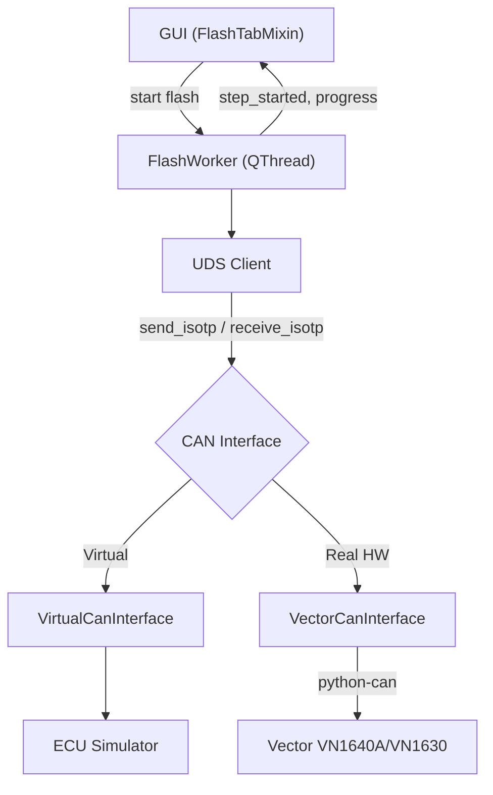

# Walkthrough — Phase 1 + 2 + 3 + 4 Complete

## Tổng Quan

Đã hoàn thành **4 Phase** cho ứng dụng ECU Flash Tool:
- **Phase 1**: Tái cấu trúc code
- **Phase 2**: File parser (HEX, S-Record, Binary)
- **Phase 3**: CAN Communication + UDS Protocol + ECU Simulator
- **Phase 4**: UDS Protocol Nâng Cao (keepalive, ReadDID, NRC retry, Security DLL loader)

---

## Cấu Trúc Project Hiện Tại

```
06_PYSIDE6/
├── main.py                          ← Entry point (gọn 17 dòng)
├── main_window.ui                   ← Qt Designer file
├── ui_main_window.py                ← Auto-generated UI
│
├── gui/                             ← GUI logic
│   ├── main_window.py               ← MainWindow (mixin pattern)
│   ├── flash_tab.py                 ← Flash tab + segment progress
│   ├── configure_tab.py             ← Configure tab + file parsing
│   └── widgets/
│
├── core/                            ← Business logic
│   ├── flash_controller.py          ← FlashWorker với UDS client thật
│   ├── flash_sequence.py            ← FlashStep + build_flash_sequence()
│   └── project_manager.py           ← Save/Load project
│
├── communication/                   ← [Phase 3+4] CAN + UDS
│   ├── can_interface.py             ← Abstract CAN interface
│   ├── virtual_can.py               ← Virtual CAN bus (no HW needed)
│   ├── vector_can.py                ← Vector VN1640A/VN1630 adapter
│   ├── ecu_simulator.py             ← Full ECU Simulator
│   ├── uds_client.py                ← UDS Protocol (ISO 14229)
│   └── tester_present.py            ← [Phase 4] TesterPresent keepalive thread
│
├── parsers/                         ← File parsers
│   ├── hex_parser.py                ← Intel HEX
│   ├── srec_parser.py               ← S-Record
│   └── binary_parser.py             ← Raw binary
│
├── config/settings.py               ← App constants
├── tests/sample.hex                 ← Test HEX file
└── main_old.py                      ← Backup file cũ
```

---

## Phase 3: Chi Tiết Implementation

### Architecture



### Các File Mới (Phase 3)

| File | Dòng | Mô tả |
|------|------|--------|
| [`can_interface.py`](file:///Users/tranminhphuc/Library/CloudStorage/OneDrive-Personal/02_WORK/01_STUDY/06_PYSIDE6/communication/can_interface.py) | ~160 | Abstract class: `connect()`, `send()`, `receive()`, `send_isotp()`, `receive_isotp()`. `CanMessage` dataclass. Error types. |
| [`ecu_simulator.py`](file:///Users/tranminhphuc/Library/CloudStorage/OneDrive-Personal/02_WORK/01_STUDY/06_PYSIDE6/communication/ecu_simulator.py) | ~680 | Full ECU simulation: session management, security access (seed & key), routine control, download/transfer, DTC, reset. Configurable delay + error injection. |
| [`virtual_can.py`](file:///Users/tranminhphuc/Library/CloudStorage/OneDrive-Personal/02_WORK/01_STUDY/06_PYSIDE6/communication/virtual_can.py) | ~340 | Virtual CAN bus: ISO-TP framing (SF + FF + CF), integrated ECU simulator, in-memory message queues. |
| [`vector_can.py`](file:///Users/tranminhphuc/Library/CloudStorage/OneDrive-Personal/02_WORK/01_STUDY/06_PYSIDE6/communication/vector_can.py) | ~336 | Vector hardware adapter: python-can with `interface='vector'`, ISO-TP framing, CAN FD support. |
| [`uds_client.py`](file:///Users/tranminhphuc/Library/CloudStorage/OneDrive-Personal/02_WORK/01_STUDY/06_PYSIDE6/communication/uds_client.py) | ~460 | UDS protocol layer: all 10 services, NRC 0x78 (ResponsePending) handling, `download_firmware()` high-level method. |

### UDS Services Implemented

| SID | Service | Mô tả |
|-----|---------|--------|
| 0x10 | DiagnosticSessionControl | Default / Extended / Programming session |
| 0x11 | ECUReset | Hard / Soft / KeyOffOn reset |
| 0x27 | SecurityAccess | Seed & Key (XOR-based algorithm, configurable) |
| 0x28 | CommunicationControl | Enable / Disable normal communication |
| 0x2E | WriteDataByIdentifier | Write Fingerprint (DID 0xF15A) |
| 0x31 | RoutineControl | Check Preconditions / Erase Memory / Verify |
| 0x34 | RequestDownload | Request ECU to accept firmware data |
| 0x36 | TransferData | Send firmware data block by block |
| 0x37 | RequestTransferExit | End data transfer |
| 0x3E | TesterPresent | Keep session alive |
| 0x85 | ControlDTCSetting | Enable / Disable DTC logging |

### ECU Simulator Features

- **Session state machine**: Default → Extended → Programming
- **Security Access**: Random seed generation, XOR-based key algorithm
- **Precondition checks**: Check Preconditions allowed without security in Extended session
- **Download flow**: RequestDownload → TransferData (with block sequence validation) → TransferExit
- **Configurable**: response delay, error injection rate, max block length
- **NRC handling**: Returns proper NRC codes for wrong sequence, invalid key, etc.

---

## Phase 4: Chi Tiết Implementation

Phase 3 đã dựng xong khung UDS + CAN cơ bản. Phase 4 hoàn thiện các phần "production-grade" cần thiết khi làm việc với ECU thật:

### 4.1 TesterPresent Keepalive Thread

- File: [`tester_present.py`](file:///Users/tranminhphuc/Library/CloudStorage/OneDrive-Personal/02_WORK/01_STUDY/06_PYSIDE6/communication/tester_present.py) — thread nền gửi `TesterPresent (0x3E)` mỗi 2s (mặc định) để tránh ECU rơi về `DefaultSession` sau P3 timeout (thường 5s).
- Hỗ trợ `pause()`/`resume()` — `UdsClient` tự động pause keepalive trong lúc có 1 request UDS khác đang chạy, tránh đụng độ trên bus.
- Được `UdsClient.start_keepalive()` / `stop_keepalive()` quản lý, và `FlashWorker.run()` tự start khi bắt đầu flash, tự stop khi kết thúc/abort/lỗi (trong `_cleanup()`).

### 4.2 ReadDataByIdentifier (0x22)

- `UdsClient.read_data_by_identifier(did)`, `read_multiple_dids(dids)`, `read_ecu_identification()` trong [`uds_client.py`](file:///Users/tranminhphuc/Library/CloudStorage/OneDrive-Personal/02_WORK/01_STUDY/06_PYSIDE6/communication/uds_client.py).
- Được ECU Simulator trả lời thật (SW/HW Version, Serial Number, Part Number...) trong [`ecu_simulator.py`](file:///Users/tranminhphuc/Library/CloudStorage/OneDrive-Personal/02_WORK/01_STUDY/06_PYSIDE6/communication/ecu_simulator.py).
- Đã có 2 bước **"Read ECU Identification"** (trước và sau flash) trong `DEFAULT_FLASH_SEQUENCE` (xem mục 4.5) → `FlashWorker._execute_read_did()` xử lý, decode ASCII/hex tự động, emit `ecu_info_message` cho GUI.

### 4.3 NRC Retry Logic

- `UdsClient._send_request()` trong `uds_client.py` tự động retry khi gặp NRC nằm trong `RETRYABLE_NRC` (0x21 Busy-RepeatRequest, 0x22 ConditionsNotCorrect), tối đa `max_retries` lần (mặc định 3), cách nhau `retry_delay` giây (mặc định 0.5s).
- NRC 0x78 (ResponsePending) được xử lý riêng bằng vòng lặp chờ với timeout P2* (mặc định 10s), không tính vào số lần retry.
- Có bảng `NRC_NAMES` để log lỗi UDS dễ đọc (vd. `0x33: Security Access Denied`).

### 4.4 Security DLL Loader (ctypes)

- `UdsClient.load_security_dll(dll_path, function_name="GenerateKeyEx")` dùng `ctypes.CDLL` để load hàm tính key từ DLL ngoài (chữ ký `UINT32 GenerateKeyEx(UINT32 seed)`), dùng khi flash ECU thật cần thuật toán bảo mật riêng của OEM.
- Thứ tự ưu tiên tính key trong `security_access()`: `key_function` param → DLL đã load → thuật toán XOR mặc định của ECU Simulator (chỉ dùng khi test ảo).
- **Mới nối vào GUI**: tab **Configure → Communication** có thêm dòng **"Security Access DLL (Optional)"** với nút **Browse...** để chọn file `.dll/.so/.dylib`. `FlashWorker` nhận `security_dll_path` và tự gọi `load_security_dll()` trước khi flash — chỉ áp dụng khi chọn hardware thật (Vector), bỏ qua khi dùng Virtual ECU Simulator.

### 4.5 ReadDID Trong Flash Sequence

- [`flash_sequence.py`](file:///Users/tranminhphuc/Library/CloudStorage/OneDrive-Personal/02_WORK/01_STUDY/06_PYSIDE6/core/flash_sequence.py) có 2 bước mới trong `DEFAULT_FLASH_SEQUENCE`:
  - **"Read ECU Identification (Before Flash)"** — đọc `SW Version, HW Version, Part Number, Serial Number` trước khi flash.
  - **"Read ECU Identification (After Flash)"** — đọc lại `SW Version` sau khi flash để xác nhận đã cập nhật.
- Sequence chuẩn hiện có **15 bước** (13 bước cũ + 2 bước ReadDID; số bước Download vẫn sinh động theo số segment thực tế).

---

## End-to-End Test Results

```
============================================================
  END-TO-END FLASH TEST WITH VIRTUAL ECU (Phase 4)
============================================================

Flash sequence: 15 steps

  [STEP] Read ECU Identification (Before Flash)        ✅
    SW Version: V1.0.0 | HW Version: HW_1.0
    Part Number: PN-12345-678 | Serial Number: SN-SIM-001-2026
  [STEP] Start Communication                → TX: [10 01] RX: [50 01 ...]  ✅
  [STEP] Start Extended Session (Network)    → TX: [10 03] RX: [50 03 ...]  ✅
  [STEP] Check Programming Preconditions     → TX: [31 01 FF 00] RX: [71 ...] ✅
  [STEP] Disable DTC Settings (Network)      → TX: [85 02] RX: [C5 02]      ✅
  [STEP] Disable Normal Communication        → TX: [28 03 03] RX: [68 03]   ✅
  [STEP] Start Programming Session           → TX: [10 02] RX: [50 02 ...]  ✅
  [STEP] Unlock ECU (Security Access)        → TX: [27 01] → [27 02 ...]    ✅
  [STEP] Write Fingerprint                   → TX: [2E F1 5A ...] RX: [6E]  ✅
  [STEP] Erase Memory                        → TX: [31 01 FF 00]            ✅
  [STEP] Download Datablock 1 Segment 1 (32B) → [34] → [36 01 ...] → [37]   ✅
  [STEP] Download Datablock 1 Segment 2 (32B) → [34] → [36 01 ...] → [37]   ✅
  [STEP] Verify Memory                       → TX: [31 01 FF 01]            ✅
  [STEP] Read ECU Identification (After Flash)          ✅
    SW Version: V1.0.0
  [STEP] Reset ECU                           → TX: [11 01] RX: [51 01]     ✅

  FLASH COMPLETED SUCCESSFULLY
```

Đã kiểm tra thêm: `UdsClient.load_security_dll()` với đường dẫn DLL không tồn tại raise `UdsError` gọn gàng, được `FlashWorker` bắt và abort an toàn (không crash app).

---

## Cách Test Thủ Công

1. Chạy app: `conda activate pyside6 && python main.py`
2. Vào **Configure → Communication** → chọn **"Virtual ECU Simulator (No Hardware)"**
   - (Tùy chọn — chỉ dùng khi có hardware thật) Chọn **"Browse..."** ở dòng **Security Access DLL** để trỏ tới DLL tính key bảo mật của OEM.
3. Vào **Configure → Data** → click **"Please click here to add a Datablock"** → chọn file `tests/sample.hex`
4. Quay lại **Flash tab** → nhấn **Flash**
5. Quan sát:
   - **Steps table**: Từng UDS step hiện lên với timestamp, bao gồm 2 bước Read ECU Identification trước/sau
   - **Information tab**: SW/HW Version, Serial Number, Part Number đọc được từ ECU
   - **Segments table**: "Flashing... XX%" → "Flashed"
   - **Progress bar**: Chạy từ 0% → 100%
   - **Trace tab**: Hiển thị CAN frame hex data (TX/RX), có thể thấy `TesterPresent (3E 80)` gửi định kỳ xen giữa các bước dài

---

## Bước Tiếp Theo → Phase 5 (Đề Xuất)

Khi có Vector hardware:
1. Cài `pip install python-can`
2. Chọn **VN1640A - Channel 1** trong Configure → Communication
3. Nếu ECU yêu cầu thuật toán bảo mật riêng, chọn DLL tương ứng ở **Security Access DLL**
4. Flash với ECU thật!

Các hướng mở rộng tiếp theo có thể cân nhắc:
- Nối `ProjectManager` (save/load `.vfp`) vào GUI — hiện class đã có sẵn nhưng chưa được gọi ở đâu.
- Lưu `security_dll_path` và cấu hình Communication vào project file để không phải chọn lại mỗi lần mở app.
- Đọc DTC (`ReadDTCInformation - 0x19`) sau khi flash để xác nhận ECU không báo lỗi.

---

## Phase 4.6: Suzuki SLP1 — Flash Sequence Từ Log Thật

Từ file `20260816_102921_Report_Trace.csv` (log CAN trace thật, flash một ECU "Suzuki SLP1"), đã phân tích và dựng lại chính xác flash sequence thực tế, thay vì dựa trên giả định.

### Số liệu phân tích được từ log

- **1632 dòng** request/response, **1544 TransferData (0x36)** block.
- **Địa chỉ flash**: `0x001AA000`, **tổng dung lượng**: `6,315,904 bytes` (~6.0 MB) — khớp chính xác giữa field `memorySize` của `RequestDownload` và tổng số byte thực nhận qua các block `TransferData`.
- **Block size**: `maxNumberOfBlockLength = 4095` → 4093 byte data/block, block cuối `407 bytes` (405 byte data). Block Sequence Counter wrap `0x01..0xFF..0x00` đúng chuẩn 1 byte.
- **Erase Memory (routine 0xFF00)** mất **~41.8 giây** để phản hồi — trong lúc đó công cụ gửi `TesterPresent (3E 80)` mỗi ~4s để giữ session.
- **Tổng thời gian flash**: ~302 giây (~5 phút).

### Khác biệt so với `DEFAULT_FLASH_SEQUENCE` (giả lập) — xác nhận từ log

| Điểm khác | Log thật | Sequence cũ (giả định) |
|---|---|---|
| Precondition check | Không có bước riêng — chỉ gọi routine `0xFF00` **một lần** trong Programming session (= Erase) | Gọi `0xFF00` hai lần: 1 lần "check precondition" ở Extended session, 1 lần "erase" ở Programming session |
| ReadDataByIdentifier | **Không dùng** — công cụ OEM không đọc ECU ID trước/sau flash | Có 2 bước đọc DID trước/sau flash |
| Địa chỉ gửi lệnh | `Session Extended`, `DTC off`, `CommControl off` gửi **functional** (broadcast `0x700`) trước khi vào Programming session; từ đó trở đi gửi **physical** tới ECU | Luôn gửi physical |
| `ControlDTCSetting (0x85)` | Có thêm 1 byte option `00`: `85 02 00` | Chỉ `85 02` |
| `CommunicationControl (0x28)` | `communication_type = 0x01` (chỉ Normal) | `0x03` (Normal + NM) |
| `WriteDataByIdentifier (0x2E)` | DID `0xF198` (10 byte tester info) + DID `0xF199` (4 byte ngày lập trình, packed-BCD — vd. `20 26 08 16` = 2026-08-16) | DID `0xF15A` (Fingerprint) |
| `RoutineControl (0x31)` | Có thêm 1 byte `optionRecord = 00` sau routine ID (cả Erase lẫn Verify) | Không có optionRecord |
| `RequestDownload (0x34)` | `addressAndLengthFormatIdentifier = 0x45` → **địa chỉ 5 byte**, size 4 byte | Mặc định 4 byte / 4 byte |
| Sau `ECUReset` | Gửi thêm `10 01` (Default Session) functional để xác nhận ECU đã reset xong | Không có |

### Bug tìm thấy khi đối chiếu log: byte order của `RequestDownload (0x34)` bị đảo

So khớp từng byte với log thật phát hiện **code cũ gửi sai thứ tự tham số** của `RequestDownload`: ISO 14229-1 quy định thứ tự `SID, dataFormatIdentifier, addressAndLengthFormatIdentifier, address, size`, nhưng [`uds_client.py`](file:///Users/tranminhphuc/Library/CloudStorage/OneDrive-Personal/02_WORK/01_STUDY/06_PYSIDE6/communication/uds_client.py) lại gửi `SID, addressAndLengthFormatIdentifier, dataFormatIdentifier, ...` (2 byte bị hoán đổi). Vì [`ecu_simulator.py`](file:///Users/tranminhphuc/Library/CloudStorage/OneDrive-Personal/02_WORK/01_STUDY/06_PYSIDE6/communication/ecu_simulator.py) cũng decode theo đúng thứ tự sai đó nên bug này **không lộ ra khi test với Virtual ECU** — chỉ phát hiện được nhờ so với log ECU thật. Nếu không sửa, flash lên ECU thật rất có thể sẽ bị NRC hoặc hiểu sai định dạng. **Đã sửa cả 2 phía** (encode trong `uds_client.py`, decode trong `ecu_simulator.py`) để khớp chuẩn ISO 14229 và log thật.

### Những gì đã implement

- **Functional (broadcast) addressing**: `communication/virtual_can.py`, `communication/vector_can.py` — `send_isotp(data, target_id=None)` cho phép gửi tới một arbitration ID khác (vd. `0x700`) thay vì ID vật lý mặc định. `UdsClient` nhận `functional_id=0x700`, thêm tham số `functional=True/False` cho `diagnostic_session_control()`, `control_dtc_setting()`, `communication_control()`, `tester_present()`. `TesterPresentThread` cũng hỗ trợ gửi keepalive functional.
- **`option_record`** cho `control_dtc_setting()` (đã có sẵn ở `routine_control()`).
- **`addr_length`/`size_length`** cho `download_firmware()` → `request_download()`, cho phép ECU dùng địa chỉ 5 byte như Suzuki SLP1.
- **`FlashStep.TYPE_WRITE_DID`** — step type tổng quát để ghi bất kỳ DID/data nào (thay vì hardcode Fingerprint `0xF15A`).
- **[`core/flash_sequence.py`](file:///Users/tranminhphuc/Library/CloudStorage/OneDrive-Personal/02_WORK/01_STUDY/06_PYSIDE6/core/flash_sequence.py)**: `build_flash_sequence()` tổng quát hóa để nhận `sequence`/`addr_length`/`size_length` tùy chỉnh. Thêm `SUZUKI_SLP1_FLASH_SEQUENCE` (11 bước cố định + Download steps sinh động) và `build_suzuki_slp1_flash_sequence(datablocks)`.
- **GUI**: tab **Configure → Communication** có thêm combo **"Flash Sequence"** (`Generic (Default)` / `Suzuki SLP1 (Real Trace)`) — chọn Suzuki sẽ tự động dùng sequence thật, địa chỉ 5-byte, và keepalive functional.

### Đã kiểm tra

- Chạy `SUZUKI_SLP1_FLASH_SEQUENCE` end-to-end qua Virtual ECU Simulator: đúng thứ tự 12 bước, `TX(FUNC)` xuất hiện đúng ở 4 bước (Extended Session, DTC off, CommControl off, Default Session cuối), `RequestDownload` gửi đúng `34 00 45 ...` khớp byte-for-byte với log thật (cùng địa chỉ `0x1AA000`, cùng cấu trúc 5-byte address).
- Chạy lại `DEFAULT_FLASH_SEQUENCE` (generic) sau khi sửa bug byte-order — không regression, vẫn hoàn thành 15 bước như trước.

### Cách dùng

1. Tab **Configure → Communication** → chọn **"Suzuki SLP1 (Real Trace)"** ở combo **Flash Sequence**.
2. Nạp file firmware như bình thường ở **Configure → Data**.
3. Sang tab **Flash** → nhấn **Flash**. Sequence sẽ chạy đúng theo thứ tự đã xác nhận từ log thật (không có bước đọc ECU ID, gọi Erase một lần duy nhất, WriteDID đúng 2 DID quan sát được, RequestDownload địa chỉ 5-byte).

**Lưu ý**: dữ liệu 2 DID (`0xF198` tester info, `0xF199` ngày lập trình) đang lấy đúng giá trị quan sát được trong log — riêng DID `0xF199` được tính **động theo ngày hệ thống hiện tại** (packed-BCD) thay vì hardcode `20 26 08 16`. Nếu ECU thật yêu cầu nội dung DID `0xF198` khác (vd. serial number tester thật), cần chỉnh `SUZUKI_SLP1_FLASH_SEQUENCE` trong `flash_sequence.py`.

---

## Phase 4.7: Thông Tin Thực Tế ECU (Suzuki Radar) + Cấu Hình CAN Cho Hardware Thật

Đã nhận thông tin xác nhận cho ECU thật (**Suzuki Radar**, không phải hộp số/ECU tổng — có 2 module Left/Right trên xe):

| Thông tin | Giá trị |
|---|---|
| CAN ID — Left (mặc định) | Tx `0x77B`, Rx `0x78B` |
| CAN ID — Right | Tx `0x77A`, Rx `0x78A` |
| Security Access | ECU đang dùng **seed/key dummy** — gửi key dummy, **chưa cần** cấu hình Security DLL |
| DID `0xF198` | Giữ nguyên giá trị như log (không ảnh hưởng flashing) |
| Bitrate CAN/CAN FD | Người dùng tự cấu hình qua GUI |

### Gap phát hiện khi rà lại code cho hardware thật (đã sửa)

`_setup_uds_client()` trong `flash_controller.py` trước đó **bỏ qua hoàn toàn** cấu hình GUI khi kết nối Vector thật: `channel` luôn hardcode `0`, `tx_id`/`rx_id` không được truyền (luôn dùng mặc định `0x778`/`0x788`), dù bảng **Communication Details** đã hiển thị và cho phép sửa các giá trị này.

**Đã sửa:**
- `FlashWorker` nhận thêm `can_channel`, `can_tx_id`, `can_rx_id`, `can_bitrate`, `can_fd`, `can_data_bitrate` và dùng thật khi gọi `VectorCanInterface.connect()` (áp dụng cho cả Virtual lẫn Vector).
- `ConfigureTabMixin.get_can_config()` ([gui/configure_tab.py](file:///Users/tranminhphuc/Library/CloudStorage/OneDrive-Personal/02_WORK/01_STUDY/06_PYSIDE6/gui/configure_tab.py)) — đọc channel từ combo Hardware (`"Channel 2"` → index 1), đọc `tx_id`/`rx_id`/Baudrate/Data Baudrate từ bảng Communication Details (editable), đọc CAN FD từ combo Logical Link.
- [gui/flash_tab.py](file:///Users/tranminhphuc/Library/CloudStorage/OneDrive-Personal/02_WORK/01_STUDY/06_PYSIDE6/gui/flash_tab.py) nối `get_can_config()` vào `FlashWorker` khi bấm Flash.

### Radar Side selector (Left/Right)

Thêm combo **"Radar Side"** ở Configure → Communication (`SUZUKI_RADAR_CAN_IDS` trong [config/settings.py](file:///Users/tranminhphuc/Library/CloudStorage/OneDrive-Personal/02_WORK/01_STUDY/06_PYSIDE6/config/settings.py)):
- Mặc định **Left** (`Tx 0x77B / Rx 0x78B`) — tự động ghi vào bảng Communication Details.
- Chọn **Right** (`Tx 0x77A / Rx 0x78A`) để ghi đè — giá trị này giữ nguyên kể cả khi đổi qua lại CAN ⇄ CAN FD (đã test).
- Bảng Communication Details vẫn có thể sửa tay thêm nếu cần một ID khác ngoài 2 lựa chọn trên.
- `CAN_CONFIGS["CAN"]` mặc định cũng đổi từ `0x778/0x788` (placeholder chung) sang `0x77B/0x78B` (Left, đúng ECU thật).

### Security Access dummy

Xác nhận: khi flash hardware thật (`use_virtual=False`) mà **không** load Security DLL, `UdsClient.security_access()` đã tự fallback sang thuật toán XOR dummy của `EcuSimulator.compute_key()` — đúng theo yêu cầu "gửi seed/key dummy, bỏ qua DLL". Không cần sửa logic, chỉ thêm 1 dòng trace rõ ràng trong `_execute_security()`: `"Security Access: no DLL loaded — using dummy seed/key algorithm"` để log không gây hiểu lầm khi review sau này.

### Đã kiểm tra

- `get_can_config()`: chọn Channel 2 → `channel=1`; sửa CAN ID trong bảng → đọc đúng; chọn Radar Side Right → `tx_id=0x77A, rx_id=0x78A`; đổi CAN ⇄ CAN FD → Radar Side vẫn giữ nguyên.
- Chạy lại cả `DEFAULT_FLASH_SEQUENCE` và `SUZUKI_SLP1_FLASH_SEQUENCE` qua Virtual ECU Simulator với CAN ID mới (`0x77B/0x78B`) — cả 2 hoàn thành, không regression.

---

## Phase 4.8: Đưa Radar Side / Security DLL / Flash Sequence Vào Qt Designer

Ban đầu 3 control này (Radar Side, Security Access DLL, Flash Sequence) được tạo **bằng code Python lúc runtime** (trong `configure_tab.py`), nên **không hiện trong Qt Designer** — chỉ thấy khi chạy app. Sau khi xác nhận không còn thay đổi chưa lưu trong Designer, đã chuyển 3 control này thành widget thật trong [`main_window.ui`](file:///Users/tranminhphuc/Library/CloudStorage/OneDrive-Personal/02_WORK/01_STUDY/06_PYSIDE6/main_window.ui) (đặt trong `pageComm` → `verticalLayout_comm`, ngay trước `verticalSpacer_comm` để nhóm gọn phía trên thay vì bị đẩy xuống dưới spacer như trước):

- `labelRadarSide` + `comboBoxRadarSide` (2 item: Left/Right).
- `labelSecurityDll` + `horizontalLayout_securityDll` chứa `lineEditSecurityDll` (read-only) + `buttonBrowseSecurityDll`.
- `labelFlashSequence` + `comboBoxFlashSequence` (2 item: Generic/Suzuki SLP1).

Regenerate `ui_main_window.py` bằng `pyside6-uic main_window.ui -o ui_main_window.py` (chỉ thêm đúng 3 khối widget mới, không đổi gì khác).

**`configure_tab.py`** được đơn giản hóa tương ứng — bỏ hết code tạo `QLabel`/`QComboBox`/`QLineEdit`/`QPushButton` bằng tay, chỉ còn nối signal vào widget tĩnh:
- `setup_radar_side_widget()` → đổi tên `setup_radar_side_selector()`, chỉ còn `connect()`.
- `setup_security_dll_widget()` → đổi tên `setup_security_dll_selector()`, chỉ còn `connect()`.
- `setup_flash_sequence_widget()` → **bỏ hẳn** (không cần wiring, `flash_tab.py` đọc `.currentText()` trực tiếp).
- `apply_radar_side_to_table()` đổi từ đọc `comboBoxRadarSide.currentData()` (chỉ có khi tạo item bằng code) sang đọc theo `currentIndex()` + tra cứu `list(SUZUKI_RADAR_CAN_IDS.keys())` (vì item định nghĩa tĩnh trong `.ui` không mang được `userData`).

Giờ mở `main_window.ui` bằng Qt Designer sẽ thấy đầy đủ 3 control này, sửa được trực quan như các control khác.

### Đã kiểm tra

- `MainWindow` khởi tạo thành công, cả 3 widget tồn tại đúng tên (`comboBoxRadarSide`, `lineEditSecurityDll`, `buttonBrowseSecurityDll`, `comboBoxFlashSequence`).
- `get_can_config()` vẫn hoạt động đúng: mặc định Left → `tx_id=0x77B, rx_id=0x78B`; chọn Right → `tx_id=0x77A, rx_id=0x78A`.
- Chạy lại `DEFAULT_FLASH_SEQUENCE` qua Virtual ECU Simulator — hoàn thành, không regression.

---

## Phase 4.9: Sắp Xếp Lại Layout Communication / Miscellaneous

Theo yêu cầu bố cục lại:

1. **Radar Side** (`labelRadarSide` + `comboBoxRadarSide`) chuyển lên ngay sau `comboBoxHardware`, trước `labelLogicalLink` — nằm cùng nhóm "Hardware configure" thay vì cuối trang.
2. **Tab Miscellaneous** (`pageMisc`, trước đây trống hoàn toàn) giờ chứa **Flash Sequence** và **Security Access DLL** — mỗi trang giờ có tiêu đề riêng theo đúng style các trang khác (`labelMiscTitle`, style `color: #2b579a; font-size: 20px;`, giống `labelCommTitle`/`labelDataTitle`), và một `verticalSpacer_misc` ở cuối để đẩy nội dung lên trên.
3. **`tableWidgetCustomConfig`** (4 hàng: Erase Timeout, Programming delay, Post reset delay, STmin override) được đo thực tế (`rowHeight=30px × 4 hàng + 2px viền = 122px`), đặt `sizePolicy` dọc = `Fixed`, `minimumSize`/`maximumSize` height = `122` trong `.ui` — không còn khoảng trắng thừa phía dưới 4 hàng. Xóa dòng `setMinimumHeight(150)` cũ trong `configure_tab.py` (giờ dư thừa, xung đột với size cố định mới).

Toàn bộ thay đổi thực hiện trực tiếp trên `main_window.ui` (di chuyển khối XML, không tạo lại từ đầu) rồi regenerate `ui_main_window.py` bằng `pyside6-uic`. `configure_tab.py`/`flash_tab.py` không cần đổi logic gì thêm — vẫn truy cập đúng qua `self.ui.<tên widget>` như cũ, vì tên các widget không đổi, chỉ đổi vị trí trong cây layout.

### Đã kiểm tra

- Thứ tự `verticalLayout_comm`: `labelCommTitle → labelHardware → comboBoxHardware → labelRadarSide → comboBoxRadarSide → labelLogicalLink → comboBoxLogicalLink → tableWidgetCommDetails → labelCustomConfig → tableWidgetCustomConfig → spacer`.
- Thứ tự `verticalLayout_misc`: `labelMiscTitle → labelFlashSequence → comboBoxFlashSequence → labelSecurityDll → horizontalLayout_securityDll → spacer`.
- Điều hướng `navListWidget` → `stackedWidget` vẫn đúng: chọn "Miscellaneous" (row 2) → hiển thị đúng `pageMisc`.
- `tableWidgetCustomConfig.minimumHeight() == maximumHeight() == 122`.
- Chạy lại cả `DEFAULT_FLASH_SEQUENCE` và `SUZUKI_SLP1_FLASH_SEQUENCE` qua Virtual ECU Simulator — cả 2 hoàn thành, không regression.

---

## Phase 4.10: Splitter Kéo-Giãn Giữa Vùng Tab Trên Và `outputTabWidget`

### Vấn đề

Trước đây `tabWidget` (Flash/Configure) và `outputTabWidget` (Information/Trace) chỉ xếp chồng trong một `QVBoxLayout` thường (`verticalLayout_2`) — không có cách nào kéo để đổi tỷ lệ chiều cao giữa 2 vùng.

Khi rà để implement, phát hiện thêm 2 vấn đề gốc khiến dù có splitter cũng **không thực sự resize được**:
- `informationTab`/`traceTab` **không có layout** — `informationText`/`traceText` định vị bằng `geometry` cố định (`height=481`), nên dù panel cha lớn/nhỏ, 2 ô text này không giãn theo.
- `flashTab` cũng vậy — nội dung (bao gồm `stepsTable`/`segmentsTable`) nằm trong `layoutWidget_flashTab`, một widget con định vị bằng `geometry` cố định (`10,10,1621,491`) thay vì layout quản lý trực tiếp bởi `flashTab`.

Đây là artifact thường gặp của Qt Designer khi chọn nhóm widget rồi bấm "Lay Out Vertically" mà không áp layout cho chính widget cha (tab page).

### Đã sửa (toàn bộ trong `main_window.ui`, regenerate bằng `pyside6-uic`)

1. ~~Bọc `tabWidget` và `outputTabWidget` trong một `QSplitter` (orientation Vertical, tên `splitterMain`) để kéo tay thanh chia~~ — **đã bỏ theo yêu cầu sau đó** (xem Phase 4.11), quay lại `QVBoxLayout` thường, không kéo tay được nữa.
2. Thêm layout (`QVBoxLayout`) trực tiếp cho `informationTab` chứa `informationText`, và cho `traceTab` chứa `traceText` — bỏ hẳn `geometry` cố định. **Giữ nguyên** — đây là phần khiến 2 ô text tự co giãn theo cửa sổ.
3. Bỏ `layoutWidget_flashTab` (widget trung gian dùng `geometry` cố định) — đưa `verticalLayout` (chứa hàng nút Flash/progress bar và `horizontalLayout_2` chứa `stepsTable`/`segmentsTable`) làm layout **trực tiếp** của `flashTab`. **Giữ nguyên**.

Không cần sửa gì ở `gui/*.py` — tên object (`stepsTable`, `segmentsTable`, `informationText`, `traceText`, ...) không đổi, chỉ đổi cấu trúc cha trong cây widget.

### Đã kiểm tra

- Kéo `splitterMain` (test qua `setSizes()`) — cả 2 hướng đều phản ánh đúng: cho vùng trên (Flash/Configure) nhiều không gian hơn → `stepsTable`/`segmentsTable` cao lên tương ứng; cho vùng dưới nhiều hơn → `informationText`/`traceText` cao lên tương ứng.
- Chạy lại flash E2E qua Virtual ECU Simulator — `log_information()`/`log_trace()`/`add_step()` vẫn hoạt động đúng, `stepsTable` có đủ 15 dòng sau khi flash xong — không regression.

---

## Phase 4.11: Bỏ Splitter, Chuyển Về Fixed Size (Vẫn Tự Co Giãn Theo Cửa Sổ)

Sau khi cân nhắc lại, quyết định **bỏ thanh kéo-giãn tay (`QSplitter`)** — không cần người dùng tự kéo chỉnh tỷ lệ. `tabWidget`/`outputTabWidget` quay lại `verticalLayout_2` (QVBoxLayout) bình thường như ban đầu.

### Phát hiện thêm khi kiểm tra lại

Test resize cửa sổ (900px → 1300px chiều cao) cho thấy **các widget bên trong hoàn toàn không đổi kích thước** — dù đã sửa `flashTab`/`informationTab`/`traceTab` ở Phase 4.10. Nguyên nhân: `centralwidget` của `MainWindow` cũng dùng chung kiểu artifact — có một `layoutWidget` trung gian định vị bằng `geometry` cố định (`10,10,1651,1081`) thay vì `centralwidget` tự quản lý layout con. Vì vậy toàn bộ nội dung app **chưa bao giờ** tự co giãn theo cửa sổ, kể cả trước khi có splitter.

**Đã sửa**: bỏ `layoutWidget`, đưa `verticalLayout_2` làm layout **trực tiếp** của `centralwidget` — cùng pattern đã áp dụng cho `flashTab` ở Phase 4.10.

### Đã kiểm tra

- `splitterMain` không còn tồn tại trong `ui_main_window.py`.
- Resize cửa sổ 900 → 1300 → 700px chiều cao: `stepsTable` 546 → 644 → 486px, `informationText` 97 → 399 → 76px — tự co giãn đúng tỷ lệ theo cửa sổ, không cần kéo tay.
- Chạy lại flash E2E qua Virtual ECU Simulator — `log_information()`/`log_trace()` và toàn bộ flow vẫn đúng, không regression.
