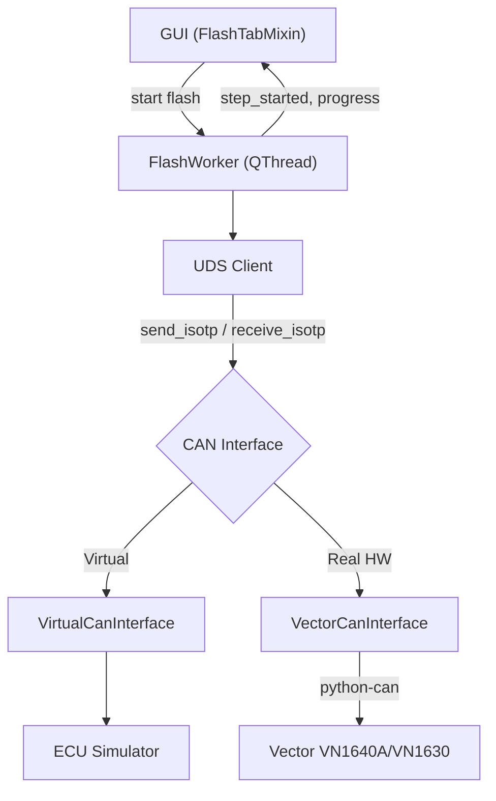

# Walkthrough — Phase 1 + 2 + 3 + 4 Complete

## Tổng Quan

Đã hoàn thành **4 Phase** cho ứng dụng ECU Flash Tool:
- **Phase 1**: Tái cấu trúc code
- **Phase 2**: File parser (HEX, S-Record, Binary)
- **Phase 3**: CAN Communication + UDS Protocol + ECU Simulator
- **Phase 4**: UDS Protocol Nâng Cao (keepalive, ReadDID, NRC retry, Security DLL loader)

---

## Cấu Trúc Project Hiện Tại

```
06_PYSIDE6/
├── main.py                          ← Entry point (gọn 17 dòng)
├── main_window.ui                   ← Qt Designer file
├── ui_main_window.py                ← Auto-generated UI
│
├── gui/                             ← GUI logic
│   ├── main_window.py               ← MainWindow (mixin pattern)
│   ├── flash_tab.py                 ← Flash tab + segment progress
│   ├── configure_tab.py             ← Configure tab + file parsing
│   └── widgets/
│
├── core/                            ← Business logic
│   ├── flash_controller.py          ← FlashWorker với UDS client thật
│   ├── flash_sequence.py            ← FlashStep + build_flash_sequence()
│   └── project_manager.py           ← Save/Load project
│
├── communication/                   ← [Phase 3+4] CAN + UDS
│   ├── can_interface.py             ← Abstract CAN interface
│   ├── virtual_can.py               ← Virtual CAN bus (no HW needed)
│   ├── vector_can.py                ← Vector VN1640A/VN1630 adapter
│   ├── ecu_simulator.py             ← Full ECU Simulator
│   ├── uds_client.py                ← UDS Protocol (ISO 14229)
│   └── tester_present.py            ← [Phase 4] TesterPresent keepalive thread
│
├── parsers/                         ← File parsers
│   ├── hex_parser.py                ← Intel HEX
│   ├── srec_parser.py               ← S-Record
│   └── binary_parser.py             ← Raw binary
│
├── config/settings.py               ← App constants
├── tests/sample.hex                 ← Test HEX file
└── main_old.py                      ← Backup file cũ
```

---

## Phase 3: Chi Tiết Implementation

### Architecture



### Các File Mới (Phase 3)

| File | Dòng | Mô tả |
|------|------|--------|
| [`can_interface.py`](file:///Users/tranminhphuc/Library/CloudStorage/OneDrive-Personal/02_WORK/01_STUDY/06_PYSIDE6/communication/can_interface.py) | ~160 | Abstract class: `connect()`, `send()`, `receive()`, `send_isotp()`, `receive_isotp()`. `CanMessage` dataclass. Error types. |
| [`ecu_simulator.py`](file:///Users/tranminhphuc/Library/CloudStorage/OneDrive-Personal/02_WORK/01_STUDY/06_PYSIDE6/communication/ecu_simulator.py) | ~680 | Full ECU simulation: session management, security access (seed & key), routine control, download/transfer, DTC, reset. Configurable delay + error injection. |
| [`virtual_can.py`](file:///Users/tranminhphuc/Library/CloudStorage/OneDrive-Personal/02_WORK/01_STUDY/06_PYSIDE6/communication/virtual_can.py) | ~340 | Virtual CAN bus: ISO-TP framing (SF + FF + CF), integrated ECU simulator, in-memory message queues. |
| [`vector_can.py`](file:///Users/tranminhphuc/Library/CloudStorage/OneDrive-Personal/02_WORK/01_STUDY/06_PYSIDE6/communication/vector_can.py) | ~336 | Vector hardware adapter: python-can with `interface='vector'`, ISO-TP framing, CAN FD support. |
| [`uds_client.py`](file:///Users/tranminhphuc/Library/CloudStorage/OneDrive-Personal/02_WORK/01_STUDY/06_PYSIDE6/communication/uds_client.py) | ~460 | UDS protocol layer: all 10 services, NRC 0x78 (ResponsePending) handling, `download_firmware()` high-level method. |

### UDS Services Implemented

| SID | Service | Mô tả |
|-----|---------|--------|
| 0x10 | DiagnosticSessionControl | Default / Extended / Programming session |
| 0x11 | ECUReset | Hard / Soft / KeyOffOn reset |
| 0x27 | SecurityAccess | Seed & Key (XOR-based algorithm, configurable) |
| 0x28 | CommunicationControl | Enable / Disable normal communication |
| 0x2E | WriteDataByIdentifier | Write Fingerprint (DID 0xF15A) |
| 0x31 | RoutineControl | Check Preconditions / Erase Memory / Verify |
| 0x34 | RequestDownload | Request ECU to accept firmware data |
| 0x36 | TransferData | Send firmware data block by block |
| 0x37 | RequestTransferExit | End data transfer |
| 0x3E | TesterPresent | Keep session alive |
| 0x85 | ControlDTCSetting | Enable / Disable DTC logging |

### ECU Simulator Features

- **Session state machine**: Default → Extended → Programming
- **Security Access**: Random seed generation, XOR-based key algorithm
- **Precondition checks**: Check Preconditions allowed without security in Extended session
- **Download flow**: RequestDownload → TransferData (with block sequence validation) → TransferExit
- **Configurable**: response delay, error injection rate, max block length
- **NRC handling**: Returns proper NRC codes for wrong sequence, invalid key, etc.

---

## Phase 4: Chi Tiết Implementation

Phase 3 đã dựng xong khung UDS + CAN cơ bản. Phase 4 hoàn thiện các phần "production-grade" cần thiết khi làm việc với ECU thật:

### 4.1 TesterPresent Keepalive Thread

- File: [`tester_present.py`](file:///Users/tranminhphuc/Library/CloudStorage/OneDrive-Personal/02_WORK/01_STUDY/06_PYSIDE6/communication/tester_present.py) — thread nền gửi `TesterPresent (0x3E)` mỗi 2s (mặc định) để tránh ECU rơi về `DefaultSession` sau P3 timeout (thường 5s).
- Hỗ trợ `pause()`/`resume()` — `UdsClient` tự động pause keepalive trong lúc có 1 request UDS khác đang chạy, tránh đụng độ trên bus.
- Được `UdsClient.start_keepalive()` / `stop_keepalive()` quản lý, và `FlashWorker.run()` tự start khi bắt đầu flash, tự stop khi kết thúc/abort/lỗi (trong `_cleanup()`).

### 4.2 ReadDataByIdentifier (0x22)

- `UdsClient.read_data_by_identifier(did)`, `read_multiple_dids(dids)`, `read_ecu_identification()` trong [`uds_client.py`](file:///Users/tranminhphuc/Library/CloudStorage/OneDrive-Personal/02_WORK/01_STUDY/06_PYSIDE6/communication/uds_client.py).
- Được ECU Simulator trả lời thật (SW/HW Version, Serial Number, Part Number...) trong [`ecu_simulator.py`](file:///Users/tranminhphuc/Library/CloudStorage/OneDrive-Personal/02_WORK/01_STUDY/06_PYSIDE6/communication/ecu_simulator.py).
- Đã có 2 bước **"Read ECU Identification"** (trước và sau flash) trong `DEFAULT_FLASH_SEQUENCE` (xem mục 4.5) → `FlashWorker._execute_read_did()` xử lý, decode ASCII/hex tự động, emit `ecu_info_message` cho GUI.

### 4.3 NRC Retry Logic

- `UdsClient._send_request()` trong `uds_client.py` tự động retry khi gặp NRC nằm trong `RETRYABLE_NRC` (0x21 Busy-RepeatRequest, 0x22 ConditionsNotCorrect), tối đa `max_retries` lần (mặc định 3), cách nhau `retry_delay` giây (mặc định 0.5s).
- NRC 0x78 (ResponsePending) được xử lý riêng bằng vòng lặp chờ với timeout P2* (mặc định 10s), không tính vào số lần retry.
- Có bảng `NRC_NAMES` để log lỗi UDS dễ đọc (vd. `0x33: Security Access Denied`).

### 4.4 Security DLL Loader (ctypes)

- `UdsClient.load_security_dll(dll_path, function_name="GenerateKeyEx")` dùng `ctypes.CDLL` để load hàm tính key từ DLL ngoài (chữ ký `UINT32 GenerateKeyEx(UINT32 seed)`), dùng khi flash ECU thật cần thuật toán bảo mật riêng của OEM.
- Thứ tự ưu tiên tính key trong `security_access()`: `key_function` param → DLL đã load → thuật toán XOR mặc định của ECU Simulator (chỉ dùng khi test ảo).
- **Mới nối vào GUI**: tab **Configure → Communication** có thêm dòng **"Security Access DLL (Optional)"** với nút **Browse...** để chọn file `.dll/.so/.dylib`. `FlashWorker` nhận `security_dll_path` và tự gọi `load_security_dll()` trước khi flash — chỉ áp dụng khi chọn hardware thật (Vector), bỏ qua khi dùng Virtual ECU Simulator.

### 4.5 ReadDID Trong Flash Sequence

- [`flash_sequence.py`](file:///Users/tranminhphuc/Library/CloudStorage/OneDrive-Personal/02_WORK/01_STUDY/06_PYSIDE6/core/flash_sequence.py) có 2 bước mới trong `DEFAULT_FLASH_SEQUENCE`:
  - **"Read ECU Identification (Before Flash)"** — đọc `SW Version, HW Version, Part Number, Serial Number` trước khi flash.
  - **"Read ECU Identification (After Flash)"** — đọc lại `SW Version` sau khi flash để xác nhận đã cập nhật.
- Sequence chuẩn hiện có **15 bước** (13 bước cũ + 2 bước ReadDID; số bước Download vẫn sinh động theo số segment thực tế).

---

## End-to-End Test Results

```
============================================================
  END-TO-END FLASH TEST WITH VIRTUAL ECU (Phase 4)
============================================================

Flash sequence: 15 steps

  [STEP] Read ECU Identification (Before Flash)        ✅
    SW Version: V1.0.0 | HW Version: HW_1.0
    Part Number: PN-12345-678 | Serial Number: SN-SIM-001-2026
  [STEP] Start Communication                → TX: [10 01] RX: [50 01 ...]  ✅
  [STEP] Start Extended Session (Network)    → TX: [10 03] RX: [50 03 ...]  ✅
  [STEP] Check Programming Preconditions     → TX: [31 01 FF 00] RX: [71 ...] ✅
  [STEP] Disable DTC Settings (Network)      → TX: [85 02] RX: [C5 02]      ✅
  [STEP] Disable Normal Communication        → TX: [28 03 03] RX: [68 03]   ✅
  [STEP] Start Programming Session           → TX: [10 02] RX: [50 02 ...]  ✅
  [STEP] Unlock ECU (Security Access)        → TX: [27 01] → [27 02 ...]    ✅
  [STEP] Write Fingerprint                   → TX: [2E F1 5A ...] RX: [6E]  ✅
  [STEP] Erase Memory                        → TX: [31 01 FF 00]            ✅
  [STEP] Download Datablock 1 Segment 1 (32B) → [34] → [36 01 ...] → [37]   ✅
  [STEP] Download Datablock 1 Segment 2 (32B) → [34] → [36 01 ...] → [37]   ✅
  [STEP] Verify Memory                       → TX: [31 01 FF 01]            ✅
  [STEP] Read ECU Identification (After Flash)          ✅
    SW Version: V1.0.0
  [STEP] Reset ECU                           → TX: [11 01] RX: [51 01]     ✅

  FLASH COMPLETED SUCCESSFULLY
```

Đã kiểm tra thêm: `UdsClient.load_security_dll()` với đường dẫn DLL không tồn tại raise `UdsError` gọn gàng, được `FlashWorker` bắt và abort an toàn (không crash app).

---

## Cách Test Thủ Công

1. Chạy app: `conda activate pyside6 && python main.py`
2. Vào **Configure → Communication** → chọn **"Virtual ECU Simulator (No Hardware)"**
   - (Tùy chọn — chỉ dùng khi có hardware thật) Chọn **"Browse..."** ở dòng **Security Access DLL** để trỏ tới DLL tính key bảo mật của OEM.
3. Vào **Configure → Data** → click **"Please click here to add a Datablock"** → chọn file `tests/sample.hex`
4. Quay lại **Flash tab** → nhấn **Flash**
5. Quan sát:
   - **Steps table**: Từng UDS step hiện lên với timestamp, bao gồm 2 bước Read ECU Identification trước/sau
   - **Information tab**: SW/HW Version, Serial Number, Part Number đọc được từ ECU
   - **Segments table**: "Flashing... XX%" → "Flashed"
   - **Progress bar**: Chạy từ 0% → 100%
   - **Trace tab**: Hiển thị CAN frame hex data (TX/RX), có thể thấy `TesterPresent (3E 80)` gửi định kỳ xen giữa các bước dài

---

## Bước Tiếp Theo → Phase 5 (Đề Xuất)

Khi có Vector hardware:
1. Cài `pip install python-can`
2. Chọn **VN1640A - Channel 1** trong Configure → Communication
3. Nếu ECU yêu cầu thuật toán bảo mật riêng, chọn DLL tương ứng ở **Security Access DLL**
4. Flash với ECU thật!

Các hướng mở rộng tiếp theo có thể cân nhắc:
- Nối `ProjectManager` (save/load `.vfp`) vào GUI — hiện class đã có sẵn nhưng chưa được gọi ở đâu.
- Lưu `security_dll_path` và cấu hình Communication vào project file để không phải chọn lại mỗi lần mở app.
- Đọc DTC (`ReadDTCInformation - 0x19`) sau khi flash để xác nhận ECU không báo lỗi.

---

## Phase 4.6: Suzuki SLP1 — Flash Sequence Từ Log Thật

Từ file `20260816_102921_Report_Trace.csv` (log CAN trace thật, flash một ECU "Suzuki SLP1"), đã phân tích và dựng lại chính xác flash sequence thực tế, thay vì dựa trên giả định.

### Số liệu phân tích được từ log

- **1632 dòng** request/response, **1544 TransferData (0x36)** block.
- **Địa chỉ flash**: `0x001AA000`, **tổng dung lượng**: `6,315,904 bytes` (~6.0 MB) — khớp chính xác giữa field `memorySize` của `RequestDownload` và tổng số byte thực nhận qua các block `TransferData`.
- **Block size**: `maxNumberOfBlockLength = 4095` → 4093 byte data/block, block cuối `407 bytes` (405 byte data). Block Sequence Counter wrap `0x01..0xFF..0x00` đúng chuẩn 1 byte.
- **Erase Memory (routine 0xFF00)** mất **~41.8 giây** để phản hồi — trong lúc đó công cụ gửi `TesterPresent (3E 80)` mỗi ~4s để giữ session.
- **Tổng thời gian flash**: ~302 giây (~5 phút).

### Khác biệt so với `DEFAULT_FLASH_SEQUENCE` (giả lập) — xác nhận từ log

| Điểm khác | Log thật | Sequence cũ (giả định) |
|---|---|---|
| Precondition check | Không có bước riêng — chỉ gọi routine `0xFF00` **một lần** trong Programming session (= Erase) | Gọi `0xFF00` hai lần: 1 lần "check precondition" ở Extended session, 1 lần "erase" ở Programming session |
| ReadDataByIdentifier | **Không dùng** — công cụ OEM không đọc ECU ID trước/sau flash | Có 2 bước đọc DID trước/sau flash |
| Địa chỉ gửi lệnh | `Session Extended`, `DTC off`, `CommControl off` gửi **functional** (broadcast `0x700`) trước khi vào Programming session; từ đó trở đi gửi **physical** tới ECU | Luôn gửi physical |
| `ControlDTCSetting (0x85)` | Có thêm 1 byte option `00`: `85 02 00` | Chỉ `85 02` |
| `CommunicationControl (0x28)` | `communication_type = 0x01` (chỉ Normal) | `0x03` (Normal + NM) |
| `WriteDataByIdentifier (0x2E)` | DID `0xF198` (10 byte tester info) + DID `0xF199` (4 byte ngày lập trình, packed-BCD — vd. `20 26 08 16` = 2026-08-16) | DID `0xF15A` (Fingerprint) |
| `RoutineControl (0x31)` | Có thêm 1 byte `optionRecord = 00` sau routine ID (cả Erase lẫn Verify) | Không có optionRecord |
| `RequestDownload (0x34)` | `addressAndLengthFormatIdentifier = 0x45` → **địa chỉ 5 byte**, size 4 byte | Mặc định 4 byte / 4 byte |
| Sau `ECUReset` | Gửi thêm `10 01` (Default Session) functional để xác nhận ECU đã reset xong | Không có |

### Bug tìm thấy khi đối chiếu log: byte order của `RequestDownload (0x34)` bị đảo

So khớp từng byte với log thật phát hiện **code cũ gửi sai thứ tự tham số** của `RequestDownload`: ISO 14229-1 quy định thứ tự `SID, dataFormatIdentifier, addressAndLengthFormatIdentifier, address, size`, nhưng [`uds_client.py`](file:///Users/tranminhphuc/Library/CloudStorage/OneDrive-Personal/02_WORK/01_STUDY/06_PYSIDE6/communication/uds_client.py) lại gửi `SID, addressAndLengthFormatIdentifier, dataFormatIdentifier, ...` (2 byte bị hoán đổi). Vì [`ecu_simulator.py`](file:///Users/tranminhphuc/Library/CloudStorage/OneDrive-Personal/02_WORK/01_STUDY/06_PYSIDE6/communication/ecu_simulator.py) cũng decode theo đúng thứ tự sai đó nên bug này **không lộ ra khi test với Virtual ECU** — chỉ phát hiện được nhờ so với log ECU thật. Nếu không sửa, flash lên ECU thật rất có thể sẽ bị NRC hoặc hiểu sai định dạng. **Đã sửa cả 2 phía** (encode trong `uds_client.py`, decode trong `ecu_simulator.py`) để khớp chuẩn ISO 14229 và log thật.

### Những gì đã implement

- **Functional (broadcast) addressing**: `communication/virtual_can.py`, `communication/vector_can.py` — `send_isotp(data, target_id=None)` cho phép gửi tới một arbitration ID khác (vd. `0x700`) thay vì ID vật lý mặc định. `UdsClient` nhận `functional_id=0x700`, thêm tham số `functional=True/False` cho `diagnostic_session_control()`, `control_dtc_setting()`, `communication_control()`, `tester_present()`. `TesterPresentThread` cũng hỗ trợ gửi keepalive functional.
- **`option_record`** cho `control_dtc_setting()` (đã có sẵn ở `routine_control()`).
- **`addr_length`/`size_length`** cho `download_firmware()` → `request_download()`, cho phép ECU dùng địa chỉ 5 byte như Suzuki SLP1.
- **`FlashStep.TYPE_WRITE_DID`** — step type tổng quát để ghi bất kỳ DID/data nào (thay vì hardcode Fingerprint `0xF15A`).
- **[`core/flash_sequence.py`](file:///Users/tranminhphuc/Library/CloudStorage/OneDrive-Personal/02_WORK/01_STUDY/06_PYSIDE6/core/flash_sequence.py)**: `build_flash_sequence()` tổng quát hóa để nhận `sequence`/`addr_length`/`size_length` tùy chỉnh. Thêm `SUZUKI_SLP1_FLASH_SEQUENCE` (11 bước cố định + Download steps sinh động) và `build_suzuki_slp1_flash_sequence(datablocks)`.
- **GUI**: tab **Configure → Communication** có thêm combo **"Flash Sequence"** (`Generic (Default)` / `Suzuki SLP1 (Real Trace)`) — chọn Suzuki sẽ tự động dùng sequence thật, địa chỉ 5-byte, và keepalive functional.

### Đã kiểm tra

- Chạy `SUZUKI_SLP1_FLASH_SEQUENCE` end-to-end qua Virtual ECU Simulator: đúng thứ tự 12 bước, `TX(FUNC)` xuất hiện đúng ở 4 bước (Extended Session, DTC off, CommControl off, Default Session cuối), `RequestDownload` gửi đúng `34 00 45 ...` khớp byte-for-byte với log thật (cùng địa chỉ `0x1AA000`, cùng cấu trúc 5-byte address).
- Chạy lại `DEFAULT_FLASH_SEQUENCE` (generic) sau khi sửa bug byte-order — không regression, vẫn hoàn thành 15 bước như trước.

### Cách dùng

1. Tab **Configure → Communication** → chọn **"Suzuki SLP1 (Real Trace)"** ở combo **Flash Sequence**.
2. Nạp file firmware như bình thường ở **Configure → Data**.
3. Sang tab **Flash** → nhấn **Flash**. Sequence sẽ chạy đúng theo thứ tự đã xác nhận từ log thật (không có bước đọc ECU ID, gọi Erase một lần duy nhất, WriteDID đúng 2 DID quan sát được, RequestDownload địa chỉ 5-byte).

**Lưu ý**: dữ liệu 2 DID (`0xF198` tester info, `0xF199` ngày lập trình) đang lấy đúng giá trị quan sát được trong log — riêng DID `0xF199` được tính **động theo ngày hệ thống hiện tại** (packed-BCD) thay vì hardcode `20 26 08 16`. Nếu ECU thật yêu cầu nội dung DID `0xF198` khác (vd. serial number tester thật), cần chỉnh `SUZUKI_SLP1_FLASH_SEQUENCE` trong `flash_sequence.py`.

---

## Phase 4.7: Thông Tin Thực Tế ECU (Suzuki Radar) + Cấu Hình CAN Cho Hardware Thật

Đã nhận thông tin xác nhận cho ECU thật (**Suzuki Radar**, không phải hộp số/ECU tổng — có 2 module Left/Right trên xe):

| Thông tin | Giá trị |
|---|---|
| CAN ID — Left (mặc định) | Tx `0x77B`, Rx `0x78B` |
| CAN ID — Right | Tx `0x77A`, Rx `0x78A` |
| Security Access | ECU đang dùng **seed/key dummy** — gửi key dummy, **chưa cần** cấu hình Security DLL |
| DID `0xF198` | Giữ nguyên giá trị như log (không ảnh hưởng flashing) |
| Bitrate CAN/CAN FD | Người dùng tự cấu hình qua GUI |

### Gap phát hiện khi rà lại code cho hardware thật (đã sửa)

`_setup_uds_client()` trong `flash_controller.py` trước đó **bỏ qua hoàn toàn** cấu hình GUI khi kết nối Vector thật: `channel` luôn hardcode `0`, `tx_id`/`rx_id` không được truyền (luôn dùng mặc định `0x778`/`0x788`), dù bảng **Communication Details** đã hiển thị và cho phép sửa các giá trị này.

**Đã sửa:**
- `FlashWorker` nhận thêm `can_channel`, `can_tx_id`, `can_rx_id`, `can_bitrate`, `can_fd`, `can_data_bitrate` và dùng thật khi gọi `VectorCanInterface.connect()` (áp dụng cho cả Virtual lẫn Vector).
- `ConfigureTabMixin.get_can_config()` ([gui/configure_tab.py](file:///Users/tranminhphuc/Library/CloudStorage/OneDrive-Personal/02_WORK/01_STUDY/06_PYSIDE6/gui/configure_tab.py)) — đọc channel từ combo Hardware (`"Channel 2"` → index 1), đọc `tx_id`/`rx_id`/Baudrate/Data Baudrate từ bảng Communication Details (editable), đọc CAN FD từ combo Logical Link.
- [gui/flash_tab.py](file:///Users/tranminhphuc/Library/CloudStorage/OneDrive-Personal/02_WORK/01_STUDY/06_PYSIDE6/gui/flash_tab.py) nối `get_can_config()` vào `FlashWorker` khi bấm Flash.

### Radar Side selector (Left/Right)

Thêm combo **"Radar Side"** ở Configure → Communication (`SUZUKI_RADAR_CAN_IDS` trong [config/settings.py](file:///Users/tranminhphuc/Library/CloudStorage/OneDrive-Personal/02_WORK/01_STUDY/06_PYSIDE6/config/settings.py)):
- Mặc định **Left** (`Tx 0x77B / Rx 0x78B`) — tự động ghi vào bảng Communication Details.
- Chọn **Right** (`Tx 0x77A / Rx 0x78A`) để ghi đè — giá trị này giữ nguyên kể cả khi đổi qua lại CAN ⇄ CAN FD (đã test).
- Bảng Communication Details vẫn có thể sửa tay thêm nếu cần một ID khác ngoài 2 lựa chọn trên.
- `CAN_CONFIGS["CAN"]` mặc định cũng đổi từ `0x778/0x788` (placeholder chung) sang `0x77B/0x78B` (Left, đúng ECU thật).

### Security Access dummy

Xác nhận: khi flash hardware thật (`use_virtual=False`) mà **không** load Security DLL, `UdsClient.security_access()` đã tự fallback sang thuật toán XOR dummy của `EcuSimulator.compute_key()` — đúng theo yêu cầu "gửi seed/key dummy, bỏ qua DLL". Không cần sửa logic, chỉ thêm 1 dòng trace rõ ràng trong `_execute_security()`: `"Security Access: no DLL loaded — using dummy seed/key algorithm"` để log không gây hiểu lầm khi review sau này.

### Đã kiểm tra

- `get_can_config()`: chọn Channel 2 → `channel=1`; sửa CAN ID trong bảng → đọc đúng; chọn Radar Side Right → `tx_id=0x77A, rx_id=0x78A`; đổi CAN ⇄ CAN FD → Radar Side vẫn giữ nguyên.
- Chạy lại cả `DEFAULT_FLASH_SEQUENCE` và `SUZUKI_SLP1_FLASH_SEQUENCE` qua Virtual ECU Simulator với CAN ID mới (`0x77B/0x78B`) — cả 2 hoàn thành, không regression.

---

## Phase 4.8: Đưa Radar Side / Security DLL / Flash Sequence Vào Qt Designer

Ban đầu 3 control này (Radar Side, Security Access DLL, Flash Sequence) được tạo **bằng code Python lúc runtime** (trong `configure_tab.py`), nên **không hiện trong Qt Designer** — chỉ thấy khi chạy app. Sau khi xác nhận không còn thay đổi chưa lưu trong Designer, đã chuyển 3 control này thành widget thật trong [`main_window.ui`](file:///Users/tranminhphuc/Library/CloudStorage/OneDrive-Personal/02_WORK/01_STUDY/06_PYSIDE6/main_window.ui) (đặt trong `pageComm` → `verticalLayout_comm`, ngay trước `verticalSpacer_comm` để nhóm gọn phía trên thay vì bị đẩy xuống dưới spacer như trước):

- `labelRadarSide` + `comboBoxRadarSide` (2 item: Left/Right).
- `labelSecurityDll` + `horizontalLayout_securityDll` chứa `lineEditSecurityDll` (read-only) + `buttonBrowseSecurityDll`.
- `labelFlashSequence` + `comboBoxFlashSequence` (2 item: Generic/Suzuki SLP1).

Regenerate `ui_main_window.py` bằng `pyside6-uic main_window.ui -o ui_main_window.py` (chỉ thêm đúng 3 khối widget mới, không đổi gì khác).

**`configure_tab.py`** được đơn giản hóa tương ứng — bỏ hết code tạo `QLabel`/`QComboBox`/`QLineEdit`/`QPushButton` bằng tay, chỉ còn nối signal vào widget tĩnh:
- `setup_radar_side_widget()` → đổi tên `setup_radar_side_selector()`, chỉ còn `connect()`.
- `setup_security_dll_widget()` → đổi tên `setup_security_dll_selector()`, chỉ còn `connect()`.
- `setup_flash_sequence_widget()` → **bỏ hẳn** (không cần wiring, `flash_tab.py` đọc `.currentText()` trực tiếp).
- `apply_radar_side_to_table()` đổi từ đọc `comboBoxRadarSide.currentData()` (chỉ có khi tạo item bằng code) sang đọc theo `currentIndex()` + tra cứu `list(SUZUKI_RADAR_CAN_IDS.keys())` (vì item định nghĩa tĩnh trong `.ui` không mang được `userData`).

Giờ mở `main_window.ui` bằng Qt Designer sẽ thấy đầy đủ 3 control này, sửa được trực quan như các control khác.

### Đã kiểm tra

- `MainWindow` khởi tạo thành công, cả 3 widget tồn tại đúng tên (`comboBoxRadarSide`, `lineEditSecurityDll`, `buttonBrowseSecurityDll`, `comboBoxFlashSequence`).
- `get_can_config()` vẫn hoạt động đúng: mặc định Left → `tx_id=0x77B, rx_id=0x78B`; chọn Right → `tx_id=0x77A, rx_id=0x78A`.
- Chạy lại `DEFAULT_FLASH_SEQUENCE` qua Virtual ECU Simulator — hoàn thành, không regression.

---

## Phase 4.9: Sắp Xếp Lại Layout Communication / Miscellaneous

Theo yêu cầu bố cục lại:

1. **Radar Side** (`labelRadarSide` + `comboBoxRadarSide`) chuyển lên ngay sau `comboBoxHardware`, trước `labelLogicalLink` — nằm cùng nhóm "Hardware configure" thay vì cuối trang.
2. **Tab Miscellaneous** (`pageMisc`, trước đây trống hoàn toàn) giờ chứa **Flash Sequence** và **Security Access DLL** — mỗi trang giờ có tiêu đề riêng theo đúng style các trang khác (`labelMiscTitle`, style `color: #2b579a; font-size: 20px;`, giống `labelCommTitle`/`labelDataTitle`), và một `verticalSpacer_misc` ở cuối để đẩy nội dung lên trên.
3. **`tableWidgetCustomConfig`** (4 hàng: Erase Timeout, Programming delay, Post reset delay, STmin override) được đo thực tế (`rowHeight=30px × 4 hàng + 2px viền = 122px`), đặt `sizePolicy` dọc = `Fixed`, `minimumSize`/`maximumSize` height = `122` trong `.ui` — không còn khoảng trắng thừa phía dưới 4 hàng. Xóa dòng `setMinimumHeight(150)` cũ trong `configure_tab.py` (giờ dư thừa, xung đột với size cố định mới).

Toàn bộ thay đổi thực hiện trực tiếp trên `main_window.ui` (di chuyển khối XML, không tạo lại từ đầu) rồi regenerate `ui_main_window.py` bằng `pyside6-uic`. `configure_tab.py`/`flash_tab.py` không cần đổi logic gì thêm — vẫn truy cập đúng qua `self.ui.<tên widget>` như cũ, vì tên các widget không đổi, chỉ đổi vị trí trong cây layout.

### Đã kiểm tra

- Thứ tự `verticalLayout_comm`: `labelCommTitle → labelHardware → comboBoxHardware → labelRadarSide → comboBoxRadarSide → labelLogicalLink → comboBoxLogicalLink → tableWidgetCommDetails → labelCustomConfig → tableWidgetCustomConfig → spacer`.
- Thứ tự `verticalLayout_misc`: `labelMiscTitle → labelFlashSequence → comboBoxFlashSequence → labelSecurityDll → horizontalLayout_securityDll → spacer`.
- Điều hướng `navListWidget` → `stackedWidget` vẫn đúng: chọn "Miscellaneous" (row 2) → hiển thị đúng `pageMisc`.
- `tableWidgetCustomConfig.minimumHeight() == maximumHeight() == 122`.
- Chạy lại cả `DEFAULT_FLASH_SEQUENCE` và `SUZUKI_SLP1_FLASH_SEQUENCE` qua Virtual ECU Simulator — cả 2 hoàn thành, không regression.

---

## Phase 4.10: Splitter Kéo-Giãn Giữa Vùng Tab Trên Và `outputTabWidget`

### Vấn đề

Trước đây `tabWidget` (Flash/Configure) và `outputTabWidget` (Information/Trace) chỉ xếp chồng trong một `QVBoxLayout` thường (`verticalLayout_2`) — không có cách nào kéo để đổi tỷ lệ chiều cao giữa 2 vùng.

Khi rà để implement, phát hiện thêm 2 vấn đề gốc khiến dù có splitter cũng **không thực sự resize được**:
- `informationTab`/`traceTab` **không có layout** — `informationText`/`traceText` định vị bằng `geometry` cố định (`height=481`), nên dù panel cha lớn/nhỏ, 2 ô text này không giãn theo.
- `flashTab` cũng vậy — nội dung (bao gồm `stepsTable`/`segmentsTable`) nằm trong `layoutWidget_flashTab`, một widget con định vị bằng `geometry` cố định (`10,10,1621,491`) thay vì layout quản lý trực tiếp bởi `flashTab`.

Đây là artifact thường gặp của Qt Designer khi chọn nhóm widget rồi bấm "Lay Out Vertically" mà không áp layout cho chính widget cha (tab page).

### Đã sửa (toàn bộ trong `main_window.ui`, regenerate bằng `pyside6-uic`)

1. ~~Bọc `tabWidget` và `outputTabWidget` trong một `QSplitter` (orientation Vertical, tên `splitterMain`) để kéo tay thanh chia~~ — **đã bỏ theo yêu cầu sau đó** (xem Phase 4.11), quay lại `QVBoxLayout` thường, không kéo tay được nữa.
2. Thêm layout (`QVBoxLayout`) trực tiếp cho `informationTab` chứa `informationText`, và cho `traceTab` chứa `traceText` — bỏ hẳn `geometry` cố định. **Giữ nguyên** — đây là phần khiến 2 ô text tự co giãn theo cửa sổ.
3. Bỏ `layoutWidget_flashTab` (widget trung gian dùng `geometry` cố định) — đưa `verticalLayout` (chứa hàng nút Flash/progress bar và `horizontalLayout_2` chứa `stepsTable`/`segmentsTable`) làm layout **trực tiếp** của `flashTab`. **Giữ nguyên**.

Không cần sửa gì ở `gui/*.py` — tên object (`stepsTable`, `segmentsTable`, `informationText`, `traceText`, ...) không đổi, chỉ đổi cấu trúc cha trong cây widget.

### Đã kiểm tra

- Kéo `splitterMain` (test qua `setSizes()`) — cả 2 hướng đều phản ánh đúng: cho vùng trên (Flash/Configure) nhiều không gian hơn → `stepsTable`/`segmentsTable` cao lên tương ứng; cho vùng dưới nhiều hơn → `informationText`/`traceText` cao lên tương ứng.
- Chạy lại flash E2E qua Virtual ECU Simulator — `log_information()`/`log_trace()`/`add_step()` vẫn hoạt động đúng, `stepsTable` có đủ 15 dòng sau khi flash xong — không regression.

---

## Phase 4.11: Bỏ Splitter, Chuyển Về Fixed Size (Vẫn Tự Co Giãn Theo Cửa Sổ)

Sau khi cân nhắc lại, quyết định **bỏ thanh kéo-giãn tay (`QSplitter`)** — không cần người dùng tự kéo chỉnh tỷ lệ. `tabWidget`/`outputTabWidget` quay lại `verticalLayout_2` (QVBoxLayout) bình thường như ban đầu.

### Phát hiện thêm khi kiểm tra lại

Test resize cửa sổ (900px → 1300px chiều cao) cho thấy **các widget bên trong hoàn toàn không đổi kích thước** — dù đã sửa `flashTab`/`informationTab`/`traceTab` ở Phase 4.10. Nguyên nhân: `centralwidget` của `MainWindow` cũng dùng chung kiểu artifact — có một `layoutWidget` trung gian định vị bằng `geometry` cố định (`10,10,1651,1081`) thay vì `centralwidget` tự quản lý layout con. Vì vậy toàn bộ nội dung app **chưa bao giờ** tự co giãn theo cửa sổ, kể cả trước khi có splitter.

**Đã sửa**: bỏ `layoutWidget`, đưa `verticalLayout_2` làm layout **trực tiếp** của `centralwidget` — cùng pattern đã áp dụng cho `flashTab` ở Phase 4.10.

### Đã kiểm tra

- `splitterMain` không còn tồn tại trong `ui_main_window.py`.
- Resize cửa sổ 900 → 1300 → 700px chiều cao: `stepsTable` 546 → 644 → 486px, `informationText` 97 → 399 → 76px — tự co giãn đúng tỷ lệ theo cửa sổ, không cần kéo tay.
- Chạy lại flash E2E qua Virtual ECU Simulator — `log_information()`/`log_trace()` và toàn bộ flow vẫn đúng, không regression.

---

## Phase 4.12: Log Context Menu — Save Log (.txt) + Trace Table dạng CSV

### Save Log (.txt) cho Information/Trace

Thêm context menu (chuột phải) cho `informationText`/`traceText`: giữ nguyên menu chuẩn của Qt (Undo/Redo/Cut/Copy/Paste/Select All) + thêm mục **"Save Log..."** — mở `QFileDialog`, ghi `toPlainText()` ra file `.txt`. Áp dụng cho `gui/main_window.py`: `setup_log_context_menu()`, `_show_log_context_menu()`, `_save_log_to_file()`, `_write_log_file()`.

### Chuyển tab Trace từ text sang table, export CSV

Theo yêu cầu tiếp theo: đổi tab **Trace** từ `QTextEdit` (`traceText`) sang **`QTableWidget` (`traceTable`)**, 6 cột đúng cấu trúc file log CAN trace thật (`docs/*_Report_Trace.csv`): `Request TimeStamp, Request Target, Request Data, Response TimeStamp, Response Source, Response Data`. Chuột phải → **"Save Log (CSV)..."** xuất ra `.csv` chuẩn (dùng module `csv`).

**Ghép cặp Request/Response** — logic mới trong `core/flash_controller.py` (`_on_uds_trace`):
- Khi gặp `TX`/`TX(FUNC)`: mở 1 row "pending" (Request Target = `FuncGroup-0x700` hoặc `0x<tx_id>` tuỳ functional/physical).
- Khi gặp `RX`: điền vào response của row đang pending. Nếu là NRC `0x78` (ResponsePending) thì **giữ row mở**, chờ response cuối — y hệt cách log CSV thật xử lý các routine dài (Erase ~42s) chỉ ra 1 row duy nhất thay vì nhiều dòng `0x78` trung gian.
- Timestamp dùng **giây tương đối kể từ lúc bắt đầu flash** (`elapsed`, format `X.XXXXXs`) — khớp định dạng file log thật, thay vì giờ tuyệt đối.
- Các message tường thuật (không phải frame CAN — "Executing: ...", "Flash sequence started.", lỗi, retry...) vẫn đi qua `trace_message` (giữ nguyên, không đổi call site nào khác trong codebase) nhưng hiển thị thành 1 row riêng với `Request Target = "SYSTEM"`, timestamp giờ tuyệt đối `HH:MM:SS.mmm` — không mất thông tin nào so với bản text cũ.
- Signal mới `FlashWorker.trace_row = Signal(dict)`, nối qua `flash_tab.py` → `MainWindow.log_trace_row()`.

### Đã kiểm tra

- Chạy Suzuki sequence qua Virtual ECU: bảng hiện đúng — dòng UDS ghép cặp đúng target/source (`FuncGroup-0x700` cho 3 bước functional, `0x77B`/`0x78B` cho các bước physical), timestamp dạng giây tương đối khớp format CSV thật; dòng SYSTEM xen kẽ đúng vị trí thực thi từng step.
- Export CSV: header đúng 6 cột, nội dung từng dòng khớp dữ liệu trong bảng, mở lại bằng `csv` module không lỗi.
- Chỉnh lại `sectionResizeMode`: cột timestamp/target/source dùng `ResizeToContents`, cột data dùng `Stretch` — không còn bị cắt chữ như lần dựng đầu.
- Resize cửa sổ khi tab Trace đang active: `traceTable` co giãn đúng (128 → 462px ở 900 → 1300px) — cùng hành vi với các tab khác (Qt chỉ layout tab đang hiển thị, không phải regression).
- Chạy lại `DEFAULT_FLASH_SEQUENCE` (generic) qua Virtual ECU — 42 dòng trace, không regression.

---

## Phase 4.13: Bug Fix — Crash "QThread: Destroyed while thread is still running"

### Triệu chứng

Chạy `main.py` thật (không phải test script), bấm **Flash** với Virtual ECU → app crash ngay khi flash hoàn tất, macOS hiện "python quit unexpectedly". Terminal in ra:

```
QThread: Destroyed while thread '' is still running
zsh: abort      python -u main.py
```

### Điều tra

Test bằng `worker.run()` gọi trực tiếp (đồng bộ, không qua `QThread`) — như cách đã test xuyên suốt conversation này — **không bao giờ** tái hiện được lỗi, vì nó bỏ qua hoàn toàn phần glue code `QThread`/`moveToThread` trong `flash_tab.py`. Chỉ khi test đúng luồng thật (bấm nút qua `flash_button_clicked()`, chạy `app.exec()` thật) mới tái hiện được crash 100%.

Dùng `lldb` bắt native backtrace tại thời điểm abort — cho thấy: `QThread::~QThread()` được gọi **lồng bên trong chính call stack của `FlashWorker.run()`**, trên chính worker thread (`thread #18, name = 'QThread'`), tại một `Sbk_QMainWindow_setattro` (gán thuộc tính lên `MainWindow`).

**Nguyên nhân gốc**: `on_flash_finished()`/`on_flash_aborted()` trong `gui/flash_tab.py` có dòng `self.thread = None`. Hai hàm này được nối vào `worker.flash_finished`/`worker.flash_aborted` — nhưng 2 signal này được `emit()` **ngay trong `FlashWorker.run()`, trước khi `run()` return** (tức là trong lúc worker thread vẫn đang thực thi chính nó). Gán `self.thread = None` tại thời điểm đó làm Python drop reference cuối cùng tới `QThread`, kích hoạt hủy ngay lập tức đối tượng — **trong khi chính thread đó vẫn đang chạy** (đúng nghĩa đen: code đang tự xóa cái thread đang thực thi nó). → Qt fatal error → `abort()`.

Đây là lỗi tồn tại từ đầu (không phải do các thay đổi gần đây trong session) — chỉ chưa từng bị phát hiện vì suốt conversation này việc test luôn gọi `FlashWorker.run()` trực tiếp, bỏ qua hẳn đường `QThread` thật.

### Đã sửa (`gui/flash_tab.py`)

- **Bỏ `self.thread = None` / `self.worker = None` khỏi `on_flash_finished()` và `on_flash_aborted()`** — 2 hàm này giờ chỉ làm việc UI (đổi text nút, tô màu step, cập nhật stats), không đụng vào vòng đời thread.
- **Gom toàn bộ việc dọn `self.thread`/`self.worker` vào một chỗ duy nhất**: `_cleanup_thread()`, nối với `self.thread.finished` (signal native của chính `QThread`, chỉ bắn ra khi thread đã **thực sự** dừng hẳn — khác với `flash_finished`/`flash_aborted` là signal tự định nghĩa, bắn ra giữa chừng lúc `run()` chưa return).
- Thêm `self.thread.wait()` trong `_cleanup_thread()` trước khi drop reference — an toàn dự phòng.
- Bỏ `self.thread.finished.connect(self.thread.deleteLater)` — tránh có 2 cơ chế xóa (Qt `deleteLater` deferred + Python refcount ngay lập tức) cùng lúc tranh chấp trên cùng 1 object.

### Đã kiểm tra

Viết 3 kịch bản test chạy **đúng qua `QThread` thật** (`flash_button_clicked()` + `app.exec()` thật, không bypass bằng cách gọi `worker.run()` trực tiếp):
1. Chạy 1 lần, Virtual ECU, sample.hex → trước: crash (abort); sau khi sửa: hoàn tất sạch, `app.exec()` return 0.
2. Chạy lặp lại **8 lần liên tiếp** (đúng cách người dùng thật sẽ bấm Flash nhiều lần) → cả 8 lần cleanup đúng (`self.thread`/`self.worker` về `None` sau mỗi lần), không crash.
3. Bấm **Flash** rồi bấm **Abort** giữa chừng (80ms sau khi bắt đầu, dùng datablock 200KB để đủ thời gian abort) → cleanup đúng, không crash.

**Bài học cho session sau**: khi debug hành vi liên quan tới `QThread`/threading trong PySide6, phải test qua đúng luồng `QThread` thật với `app.exec()` — gọi trực tiếp method của worker (bypass QThread) để tiện test nhanh sẽ **không phát hiện được** race condition loại này.

---

## Phase 4.14: Bộ Test Suite Tự Động (`tests/`)

Theo yêu cầu "chạy hết các bài test/stress test trước khi delivery, lưu vào `tests/` để tái sử dụng" — dựng bộ test tự động bằng `unittest` (built-in, không cần cài thêm dependency như `pytest`).

### Cấu trúc

| File | Nội dung | Số test |
|---|---|---|
| `tests/qt_test_utils.py` | `get_app()` — singleton `QApplication` dùng chung cho mọi test GUI (Qt chỉ cho 1 instance/process, các file test chạy chung 1 process khi dùng `discover`) | - |
| `tests/test_parsers.py` | HEX/S-Record (bao gồm `.s3` 32-bit)/Binary — parse đúng + các trường hợp lỗi | 12 |
| `tests/test_flash_sequence.py` | `build_flash_sequence()` + `build_suzuki_slp1_flash_sequence()` | 14 |
| `tests/test_uds_client.py` | UDS Client qua Virtual ECU + scripted fake CAN cho NRC retry/pending tất định | 19 |
| `tests/test_flash_controller.py` | `FlashWorker.run()` E2E đồng bộ (generic + Suzuki) | 8 |
| `tests/test_flash_threading.py` | **Regression crash `QThread`** — chạy qua `QThread` thật | 4 |
| `tests/test_gui_smoke.py` | `MainWindow`, `get_can_config()`, save log `.txt`/`.csv` | 15 |

**Tổng: 71 test.**

### Về `test_flash_threading.py` — quan trọng nhất

Đây là bộ test cố tình lái qua đúng con đường `QThread` thật (`flash_button_clicked()` + `app.exec()` chạy bằng `QTimer` polling), KHÔNG gọi `FlashWorker.run()` trực tiếp — vì gọi trực tiếp (như `test_flash_controller.py` làm, để test logic flash sequence) sẽ **không bao giờ** phát hiện được bug `QThread: Destroyed while thread is still running` đã sửa ở Phase 4.13 (đây chính xác là lý do bug đó tồn tại từ đầu mà không ai phát hiện qua cả conversation dài này). 4 kịch bản:
1. 1 lần Flash qua Virtual ECU — hoàn tất, cleanup sạch.
2. 5 lần Flash liên tiếp (giống người dùng bấm nhiều lần).
3. Bấm Abort giữa chừng (payload 200KB để đủ thời gian abort).
4. Đóng cửa sổ (`closeEvent`) giữa chừng lúc đang flash — code path khác với nút Abort.

### Việc phụ đã làm để test được

- Tách `_save_trace_table_to_csv()` (mở dialog) khỏi `_write_trace_table_csv(file_path)` (ghi file thật) trong `gui/main_window.py` — cùng pattern đã có sẵn với `_save_log_to_file()`/`_write_log_file()` — để test được logic ghi CSV mà không cần trigger `QFileDialog` thật (sẽ treo trong môi trường headless).
- Test lỗi ghi file (`test_write_log_file_failure_does_not_raise`) tạm patch `QMessageBox.critical` thành no-op — tránh popup dialog thật gây treo test khi chạy không có màn hình tương tác.

### Đã kiểm tra

- Chạy riêng từng file: tất cả pass.
- Chạy `python -m unittest discover -s tests -p "test_*.py"` — **71/71 pass**, cả với và không có `QT_QPA_PLATFORM=offscreen`.
- Chạy lặp lại toàn bộ suite 2 lần liên tiếp — kết quả ổn định, không flaky (~16s/lần).
- Khởi chạy `main.py` thật (không qua test harness), để chạy 3 giây rồi terminate — không crash, không abort.

---

## Phase 4.15: CLI (`cli.py`) — Chạy App Từ Command Line, Hỗ Trợ Windows

### Thiết kế

Thêm entry point thứ 2 — `cli.py` (argparse, chỉ dùng thư viện chuẩn + PySide6, không thêm dependency) — chạy chung tầng logic với GUI (`core/flash_sequence.py`, `core/flash_controller.py`) nhưng không tạo widget nào, chỉ dùng Qt signal/slot để nhận tiến trình. 3 subcommand:
- `info <file>` — parse file firmware, in thông tin segment/checksum, không đụng ECU.
- `flash <file>` — flash thật (hoặc `--dry-run` chỉ in các bước). Cờ: `--hardware {virtual,vector}`, `--channel`, `--sequence {generic,suzuki}`, `--radar-side {left,right}`, `--tx-id`/`--rx-id` (ghi đè radar side), `--bitrate`, `--can-fd`, `--data-bitrate`, `--security-dll`, `--base-address` (cho `.bin`), `-q/--quiet`, `-v/--verbose`. Mã thoát: `0` thành công, `1` abort/lỗi, `2` lỗi tham số/parse, `130` bị ngắt (Ctrl+C).
- `list-hardware` — liệt kê hardware option + Radar Side CAN ID.

### Refactor để tránh lệch logic GUI/CLI

Logic "tự nhận diện định dạng file theo đuôi" trước đây nằm trong `gui/configure_tab.py::_parse_firmware_file()`. Tách ra module dùng chung **`parsers/auto_parser.py`** (`parse_firmware_file(path, base_address=...)`), cả GUI lẫn CLI cùng gọi hàm này — tránh tình trạng 2 nơi tự viết logic routing rồi lệch nhau theo thời gian (đúng loại lỗi đã gặp với `.s3` trước đây).

### Bug phát hiện khi test: xung đột `QApplication` vs `QCoreApplication`

Ban đầu `cli.py` dùng `QCoreApplication` (nhẹ hơn, không cần GUI subsystem, phù hợp server thật sự headless). Khi chạy `test_cli.py` chung process với `test_gui_smoke.py`/`test_flash_threading.py` (qua `unittest discover`), gặp lỗi `QWidget: Cannot create a QWidget without QApplication` — vì Qt chỉ cho **1 instance `QCoreApplication`-family duy nhất mỗi process**, và một khi `QCoreApplication` (lớp cơ sở) đã được tạo trước, không thể "nâng cấp" thành `QApplication` (lớp con, cần cho `QWidget`) sau đó trong cùng process.

**Đã sửa**: đổi `cli.py` sang dùng `QApplication` thống nhất với phần còn lại của app — cả `cli.py` lẫn `tests/qt_test_utils.get_app()` đều gọi `QApplication.instance() or QApplication(...)`, nên dù chạy trước hay sau đều tái sử dụng đúng 1 instance. Với server Linux thật sự không có màn hình, set `QT_QPA_PLATFORM=offscreen` trước khi chạy `cli.py` (quy ước chuẩn của Qt, không liên quan gì tới việc app có hiện GUI hay không).

### Đã kiểm tra

- Chạy tay từng lệnh: `info` (file hợp lệ + file không tồn tại), `list-hardware`, `flash --dry-run` (cả generic lẫn suzuki), `flash` thật qua Virtual ECU (default/`-q`/`-v`), `flash --sequence suzuki --radar-side right --verbose` (xác nhận đúng `0x77A`/`FuncGroup-0x700` trong trace), `flash --hardware vector` khi chưa cài `python-can` (lỗi gọn, exit 1, không crash).
- Chạy CLI từ thư mục khác project root (`cd /tmp && python .../cli.py ...`) — import path vẫn đúng nhờ Python tự thêm thư mục chứa script vào `sys.path`.
- Thêm `tests/test_cli.py` (15 test) — `info`/`flash --dry-run`/`flash` thật/`list-hardware`/mã lỗi. Chạy toàn bộ suite: **87/87 pass**, ổn định qua nhiều lần chạy.
- `MainWindow` vẫn khởi tạo bình thường sau khi refactor `configure_tab.py` dùng `parsers/auto_parser.py`.

---

## Phase 4.16: Giảm Kích Thước Mặc Định Của Cửa Sổ

Kích thước mặc định (`geometry` của `MainWindow` trong `main_window.ui`) đổi từ `1675×1166` xuống **`1100×850`** — người dùng tự kéo lớn hơn nếu muốn (đã có sẵn cơ chế tự resize từ Phase 4.11).

- `1100×850` vẫn cao hơn `minimumSizeHint` (`401×788`) một khoảng an toàn (~60px), không có nguy cơ bị Qt tự chặn/kẹt ở size nhỏ hơn dự kiến.
- Chỉ sửa `<property name="geometry">` trong `.ui`, regenerate `ui_main_window.py` bằng `pyside6-uic` — không đổi code Python nào.

### Đã kiểm tra

- Kích thước mặc định thực tế: `1100×850` (đúng như khai báo).
- Resize tay lên `1600×1100` — thành công, không bị chặn.
- Chụp ảnh giao diện ở kích thước mặc định — mọi nội dung hiển thị đầy đủ, không bị cắt.
- Chạy lại toàn bộ test suite: **87/87 pass**.

---

## Phase 4.17: Chuyển "Custom Configuration" Sang Tab "Custom Actions"

`labelCustomConfig` + `tableWidgetCustomConfig` (Erase Timeout, Programming delay, Post reset delay, STmin override) trước đây nằm cuối trang **Configure → Communication**. Theo yêu cầu, chuyển hẳn sang trang **Configure → Custom Actions** (`pageCustom`, trước đây hoàn toàn trống — `<widget class="QWidget" name="pageCustom"/>` không có layout).

- Dựng `pageCustom` theo đúng pattern đã dùng cho `pageMisc` (Phase 4.9): `QVBoxLayout` + title `"Custom Actions"` (style giống các trang khác) + nội dung + `verticalSpacer_custom` cuối trang.
- `tableWidgetCustomConfig` giữ nguyên mọi thuộc tính đã cấu hình trước đó (size cố định 122px từ Phase 4.9) — chỉ đổi widget cha, không đổi property nào.
- Không cần sửa `gui/configure_tab.py` — code chỉ tham chiếu `self.ui.tableWidgetCustomConfig` theo tên, không phụ thuộc nó nằm trong page nào.

### Đã kiểm tra

- `pageCustom.isAncestorOf(tableWidgetCustomConfig)` = `True`, `pageComm.isAncestorOf(...)` = `False` — xác nhận đã chuyển hẳn, không còn ở Communication.
- `tableWidgetCustomConfig` vẫn giữ `minimumHeight() == maximumHeight() == 122`, đủ 4 hàng dữ liệu.
- Chụp ảnh: tab **Custom Actions** hiển thị đúng bảng; tab **Communication** không còn phần Custom Configuration.
- Chạy lại toàn bộ test suite: **87/87 pass**.

---

## Phase 4.18: Tăng Không Gian Mặc Định Cho Information/Trace

Sau khi giảm kích thước cửa sổ mặc định (Phase 4.16), người dùng phản hồi vùng **Information/Trace** (phía dưới) bị hiển thị quá nhỏ so với vùng **Flash/Configure** (phía trên) — do `verticalLayout_2` (chứa 2 vùng này) chưa có tỷ lệ chia không gian (`stretch`) rõ ràng, Qt tự phân bổ theo `sizeHint` mặc định khiến tỷ lệ ~4.2:1.

**Đã sửa**: thêm `stretch="3,2"` vào `verticalLayout_2` trong `main_window.ui` — tỷ lệ thực đo được cải thiện xuống ~2.9:1 ở kích thước mặc định (1100×850), và cân đối tốt hơn nữa khi cửa sổ lớn lên (gần 60/40 ở 1100×1200). Không cần đổi code Python.

### Đã kiểm tra

- Đo chiều cao thực tế: `tabWidget` 650→599px, `outputTabWidget` 154→205px ở kích thước mặc định (cải thiện rõ rệt).
- Resize lên `1100×1200`: `outputTabWidget` đạt 462px — vẫn tự co giãn đúng theo cửa sổ như Phase 4.11.
- Chụp ảnh xác nhận trực quan — vùng Information/Trace giờ đủ không gian đọc log, không còn bị bóp nhỏ.
- Chạy lại toàn bộ test suite: **87/87 pass**.

---

## Phase 4.19: Đặt Tên Có Nghĩa Cho Layout Trong `main_window.ui`

Theo yêu cầu — đổi toàn bộ layout còn mang tên đánh số mặc định của Qt Designer (`verticalLayout_2`, `horizontalLayout_3`...) sang tên mô tả đúng vai trò, cùng phong cách với các layout đã đặt tên tốt sẵn có (`verticalLayout_comm`, `verticalLayout_misc`...).

| Tên cũ | Tên mới | Vai trò |
|---|---|---|
| `verticalLayout_2` | `verticalLayout_root` | Layout gốc của `centralwidget` — chứa `tabWidget` + `outputTabWidget` |
| `verticalLayout` | `verticalLayout_flashTab` | Layout của `flashTab` |
| `horizontalLayout` | `horizontalLayout_flashHeader` | Hàng `flashButton` + `progressBar` |
| `horizontalLayout_2` | `horizontalLayout_flashTables` | Hàng `stepsTable` + `segmentsTable` |
| `horizontalLayout_3` | `horizontalLayout_configureTab` | Layout của `configureTab` — `navListWidget` + `stackedWidget` |
| `verticalLayout_3` | `verticalLayout_dataTab` | Layout của `pageData` |
| `horizontalLayout_4` | `horizontalLayout_checksumMethod` | Hàng `labelChecksumMethod` + `comboBoxChecksum` |

**Lưu ý quan trọng phát hiện khi rà soát**: `gui/flash_tab.py` có 1 chỗ tham chiếu trực tiếp layout theo tên lúc runtime — `self.ui.horizontalLayout.addWidget(self.ui.statsLabel)` (thêm `statsLabel` động vào layout). Đã cập nhật thành `self.ui.horizontalLayout_flashHeader.addWidget(...)` cùng lúc đổi tên trong `.ui`, tránh vỡ tham chiếu.

**Đã thêm rule vào `CLAUDE.md`**: luôn đặt tên có nghĩa cho mọi widget/layout trong `main_window.ui`, không để tên đánh số mặc định của Designer; trước khi đổi tên 1 layout đã tồn tại, `grep` `gui/*.py` tìm `self.ui.<tên>` trước — một số layout được code Python truy cập trực tiếp lúc runtime.

### Đã kiểm tra

- `grep` xác nhận không còn layout nào mang tên đánh số mặc định trong `main_window.ui`.
- `statsLabel` vẫn được thêm đúng vào `horizontalLayout_flashHeader` sau khi đổi tên + sửa `flash_tab.py`.
- Chạy lại toàn bộ test suite: **87/87 pass**.

---

## Phase 4.20: Bỏ 4 Channel Vector Giả, Chỉ Hiện Channel Thật Khi Có Kết Nối

Combo **Hardware configure** trước đây hardcode sẵn 4 mục `VN1640A - Channel 1..4` trong `main_window.ui`, hiển thị y hệt các kênh thật dù không hề có phần cứng nào cắm vào máy — gây hiểu nhầm. Theo yêu cầu: bỏ hẳn, chỉ giữ **"Virtual ECU Simulator"** + các kênh **thật sự được nhận diện** khi có Vector hardware kết nối.

### Thiết kế

- **`communication/vector_can.py`**: thêm `detect_vector_channels()` — gọi `can.interfaces.vector.canlib.get_channel_configs()` (qua `python-can`) để liệt kê kênh Vector thật đang cắm vào máy. Bọc trong `try/except` rộng, trả về `[]` (không raise) nếu thiếu `python-can`, thiếu driver Vector, hoặc không có hardware nào — đây đều là trạng thái bình thường (đa số người dùng chạy Virtual ECU), không phải lỗi.
- **`main_window.ui`**: xóa 4 `<item>` hardcode khỏi `comboBoxHardware` (giờ trống, điền lúc runtime); thêm nút **"Refresh"** cạnh combo để quét lại khi hardware được cắm vào sau lúc mở app.
- **`gui/configure_tab.py`**: `populate_hardware_combo()` — xóa hết item cũ, thêm `"Virtual ECU Simulator"` (`userData=None`) rồi từng kênh thật phát hiện được (`userData=<channel index>`). Gọi lúc khởi động và mỗi khi bấm Refresh.
- **`get_can_config()`**: đổi từ parse text bằng regex (`Channel\s+(\d+)`) sang đọc trực tiếp `comboBoxHardware.currentData()` — không còn phụ thuộc format chuỗi hiển thị.
- **`gui/flash_tab.py`**: xác định `use_virtual` bằng `currentData() is None` thay vì check chuỗi `"Virtual" in text` — đồng bộ nguồn dữ liệu với `get_can_config()`.
- **`cli.py list-hardware`**: đổi từ in danh sách tĩnh `HARDWARE_OPTIONS` sang gọi `detect_vector_channels()` thật — CLI và GUI giờ dùng chung 1 nguồn phát hiện hardware.
- **`config/settings.py`**: xóa hẳn `HARDWARE_OPTIONS` (không còn nơi nào dùng, tránh code chết).

### Đã kiểm tra

- Trong môi trường dev (không có `python-can`/driver Vector): `detect_vector_channels()` trả về `[]`, combo chỉ còn đúng 1 mục `"Virtual ECU Simulator (No Hardware)"`.
- Nút Refresh bấm không crash, quét lại đúng (vẫn 1 mục Virtual trong môi trường dev).
- Giả lập 1 kênh thật (thêm item thủ công `userData=1`) → `get_can_config()["channel"] == 1` — xác nhận cơ chế đọc `currentData()` hoạt động đúng khi có hardware thật.
- `cli.py list-hardware` hiển thị đúng thông báo "No real Vector hardware detected..." khi không có gì cắm vào.
- Chụp ảnh xác nhận trực quan: Communication page chỉ còn Virtual + nút Refresh, không còn 4 channel giả.
- Cập nhật + chạy lại `tests/test_gui_smoke.py` (thay 1 test cũ dựa vào "Channel 2" tĩnh bằng 3 test mới: combo chỉ có Virtual khi không có hardware, đọc đúng `userData`, Refresh không crash). Chạy toàn bộ test suite: **89/89 pass**.

---

## Phase 4.21: Subcommand `test-connection` — Test An Toàn Trước Khi Flash Thật

Theo yêu cầu sau khi hướng dẫn quy trình test trên Windows: thêm 1 lệnh CLI chỉ test **Session + Security Access**, tuyệt đối không đụng Erase/Download, để verify đấu dây/CAN ID/thuật toán security trước khi tin tưởng chạy `flash` thật.

### Thiết kế — vì sao không tái dùng `FlashStep`/`build_*_flash_sequence()`

`FlashWorker.run()` chạy tuần tự các `FlashStep`, **abort ngay khi 1 bước lỗi** — không có cơ chế đảm bảo bước "dọn dẹp" luôn chạy dù bước trước đó pass hay fail. Với `test-connection`, yêu cầu an toàn là: **dù Security Access thành công hay bị từ chối giữa chừng, ECU vẫn phải được khôi phục về Default Session** (bật lại DTC/Communication nếu đã tắt) trước khi thoát — không thể đạt được bằng model tuyến tính đó.

**Giải pháp**: `cmd_test_connection()` trong `cli.py` chỉ tái dùng `FlashWorker._setup_uds_client()` (để có sẵn logic kết nối CAN virtual/thật + load Security DLL + nối trace), rồi tự gọi trực tiếp các method của `UdsClient` (`diagnostic_session_control`, `control_dtc_setting`, `communication_control`, `security_access`, `read_ecu_identification`) bên trong khối `try/except/finally` của chính nó — phần `finally` **luôn** chạy, bất kể try thành công hay raise exception ở bước nào.

### Luồng thực hiện

- **`--sequence generic`**: Extended Session → Programming Session → Security Access → đọc ECU Identification (read-only) → **finally**: về Default Session.
- **`--sequence suzuki`**: giống hệt thứ tự tiền-Security trong log thật (Extended Session functional → Disable DTC functional → Disable Communication functional) → Programming Session vật lý → Security Access → đọc ECU ID → **finally**: Enable Communication functional → Enable DTC functional → về Default Session functional — khôi phục đúng những gì đã tắt, theo đúng địa chỉ (functional) đã dùng để tắt.
- Bất kỳ lỗi nào giữa chừng (kể cả Security Access bị từ chối — NRC 0x35) đều được bắt, in `Connection test FAILED: <lý do>`, và **vẫn chạy phần khôi phục** trước khi trả về exit code 1.

### Refactor phụ

- Tách `_make_trace_handlers(verbose)` và di chuyển `_resolve_can_ids()` lên phần Helpers dùng chung — tránh lặp code giữa `cmd_flash` và `cmd_test_connection`.
- Tách `_add_can_args(parser)` — toàn bộ cờ CAN/hardware dùng chung giữa `flash` và `test-connection` (10 option), tránh khai báo trùng 2 lần.

### Đã kiểm tra

- Chạy qua Virtual ECU (generic + suzuki + `--radar-side right`): pass, đọc đúng SW/HW Version, và log xác nhận đúng địa chỉ functional (`FuncGroup-0x700`)/physical (`0x77A`/`0x78A` cho Right) từng bước.
- Xác nhận phần cleanup thực sự gửi `28 00 01` (CommunicationControl enable) + `85 01` (ControlDTCSetting ON) trước khi về Default session — đúng như thiết kế.
- `--hardware vector` khi chưa cài `python-can` → lỗi gọn, exit 1, không crash.
- Thêm `tests/test_cli.py::TestCliTestConnection` (5 test) — bao gồm test xác nhận **không bao giờ** gửi SID `0x34`/`0x36` (dùng regex khớp đúng vị trí SID đầu request, tránh false-positive vì byte `34`/`36` có thể tình cờ xuất hiện trong data trả về, vd. `PN-12345-678` chứa byte `0x34`='4').
- Chạy toàn bộ test suite: **94/94 pass**.

---

## Phase 4.22: Tài Liệu Cài Đặt Vector Hardware (Driver + Vector Hardware Config)

Sau khi trao đổi về cách kết nối hardware Vector thật (có cần cấu hình gì trong Vector Hardware Manager/Config không) — ghi lại toàn bộ thành tài liệu trong `README.md` (mục **"Sử Dụng Với Phần Cứng Vector Thật"**, viết lại chi tiết hơn hẳn bản trước) để người dùng tự cấu hình được, không cần hỏi lại:

- **A. Cài đặt**: Vector Driver Setup (XL Driver Library + Vector Hardware Config), `pip install python-can`, cắm hardware.
- **B. Cấu hình Vector Hardware Config (bắt buộc)**: giải thích mô hình "Application" của Vector XL Driver — mỗi phần mềm phải đăng ký tên (`app_name`) và channel vật lý phải được gán riêng cho tên đó. Tool này đăng ký với tên **`FlashTool`** (`communication/vector_can.py`) — nếu không tạo/gán channel cho đúng tên này trong Vector Hardware Config, kết nối sẽ lỗi kiểu "no channels configured for application" dù `list-hardware`/Refresh vẫn thấy hardware (2 bước dùng cơ chế khác nhau: quét hardware toàn cục vs. kết nối theo app đã đăng ký).
- **C. Dùng chung hardware với CANoe**: có thể đăng ký chung 1 channel, nhưng nên dừng/đóng CANoe measurement lúc dùng tool này để tránh xung đột frame trên bus.
- **D. Sử dụng trong app**: Refresh → chọn channel → Security DLL (nếu cần) → khuyến nghị chạy `test-connection` trước khi `flash` thật.
- **Lưu ý riêng về đánh số channel**: nêu rõ sự không chắc chắn — `channel_index` toàn cục từ `detect_vector_channels()` có thể không khớp với cách `python-can` diễn giải channel khi có `app_name` (có thể là index tương đối theo app, không phải toàn cục). Đánh dấu rõ đây là điều **cần xác nhận bằng hardware thật**, hướng dẫn người dùng gửi lại lỗi/log nếu gặp nhầm channel để điều chỉnh code.

Đây thuần túy là cập nhật tài liệu (`README.md`), không đổi code — không cần chạy lại test suite.

---

## Phase 4.23: Cảnh Báo Xung Đột CAN Bus Với CANoe/CANalyzer/CANape

Theo yêu cầu: *"user nhiều khi quên rằng CANoe đang chạy, tool có thể nào detect được rằng canoe đang start measurement rồi hiện cảnh báo cho user được không"* — thêm cơ chế phát hiện + cảnh báo trước khi flash vào hardware thật, thay vì chỉ dừng ở việc ghi chú trong README (Phase 4.22 mục C).

### Thiết kế — hai tín hiệu độc lập, best-effort

Không có cách nào chắc chắn 100% phát hiện "CANoe đang measurement" từ bên ngoài, nên kết hợp 2 tín hiệu, cả hai đều "best-effort — không bao giờ raise":

1. **`detect_running_vector_tools()`** (`communication/vector_can.py`): chỉ chạy trên Windows (`sys.platform == "win32"`), gọi `tasklist` qua `subprocess.run(...)`, tìm tên process trong `_KNOWN_VECTOR_TOOL_NAMES = ("canoe", "canalyzer", "canape")`. Đây chỉ là process đang chạy — không chắc đang thật sự measurement, nhưng đủ để nhắc user kiểm tra lại.
2. **`is_on_bus`** — mở rộng field trong dict trả về của `detect_vector_channels()` (đã có sẵn hàm này từ Phase 4.20), đọc trực tiếp `cfg.is_on_bus` từ driver Vector — tín hiệu độc lập với tên process, báo hiệu **có ứng dụng nào đó** (có thể chính là tool này ở phiên trước chưa disconnect sạch, có thể là CANoe) đã mở kết nối trên channel đó rồi.

### Nơi kết hợp và hiển thị

- **`gui/configure_tab.py`**: `ConfigureTabMixin.detect_can_conflict_warning()` — gọi cả 2 hàm trên, ghép thành 1 chuỗi cảnh báo tiếng Anh (hoặc `None` nếu không phát hiện gì). Không tự lọc theo Virtual/hardware thật — đó là việc của nơi gọi.
- **`gui/flash_tab.py`**: `flash_button_clicked()` — chỉ gọi check này khi `use_virtual == False` (không áp dụng cho Virtual ECU Simulator), hiển thị `QMessageBox.warning(...)` với 2 nút Yes/No, **mặc định No** — chọn No thì `return` ngay, không bắt đầu flash. Đặt việc này ngay sau khi xác định `use_virtual`, trước `prepare_flash_ui()`, để không làm bẩn UI (xóa log/bảng) nếu user hủy.
- **`cli.py`**: `_warn_can_conflict(args)` — logic tương tự nhưng **không chặn, không hỏi tương tác** (CLI phải giữ được khả năng chạy script/tự động hóa): chỉ in cảnh báo ra `stderr` rồi tiếp tục. Gọi trong cả `cmd_flash` (sau khi qua nhánh `--dry-run`, tức chỉ khi thực sự sắp kết nối) và `cmd_test_connection`.

### Đã kiểm tra

- Thêm `tests/test_vector_can.py` (8 test mới): `detect_running_vector_tools()` — không gọi `tasklist` trên non-Windows, nhận diện đúng tên tool từ output `tasklist` giả lập trên Windows, trả về `[]` khi không khớp tên nào hoặc khi `subprocess.run` raise lỗi. `detect_vector_channels()` — field `is_on_bus` được truyền đúng (`True`/`False`/thiếu attribute → mặc định `False`), và vẫn trả về `[]` sạch khi không có driver (môi trường dev hiện tại).
- Thêm `tests/test_gui_smoke.py::TestCanConflictWarning` (4 test mới, mock 2 hàm detect): không cảnh báo khi cả 2 tín hiệu đều rỗng; cảnh báo khi phát hiện tool đang chạy; cảnh báo khi channel đang chọn có `is_on_bus=True`; xác nhận `detect_can_conflict_warning()` tự nó không lọc theo hardware đang chọn (việc lọc Virtual thuộc về `flash_button_clicked()`).
- Chạy `cli.py flash tests/sample.hex -q` (Virtual) và `cli.py flash tests/sample.hex --hardware vector -q` (không có driver) thủ công — không crash, hành vi cũ giữ nguyên (vector vẫn abort gọn vì thiếu `python-can`, không liên quan đến cảnh báo mới).
- Sanity check `MainWindow()` khởi tạo + `show()` qua `QT_QPA_PLATFORM=offscreen` — không crash.
- Chạy toàn bộ test suite: **106/106 pass** (94 cũ + 12 mới).

---

## Phase 4.24: Đổi Flash Sequence Mặc Định — Suzuki SLP1 (Không Còn Generic)

Theo yêu cầu: *"điều chỉnh lại mặc định là SUZ flashing sequence (không phải Generic)"* — vì Suzuki SLP1 là sequence đã được đối chiếu với log CAN trace thật (`docs/*_Report_Trace.csv`), còn Generic chỉ là sequence giả định/demo.

### Thay đổi

- **`main_window.ui`**: đổi thứ tự 2 item trong `comboBoxFlashSequence` — `"Suzuki SLP1 (Real Trace) (Default)"` giờ là item đầu tiên (index 0, mặc định được chọn vì `QComboBox` không có `currentIndex` khai báo riêng), `"Generic"` xuống thứ hai (bỏ hậu tố "(Default)"). Regenerate `ui_main_window.py` bằng `pyside6-uic`.
- **`cli.py`**: `--sequence` đổi `default="generic"` thành `default="suzuki"`, cập nhật help text.
- **`gui/flash_tab.py`**: không cần đổi code — logic `"Suzuki" in comboBoxFlashSequence.currentText()` đã tự động nhận đúng lựa chọn mới vì dựa vào text, không dựa vào thứ tự index.
- **`README.md`**: ghi rõ `--sequence {generic,suzuki}` mặc định là **`suzuki`**.

### Đã kiểm tra

- 3 test trong `tests/test_cli.py` từng ngầm định "không truyền `--sequence` = generic" (`test_generic_sequence_dry_run`, `test_generic_flash_completes`, `test_generic_passes_and_restores_default_session`) được sửa thành truyền tường minh `--sequence generic`, để không mất coverage nhánh generic khi default đổi.
- Thêm 3 test mới xác nhận default thực sự là suzuki: `test_cli.TestCliFlashDryRun::test_default_sequence_is_suzuki`, `test_cli.TestCliTestConnection::test_default_sequence_is_suzuki`, `test_gui_smoke.TestMainWindowConstruction::test_flash_sequence_combo_defaults_to_suzuki`.
- Sanity check `MainWindow()` qua `QT_QPA_PLATFORM=offscreen`: `comboBoxFlashSequence.currentText()` đúng là `"Suzuki SLP1 (Real Trace) (Default)"` ngay khi khởi tạo, không cần user tự chọn.
- Chạy toàn bộ test suite: **109/109 pass** (106 cũ + 3 mới).

---

## Phase 4.25: Đổi Tên App Thành FFlash v1.1

Theo yêu cầu: *"đổi tên app FFlash v1.1, hiển thị Version: v1.1 bên góc trái dưới của GUI"*.

### Thay đổi

- **`config/settings.py`**: `APP_NAME = "VectorFlash Tool"` → `"FFlash"`, `APP_VERSION = "1.0.0"` → `"1.1"`. `cli.py` (`--version`, description text) tự động ăn theo vì đã import 2 hằng số này, không cần sửa logic.
- **`gui/main_window.py`**: `setWindowTitle()` đổi từ chỉ `APP_NAME` thành `f"{APP_NAME} v{APP_VERSION}"`. Thêm `version_label` ("Version: v1.1") vào status bar qua `addWidget()` (khác với `author_label` dùng `addPermanentWidget()`) — `QStatusBar` mặc định đặt widget thường bên **trái**, widget "permanent" bên **phải**, nên 2 label tự động nằm đúng 2 góc mà không cần layout thủ công.
- Cập nhật comment header "VectorFlash Tool" → "FFlash" ở `main.py`, `cli.py`; tiêu đề `README.md`/`CLAUDE.md` đổi tên tương ứng.

### Đã kiểm tra

- Thêm 2 test trong `tests/test_gui_smoke.py::TestMainWindowConstruction`: `test_window_title_shows_name_and_version` (window title đúng `"FFlash v1.1"`), `test_status_bar_shows_version_bottom_left` (tìm `QLabel` con của `statusbar` chứa text `"v1.1"`).
- Chụp ảnh offscreen (`QT_QPA_PLATFORM=offscreen`) xác nhận trực quan: "Version: v1.1" nằm góc trái dưới, "Author: ..." vẫn ở góc phải dưới, không đè lên nhau.
- Chạy toàn bộ test suite: **111/111 pass** (109 cũ + 2 mới).

---

## Phase 4.26: Script Build File `.exe` Cho Windows

Theo yêu cầu: *"viết file script.bat build app thành file .exe cho window (không cần build cho mac), và requirements_build.txt để build app này"*.

### File mới

- **`requirements_build.txt`**: chỉ chứa `pyinstaller>=6.10` (bắt buộc), cộng `python-can` để tùy chọn bật (comment sẵn, mirror cách `requirements.txt` xử lý dependency optional) — nếu build muốn `.exe` hỗ trợ luôn hardware Vector thật.
- **`build.bat`** (chạy trên Windows): `cd` về đúng thư mục chứa script (`%~dp0`, để chạy đúng dù gọi từ đâu) → kiểm tra `python` có trên PATH không → `pip install -r requirements.txt -r requirements_build.txt` → dọn `build/`/`dist/`/`*.spec` cũ → chạy `pyinstaller --noconfirm --clean --onefile --windowed --name FFlash main.py` (tự thêm `--icon resources\icon.ico` nếu file đó tồn tại, bỏ qua nếu không). Kết quả: `dist\FFlash.exe`.

### Quyết định thiết kế

- Không cần `--add-data`/bundle thêm resource nào: `main_window.ui` chỉ dùng lúc dev (regenerate `ui_main_window.py` qua `pyside6-uic`), runtime chỉ import `ui_main_window.py` — file Python thuần, PyInstaller tự đóng gói cùng code.
- Tránh dùng caret (`^`) line-continuation lồng trong khối `if (...) else (...)` của batch — pattern này dễ vỡ khi cmd.exe pre-scan cả khối ngoặc; thay bằng biến `PYI_ICON_ARG` set rỗng hoặc `--icon ...` rồi nội suy vào 1 dòng lệnh PyInstaller duy nhất — an toàn hơn và tương đương về kết quả.
- Chỉ build GUI (`main.py`) — không build `.exe` riêng cho `cli.py`, vì CLI đã chạy tốt qua `python cli.py ...` trực tiếp (theo đúng phạm vi yêu cầu).
- `.gitignore`: thêm `*.spec` (PyInstaller sinh ra `FFlash.spec` ở thư mục gốc khi build) — `build/`/`dist/` đã được ignore sẵn từ trước.
- README.md: thêm mục **"Build File `.exe` (Windows)"**, nêu rõ python-can phải được quyết định bật/tắt **trước khi** build (không thể thêm vào sau vì `.exe` đã đóng gói sẵn), và Vector XL Driver Library vẫn phải cài riêng trên máy chạy `.exe` dù build có bundle `python-can` hay không.

### Đã kiểm tra

- Không thể chạy `build.bat`/PyInstaller thật trên môi trường dev (macOS) — đây là giới hạn cố hữu của việc build `.exe` Windows, cần verify trên máy Windows thật.
- Review logic batch thủ công từng dòng để tránh các lỗi cú pháp cmd.exe phổ biến (ngoặc lồng nhau, escape sai, line-continuation trong block `if`).
- Không đổi code Python nào — chỉ thêm file build script + docs, không cần chạy lại test suite Python.

---

## Phase 4.27: Đổi Tên Radar Side "Left/Right" → "S0/S1"

Theo yêu cầu: đổi combo Radar Side từ `"Left (Tx 0x77B / Rx 0x78B)"`/`"Right (Tx 0x77A / Rx 0x78A)"` thành `"S0 (77B/78B)"`/`"S1 (77A/78A)"`. Sau khi hỏi lại phạm vi, user chọn **đổi toàn bộ codebase** (không chỉ label GUI) — kể cả flag `--radar-side` của CLI, key dict trong `config/settings.py`.

### Thay đổi

- **`config/settings.py`**: `SUZUKI_RADAR_CAN_IDS` đổi key `"Left"`/`"Right"` → `"S0"`/`"S1"`.
- **`main_window.ui`**: 2 item của `comboBoxRadarSide` đổi text thành đúng format user yêu cầu — `"S0 (77B/78B)"` / `"S1 (77A/78A)"` (bỏ tiền tố `Tx`/`Rx`/`0x`). Regenerate `ui_main_window.py`.
- **`cli.py`**: `--radar-side` đổi `choices=["left","right"]` → `["s0","s1"]`, `default="left"` → `"s0"`. `_resolve_can_ids()` đổi `args.radar_side.capitalize()` → `.upper()` — rõ ràng hơn cho việc map `"s0"` → key `"S0"` (`.capitalize()` tình cờ cũng ra đúng kết quả nhưng gây hiểu lầm về ý đồ). `list-hardware`'s `side.lower()` tự động in ra `s0`/`s1` khớp đúng giá trị flag mới, không cần sửa.
- **`gui/configure_tab.py`**: `apply_radar_side_to_table()` không đổi logic (đã dùng `list(SUZUKI_RADAR_CAN_IDS.keys())` theo index, không hardcode tên) — chỉ cập nhật comment/docstring nhắc "Left/Right" → "S0/S1".
- **`README.md`/`CLAUDE.md`**: cập nhật ví dụ lệnh (`--radar-side right` → `--radar-side s1`), bảng flag `--radar-side {left,right}` → `{s0,s1}`.

### Đã kiểm tra

- Đổi tên test cho khớp thuật ngữ mới: `test_cli.py::test_suzuki_flash_with_radar_side_right` → `test_suzuki_flash_with_radar_side_s1`, `test_suzuki_radar_side_right_restores_dtc_and_comm` → `test_suzuki_radar_side_s1_restores_dtc_and_comm` (nội dung test đổi `"right"` → `"s1"`); `test_gui_smoke.py::test_default_is_radar_side_left` → `test_default_is_radar_side_s0`, `test_radar_side_right` → `test_radar_side_s1`.
- `cli.py list-hardware` in đúng `s0`/`s1` với CAN ID tương ứng; `cli.py flash --sequence suzuki --radar-side s1 --dry-run` chạy đúng.
- Chụp ảnh offscreen xác nhận trực quan: combo hiện đúng `"S0 (77B/78B)"`, chọn S0 thì bảng Communication vẫn map đúng `0x77B`/`0x78B`.
- Chạy toàn bộ test suite: **111/111 pass** (không đổi số lượng test, chỉ đổi nội dung/tên).

---

## Phase 4.28: Gom `main_window.ui`/`ui_main_window.py` Vào `gui/`

Theo yêu cầu: *"có cần cấu trúc lại file, thư mục cho dự án này không, gom chung file liên quan đến ui bỏ vào chung 1 thư mục"*. Trả lời trước khi làm: chỉ 2 file UI (`main_window.ui`, `ui_main_window.py`) đáng để move — chúng gắn chặt với các mixin trong `gui/` (`flash_tab.py`/`configure_tab.py`/`main_window.py`) nhưng lại nằm ở root. `cli.py`/`build.bat` **không** move — cả hai là entry point/tooling top-level, đúng convention Python (`main.py`/`cli.py` cùng cấp) và Windows (`build.bat` chạy trực tiếp từ root), move vào subfolder chỉ thêm phức tạp mà không lợi ích gì. `core/`/`communication/`/`parsers/`/`config/` đã tổ chức đúng theo layer, không cần đụng.

### Thay đổi

- `git mv main_window.ui gui/main_window.ui`, `git mv ui_main_window.py gui/ui_main_window.py` (giữ lịch sử git thay vì xóa/tạo mới).
- **`gui/main_window.py`**: `from ui_main_window import Ui_MainWindow` → `from gui.ui_main_window import Ui_MainWindow`.
- Regenerate `gui/ui_main_window.py` từ vị trí mới: `pyside6-uic gui/main_window.ui -o gui/ui_main_window.py`.
- **`CLAUDE.md`**: cập nhật lệnh `pyside6-uic` + toàn bộ rule/mô tả kiến trúc tham chiếu đường dẫn cũ (`main_window.ui` → `gui/main_window.ui`, `ui_main_window.py` → `gui/ui_main_window.py`).
- **`README.md`**: cây thư mục cập nhật — 2 file UI chuyển vào block `gui/`, thêm `build.bat` vào danh sách entry point ở root.
- **`docs/gui_todo.md`** (tracking doc còn sống, không phải log lịch sử): cập nhật link markdown tương đối (`../main_window.ui` → `../gui/main_window.ui`) — số dòng không đổi vì nội dung file y hệt, chỉ đổi vị trí.
- **Không sửa** `docs/walkthrough.md` các phase trước đó (log lịch sử, giữ nguyên để phản ánh đúng trạng thái codebase tại thời điểm viết).

### Đã kiểm tra

- `pyside6-uic gui/main_window.ui -o gui/ui_main_window.py` chạy thành công từ vị trí mới.
- Sanity check `MainWindow()` qua `QT_QPA_PLATFORM=offscreen` — khởi tạo OK, title đúng `"FFlash v1.1"`.
- Chạy toàn bộ test suite: **111/111 pass** — không file test nào tham chiếu trực tiếp đường dẫn `main_window.ui`/`ui_main_window.py` nên không cần sửa gì ở `tests/`.
- Dọn `__pycache__/ui_main_window.*.pyc` cũ ở root (bytecode stale của module đã move, không ảnh hưởng git vì đã gitignore).
